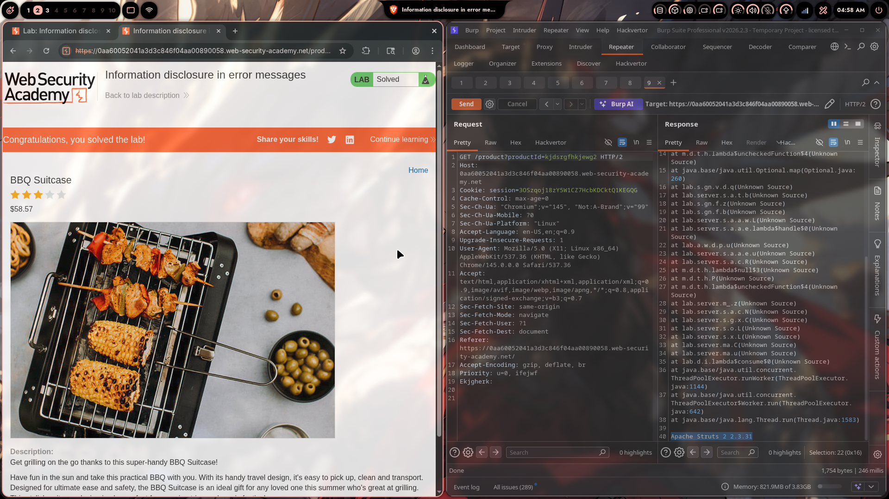

# Lab 01: Information Disclosure in Error Messages

> **Topic**: Information Disclosure
> **Lab Number**: 01
> **Platform**: PortSwigger Web Security Academy

## Category
Information Disclosure — Verbose Error Messages Leaking Framework Version via Unhandled Exception

## Vulnerability Summary
The application's product page passes a user-supplied `productId` parameter directly to the backend without adequate error handling. Supplying an invalid (non-numeric) value triggers an unhandled exception that returns a full Java stack trace in the HTTP response. The stack trace discloses the exact framework version — **Apache Struts 2 2.3.31** — along with internal class names and package structure. This version is known to be vulnerable to critical CVEs (including CVE-2017-5638, the vulnerability behind the Equifax breach), making this disclosure directly actionable for further exploitation.

## Attack Methodology

### Step 1: Identify the Target Parameter
Observed the product page URL structure:

```
GET /product?productId=1 HTTP/2
```

The `productId` parameter is passed to the backend to look up a product.

### Step 2: Supply an Invalid Value to Trigger an Error
Modified `productId` to a non-numeric string to force an unhandled exception:

```http
GET /product?productId=kjdsrgfhkjewg2 HTTP/2
Host: 0aa60052041a3d3c846f04aa00890058.web-security-academy.net
Cookie: session=3OSzqoji8zYSW1CZ7HcbKDCktQ1KEGQG
```

### Step 3: Read the Stack Trace Response
The server returned a verbose error page containing a full Java stack trace:

```
at m.d.t.h.lambda$uncheckedFunction$4(Unknown Source)
at java.base/java.util.Optional.map(Optional.java:260)
at lab.s.gn.v.d.q(Unknown Source)
at lab.s.a.t.b(Unknown Source)
at lab.s.gn.f.z(Unknown Source)
at lab.s.gn.f.b(Unknown Source)
at lab.s.a.a.w.L(Unknown Source)
at lab.s.a.a.e.lambda$handle$0(Unknown Source)
at lab.a.w.d.p.u(Unknown Source)
at lab.s.a.a.e.u(Unknown Source)
at lab.s.a.a.c.R(Unknown Source)
at lab.t.h.lambda$null$3(Unknown Source)
at m.d.t.h.P(Unknown Source)
at m.d.t.h.lambda$uncheckedFunction$4(Unknown Source)
at lab.server.m._z(Unknown Source)
at lab.server.s.a.N(Unknown Source)
at lab.server.s.g.X(Unknown Source)
at lab.server.s.o.L(Unknown Source)
at lab.server.s.x.L(Unknown Source)
at lab.server.ma.C(Unknown Source)
at lab.server.ma.u(Unknown Source)
at lab.d.i.lambda$consume$0(Unknown Source)
at java.base/java.util.concurrent.ThreadPoolExecutor.runWorker(ThreadPoolExecutor.java:1144)
at java.base/java.util.concurrent.ThreadPoolExecutor$Worker.run(ThreadPoolExecutor.java:642)
at java.base/java.lang.Thread.run(Thread.java:1583)
Apache Struts 2 2.3.31
```

The final line — **`Apache Struts 2 2.3.31`** — is the framework version, highlighted in the response. Lab solved by submitting this version string.



## Technical Root Cause

### Vulnerable Code (Pseudocode)
```java
// VULNERABLE: unhandled exception propagates to HTTP response
@GetMapping("/product")
public Product getProduct(@RequestParam String productId) {
    // Throws NumberFormatException or NoSuchElementException for invalid input
    return productRepository.findById(Long.parseLong(productId)).get();
    // Exception propagates up — default error handler renders full stack trace
}
```

The default error handler (or a misconfigured one) serializes the full exception including:
- Stack frames with internal class names
- Framework version string appended by Struts error rendering

### Secure Code (Pseudocode)
```java
@GetMapping("/product")
public ResponseEntity<?> getProduct(@RequestParam String productId) {
    try {
        long id = Long.parseLong(productId);
        return productRepository.findById(id)
            .map(ResponseEntity::ok)
            .orElse(ResponseEntity.notFound().build());
    } catch (NumberFormatException e) {
        // Generic error — no stack trace, no version info
        return ResponseEntity.badRequest().body("Invalid product ID");
    }
}
```

Additionally, configure the framework to suppress verbose errors in production:
```properties
# struts.xml / application.properties
struts.devMode=false
server.error.include-stacktrace=never
```

## Impact
- **Framework Version Disclosure**: Apache Struts 2.3.31 is affected by **CVE-2017-5638** (CVSS 10.0) — the RCE vulnerability exploited in the Equifax breach. Knowing the exact version allows an attacker to select a working exploit immediately.
- **Internal Architecture Exposure**: Package names (`lab.server`, `lab.s.a.a`, etc.) reveal internal code structure, aiding reverse engineering and targeted attacks.
- **Reconnaissance Acceleration**: Version disclosure collapses the recon phase — instead of fingerprinting blindly, the attacker has a confirmed target for known CVEs.

**Severity: Medium** (disclosure alone) → **Critical** (when chained with a matching CVE exploit)

## Proof of Concept

```http
GET /product?productId=invalid HTTP/2
Host: <target>
```

**Response contains:**
```
[Java stack trace]
...
Apache Struts 2 2.3.31
```

Submit `Apache Struts 2 2.3.31` as the framework version to solve the lab.

## Key Takeaways
1. **Error Messages Are an Information Source**: Unhandled exceptions that reach the client reveal framework names, versions, internal class paths, and sometimes file system paths or database queries. Each piece narrows the attack surface.
2. **Version Disclosure Is Directly Actionable**: Knowing `Apache Struts 2 2.3.31` immediately points to CVE-2017-5638 (RCE via `Content-Type` header). The gap between "information disclosure" and "critical RCE" is a single known exploit.
3. **Dev Mode Must Be Off in Production**: Frameworks like Struts, Spring, and Django have a "development mode" that enables verbose errors for debugging. This must always be disabled before deployment.
4. **Generic Error Pages Are the Fix**: The client should receive a user-friendly error page with a reference ID. The full exception should be logged server-side only, never rendered in the response.

## Mitigation

### 1. Catch Exceptions and Return Generic Responses
```java
@ExceptionHandler(Exception.class)
public ResponseEntity<String> handleAll(Exception e) {
    log.error("Unhandled exception", e);  // log internally
    return ResponseEntity.status(500).body("An error occurred. Reference: " + UUID.randomUUID());
}
```

### 2. Disable Stack Traces in Production
```properties
# Spring Boot
server.error.include-stacktrace=never
server.error.include-message=never

# Apache Struts
struts.devMode=false
```

### 3. Custom Error Pages
Configure the web server/framework to serve a static error page for 4xx/5xx responses, bypassing any dynamic error rendering entirely.

### 4. Keep Frameworks Updated
Apache Struts 2.3.31 is end-of-life and carries multiple critical CVEs. Upgrade to a supported version and subscribe to security advisories.

## References
- [PortSwigger — Information Disclosure in Error Messages](https://portswigger.net/web-security/information-disclosure/exploiting/lab-infoleak-in-error-messages)
- [PortSwigger — Information Disclosure Vulnerabilities](https://portswigger.net/web-security/information-disclosure)
- [CVE-2017-5638 — Apache Struts RCE](https://nvd.nist.gov/vuln/detail/CVE-2017-5638)
- [OWASP — Error Handling Cheat Sheet](https://cheatsheetseries.owasp.org/cheatsheets/Error_Handling_Cheat_Sheet.html)
- [CWE-209: Generation of Error Message Containing Sensitive Information](https://cwe.mitre.org/data/definitions/209.html)

## Tools Used
- Burp Suite Professional (Proxy, Repeater)
- Chromium

---

*Lab completed on: 2026-05-09*  
*Writeup by vibhxr*
