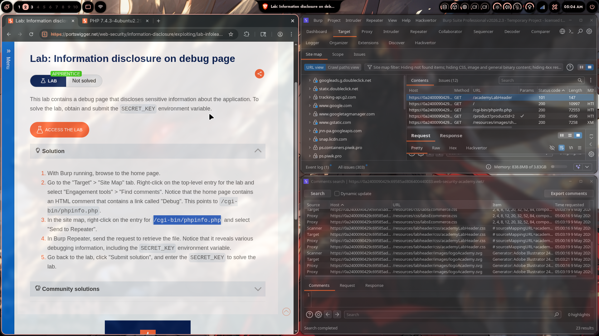
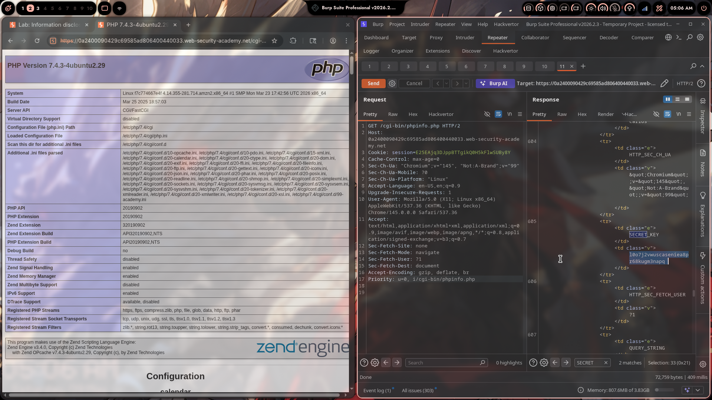
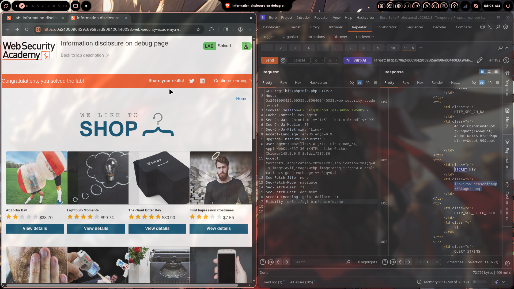

# Lab 02: Information Disclosure on Debug Page

> **Topic**: Information Disclosure
> **Lab Number**: 02
> **Platform**: PortSwigger Web Security Academy

## Category
Information Disclosure — Debug Page Exposed via HTML Comment Referencing `/cgi-bin/phpinfo.php`

## Vulnerability Summary
The application's home page contains an HTML comment that references a debug endpoint at `/cgi-bin/phpinfo.php`. This endpoint is publicly accessible and renders a full PHP info page, disclosing the PHP version, server configuration, loaded modules, file system paths, and — critically — all environment variables including the `SECRET_KEY`. The key (`1o07j2vwuscaseniea8pr68kugm3napq`) is submitted to solve the lab.

## Attack Methodology

### Step 1: Discover the Debug Page via HTML Comment
With Burp running, browsed to the lab home page. In Burp **Target > Site Map**, right-clicked the top-level entry and selected **Engagement tools > Find comments**.

The comments search returned a reference to:
```
/cgi-bin/phpinfo.php
```

This path was also visible in the Site Map as a separate entry:
```
GET /cgi-bin/phpinfo.php    200    72,553 bytes
```



### Step 2: Request the Debug Endpoint

Sent the request to Burp Repeater and fetched the page:

```http
GET /cgi-bin/phpinfo.php HTTP/2
Host: 0a2400090429c69585ad806400440033.web-security-academy.net
Cookie: session=E25EAjq3DJppBTTgikQ0H5kFlwSUByBY
```

The response (72,759 bytes) is a full `phpinfo()` output page, disclosing:

| Field | Value |
|---|---|
| PHP Version | 7.4.3-4ubuntu2.29 |
| System | Linux f7c774667e4f 4.14.355-281.714.amzn2.x86_64 |
| Server API | CGI/FastCGI |
| Configuration File Path | /etc/php/7.4/cgi |
| Loaded Config File | /etc/php/7.4/cgi/php.ini |
| Debug Build | no |

### Step 3: Extract the `SECRET_KEY` Environment Variable

Searched the response for `SECRET` (2 matches). At line 605 of the response:

```html
<td class="e">SECRET_KEY</td>
<td class="v">1o07j2vwuscaseniea8pr68kugm3napq</td>
```

The `SECRET_KEY` environment variable is exposed in the phpinfo environment variables table.



### Step 4: Submit the Key to Solve the Lab

Submitted `1o07j2vwuscaseniea8pr68kugm3napq` as the solution. Lab solved.



## Technical Root Cause

### Two Compounding Issues

**1. HTML Comment Leaking Internal Path**
```html
<!-- Debug: /cgi-bin/phpinfo.php -->
```
HTML comments are visible to anyone who views page source or proxies traffic. Internal paths, debug endpoints, and developer notes must never appear in production HTML.

**2. `phpinfo()` Page Left Accessible in Production**
```php
// /cgi-bin/phpinfo.php
<?php phpinfo(); ?>
```
`phpinfo()` dumps the entire PHP runtime environment — version, configuration, loaded extensions, HTTP headers, and all environment variables — in a single publicly accessible page. It is a development diagnostic tool with no place in production.

### Why Environment Variables Are Dangerous Here
The web server process inherits environment variables set at the OS or container level. `SECRET_KEY` (likely used for session signing, CSRF tokens, or cryptographic operations) is set as an environment variable and appears verbatim in `phpinfo()` output. An attacker with this key can forge signed tokens, decrypt data, or bypass CSRF protections depending on how it is used.

## Impact
- **Secret Key Disclosure**: `SECRET_KEY` exposed — depending on usage, enables session forgery, CSRF bypass, or decryption of application data
- **Full Server Fingerprint**: PHP version, OS kernel, server API, all loaded `.ini` files, and extension versions — a complete attack surface map
- **Environment Variable Enumeration**: All env vars visible, potentially including database credentials, API keys, cloud provider tokens, and other secrets
- **Path Disclosure**: Exact filesystem paths for config files, enabling targeted local file inclusion or path traversal attacks

**Severity: High**

## Proof of Concept

**Step 1 — Find the comment:**
View page source of the home page or use Burp's "Find comments" feature. Locate the reference to `/cgi-bin/phpinfo.php`.

**Step 2 — Fetch the debug page:**
```http
GET /cgi-bin/phpinfo.php HTTP/2
Host: <target>
```

**Step 3 — Search for secrets:**
In Burp Repeater, search for `SECRET`, `KEY`, `PASSWORD`, `TOKEN`, `API` in the response. Extract values from the environment variables table.

## Key Takeaways
1. **HTML Comments Are Public**: Anything in an HTML comment is visible to any user who views source or uses a proxy. Debug paths, internal URLs, developer notes, and TODO items must be stripped before deployment.
2. **`phpinfo()` Is a Complete Information Disclosure**: It exposes PHP version, server config, all environment variables, HTTP request headers, and loaded modules in one page. It must never be accessible in production — not even behind IP restrictions if the application handles sensitive data.
3. **Environment Variables Are Not Secret Storage**: Storing secrets in environment variables is common practice, but `phpinfo()`, error pages, and debug endpoints can expose them. Use a secrets manager (AWS Secrets Manager, HashiCorp Vault) and ensure no debug endpoint can read the process environment.
4. **Site Map + Find Comments = Fast Recon**: Burp's "Find comments" feature across the entire site map is a standard first step in recon. It surfaces developer notes, debug links, and internal paths that are invisible during normal browsing.

## Mitigation

### 1. Remove All Debug Endpoints Before Deployment
```bash
# Ensure phpinfo files don't exist in production
find /var/www -name "phpinfo.php" -delete
find /cgi-bin -name "phpinfo.php" -delete
```

### 2. Strip HTML Comments in Production Builds
Use a build pipeline step to remove HTML comments:
```bash
# Example with html-minifier
html-minifier --remove-comments index.html
```
Or configure the template engine to suppress comments in production mode.

### 3. Restrict CGI Directory Access
```apache
# Apache: deny access to /cgi-bin in production
<Directory "/cgi-bin">
    Require all denied
</Directory>
```

### 4. Use a Secrets Manager Instead of Environment Variables
```python
import boto3
secret = boto3.client('secretsmanager').get_secret_value(SecretId='prod/app/secret_key')
SECRET_KEY = secret['SecretString']
# Never stored in process environment, never visible to phpinfo()
```

### 5. Web Application Firewall Rule
Block requests to known debug paths:
```
/cgi-bin/phpinfo.php
/phpinfo.php
/info.php
/test.php
```

## References
- [PortSwigger — Information Disclosure on Debug Page](https://portswigger.net/web-security/information-disclosure/exploiting/lab-infoleak-on-debug-page)
- [PortSwigger — Information Disclosure Vulnerabilities](https://portswigger.net/web-security/information-disclosure)
- [PHP Manual — phpinfo()](https://www.php.net/manual/en/function.phpinfo.php)
- [OWASP — Sensitive Data Exposure](https://owasp.org/www-project-top-ten/2017/A3_2017-Sensitive_Data_Exposure)
- [CWE-215: Insertion of Sensitive Information Into Debugging Code](https://cwe.mitre.org/data/definitions/215.html)
- [CWE-540: Inclusion of Sensitive Information in Source Code](https://cwe.mitre.org/data/definitions/540.html)

## Tools Used
- Burp Suite Professional (Proxy, Repeater, Target > Site Map, Find Comments)
- Chromium

---

*Lab completed on: 2026-05-09*  
*Writeup by vibhxr*
