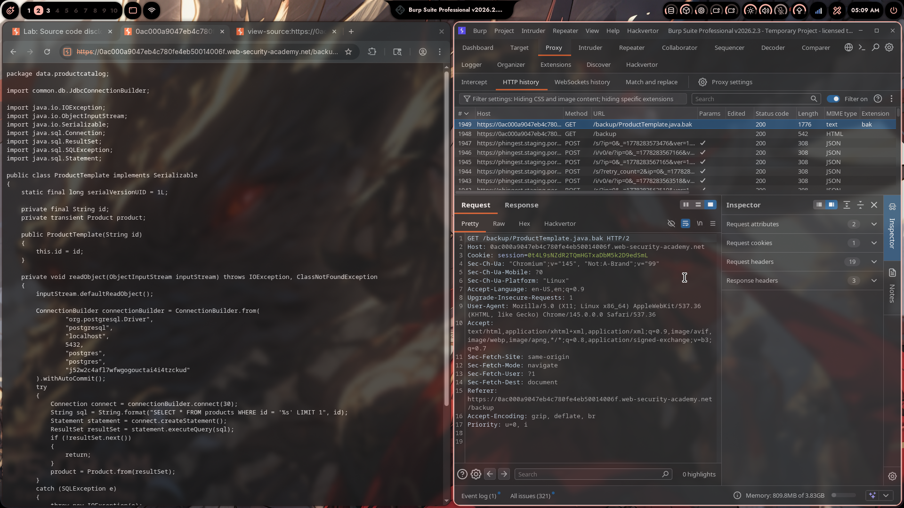
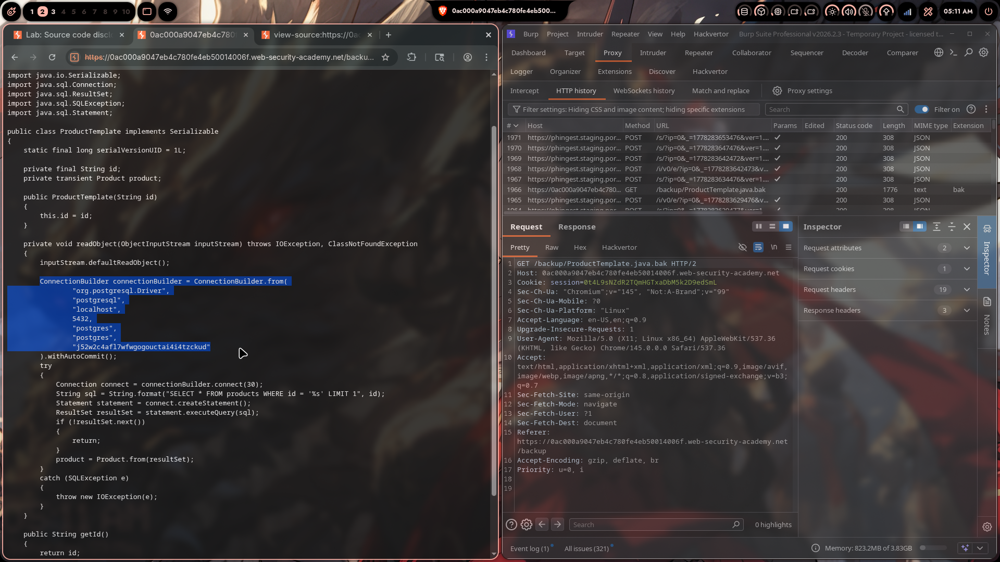
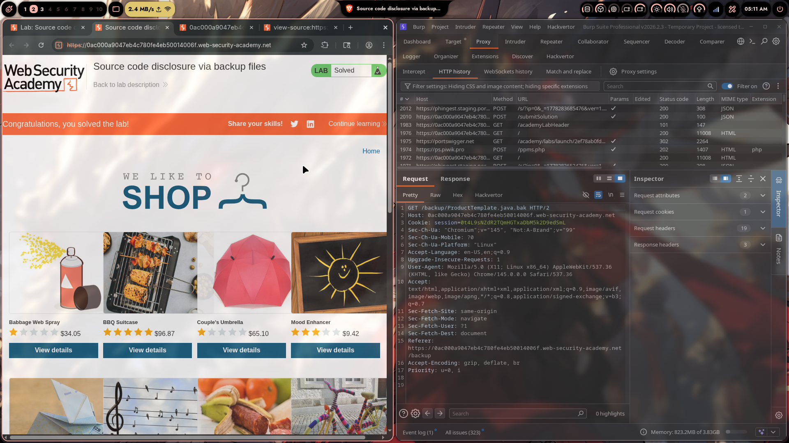
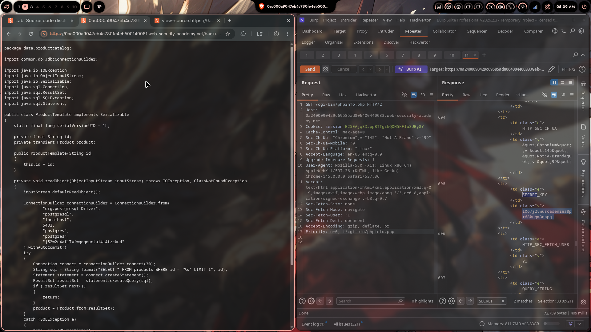

# Lab 03: Source Code Disclosure via Backup Files

> **Topic**: Information Disclosure
> **Lab Number**: 03
> **Platform**: PortSwigger Web Security Academy

## Category
Information Disclosure — Hardcoded Credentials Exposed via Publicly Accessible Backup File

## Vulnerability Summary
The application leaves a Java source backup file (`ProductTemplate.java.bak`) accessible under the `/backup` directory with no authentication or access control. The file contains the full source of the `ProductTemplate` class, including a hardcoded PostgreSQL connection string with plaintext credentials. Retrieving this file reveals the database password, which is the lab's objective.

## Attack Methodology

### Step 1: Discover the Backup Directory
Navigated to `/backup` on the target application. The directory listing was enabled and exposed a single file:

```
GET /backup HTTP/2
Host: 0ac000a9047eb4c780fe4eb50014006f.web-security-academy.net
```

Response: directory listing showing `ProductTemplate.java.bak`.



### Step 2: Retrieve the Backup File
Requested the file directly:

```http
GET /backup/ProductTemplate.java.bak HTTP/2
Host: 0ac000a9047eb4c780fe4eb50014006f.web-security-academy.net
Cookie: session=0t4L9sNZdR2TQmHGTxaDbM5k2D9edSmL
```

Response: `200 OK` — full Java source returned as plaintext.

### Step 3: Extract Hardcoded Credentials
The source code contained a `readObject` method that builds a JDBC connection with credentials hardcoded directly in the source:

```java
package data.productcatalog;

import common.db.JdbcConnectionBuilder;
// ...

public class ProductTemplate implements Serializable {
    static final long serialVersionUID = 1L;

    private final String id;
    private transient Product product;

    private void readObject(ObjectInputStream inputStream)
            throws IOException, ClassNotFoundException {
        inputStream.defaultReadObject();

        ConnectionBuilder connectionBuilder = ConnectionBuilder.from(
                "org.postgresql.Driver",
                "postgresql",
                "localhost",
                5432,
                "postgres",
                "postgres",
                "j52w2c4afl7wfwgogouctai4i4tzckud"  // <-- hardcoded DB password
        ).withAutoCommit();
        // ...
    }
}
```





### Step 4: Submit the Password — Lab Solved
Submitted the extracted password `j52w2c4afl7wfwgogouctai4i4tzckud` as the solution. Lab marked **Solved**.



## Technical Root Cause

### Vulnerable Pattern
```java
// Credentials hardcoded directly in source — exposed if source is ever leaked
ConnectionBuilder connectionBuilder = ConnectionBuilder.from(
    "org.postgresql.Driver",
    "postgresql",
    "localhost",
    5432,
    "postgres",
    "postgres",
    "j52w2c4afl7wfwgogouctai4i4tzckud"
).withAutoCommit();
```

Two compounding flaws:
1. **Hardcoded credentials in source code** — any leak of the source (backup file, version control, error page) immediately exposes the database password
2. **Publicly accessible `/backup` directory** — no authentication, no access control, directory listing enabled; the backup file is served to any unauthenticated user

### Secure Pattern
```java
// Credentials loaded from environment variables at runtime — never in source
String dbPassword = System.getenv("DB_PASSWORD");
if (dbPassword == null) throw new IllegalStateException("DB_PASSWORD not set");

ConnectionBuilder connectionBuilder = ConnectionBuilder.from(
    "org.postgresql.Driver",
    "postgresql",
    System.getenv("DB_HOST"),
    Integer.parseInt(System.getenv("DB_PORT")),
    System.getenv("DB_USER"),
    System.getenv("DB_NAME"),
    dbPassword
).withAutoCommit();
```

Additionally, `/backup` (and any directory containing source, config, or build artifacts) must be blocked at the web server level and never deployed to production.

## Impact
- **Database Credential Exposure**: The PostgreSQL password is directly readable by any unauthenticated user who knows (or guesses) the backup path
- **Full Database Compromise**: With valid credentials and network access, an attacker can connect to the database, read all data, modify records, or drop tables
- **Lateral Movement**: Reused credentials may grant access to other internal systems

**Severity: High**

## Proof of Concept

```http
GET /backup/ProductTemplate.java.bak HTTP/2
Host: 0ac000a9047eb4c780fe4eb50014006f.web-security-academy.net
```

Response contains:
```
"j52w2c4afl7wfwgogouctai4i4tzckud"
```

Extracted DB password: `j52w2c4afl7wfwgogouctai4i4tzckud`

## Key Takeaways
1. **Never hardcode credentials in source code**: Secrets in source are one leak away from full exposure — backup files, git history, error pages, and misconfigured directories are all common leak vectors.
2. **Backup files are a classic information disclosure vector**: Editors and build tools often create `.bak`, `.orig`, `~`, `.swp` files. These must be excluded from web roots and deployment pipelines entirely.
3. **Directory listing must be disabled in production**: An open `/backup` directory with listing enabled is a direct invitation to enumerate and download sensitive files.
4. **Use secrets management**: Credentials belong in environment variables, a secrets manager (AWS Secrets Manager, HashiCorp Vault), or an encrypted config store — never in code or committed config files.

## Mitigation

### 1. Remove Hardcoded Credentials — Use Environment Variables
```java
String dbPassword = System.getenv("DB_PASSWORD");
```
Or use a secrets manager SDK to fetch credentials at runtime.

### 2. Block Backup and Source Directories at the Web Server
```nginx
# Nginx — deny access to backup files and directories
location ~* \.(bak|orig|swp|tmp|java|class)$ {
    deny all;
    return 404;
}

location /backup {
    deny all;
    return 404;
}
```

### 3. Disable Directory Listing
```nginx
autoindex off;
```

### 4. Exclude Backup Files from Deployment
```gitignore
# .gitignore / deployment exclusions
*.bak
*.orig
*.swp
*~
/backup/
```

### 5. Rotate Exposed Credentials Immediately
Any credential found in a backup or public file must be treated as compromised and rotated immediately, regardless of whether active exploitation is confirmed.

## References
- [PortSwigger — Source Code Disclosure via Backup Files](https://portswigger.net/web-security/information-disclosure/exploiting/lab-infoleak-via-backup-files)
- [PortSwigger — Information Disclosure Vulnerabilities](https://portswigger.net/web-security/information-disclosure)
- [OWASP — Sensitive Data Exposure](https://owasp.org/www-project-top-ten/2017/A3_2017-Sensitive_Data_Exposure)
- [CWE-312: Cleartext Storage of Sensitive Information](https://cwe.mitre.org/data/definitions/312.html)
- [CWE-530: Exposure of Backup File to Unauthorized Control Sphere](https://cwe.mitre.org/data/definitions/530.html)

## Tools Used
- Burp Suite Professional (Proxy, Repeater, HTTP History)
- Chromium

---

*Lab completed on: 2026-05-09*  
*Writeup by vibhxr*
