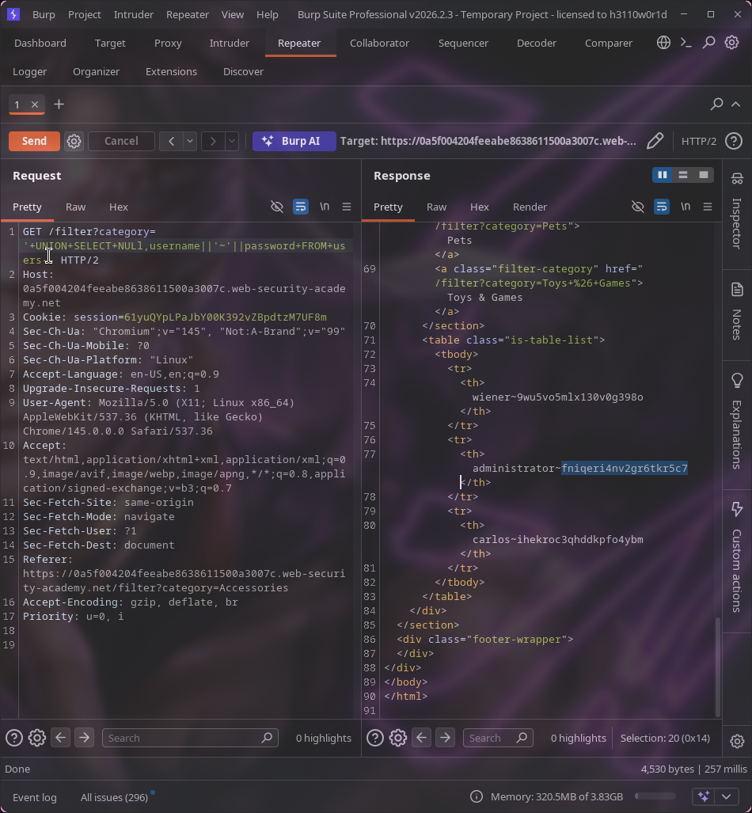
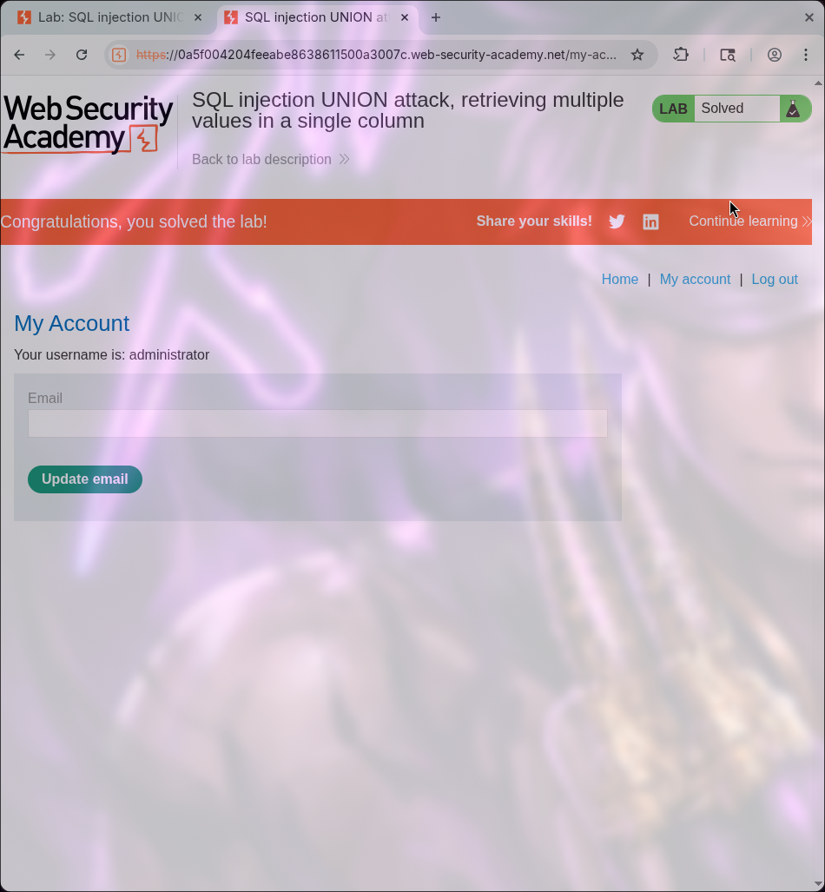

# Lab 11: SQL injection UNION attack, retrieving data from other tables

## Category
SQL Injection - UNION-based (Cross-Table Data Exfiltration)

## Vulnerability Summary
The website's product filtering feature contains a SQL injection vulnerability that allows attackers to retrieve data from other tables in the database. By using UNION SELECT statements, attackers can combine results from the products table with data from entirely different tables such as the users table. This enables extraction of sensitive information including usernames and passwords from tables that are not directly accessible through the application's normal functionality.

## Steps to Reproduce
1. Navigate to the e-commerce website's product category filter.
2. Determine the number of columns using NULL injection (3 columns identified).
3. Identify which columns are displayed in the output by testing with visible strings.
4. Craft a UNION SELECT payload to extract data from the users table:
   - Payload: `'+UNION+SELECT+NULL,username,password+FROM+users--`
5. Submit the payload via the category filter parameter.
6. Observe the response - usernames and passwords appear in the product listing.
7. Locate the administrator credentials in the extracted data.
8. Use extracted credentials to log in as administrator.




## Technical Root Cause
The vulnerability stems from improper handling of user input in SQL query construction combined with UNION-based injection capabilities:

- **Unsanitized Input:** User input from the category filter is directly concatenated into SQL queries.
- **Missing Parameterization:** The application does not use parameterized queries or prepared statements.
- **UNION Operator Exploitation:** The UNION operator allows combining results from multiple SELECT statements.
- **Cross-Table Access:** The database user has SELECT permissions on multiple tables including users.
- **Visible Output:** Injected data appears in the HTML response, confirming successful exploitation.
- **No Input Validation:** The application accepts SQL operators and special characters without validation.
- **Information Disclosure:** Database schema and table structures can be discovered through enumeration.

### Payload Used
```
'+UNION+SELECT+NULL,username,password+FROM+users--
```

URL-encoded payload in category filter:
```
/filter?category='+UNION+SELECT+NULL,username,password+FROM+users--
```

How it works:
- The original query likely looks like: `SELECT * FROM products WHERE category = 'input' AND released = 1`
- The injection transforms it to: `SELECT * FROM products WHERE category = '' UNION SELECT NULL, username, password FROM users--' AND released = 1`
- The `'` closes the category string value.
- The `UNION SELECT NULL, username, password FROM users` combines product data with user credentials.
- The `NULL` fills the column positions that aren't needed.
- The `FROM users` specifies the target table for data extraction.
- The `--` comments out the rest of the original query.

### Common Table Names for Data Extraction

| Table Name | Description | Typical Columns |
|------------|-------------|-----------------|
| users | User accounts | username, password, email |
| administrators | Admin accounts | username, password_hash |
| customers | Customer data | name, email, address |
| orders | Order history | order_id, user_id, total |
| products | Product catalog | name, price, description |
| sessions | Active sessions | session_id, user_id, token |

### Column Discovery Process
1. **Determine column count:** Use `'+UNION+SELECT+NULL--`, `'+UNION+SELECT+NULL,NULL--`, etc.
2. **Find visible columns:** Test each position with a visible string like `'test'`.
3. **Identify data types:** Some columns require specific data types (string vs number).
4. **Extract table data:** Once columns are known, use `FROM table_name` to target specific tables.

### Alternative Payloads for Other Tables

| Target | Payload |
|--------|---------|
| Users table | `'+UNION+SELECT+NULL,username,password+FROM+users--` |
| Administrators | `'+UNION+SELECT+NULL,username,password+FROM+administrators--` |
| Custom table | `'+UNION+SELECT+NULL,column1,column2+FROM+table_name--` |
| All tables | `'+UNION+SELECT+NULL,table_name,column_name+FROM+information_schema.columns--` |

## Impact
- **Complete Credential Exposure:** Attackers can extract usernames and passwords from any accessible table.
- **Account Takeover:** Extracted administrator credentials allow full administrative access.
- **Data Breach:** Sensitive data from multiple tables can be extracted systematically.
- **Schema Disclosure:** Attackers can enumerate database structure using information_schema tables.
- **Privilege Escalation:** Admin access enables further exploitation and data access.
- **Compliance Violation:** Violates data protection regulations (GDPR, PCI-DSS, HIPAA).
- **Legal Liability:** Organization may face lawsuits and regulatory fines.
- **Reputation Damage:** Public disclosure of data breach severely affects user trust.

## Mitigation
1. **Parameterized Queries:** Use prepared statements with parameterized queries for all database operations.
2. **Input Validation:** Implement strict input validation allowing only expected category values.
3. **Whitelist Approach:** Use a whitelist of valid category names instead of accepting raw input.
4. **Least Privilege:** Database accounts should have minimal permissions - restrict access to only necessary tables.
5. **Error Handling:** Implement generic error messages that don't reveal database structure information.
6. **ORM Usage:** Consider using Object-Relational Mapping (ORM) frameworks that handle SQL safely.
7. **Web Application Firewall:** Deploy WAF rules to detect and block UNION-based SQL injection attempts.
8. **Regular Security Testing:** Conduct periodic penetration testing and code reviews for SQL injection.
9. **Data Encryption:** Encrypt sensitive data at rest to limit impact of successful extraction.
10. **Access Monitoring:** Implement logging and alerting for suspicious database queries.
11. **Output Encoding:** Apply proper output encoding to prevent injected data from rendering in HTML.
12. **Column Count Hardening:** Ensure applications handle unexpected column counts gracefully.

---
*Lab completed on: 2026-03-17*
