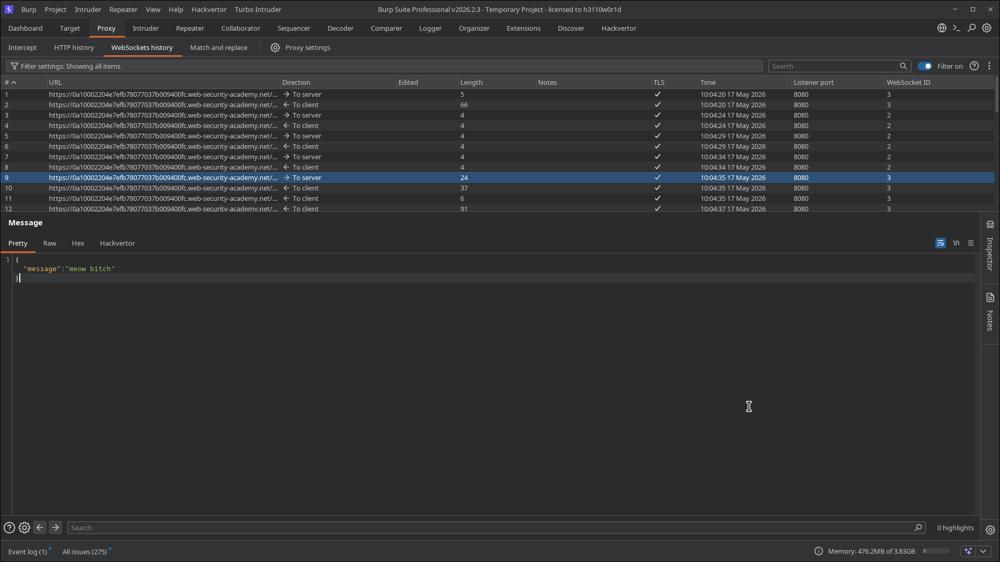
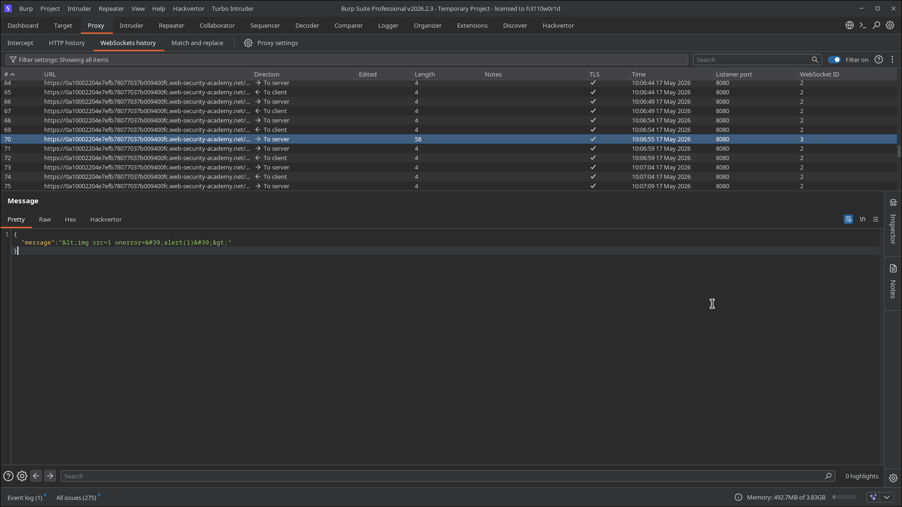
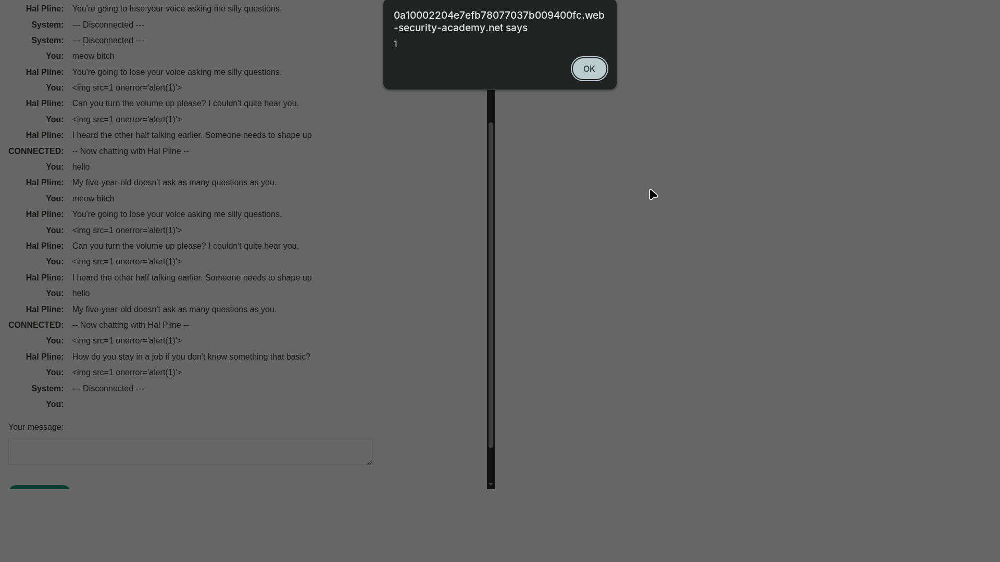
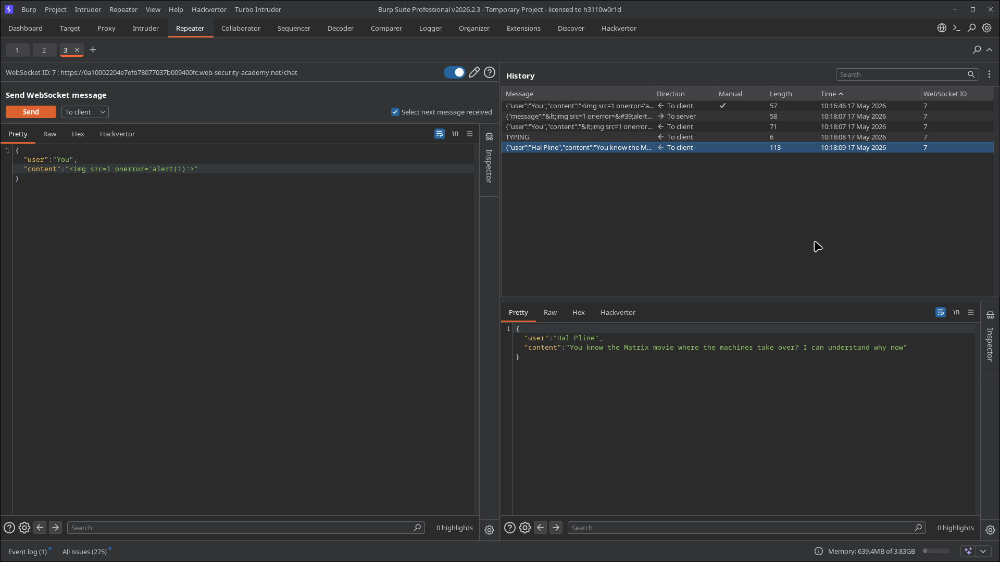
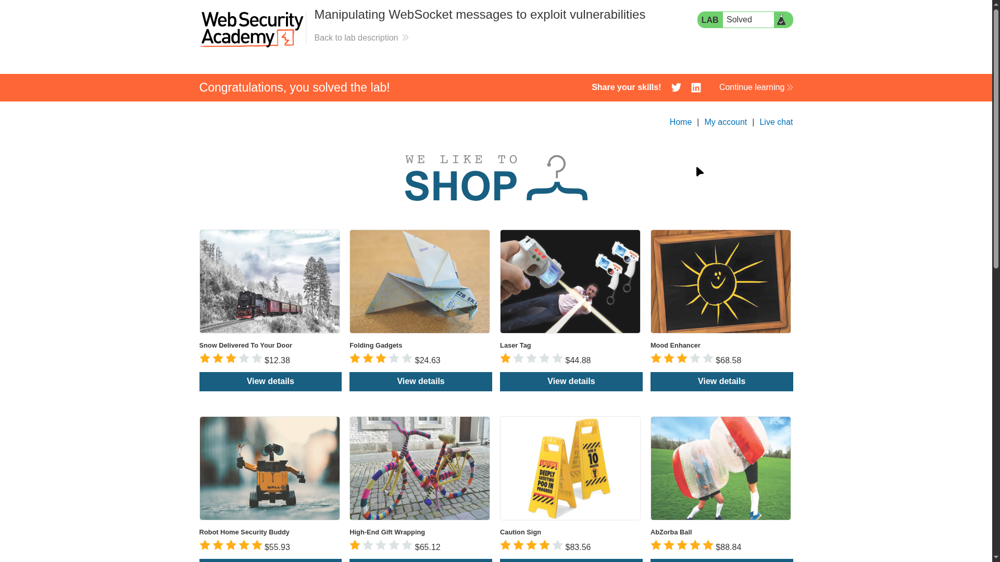

# Lab 01: Manipulating WebSocket messages to exploit vulnerabilities

> **Topic**: Websockets
> **Lab Number**: 01
> **Platform**: PortSwigger Web Security Academy

## Category
WebSockets — Cross-Site Scripting (XSS) via WebSocket Message Manipulation

## Vulnerability Summary
The application features a live chat implemented using WebSockets. When a user sends a message, it is transmitted to the server as a JSON-formatted WebSocket message. The client-side JavaScript performs HTML encoding on certain characters (like `<` and `>`) before sending the message to prevent XSS. However, the server-side fails to perform its own validation or encoding of the incoming message. By intercepting the WebSocket traffic and bypassing the client-side encoding, an attacker can inject a malicious XSS payload that will be rendered in the browser of anyone viewing the chat, including the support agent.

## Attack Methodology

### Step 1: Reconnaissance
I started the live chat and sent a test message "hello" to observe how the communication works.

### Step 2: Intercepting WebSocket Messages
Using Burp Suite, I navigated to the **Proxy -> WebSockets history** tab. I observed that the message was sent to the server in the following format:
`{"message": "hello"}`


*Initial test message captured in Burp's WebSocket history.*

### Step 3: Identifying Client-Side Encoding
I attempted to send a message containing a `<` character. Looking at the WebSocket history, I saw that the client-side script had encoded the character before transmission:
`{"message": "&lt;"}`

This confirmed that the protection is implemented on the client-side, which can be easily bypassed.


*Burp showing that the client-side encodes special characters like < before sending.*

### Step 4: Bypassing Encoding and Exploitation
I enabled Intercept in Burp Suite and sent another chat message. When the WebSocket message was intercepted, I modified the `message` value to contain an unencoded XSS payload:

**Payload:**
```html

```

After forwarding the modified message, an alert box was triggered in my browser, confirming the XSS.


*The XSS payload successfully executing in the chat window.*

### Step 5: Verification in Repeater
I also sent the message to **Burp Repeater** to verify the server's response and the reflected content. The server reflects the message back to all connected clients, rendering the raw HTML.


*Using Burp Repeater to send the malicious WebSocket message.*


*Lab successfully solved.*

## Technical Root Cause
The vulnerability exists because the application relies solely on client-side security controls. Client-side encoding is a convenience feature, not a security boundary. The server-side WebSocket handler accepts raw input and reflects it back to clients without sanitization, trusting that the client has already performed the necessary encoding.

## Impact
- **Cross-Site Scripting (XSS)**: An attacker can execute arbitrary JavaScript in the context of other users' sessions.
- **Session Hijacking**: Stealing session cookies from the support agent or other users.
- **Account Takeover**: Performing actions on behalf of the victim user.

## Proof of Concept
1. Open the "Live chat" feature.
2. Intercept the outgoing WebSocket message using a tool like Burp Suite.
3. Replace the encoded message with a raw XSS payload: `{"message":""}`.
4. Observe the payload executing in the browser.

## Key Takeaways
1. **Never trust client-side input**: All data received by the server, regardless of the protocol (HTTP, WebSockets, etc.), must be treated as untrusted.
2. **Server-side validation is mandatory**: Always sanitize or encode data on the server-side before storing or reflecting it.
3. **Defense in Depth**: Use Content Security Policy (CSP) to mitigate the impact of XSS vulnerabilities.

## Mitigation
1. **Server-Side Sanitization**: Implement a robust sanitization library on the server-side to filter out dangerous HTML tags and attributes from WebSocket messages.
2. **Output Encoding**: Ensure that any data reflected from a WebSocket message is properly encoded for the context in which it is displayed (e.g., HTML entity encoding).
3. **Use Safe Sinks**: When updating the DOM with chat messages, use safe methods like `.textContent` instead of `.innerHTML`.

## References
- [PortSwigger WebSockets Lab - Manipulating messages](https://portswigger.net/web-security/websockets/lab-manipulating-messages-to-exploit-vulnerabilities)
- [OWASP WebSockets Security Cheat Sheet](https://cheatsheetseries.owasp.org/cheatsheets/WebSockets_Security_Cheat_Sheet.html)

---

*Lab completed on: 2026-05-17*
*Writeup by vibhxr*
