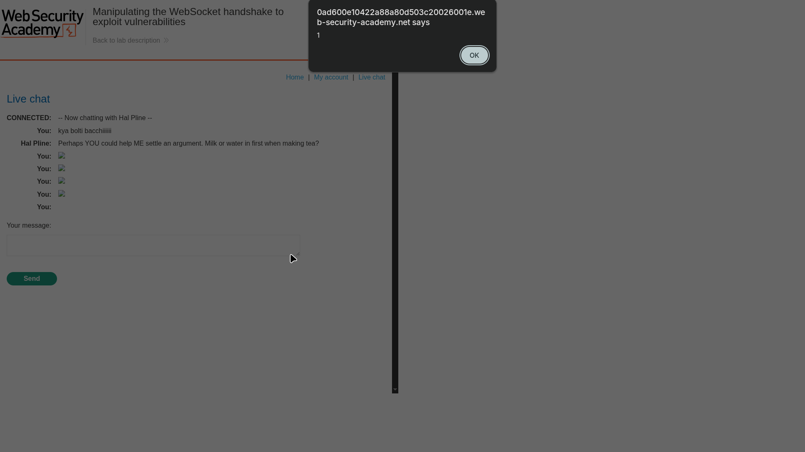
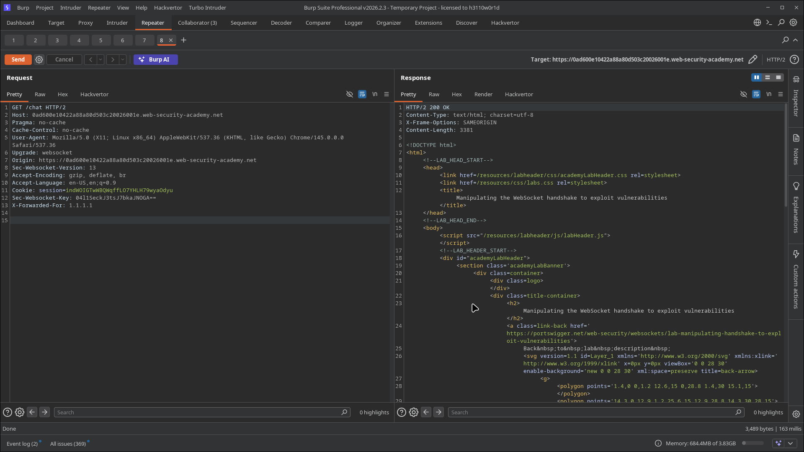
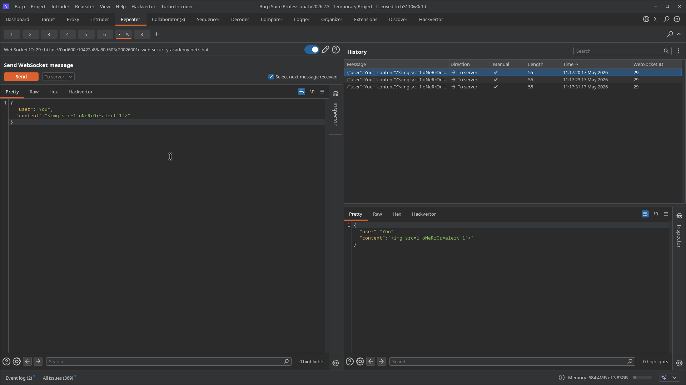
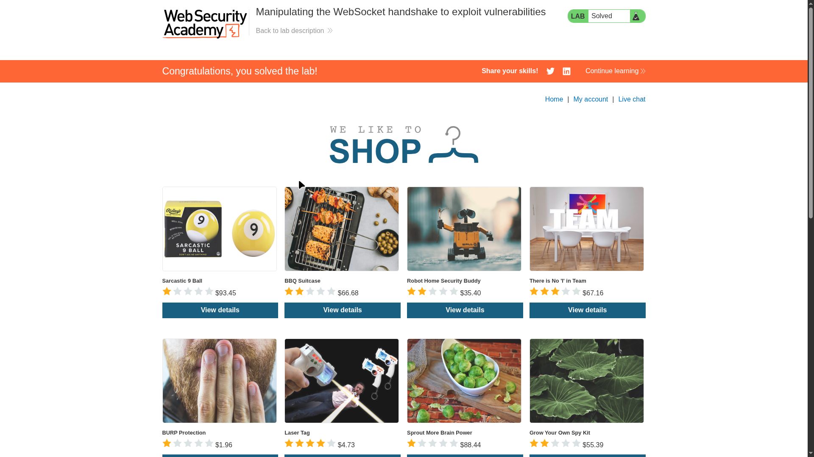
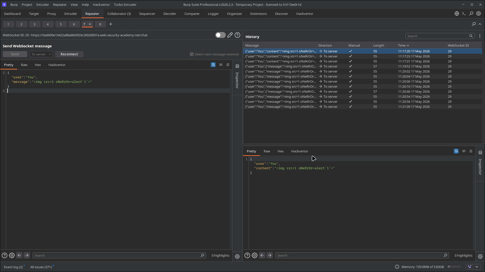

# Lab 03: Manipulating the WebSocket handshake to exploit vulnerabilities

> **Topic**: Websockets
> **Lab Number**: 03
> **Platform**: PortSwigger Web Security Academy

## Category
WebSocket Security / Handshake Manipulation / XSS Filter Bypass

## Vulnerability Summary
The chat endpoint enforces naive detection for obvious XSS payloads and bans the client IP when a malicious event handler is detected. The ban decision trusts client-supplied `X-Forwarded-For` during WebSocket handshake processing. By spoofing this header, a banned attacker can reconnect and deliver an obfuscated XSS payload that executes in the support agent context.

## Attack Methodology

### Step 1: Trigger XSS Execution Primitive
Sent a crafted chat payload through WebSocket Repeater and confirmed JavaScript execution via `alert(1)` popup.



### Step 2: Reconnect Using Handshake Header Manipulation
After ban/termination behavior, moved to handshake manipulation and added:

```http
X-Forwarded-For: 1.1.1.1
```

in the WebSocket upgrade request to bypass IP-based blocking.



### Step 3: Send Obfuscated Event-Handler Payload
With the re-established socket, sent an obfuscated payload from Repeater:

```html

```

This bypassed simple signature checks on lowercase `onerror='alert(1)'` patterns.



### Step 4: Verify Lab Completion
After successful delivery and execution in the target chat flow, the lab status changed to solved.





## Technical Root Cause
1. **Misplaced trust in user-controlled IP headers**: `X-Forwarded-For` accepted as authoritative client identity.
2. **Weak payload filtering**: brittle signature-based blocking instead of robust output handling.
3. **No defense-in-depth against message-level script injection**: attacker-controlled content reaches a rendering sink.

## Impact
- Bypass of IP-based abuse controls and temporary bans.
- Cross-user script execution in chat context.
- Potential session theft, unauthorized actions, and account compromise.

## Mitigation
1. Only trust `X-Forwarded-For` from known reverse proxies and sanitize header chains.
2. Implement canonicalization plus strict server-side validation before filtering decisions.
3. Render chat content safely (`textContent`/contextual encoding), not raw HTML.
4. Apply CSP to reduce script execution impact.
5. Keep detection logic separate from identity/rate-limiting controls.

## Tools Used
- Burp Suite Professional (Proxy, WebSockets history, Repeater)
- Chromium

## References
- [PortSwigger - Manipulating the WebSocket handshake to exploit vulnerabilities](https://portswigger.net/web-security/websockets/lab-manipulating-handshake-to-exploit-vulnerabilities)
- [OWASP WebSocket Security Cheat Sheet](https://cheatsheetseries.owasp.org/cheatsheets/WebSocket_Security_Cheat_Sheet.html)

---

*Lab completed on: 2026-05-17*
*Writeup by vibhxr*
